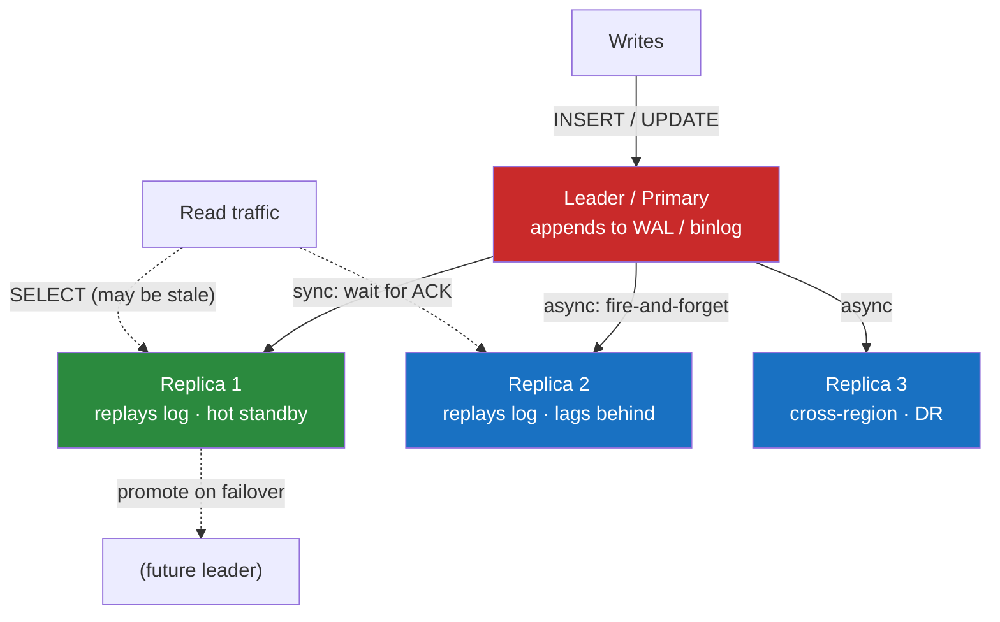

# 🔁 Replication Strategies

> [!abstract] TL;DR
> **Replication** keeps copies of your data on more than one node — for read scaling, high availability, and disaster recovery. The core design axis is *who is allowed to accept writes*: **single-leader** (one primary, N read replicas — the default for Postgres/MySQL), **multi-leader** (several writable nodes, used across regions), and **leaderless** (Dynamo/Cassandra-style quorums, no special node). The second axis is *when the leader considers a write done*: **synchronous** (wait for replicas — durable but slower), **asynchronous** (don't wait — fast but replicas lag), or **semi-synchronous** (wait for one). Almost every distributed-database headache — **replication lag**, **read-your-writes**, split-brain failover — falls out of choices on these two axes. This is the DB-engineering deep dive; for the architecture framing see [[Database_Replication]].

## Intuition — analogy FIRST

Think of a head chef writing the day's menu, and line cooks who need their own copy.

**Single-leader**: only the head chef (the *primary*) may edit the master menu. Every change is copied to the line cooks (*replicas*), who may read from their copy but never write to it. Simple, no conflicts — there is exactly one source of truth. If the head chef faints, someone must be promoted (*failover*).

**Multi-leader**: you open a second kitchen in another city, and *both* head chefs can edit their own menu, syncing changes to each other. Great for locality and staying open if one city loses power — but if both chefs rename the same dish at the same moment, you now have a **conflict** to resolve.

**Leaderless**: there is no head chef at all. To change the menu you shout it to *most* of the cooks and consider it done once *enough* of them acknowledge (a **write quorum**). To read, you ask *several* cooks and trust the answer the majority (or the newest) gives (a **read quorum**). No single point of failure, but you must reason about *how many* is "enough."

And **asynchronous** vs **synchronous** is simply: does the head chef start cooking the moment they write the change (async — fast, but a cook might still have the old menu), or wait until the cooks confirm they copied it (sync — safe, but slower)?

---

## How It Works

A single leader accepts all writes, records them in an ordered log (Postgres **WAL**, MySQL **binlog**), and streams that log to replicas which replay it to converge on the same state.



### Axis 1 — where writes are allowed

| Topology | Writes accepted by | Conflicts? | Typical use |
|---|---|---|---|
| **Single-leader** | Exactly one node (primary) | Impossible by design | Default for Postgres/MySQL; read scaling + HA |
| **Multi-leader** | Several nodes | Yes — need conflict resolution (LWW, CRDTs, app merge) | Multi-region writes, offline-capable apps |
| **Leaderless** | Any replica (client/coordinator writes to many) | Resolved by quorum + read repair | Cassandra, DynamoDB, Riak — high availability |

**Leaderless quorum math** — with `N` replicas, `W` write acks required, `R` read responses required: if **`W + R > N`**, any read set overlaps any write set by at least one node, so reads can see the latest write. Common: `N=3, W=2, R=2`. Tuning `W`/`R` trades latency for consistency. (Full treatment in [[Consensus_and_Quorums]].)

### Axis 2 — when the write is "done"

| Mode | Leader waits for | Durability on leader failure | Latency |
|---|---|---|---|
| **Synchronous** | Replica(s) to persist the log record | No committed data lost | Highest — bounded by slowest replica; blocks if replica down |
| **Asynchronous** | Nothing — replies after local commit | Last few txns can be lost | Lowest |
| **Semi-synchronous** | *At least one* replica to acknowledge | One synced copy guaranteed | Middle ground — the common production default |

Fully synchronous to *all* replicas is rarely used: one slow or dead replica stalls every write. Semi-sync (wait for *any one*) is the pragmatic sweet spot.

### PostgreSQL replication mechanics

- **Streaming (physical) replication** — the standby connects to the primary and streams **WAL** records, replaying them byte-for-byte. Replicas are exact physical copies; whole-cluster only, same major version.
- **Hot standby** — a streaming replica that also serves read-only queries while it replays.
- **Replication slots** — the primary tracks how far each replica has consumed and *refuses to recycle WAL* the replica still needs, preventing a lagging replica from falling off a cliff. (Trade-off: a dead replica with a slot can make WAL pile up and fill the disk.)
- **Synchronous config** — `synchronous_standby_names` + `synchronous_commit = on` make chosen standbys synchronous.
- **Logical replication** — decodes WAL into logical row changes and ships them via **publications** (on the primary) and **subscriptions** (on the subscriber). Selective (per-table), cross-version, and cross-major-version — ideal for **zero-downtime upgrades** and selective data sharing.

### MySQL replication mechanics

- **Binlog-based async replication** — the primary writes a **binary log** of changes; each replica's I/O thread copies it to a relay log, and an SQL thread applies it. Async by default.
- **GTIDs (Global Transaction Identifiers)** — every transaction gets a cluster-unique ID, so a replica knows exactly what it has applied. This makes **failover and re-pointing replicas** dramatically safer than the old file+position bookkeeping.
- **Semi-synchronous replication** — a plugin makes the primary wait for at least one replica to acknowledge receipt before returning commit.
- **Group Replication** — MySQL's built-in Paxos-like (single- or multi-primary) group with automatic membership and conflict detection; the foundation of **InnoDB Cluster**. This is MySQL's answer to consensus-based HA (see [[Consensus_and_Quorums]]).

### The two consequences you cannot escape

**Replication lag** — async replicas trail the primary by milliseconds to (under load) minutes. This breaks several intuitive guarantees:

- **Read-your-writes (read-after-write)** — a user updates their profile, the read hits a lagging replica, and they see the *old* value. Fixes: route that user's reads to the primary for a short window, read from a replica caught up past the write's log position, or pin post-write reads to the leader.
- **Monotonic reads** — a user refreshing sees data *go backwards* because two requests hit replicas at different lag. Fix: pin a user to one replica.
- **Consistent prefix reads** — causally-ordered writes appear out of order. (These anomalies are catalogued in [[Consistency_Models]].)

**Failover** — when the leader dies, a replica must be **promoted**. Hazards:

- **Data loss** — with async replication, writes not yet shipped are gone.
- **Split-brain** — the old leader comes back thinking it is still primary while a new one exists; two writable primaries corrupt data. Fencing (STONITH) and consensus-based leader election prevent this.
- **Tooling** — Postgres uses Patroni/repmgr + etcd/Consul for leader election; MySQL uses Orchestrator, Group Replication, or MHA. Automatic failover is a consensus problem (see [[Consensus_and_Quorums]]).

---

## SQL / Config Examples

**PostgreSQL — synchronous standby (primary `postgresql.conf`):**

```config
# postgresql.conf on the PRIMARY
wal_level = replica
max_wal_senders = 10
synchronous_commit = on
synchronous_standby_names = 'ANY 1 (replica_a, replica_b)'   # semi-sync: any one
```

```sql
-- Create a persistent replication slot so WAL isn't recycled prematurely
SELECT pg_create_physical_replication_slot('replica_a_slot');

-- Observe lag from the primary (bytes behind)
SELECT client_addr, state, sync_state,
       pg_wal_lsn_diff(pg_current_wal_lsn(), replay_lsn) AS bytes_behind
FROM pg_stat_replication;
```

```sql
-- Logical replication: PUBLICATION on primary, SUBSCRIPTION on subscriber
-- On the publisher:
CREATE PUBLICATION orders_pub FOR TABLE orders, order_items;

-- On the subscriber (different major version is fine):
CREATE SUBSCRIPTION orders_sub
    CONNECTION 'host=primary dbname=shop user=repl'
    PUBLICATION orders_pub;
```

**MySQL — GTID-based replication + semi-sync:**

```config
# my.cnf on the PRIMARY
server_id            = 1
log_bin              = mysql-bin
gtid_mode            = ON
enforce_gtid_consistency = ON
rpl_semi_sync_master_enabled = 1      # wait for one replica ACK
rpl_semi_sync_master_timeout = 1000   # ms before falling back to async
```

```sql
-- On the REPLICA: point at primary using GTID auto-positioning
CHANGE REPLICATION SOURCE TO
    SOURCE_HOST   = 'primary.db',
    SOURCE_USER   = 'repl',
    SOURCE_AUTO_POSITION = 1;          -- GTID: no file/position bookkeeping
START REPLICA;

-- Check replication health & lag
SHOW REPLICA STATUS\G   -- watch Seconds_Behind_Source, Replica_IO/SQL_Running
```

---

## Trade-offs

| Choice | Gains | Costs |
|---|---|---|
| Single-leader | Simple, no write conflicts, strong-ish reads from primary | Leader is a write bottleneck & failover point |
| Multi-leader | Local low-latency writes, survives region loss | Write conflicts → resolution logic; harder to reason about |
| Leaderless | No SPOF, tunable consistency, high availability | Eventual consistency, read repair overhead, client complexity |
| Synchronous | No committed-data loss | Latency bound by slowest replica; stalls if replica down |
| Asynchronous | Lowest write latency | Data loss window on failover; replication lag |
| Semi-sync | One durable copy, bounded latency | Falls back to async on timeout (silent durability drop) |
| Physical replication | Exact, low overhead | Whole cluster, same major version only |
| Logical replication | Selective, cross-version, zero-downtime upgrades | Higher overhead, no DDL replication, some type limits |

## Common Pitfalls

1. **Reading your own writes off an async replica.** The classic "I saved it but it's gone" bug. Route the writing user's immediate reads to the primary or to a replica confirmed caught up past that write's LSN/GTID.
2. **Assuming a read replica is up to date.** It is *eventually* consistent. Any logic that requires the latest value (balance checks, uniqueness) must hit the primary.
3. **Fully synchronous to all replicas in production.** One slow replica now gates every commit; a dead one stalls writes entirely. Prefer semi-sync (any-one).
4. **Postgres replication slot without monitoring.** A dead replica holding a slot makes the primary retain WAL forever → disk fills → primary crashes. Alert on slot lag; consider `max_slot_wal_keep_size`.
5. **Ignoring split-brain during failover.** Two primaries writing concurrently silently corrupt data. You need fencing and consensus-based election, not a cron job that "promotes if the primary looks down."
6. **Confusing replication with backups.** Replication faithfully copies your `DROP TABLE` to every replica instantly. It is availability, not point-in-time recovery — you still need backups.

## Related Concepts

- [[_MOC_DB_Distributed|↑ Section MOC]]
- [[Database_Replication]] — the systems-design framing (master-slave vs master-master, DR); this note is the WAL/binlog-level deep dive
- [[Partitioning_and_Sharding]] — replication scales reads + HA; sharding scales writes + storage; production systems use both together
- [[Consistency_Models]] — read-your-writes, monotonic reads, and why lag breaks strong consistency
- [[Consensus_and_Quorums]] — how leaderless quorums and safe leader election actually work (Raft/Paxos)
- [[CAP_Theorem]] — why a partition forces a choice between staying available (async) and staying consistent
- [[NewSQL]] — systems that replicate *per shard* with Raft to get HA and horizontal scale together

## Review Questions

1. A user updates their email, and on the next page load sees the old email. The DBA insists "replication is working fine." Explain what is happening in terms of async lag, name the consistency guarantee being violated, and give two concrete fixes.
2. Compare synchronous, asynchronous, and semi-synchronous replication in terms of write latency and data loss on primary failure. Why do most production MySQL setups choose semi-sync over full sync?
3. Your Postgres primary's disk is filling with WAL even though write volume is normal. A replica has been offline for a day. Explain the mechanism connecting these facts and how you would prevent it.

## Sources

- Martin Kleppmann, *Designing Data-Intensive Applications*, Ch. 5 — Replication
- PostgreSQL Documentation: High Availability, Load Balancing, and Replication — https://www.postgresql.org/docs/current/high-availability.html
- PostgreSQL Documentation: Logical Replication — https://www.postgresql.org/docs/current/logical-replication.html
- MySQL Documentation: Replication (GTIDs, semi-sync, Group Replication) — https://dev.mysql.com/doc/refman/8.0/en/replication.html

#Database #DistributedDatabases #Replication #WAL #Binlog #GTID #ReplicationLag #Failover
