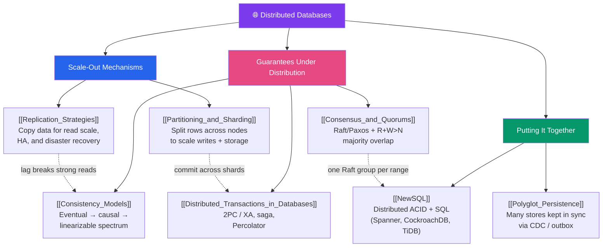

# 🗺️ Distributed Databases — Map of Content

> [!abstract] What This Section Covers
> When one machine is no longer enough, a database must spread its data and work across many nodes — and every comfortable single-server guarantee suddenly costs coordination. This section covers the two scale-out mechanisms you almost always use together (**sharding** to scale writes and storage, **replication** to scale reads and provide HA), the guarantees that survive once data lives in many places (**consistency models**, **distributed transactions**, and the **consensus/quorum** machinery that makes agreement safe), and the modern syntheses that hide it all: **NewSQL** systems that give you ACID + SQL at horizontal scale, and **polyglot persistence** that runs many specialised stores behind one system of record. The through-line is the [[CAP_Theorem|CAP]]/[[PACELC_Theorem|PACELC]] tradeoff — every choice here is buying availability, latency, or consistency at the expense of the others.

## Concept Map

## Learning Path

1. [[Partitioning_and_Sharding]] — Start with the mechanism that breaks the single-machine ceiling: how to split rows across nodes, choosing a shard key, and the three horsemen (hotspots, cross-shard joins, resharding).
2. [[Replication_Strategies]] — The complement to sharding: single-leader vs multi-leader vs leaderless, sync vs async, and the two consequences you cannot escape (replication lag, failover).
3. [[Consistency_Models]] — What a read is *allowed* to return once data is replicated: the eventual → causal → linearizable spectrum, and the linearizability-vs-serializability distinction that trips everyone up.
4. [[Consensus_and_Quorums]] — The machinery that buys safe agreement: Raft/Paxos leader election, the `R + W > N` majority-overlap rule, and read repair / hinted handoff.
5. [[Distributed_Transactions_in_Databases]] — Committing atomically across nodes: two-phase commit and its blocking flaw, XA, the saga alternative, and Percolator-style non-blocking commits.
6. [[NewSQL]] — The synthesis: shard + replicate-per-range with consensus + a SQL layer to get ACID *and* horizontal scale (Spanner's TrueTime, CockroachDB, TiDB).
7. [[Polyglot_Persistence]] — The other synthesis: many purpose-built stores behind one system of record, kept in sync with CDC and the outbox pattern, queried across with federation/FDW.

## All Notes at a Glance

| Note | Difficulty | What You'll Learn |
| ---- | ---------- | ----------------- |
| [[Partitioning_and_Sharding]] | Advanced | Local partitioning vs sharding; RANGE/LIST/HASH; shard-key selection; hotspots, cross-shard joins, resharding; Vitess/Citus |
| [[Replication_Strategies]] | Advanced | Single/multi/leaderless leadership; sync/async/semi-sync; Postgres streaming vs logical, MySQL binlog/GTID; lag, read-your-writes, failover, split-brain |
| [[Consistency_Models]] | Advanced | Eventual/causal/linearizable spectrum; linearizability vs serializability; session guarantees; tunable `R+W>N` consistency |
| [[Distributed_Transactions_in_Databases]] | Advanced | 2PC and the blocking problem; 3PC; XA / `PREPARE TRANSACTION`; saga + compensation; Percolator/TiDB |
| [[Consensus_and_Quorums]] | Advanced | Majority overlap; Raft/Paxos leader election + commit order; quorum reads/writes; read repair, hinted handoff, anti-entropy; consensus-per-range |
| [[NewSQL]] | Advanced | Range sharding + consensus-per-range + SQL layer; Spanner TrueTime; CockroachDB, TiDB, YugabyteDB; NewSQL vs sharded Postgres |
| [[Polyglot_Persistence]] | Intermediate | Right store per job; system-of-record + derived stores; CDC, outbox, dual-writes; federation and foreign data wrappers |

## Key Questions This Section Answers

- When do you shard, and how do you pick a shard key that keeps queries single-shard?
- Why do sharding (write scale) and replication (read scale + HA) almost always go together?
- What is replication lag, and why does it break read-your-writes and monotonic reads?
- What is the difference between linearizability and serializability — and why are they orthogonal?
- What does `R + W > N` guarantee, and why is a quorum read still not truly linearizable?
- Why does two-phase commit block, and when is a saga the better choice?
- How does consensus (Raft/Paxos) prevent split-brain, and why must consensus clusters be odd-sized?
- How does NewSQL get both horizontal scale and strong consistency from "one Raft group per range"?
- How do you keep Elasticsearch, Redis, and a warehouse in sync with a relational source without dual-write drift?

## Related Sections
- [[_MOC_Database_Master|↑ Database Master MOC]]
- [[_MOC_DB_NoSQL|← NoSQL]] — the leaderless, tunable-consistency stores this section's theory grounds
- [[_MOC_DB_Systems|→ Database Systems]] — Postgres, MySQL, Cassandra, and CockroachDB as concrete engines
- System Design: [[CAP_Theorem]], [[PACELC_Theorem]] — the availability/consistency/latency tradeoffs behind every choice here
- System Design: [[Database_Sharding]], [[Database_Replication]] — the architecture-level framing of sharding and replication
- System Design: [[Consensus_and_Raft]] — the step-by-step Raft/Paxos algorithm walkthrough

#MOC #Database #DistributedDatabases #Sharding #Replication #Consensus #NewSQL
