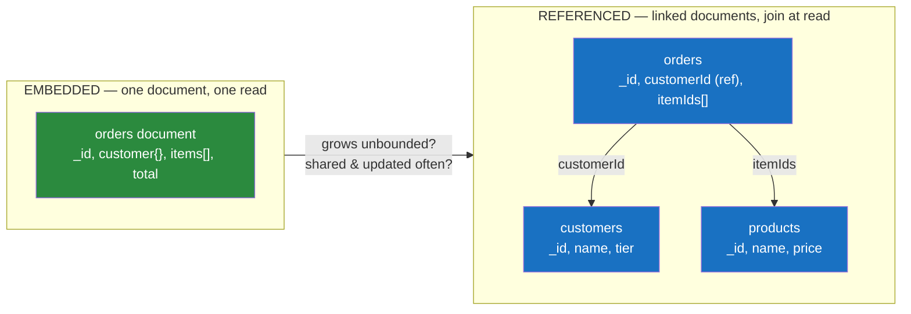

# 📄 Document Stores

> [!abstract] TL;DR
> A **document store** keeps data as self-contained **JSON/BSON documents** — nested trees of fields, arrays, and sub-objects — grouped into **collections**. Unlike a key-value store, the database *can see inside* the document: you query, index, and aggregate on any field at any depth. The central modelling decision is **embed vs reference**: nest related data inside one document (fast reads, one fetch) or store it separately and link by id (avoids duplication and unbounded growth). **MongoDB** is the archetype — documents, secondary indexes, a powerful **aggregation pipeline** (`$match → $group → $lookup`), **sharding** by a shard key, and **replica sets** for HA. Documents shine when your data is naturally a hierarchical aggregate read as a unit; they struggle with many-to-many relationships and cross-document transactions.

## Intuition — analogy FIRST

Picture the difference between a **relational filing system** and a stack of **complete paper forms**.

In the relational world, a customer's order is shredded across four drawers: the *order header* drawer, the *line items* drawer, the *customer* drawer, the *product* drawer. Each fact lives once. To see the whole order, a clerk pulls a sheet from each drawer and **staples them together by matching ID numbers** — a join, performed fresh every single time anyone asks.

A **document store** is a filing cabinet of **fully-filled-out order forms**. One form holds *everything about that order*: the customer's name and address, every line item with product name and price, the shipping details — all on one page, already assembled. Pull one form and you have the complete order in a single reach. No stapling, no cross-referencing, no join.

The catch reveals itself when the customer changes their address. In the relational drawers you edit one sheet and every order instantly reflects it. In the forms cabinet, the address was *copied onto* every order form — so either you leave old orders showing the old address (often correct — an order *should* remember where it shipped!) or you hunt down and edit every form. That tension — **assembled-and-duplicated vs normalised-and-joined** — is the whole art of document modelling, and it has a name: **embed vs reference**.

---

## How It Works

A document store persists each record as a tree. MongoDB stores it as **BSON** (Binary JSON) — a binary encoding that adds types JSON lacks (`Date`, `ObjectId`, `Decimal128`, binary, 64-bit ints) and length prefixes so the engine can skip fields without parsing the whole document.

```json
{
  "_id": ObjectId("64f0a1..."),
  "customer": { "name": "Ada Lovelace", "tier": "gold" },
  "shipTo":   { "city": "London", "zip": "EC1A" },
  "items": [
    { "sku": "A-100", "name": "Widget", "qty": 2, "price": 9.99 },
    { "sku": "B-250", "name": "Gadget", "qty": 1, "price": 42.00 }
  ],
  "total": 61.98,
  "status": "shipped",
  "placedAt": ISODate("2026-07-15T10:22:00Z")
}
```

Documents live in **collections** (the loose analogue of tables). There is no enforced schema — two documents in one collection can have different fields — though MongoDB supports optional **schema validation** rules. Every document has a unique `_id`, which is also its default shard key candidate and primary index.



### Replica sets (high availability)

A MongoDB **replica set** is one **primary** (takes all writes) plus **secondaries** (replicate the primary's oplog). If the primary fails, the secondaries hold an **election** (Raft-like) and promote a new primary automatically — typically within seconds. Reads can optionally be served from secondaries (`readPreference`), trading freshness for throughput. This is how a document store delivers durability and failover; see [[Database_Replication]] and [[Failover]].

### Sharding (horizontal scale)

When one replica set can't hold the data or traffic, MongoDB **shards**: documents are partitioned across multiple replica sets by a **shard key**. A routing tier (`mongos`) directs each query to the relevant shard(s). The shard key choice is as critical as it is irreversible-ish — see Pitfalls and [[Database_Sharding]].

---

## Data Model & Query Examples

### CRUD and querying *inside* the document

The superpower over key-value: filter and index on nested fields and array elements.

```javascript
// Insert
db.orders.insertOne({ customer: { name: "Ada", tier: "gold" },
                      items: [{ sku: "A-100", qty: 2 }], total: 61.98, status: "new" })

// Query on a nested field and an array element (dot notation)
db.orders.find({ "customer.tier": "gold", "items.sku": "A-100" })

// Update: atomically push to an array + set a field (atomic WITHIN one document)
db.orders.updateOne(
  { _id: ObjectId("64f0a1...") },
  { $push: { items: { sku: "C-9", qty: 1 } }, $set: { status: "updated" } }
)

// Index a nested field to make the query above fast
db.orders.createIndex({ "customer.tier": 1, "placedAt": -1 })
```

### The aggregation pipeline

MongoDB's analytics engine is a **pipeline** of stages, each transforming the stream of documents from the last — conceptually the NoSQL cousin of SQL's `WHERE → GROUP BY → JOIN`.

```javascript
db.orders.aggregate([
  // $match — filter early (like WHERE); uses indexes, shrinks the stream
  { $match: { status: "shipped", placedAt: { $gte: ISODate("2026-01-01") } } },

  // $group — aggregate (like GROUP BY): revenue & order count per tier
  { $group: {
      _id: "$customer.tier",
      revenue: { $sum: "$total" },
      orders:  { $sum: 1 },
      avgOrder:{ $avg: "$total" }
  }},

  // $lookup — a LEFT JOIN to another collection (the referenced model)
  { $lookup: {
      from: "tiers", localField: "_id", foreignField: "name", as: "tierInfo"
  }},

  { $sort: { revenue: -1 } },
  { $limit: 10 }
])
```

- **`$match` early, `$project` narrow** — filtering first (ideally on an index) is the single biggest performance lever; it's the pipeline equivalent of pushing down predicates.
- **`$lookup`** exists but is comparatively expensive and only performs a left-outer equality join — a reminder that document stores *tolerate* joins rather than *love* them. If you `$lookup` constantly, your data probably wanted embedding (or a relational database).

### CouchDB — a different philosophy

**CouchDB** stores JSON documents too but leans on: an **HTTP/REST** API (every document is a URL), **MVCC** with explicit document `_rev` for lock-free concurrency, **map-reduce views** (precomputed indexes) instead of an ad-hoc aggregation pipeline, and best-in-class **multi-master replication** — designed for offline-first / edge sync (PouchDB in the browser syncing to CouchDB). Where MongoDB optimises for rich server-side querying, CouchDB optimises for **replication and conflict handling across unreliable networks**.

---

## Trade-offs / When to Use

### Embed vs Reference — the decision table

| Signal | **Embed** (nest inside parent) | **Reference** (separate + link) |
|---|---|---|
| Read pattern | Always fetched *with* the parent | Fetched independently |
| Relationship | One-to-few, contained ("has-a") | One-to-many (large), many-to-many |
| Growth | Bounded (an order's line items) | Unbounded (a user's activity log) |
| Update frequency of the child | Rarely changes / is a point-in-time snapshot | Shared and updated often (a product's price) |
| Consistency | Same-document update is **atomic** | Must update in one place (no duplication) |
| Example | Order → its line items; blog post → comments (if few) | Author → posts; product ↔ orders (many-to-many) |

**Rule of thumb:** *embed for "contains / read-together," reference for "unbounded or shared."* When a document approaches MongoDB's **16 MB limit** or an embedded array grows without bound, that's the model shouting *reference me*.

**Use a document store when:**
- Your entities are naturally **hierarchical aggregates** read/written as a unit (orders, user profiles, CMS content, product catalogues, event payloads).
- The **schema varies** across records or evolves fast (per-tenant fields, sparse attributes).
- You want the object in your code and the document on disk to look nearly identical (no ORM impedance mismatch).

**Reconsider when:**
- The data is deeply **relational with many-to-many joins** and ad-hoc reporting — a relational store with **JSONB** ([[Advanced_SQL_and_JSON]]) often gives you *both* worlds: normalised tables *plus* flexible JSON columns, with real joins and ACID.
- You need **multi-document ACID transactions** frequently (supported since MongoDB 4.0 but with a performance cost — if you lean on them constantly, your aggregate boundaries are wrong or you want relational).

> [!tip] The relational alternative
> Before adopting MongoDB "for flexibility," ask whether a **JSONB column in Postgres** ([[Advanced_SQL_and_JSON]]) meets the need. You keep joins, constraints, and ACID for the structured 90% while storing the flexible 10% as indexed JSON. Many "we need a document DB" cases are really "we need one flexible column."

---

## Common Pitfalls

1. **Unbounded embedded arrays.** Embedding "all comments" or "all events" in one document grows it toward the 16 MB cap, makes every read drag the whole array, and makes updates rewrite the entire document. Reference (or bucket) unbounded children.
2. **A bad shard key.** A **monotonically increasing** shard key (timestamp, `ObjectId`) sends all new writes to one shard (a **hotspot**); a **low-cardinality** key can't spread load. Choose a high-cardinality key aligned to your query pattern — and know that changing it later is painful. See [[Database_Sharding]].
3. **Treating "schemaless" as no design.** Field-name drift (`status` vs `state` vs `orderStatus`) and mixed types accumulate silently, forcing every reader to handle every historical shape. Use schema validation and disciplined migrations.
4. **Over-referencing (relational habits on documents).** Splitting a naturally-embedded aggregate into many collections and `$lookup`-ing them back together is slow and misses the point — you've built a relational schema on an engine bad at joins.
5. **Missing indexes on nested/array fields.** A query on `"customer.tier"` without an index does a **collection scan**. Documents don't magically index themselves; index the fields you filter and sort on. See [[Database_Indexes]].
6. **Assuming single-document is enough for money.** Atomicity is guaranteed *within* one document. Transferring value between two documents needs a multi-document transaction — which document stores support but don't celebrate.

---

## Related Concepts

- [[_MOC_DB_NoSQL|↑ Section MOC]]
- [[Document_Store]] — the System Design view of document databases as a building block
- [[NoSQL_Overview]] — document stores among the four families
- [[Advanced_SQL_and_JSON]] — Postgres JSONB: relational + document hybrid, the frequent better answer
- [[Key_Value_Stores]] — the simpler cousin; a document store is a KV store that can see inside the value
- [[Database_Sharding]] — how the shard key partitions a collection
- [[Database_Replication]] — replica sets and read preferences
- [[Database_Indexes]] — indexing nested and array fields
- [[Failover]] — replica-set elections and automatic primary promotion

## Review Questions

1. Give the four signals that push you toward **referencing** a related entity instead of **embedding** it, and explain why MongoDB's 16 MB document limit is really a modelling signal rather than an arbitrary cap.
2. Walk through a `$match → $group → $lookup` aggregation pipeline and map each stage to its SQL equivalent. Why is putting `$match` first the biggest performance lever, and why is heavy reliance on `$lookup` a design smell?
3. A team wants "flexible schema" and is choosing MongoDB over Postgres. What Postgres feature might give them flexibility *without* giving up joins and ACID, and when would you still pick MongoDB anyway?

## Sources

- MongoDB Manual — Data Model Design (embedding vs referencing): https://www.mongodb.com/docs/manual/core/data-model-design/
- MongoDB Manual — Aggregation Pipeline: https://www.mongodb.com/docs/manual/core/aggregation-pipeline/
- MongoDB Manual — Sharding & Shard Keys: https://www.mongodb.com/docs/manual/sharding/
- Apache CouchDB Documentation — Technical Overview: https://docs.couchdb.org/en/stable/intro/overview.html
- Pramod Sadalage & Martin Fowler, *NoSQL Distilled*, Ch. 9 — Document Databases

#Database #NoSQL #Document #MongoDB #CouchDB #AggregationPipeline #EmbedVsReference #Sharding
