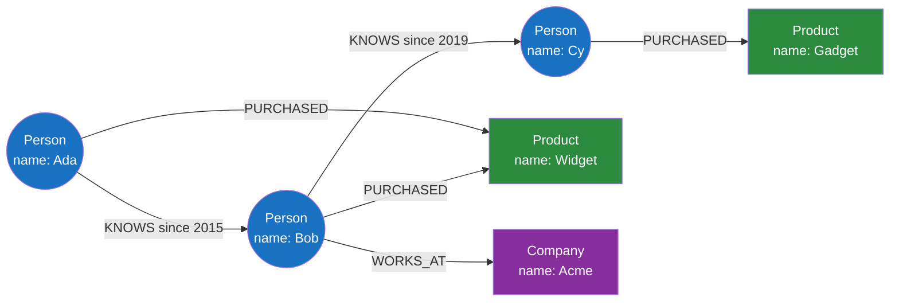

# 🕸️ Graph Databases and Cypher

> [!abstract] TL;DR
> A **graph database** stores data as **nodes** (entities) connected by **relationships** (edges), each carrying **properties** — the **property graph** model. Its defining superpower is **index-free adjacency**: each node holds direct physical pointers to its neighbours, so traversing a relationship is an O(1) pointer hop, *independent of total data size*. That's why graph DBs crush relational databases on **deep, variable-hop traversals** ("friends of friends of friends," fraud rings, shortest paths) where SQL would need an exponential pile of self-joins. **Neo4j** and its query language **Cypher** are the archetype: you draw patterns in ASCII-art — `(a)-[:KNOWS]->(b)` — and the engine walks the graph. Contrast with **RDF/triple stores** (subject-predicate-object, SPARQL) for semantic/knowledge-graph interoperability, and **Gremlin/TinkerPop** as a vendor-neutral traversal API. Use for social networks, recommendations, fraud detection, and knowledge graphs; avoid for simple tabular or aggregate workloads.

## Intuition — analogy FIRST

Think about how you'd answer *"who can introduce me to this person?"* on a professional network — and contrast two ways of storing the answer.

The **relational way** is a giant **spreadsheet of connections**: one enormous `friendships` table with columns `(person_a, person_b)`. To find friends-of-friends, you join the table to itself. Friends-of-friends-of-friends? Join it to itself *again*. Each extra hop multiplies the work; by five or six hops the database is scanning and joining millions of rows to find a handful of paths. The spreadsheet has *no idea* who's connected to whom until it laboriously matches ID columns, every single time, across the whole table.

The **graph way** is a **physical web of string** connecting pushpins on a corkboard. Each pin (a *node*) has actual pieces of string (*relationships*) tied directly to the pins it connects to. To find friends-of-friends you just **follow the strings** from your pin, then from each of those pins. You never search a table — you *walk*. And crucially, following a string from one pin takes the same tiny effort whether the board has 100 pins or 100 million, because you only ever touch the strings tied to the pins you're standing on. That "just follow the strings you're holding" property is **index-free adjacency**, and it's the whole reason graph databases exist: **relationships are first-class, physical, and free to traverse.**

---

## How It Works

### The property graph model

Two building blocks, each able to hold arbitrary key-value **properties**:

- **Nodes** — entities (a `Person`, a `Product`, an `Account`). Tagged with one or more **labels** (`:Person`, `:Admin`) for grouping/indexing. Properties: `{name: "Ada", since: 2015}`.
- **Relationships** — *directed*, *typed* edges between nodes (`(a)-[:PURCHASED {date: ...}]->(b)`). Relationships also carry properties. In a property graph the edge is a first-class citizen, not a foreign key.



### Index-free adjacency — the core performance idea

In a relational database, "follow a relationship" means "look up matching rows in another table **via an index**" — an O(log n) index seek that gets slower as the table grows, repeated for every hop and every row. In a native graph database like Neo4j, each node record stores **direct pointers** (physical memory/disk offsets) to its adjacent relationship records, which in turn point to the neighbour nodes. Traversing an edge is a **pointer dereference**, O(1), and — the key insight — its cost is **independent of the total number of nodes and edges in the database**.

| Depth of query | Relational (self-joins) | Native graph (index-free adjacency) |
|---|---|---|
| Friends (1 hop) | Fast (one indexed join) | Fast |
| Friends-of-friends (2) | Noticeably slower | Fast |
| 4–5 hops | Often seconds-to-minutes; blows up | Milliseconds; scales with *result* size, not DB size |

This is why the graph advantage isn't "graphs are always faster" — it's specifically **deep, variable-length traversals**. For shallow, one-hop lookups a relational database is perfectly fine (and often better).

---

## Data Model & Query Examples (Cypher)

Cypher is **declarative and visual**: you sketch the pattern you want as ASCII-art, and the engine finds all matches. Nodes are `(parens)`, relationships are `-[:ARROWS]->`.

### Create and match

```cypher
// Create nodes and a typed, directed relationship with properties
CREATE (ada:Person {name: 'Ada', city: 'London'})
CREATE (bob:Person {name: 'Bob'})
CREATE (ada)-[:KNOWS {since: 2015}]->(bob)

// Basic pattern match: everyone Ada knows
MATCH (ada:Person {name: 'Ada'})-[:KNOWS]->(friend)
RETURN friend.name
```

### The killer query — friends-of-friends (recommendation)

```cypher
// "People my friends know, whom I don't yet know" — a classic 2-hop recommendation
MATCH (me:Person {name: 'Ada'})-[:KNOWS]->(friend)-[:KNOWS]->(foaf)
WHERE NOT (me)-[:KNOWS]->(foaf) AND foaf <> me
RETURN foaf.name AS suggestion, count(*) AS mutualFriends
ORDER BY mutualFriends DESC
LIMIT 10
```

Note how the *two hops* are just `-[:KNOWS]->()-[:KNOWS]->` — no self-joins, no exploding SQL. `count(*)` naturally counts the paths (mutual friends).

### Variable-length paths and shortest path

The feature that is genuinely painful in SQL and trivial here:

```cypher
// Variable-length: anyone reachable from Ada in 1 to 4 KNOWS hops
MATCH (ada:Person {name: 'Ada'})-[:KNOWS*1..4]->(reachable)
RETURN DISTINCT reachable.name

// Shortest connection path between two people (LinkedIn "degrees of separation")
MATCH p = shortestPath(
  (a:Person {name: 'Ada'})-[:KNOWS*..6]-(z:Person {name: 'Zoe'})
)
RETURN [n IN nodes(p) | n.name] AS chain, length(p) AS degrees
```

`[:KNOWS*1..4]` means "1 to 4 relationships of type KNOWS." `shortestPath` runs a breadth-first search across the graph — expressible in one line, versus a recursive CTE or application-side BFS in a relational system.

### Aggregation and pattern-based recommendation

```cypher
// "Customers who bought what I bought, also bought..." — collaborative filtering
MATCH (me:Person {name: 'Ada'})-[:PURCHASED]->(p:Product)<-[:PURCHASED]-(other)-[:PURCHASED]->(rec:Product)
WHERE NOT (me)-[:PURCHASED]->(rec)
RETURN rec.name, count(DISTINCT other) AS strength
ORDER BY strength DESC
```

### RDF / triple stores — the other graph model

Not all graph databases are property graphs. **RDF (Resource Description Framework)** stores data as atomic **triples**: `subject — predicate — object` (e.g. `<Ada> <knows> <Bob>`). There are no property-bearing edges; everything, including metadata, is more triples. RDF is queried with **SPARQL** and is built for **semantic web / open data interoperability** — global URIs, ontologies (OWL/RDFS), and reasoning/inference. Trade-off: RDF is standardised and great for merging heterogeneous datasets and knowledge graphs across organisations, but more verbose and often less ergonomic than property graphs for application development.

| | **Property graph** (Neo4j) | **RDF triple store** (GraphDB, Blazegraph) |
|---|---|---|
| Unit | Node/edge with properties | Atomic `subject-predicate-object` triple |
| Query language | Cypher / GQL | SPARQL |
| Edge properties | First-class | Awkward (needs reification) |
| Sweet spot | App development, traversals | Interop, ontologies, inference, open data |

### Gremlin / Apache TinkerPop

**Gremlin** is a vendor-neutral *imperative* graph **traversal language** and API (part of Apache TinkerPop) supported by many engines (JanusGraph, Amazon Neptune, Cosmos DB). Where Cypher is declarative ("describe the pattern"), Gremlin is a step-by-step traversal (`g.V().has('name','Ada').out('KNOWS').out('KNOWS')`). It lets you write portable graph code across TinkerPop-enabled databases. The emerging **ISO GQL** standard (2024) aims to be the "SQL of graphs," unifying Cypher-style querying.

---

## Trade-offs / When to Use

**Use a graph database when relationships are the point:**
- **Social networks** — friends-of-friends, mutual connections, influence.
- **Recommendation engines** — "people/products connected to what you like" (collaborative filtering as traversal).
- **Fraud detection** — spotting rings: accounts sharing devices/addresses/cards in suspicious cycles; deep pattern matching in real time.
- **Knowledge graphs** — entities and their myriad typed relationships (Google's Knowledge Graph, enterprise data integration, GraphRAG for LLMs).
- **Network / IT / supply-chain topology** — dependency and impact analysis ("what breaks if this node fails").
- The queries are **deep, variable-length traversals** or **path-finding**.

**Avoid when:**
- The workload is **tabular / aggregate** — sums, group-bys, reports over uniform records. Relational or wide-column wins.
- Relationships are **shallow** (one hop) — a relational foreign key with an index is simpler and fast enough.
- You need **massive write throughput of independent records** with few relationships — a graph is overhead.
- You need **easy horizontal sharding** — graphs are notoriously hard to partition because relationships cross any cut you make (the "min-cut" problem); most graph DBs scale up or use read replicas rather than sharding cleanly.

---

## Common Pitfalls

1. **Using a graph DB for non-graph data.** If your queries never traverse more than one relationship, you're paying graph overhead for nothing — a relational database is the right tool. Graphs pay off with *depth and variability*.
2. **Forgetting to index the starting node.** Index-free adjacency makes *traversal* free, but you still need an index (or label scan) to *find the anchor node* to start from. A `MATCH (p:Person {name:'Ada'})` without an index on `:Person(name)` does a label scan first. Create the anchor index.
3. **Unbounded variable-length paths.** `-[:KNOWS*]->` with no upper bound in a dense graph can explode combinatorially into billions of paths. Always cap it (`*1..4`) and prefer `shortestPath` when you want a path, not all paths.
4. **Supernodes (dense nodes).** A node with millions of relationships (a celebrity, a "USA" country node) makes traversals *through* it expensive and breaks the O(1)-per-hop assumption. Model around them (e.g. partition the relationship by a property, or avoid routing through the hub).
5. **Expecting relational-grade sharding.** Graphs resist partitioning because edges cross partitions. Plan for a scale-up primary + replicas, or a graph platform with built-in (imperfect) sharding, rather than assuming Cassandra-like linear scale.
6. **Confusing property graphs and RDF.** They are different models with different query languages. Choosing RDF for a straightforward app, or a property graph for a standards-driven interop/ontology project, fights the tool.
7. **Modelling everything as properties instead of relationships.** Storing `friendIds: [1,2,3]` as a property array reinvents foreign keys and forfeits index-free adjacency. If it's a relationship, make it an edge.

---

## Related Concepts

- [[_MOC_DB_NoSQL|↑ Section MOC]]
- [[Graph_Databases]] — the System Design view of graph databases as a building block
- [[NoSQL_Overview]] — graph as the odd-one-out among the four families (relationship-oriented, not aggregate-oriented)
- [[Wide_Column_Stores]] — contrast: linear scale-out vs the graph's hard-to-shard nature
- [[Document_Stores]] — where you'd embed instead of traverse
- [[Database_Indexes]] — still needed to find the anchor node to start a traversal
- [[SQL_vs_NoSQL]] — recursive CTEs vs native graph traversal for relationship queries

## Review Questions

1. Define **index-free adjacency** and explain precisely why it makes a 5-hop "friends of friends" query scale with the *result* size rather than the *database* size, whereas the relational self-join approach degrades with each hop.
2. Write (in words or Cypher) a 2-hop recommendation query and explain why the same logic in SQL requires the friendships table to be joined to itself twice. When would you *not* reach for a graph database?
3. Contrast the **property graph** model (Neo4j/Cypher) with **RDF triple stores** (SPARQL). Give one scenario that favours each, and say where **Gremlin/TinkerPop** fits in.

## Sources

- Ian Robinson, Jim Webber & Emil Eifrem, *Graph Databases* (O'Reilly) — index-free adjacency, property graph model
- Neo4j Documentation — Cypher Manual: https://neo4j.com/docs/cypher-manual/current/
- Neo4j — Graph Database Concepts: https://neo4j.com/docs/getting-started/appendix/graphdb-concepts/
- W3C — RDF 1.1 & SPARQL 1.1 Specifications: https://www.w3.org/TR/rdf11-concepts/
- Apache TinkerPop — Gremlin Documentation: https://tinkerpop.apache.org/gremlin.html

#Database #NoSQL #Graph #Neo4j #Cypher #PropertyGraph #IndexFreeAdjacency #RDF #SPARQL #Gremlin
