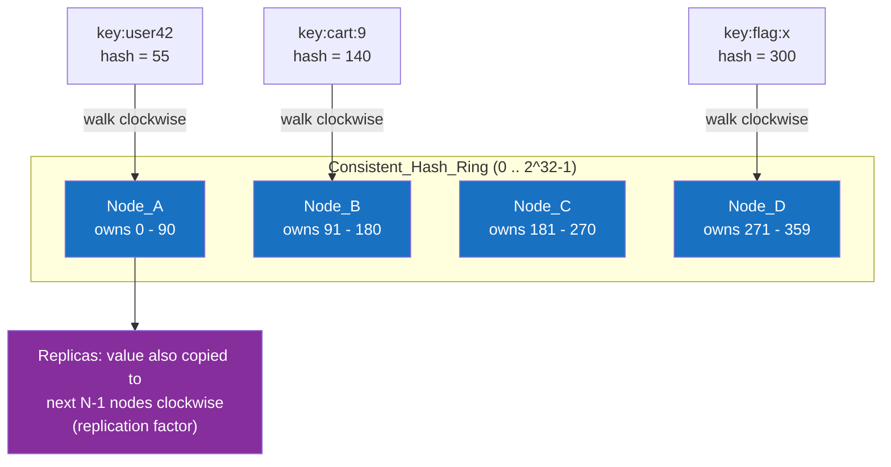

# 🔑 Key-Value Stores

> [!abstract] TL;DR
> A **key-value store** is the simplest NoSQL model: a giant, distributed **hash map** of `key -> value`, where the value is an **opaque blob** the database never looks inside. You get `GET`, `PUT`, `DELETE` by exact key in roughly **O(1)** time, and because keys hash independently, the data set **partitions trivially** across many nodes — usually via **consistent hashing**. The trade for that raw speed and scale is that you can *only* look things up by key: no queries over the value's contents, no joins. Redis (in-memory, rich data structures), DynamoDB (managed, partition + sort key), Riak, and etcd are the archetypes. Perfect for **caches, session stores, feature flags, and shopping carts**.

## Intuition — analogy FIRST

A key-value store is a wall of **coat-check lockers**.

You hand the attendant your coat and get a **numbered ticket** (the *key*). The attendant doesn't care what's in the coat — cash, a phone, a sandwich — it's an **opaque bundle** (the *value*). Later you present the ticket and get the exact bundle back, instantly. The attendant walks straight to locker #4417; they don't search, they don't rummage. That's an **O(1)** lookup by key.

But notice what you *can't* do: you cannot ask the attendant "give me all the coats that have a phone in the pocket." They never looked inside; the contents are invisible to them. To answer that you'd have to open every locker yourself. That single limitation — **lookup by key only, contents opaque** — is the entire personality of a key-value store: blazing fast and effortlessly scalable at exactly one thing, and useless for anything else.

Now imagine one coat-check room isn't enough for a stadium. You open **sixteen rooms** and hang a sign: "tickets ending 0–0FFF → Room 1, 1000–1FFF → Room 2…". Any attendant, given a ticket, instantly knows which room to walk to. That routing rule is **partitioning by key hash**, and it's why key-value stores scale out so cleanly.

---

## How It Works

Two mechanisms define a distributed key-value store: **hashing the key to find its value**, and **hashing the key to find its node**. The second is the clever part.

Naively, to spread keys over `N` nodes you'd compute `node = hash(key) mod N`. It works — until `N` changes. Add or remove one node and `mod N` becomes `mod (N±1)`, remapping **almost every key** to a different node: a catastrophic, cache-cold reshuffle. **Consistent hashing** solves this by mapping both keys *and* nodes onto the same circular hash space (a "ring"); a key belongs to the first node clockwise from it. Add a node and only the keys between it and its predecessor move — roughly `1/N` of the data, not all of it.



In practice each physical node is placed at **many** points on the ring (**virtual nodes / vnodes**) so load spreads evenly and a departing node's keys scatter across *all* survivors rather than dumping onto one neighbour. The value is then **replicated** to the next `N-1` nodes clockwise (the replication factor), which is what makes the store survive node failure. Full mechanics in [[Consistent_Hashing]].

### The core API — deliberately tiny

```
PUT(key, value)     -> store (or overwrite) the blob
GET(key)            -> return the blob, or nil
DELETE(key)         -> remove it
```

Some stores add `TTL` (auto-expiry — the heartbeat of caches), atomic counters, and compare-and-set. But the surface stays intentionally minimal; the whole value proposition is that a tiny, uniform API lets the engine optimise ruthlessly and shard trivially.

---

## Data Model & Query Examples

The model is `key -> value`. What differs across products is *how rich the value and the API are* — from an opaque byte string (pure KV) to server-side data structures (Redis).

### Redis — in-memory, data-structure server

Redis is a key-value store where the *value* can be a string, hash, list, set, sorted set, stream, or bitmap — and the server exposes atomic operations on each. This makes it far more than a cache.

```redis
# String value + TTL (classic cache / session)
SET session:abc123 "{\"user\":42,\"role\":\"admin\"}" EX 1800   # expires in 30 min
GET session:abc123
TTL session:abc123

# Atomic counter — rate limiting, feature-flag rollout %
INCR page:home:views
INCRBY user:42:credits 100

# Hash — store an object's fields without serialising the whole blob
HSET user:42 name "Ada" plan "pro" logins 17
HINCRBY user:42 logins 1
HGETALL user:42

# Sorted set — a real-time leaderboard, O(log n) ranked
ZADD leaderboard 4820 "player:7"
ZADD leaderboard 5100 "player:3"
ZREVRANGE leaderboard 0 9 WITHSCORES     # top 10

# List as a queue
LPUSH jobs "email:welcome:42"
BRPOP jobs 0                              # blocking pop (worker)
```

### DynamoDB — managed, partition key + sort key

DynamoDB's key is richer: a **partition key** (which node/partition, via its hash) optionally combined with a **sort key** (ordering *within* that partition). The `(PK, SK)` pair enables a "wide-row"-like access pattern on top of a KV foundation.

```
# Simple key-value: partition key only
Table: Sessions   PK = session_id
  { session_id: "abc123", user: 42, expires: 1690000000 }

# Composite key: PK groups items, SK orders/filters within the group
Table: Orders     PK = customer_id   SK = order_date#order_id
  { customer_id: "C42", "order_date#order_id": "2026-07-01#O900", total: 89.99 }
  { customer_id: "C42", "order_date#order_id": "2026-07-15#O912", total: 42.00 }

# Query = all of one partition, range-filtered by sort key (efficient, single partition)
Query: PK = "C42" AND SK BETWEEN "2026-07-01" AND "2026-07-31"
```

- **GSI (Global Secondary Index)** — an index with a *different* partition key, letting you query by another attribute (e.g. by `email`). It's a separately-partitioned replica of the data.
- **LSI (Local Secondary Index)** — same partition key, *alternate* sort key; must be defined at table creation.
- **Capacity**: **provisioned** (you reserve RCU/WCU, cheaper at steady predictable load) vs **on-demand** (pay-per-request, auto-scales, ideal for spiky/unknown traffic).

> [!warning] Avoid `Scan`
> `Scan` reads the *entire* table (every partition) — the coat-check "open every locker" anti-pattern. Model your data so every access is a `GetItem` or a `Query` on a known partition key. Needing `Scan` is a signal your key design doesn't match your access pattern.

### Riak & etcd — the ends of the spectrum

- **Riak** — a faithful Dynamo implementation: highly available, consistent hashing, tunable N/R/W quorums, conflict resolution via vector clocks. Built for "must accept writes even during a partition."
- **etcd** — a small, **strongly consistent** key-value store backing Kubernetes. It uses the **Raft** consensus protocol, trading availability-under-partition for linearizable reads. Proof that "key-value" says nothing about the consistency model — etcd is the opposite of Dynamo.

---

## Trade-offs / When to Use

**Use a key-value store when:**
- **Caching** — the killer app. Redis/Memcached in front of a slow database or API; `GET` by key with a TTL.
- **Session storage** — session ID → session blob; fast, disposable, TTL-expired.
- **Feature flags / config** — flag name → rollout rule, read on every request.
- **Shopping carts, user preferences, real-time counters, leaderboards, rate limiters** — a single aggregate fetched/mutated by a known key.
- You need **predictable single-digit-millisecond latency at massive scale** and every access is by key.

**Avoid when:**
- You must **query by value contents** ("all users in Berlin") — the store can't see inside; you'd need a document store or a secondary index.
- You need **relationships / joins** across keys.
- The data is naturally relational and queried ad-hoc.

| Dimension | Strength | Limitation |
|---|---|---|
| **Read/write by key** | O(1), microsecond-to-millisecond | Only by *exact* key (or PK+SK range) |
| **Scaling** | Trivial horizontal partitioning | Hot keys create hotspots (see pitfalls) |
| **Schema** | None — total flexibility | No validation, no queryable structure |
| **Value size** | Small aggregates ideal | Large blobs waste RAM/bandwidth |

---

## Common Pitfalls

1. **Hot keys.** One wildly popular key (a celebrity's profile, a global counter) hashes to a *single* partition, and no amount of nodes helps — that one node melts. Mitigate by sharding the key (`counter:{0..9}` summed) or fronting it with a local cache.
2. **Using `Scan` / `KEYS *` in production.** Both walk every key. Redis `KEYS *` blocks the single-threaded server; use `SCAN` (cursor-based) or, better, design keys so you never need to enumerate.
3. **Unbounded values.** Appending forever to one Redis list or one DynamoDB item hits size limits (DynamoDB item = 400 KB) and turns cheap O(1) ops into expensive ones. Keep aggregates bounded.
4. **Forgetting TTLs on cache/session keys.** Without expiry, a cache becomes an ever-growing memory leak and evicts unpredictably. Always set a TTL for ephemeral data.
5. **Assuming durability like an RDBMS.** In-memory stores (Redis default) can lose recent writes on crash unless AOF/RDB persistence is tuned. Treat a pure cache as *rebuildable*, not a system of record.
6. **Modelling relational data as KV.** Storing `user:42`, `user:42:orders`, `user:42:orders:1`… and stitching them in app code reinvents joins, badly. If you need queryable relationships, pick the right family.
7. **Ignoring the consistency dial (Dynamo-style).** Reads default to *eventually consistent* in DynamoDB (cheaper); request *strongly consistent* reads explicitly when you can't tolerate stale data.

---

## Related Concepts

- [[_MOC_DB_NoSQL|↑ Section MOC]]
- [[Key_Value_Store]] — the System Design view: KV stores as an architectural building block
- [[NoSQL_Overview]] — where key-value sits among the four families
- [[Consistent_Hashing]] — the partitioning algorithm that lets KV stores scale and rebalance
- [[Wide_Column_Stores]] — the natural next step when you need ordered range scans, not just point gets
- [[Consistency_Models]] — eventual vs strong reads, the DynamoDB/Riak dial
- [[CAP_Theorem]] — why Riak (AP) and etcd (CP) are both "key-value" yet opposites
- [[Database_Replication]] — how the replication factor keeps keys available under failure

## Review Questions

1. Why does `hash(key) mod N` break horribly when you add a node, and how does consistent hashing reduce the keys that must move from "almost all" to "about 1/N"? What role do virtual nodes play?
2. Explain the difference between a DynamoDB **partition key** and **sort key**, and why a `Query` on a partition key is efficient while a `Scan` is an anti-pattern.
3. Both DynamoDB (Dynamo-style) and etcd (Raft-based) are "key-value stores," yet one is AP and the other CP. What does that tell you about how much the term "key-value" reveals about a database's guarantees?

## Sources

- DeCandia et al., *Dynamo: Amazon's Highly Available Key-value Store* (2007) — consistent hashing, vnodes, tunable quorums
- Amazon DynamoDB Developer Guide — Core Components & Best Practices: https://docs.aws.amazon.com/amazondynamodb/latest/developerguide/HowItWorks.html
- Redis Documentation — Data types: https://redis.io/docs/latest/develop/data-types/
- etcd Documentation — Why etcd / Raft: https://etcd.io/docs/latest/learning/why/
- Martin Kleppmann, *Designing Data-Intensive Applications*, Ch. 6 — Partitioning

#Database #NoSQL #KeyValue #Redis #DynamoDB #ConsistentHashing #Caching #SessionStore
