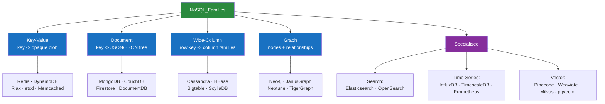

# 🧩 NoSQL Overview

> [!abstract] TL;DR
> **NoSQL** ("Not Only SQL") is an umbrella for databases that drop the strict relational table-and-join model to buy **horizontal scale**, **flexible schema**, and **developer velocity**. Instead of one model, there are four core **families** — **key-value**, **document**, **wide-column**, and **graph** — plus specialised cousins (search, time-series, vector). Most trade **ACID** for **BASE** (Basically Available, Soft state, Eventually consistent) and organise data as self-contained **aggregates** rather than normalised rows joined at query time. The schema lives in your application code (**schema-on-read**), not the database. NoSQL is a poor fit when you need multi-entity transactions, ad-hoc joins, or strong global consistency — that is still SQL's home turf.

## Intuition — analogy FIRST

Think about how you'd organise information as a **filing system** versus a **set of self-contained folders**.

A **relational database** is a meticulous **tax office**. Every fact lives in exactly one place: your address is in the *Addresses* ledger, your payments in the *Payments* ledger, your dependents in the *Dependents* ledger. Nothing is duplicated. To assemble your complete profile, a clerk pulls three ledgers and **joins** them by your ID. This is beautiful for consistency — change your address once and everyone sees it — but it means every read is a scavenger hunt across ledgers, and when the office gets a million new citizens, one clerk at one desk can't keep up.

**NoSQL** is a wall of **manila folders**, one per person, each holding *everything* about that person — address, payments, dependents — stapled together. Grab one folder and you have the whole story in a single reach: no joining, no scavenger hunt. And because folders are independent, you can split the wall across ten filing rooms in ten buildings (ten machines), each handling its own citizens. The price: your address now appears in several folders (yours, your spouse's), so an address change means editing multiple folders — and for a moment they might disagree.

That single trade — **duplicate-and-self-contain instead of normalise-and-join** — is the seed from which every NoSQL design decision grows.

---

## How It Works

NoSQL didn't appear from theory; it was **forged by scale**. In the mid-2000s, Google (Bigtable), Amazon (Dynamo), and Facebook (Cassandra) hit a wall: a single relational server, even a huge one, could not serve planet-scale traffic, and sharding a relational database by hand — with cross-shard joins and distributed transactions — was operationally brutal. Their answer was to redesign the data model so the database could **shard itself** and stay available even when machines and networks fail.

### The three forces that created NoSQL

1. **Scale (horizontal, not vertical).** Relational DBs scale *up* — buy a bigger box. NoSQL scales *out* — add commodity nodes. When your data or traffic outgrows the biggest single machine, out-scaling is the only option, and NoSQL data models are built to partition cleanly.
2. **Flexible schema (developer velocity).** In agile teams the shape of data changes weekly. `ALTER TABLE` on a billion-row relational table is a heavyweight, sometimes locking, operation. A document store just writes the new field on the next insert — no migration ceremony.
3. **New data shapes.** JSON from web APIs, IoT sensor streams, social graphs, and ML embeddings don't map cleanly onto rows and columns. NoSQL families were shaped around these native forms.

---

## Key Concepts / Details

### ACID vs BASE — the philosophical split

Relational databases promise **ACID** (see [[ACID_and_Transactions]]). Many distributed NoSQL systems instead offer **BASE**, a deliberately looser guarantee that is the *practical consequence* of choosing availability under the [[CAP_Theorem]].

| | **ACID** (classic RDBMS) | **BASE** (many NoSQL) |
|---|---|---|
| **A** | **Atomicity** — all-or-nothing | **Basically Available** — the system always responds, even if with stale data |
| **C** | **Consistency** — every read sees a valid, latest state | **Soft state** — state may change over time without new input (replicas converging) |
| **I** | **Isolation** — concurrent txns don't interfere | |
| **D** | **Durability** — commits survive crashes | **Eventually consistent** — replicas converge *given enough time* without new writes |
| Mindset | *Correctness first* | *Availability & scale first* |

BASE is not "no guarantees" — it is a **tunable** trade. Dynamo-style stores (Cassandra, DynamoDB) let you dial consistency per request (see [[Consistency_Models]] and the quorum discussion in [[Wide_Column_Stores]]). And the pendulum has swung back: modern "NewSQL" and document stores (MongoDB 4.0+, Cosmos DB, FoundationDB) now offer ACID multi-document transactions — the ACID/BASE line is a spectrum, not a wall.

### Aggregate-oriented modelling

The unifying idea across KV, document, and wide-column stores (graph is the exception) is the **aggregate**: a cluster of data that is stored, retrieved, and updated as a **single unit**, identified by one key.

- **Relational modelling** decomposes an order into `orders`, `order_lines`, `customers`, `products` — four tables, joined at read time. Normalisation minimises duplication.
- **Aggregate modelling** stores the *entire order* — header, line items, shipping address snapshot — as one document under one key. One read returns the whole thing; no joins.

The aggregate boundary is also the **transaction and distribution boundary**: NoSQL systems typically guarantee atomicity *within* one aggregate but not *across* aggregates, and they shard by the aggregate's key. Choosing your aggregate boundaries **is** your NoSQL data model.

### Schema-on-read vs schema-on-write

- **Schema-on-write** (RDBMS): the schema is declared up front; the database *rejects* any row that doesn't conform. Structure is enforced at write time.
- **Schema-on-read** (most NoSQL): the database stores whatever you give it; **your application** interprets the structure when it reads. Structure is enforced (or not) at read time.

Schema-on-read buys agility but shifts the burden: with no `NOT NULL` or type checks, malformed or drifting data silently accumulates, and every reader must defensively handle *every historical shape* of the data. "Schemaless" really means "the schema is now in your code, undocumented and unenforced" — which is why teams add application-level schema validators (Mongoose, JSON Schema, DynamoDB single-table design docs).

### The four families at a glance

| Family | Data model | Read pattern it loves | Canonical systems | Deep-dive note |
|---|---|---|---|---|
| **Key-Value** | `key -> opaque value` | Get/put by exact key | Redis, DynamoDB, Riak | [[Key_Value_Stores]] |
| **Document** | `key -> nested JSON tree` | Query by fields *inside* the value | MongoDB, CouchDB | [[Document_Stores]] |
| **Wide-Column** | `partition key -> sparse columns` | Range scans over clustered rows | Cassandra, HBase, Bigtable | [[Wide_Column_Stores]] |
| **Graph** | `nodes + edges + properties` | Traverse relationships | Neo4j, JanusGraph | [[Graph_Databases_and_Cypher]] |

Think of KV → document → wide-column as **increasing structure the database can see inside the value**. A KV store treats the value as an opaque blob; a document store can index and query *fields within* it; a wide-column store imposes a partition/clustering structure for ordered scans. Graph is a different axis entirely — it optimises for **relationships between records**, not the records themselves.

---

## Trade-offs / When to Use

**Reach for NoSQL when:**
- Your working set exceeds one machine and must **shard horizontally** with predictable performance.
- The data is naturally an **aggregate** (a document, an event, a session) read as a unit by a known key.
- The **schema evolves fast** or is genuinely heterogeneous (per-tenant custom fields, sparse attributes).
- The access pattern is a poor fit for the relational engine: pure key lookups (KV/cache), deep relationship traversals (graph), massive append-only time-ordered writes (wide-column/time-series), or similarity search over embeddings (vector).

**NoSQL is the WRONG choice when:**
- You need **multi-entity ACID transactions** (transfer money between two accounts, decrement inventory *and* create an order atomically). Aggregate-scoped atomicity doesn't cover cross-aggregate invariants.
- Your queries are **ad-hoc and join-heavy** — reporting, BI, "slice by any dimension." Relational + SQL is unbeaten here; denormalised NoSQL forces you to know queries in advance.
- **Strong global consistency** is non-negotiable (regulatory ledgers, bookings that must never double-sell).
- The dataset is **small and relational-shaped** — a well-indexed Postgres handles millions of rows on one node effortlessly. "We might need web-scale someday" is premature optimisation; see [[SQL_vs_NoSQL]].

> [!tip] The modern default
> Start with a relational database (Postgres) and reach for a specific NoSQL family only when a concrete access pattern demands it — often as a *complement* (Redis cache + Postgres, or Elasticsearch alongside Postgres), not a replacement. **Polyglot persistence** — the right store per workload — is the mature end state, not "pick one database for everything."

---

## Common Pitfalls

1. **Choosing NoSQL for scale you don't have.** The vast majority of applications never outgrow a single relational primary with read replicas. Adopting NoSQL "to be web-scale" trades a familiar, powerful model for operational complexity you won't benefit from.
2. **Treating "schemaless" as "no data modelling."** NoSQL modelling is *harder*, not easier — you must design around your queries up front (especially in wide-column) and you lose the safety net of constraints. The schema moved to your code; it did not disappear.
3. **Expecting joins.** Most NoSQL stores can't join across aggregates (or do it slowly, like Mongo `$lookup`). Designing a normalised, relational-style schema on a document store gives you the worst of both worlds.
4. **Assuming NoSQL means eventual consistency (or that it means no consistency).** Consistency is a *configurable dial* in Dynamo-style stores and *strong* in many others. Conflating "NoSQL" with "will lose my data" is outdated FUD.
5. **Ignoring the aggregate boundary.** Cramming unbounded, ever-growing collections (all a user's events for all time) into one document/row hits size limits (Mongo's 16 MB doc cap) and creates hotspots. The aggregate must stay bounded.
6. **Forgetting that "NoSQL" is four+ radically different things.** A graph database and a key-value store share almost nothing. "We use NoSQL" says roughly as much as "we use a programming language."

---

## Related Concepts

- [[_MOC_DB_NoSQL|↑ Section MOC]]
- [[SQL_vs_NoSQL]] — the decision framework: when relational still wins and how to choose
- [[Key_Value_Stores]] · [[Document_Stores]] · [[Wide_Column_Stores]] · [[Graph_Databases_and_Cypher]] — the four families in depth
- [[Time_Series_and_Vector_Databases]] — the specialised stores for metrics and embeddings
- [[CAP_Theorem]] — the availability/consistency trade that shapes distributed NoSQL
- [[Consistency_Models]] — strong, eventual, and tunable consistency explained
- [[ACID_and_Transactions]] — the guarantees BASE relaxes
- [[Database_Sharding]] — horizontal partitioning, the scaling mechanism NoSQL bakes in

## Review Questions

1. A colleague argues "we should move to NoSQL because our Postgres schema keeps changing and migrations are painful." Give two clarifying questions you'd ask, and explain the specific trade-off (naming the guarantee) they'd accept by switching.
2. Explain "aggregate-oriented modelling" and why the aggregate boundary simultaneously defines the transaction scope *and* the sharding unit. What relational concept does it deliberately reject?
3. Contrast schema-on-write and schema-on-read. Where does the schema "live" in a schemaless document store, and what class of bug does that shift introduce?

## Sources

- Pramod Sadalage & Martin Fowler, *NoSQL Distilled* — aggregate orientation, the four families, polyglot persistence
- Martin Kleppmann, *Designing Data-Intensive Applications*, Ch. 2–3 — data models and storage engines
- DeCandia et al., *Dynamo: Amazon's Highly Available Key-value Store* (2007) — the BASE/availability origin
- Chang et al., *Bigtable: A Distributed Storage System for Structured Data* (2006)
- MongoDB — What Is NoSQL: https://www.mongodb.com/nosql-explained

#Database #NoSQL #Overview #BASE #ACID #AggregateOrientation #SchemaOnRead #PolyglotPersistence
