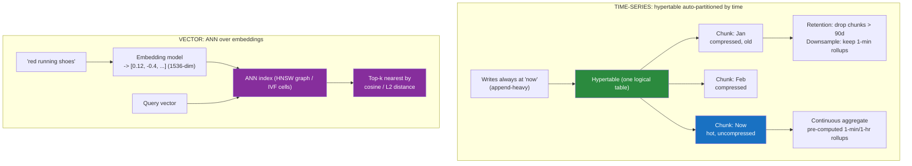

# 📈 Time-Series and Vector Databases

> [!abstract] TL;DR
> Two specialised NoSQL families, each shaped by a workload the generic families handle poorly. A **time-series database (TSDB)** is built for **append-heavy, time-ordered** data (metrics, IoT, events): timestamp-partitioned storage, aggressive compression, automatic **retention/downsampling**, and **continuous aggregates** so "average CPU per minute for the last year" is instant. InfluxDB, **TimescaleDB** (a Postgres extension using **hypertables**), and Prometheus lead. A **vector database** stores high-dimensional **embeddings** and answers **"find the most *similar* items"** using **approximate nearest neighbour (ANN)** indexes — **HNSW** graphs and **IVF** partitions — trading a little recall for enormous speed. It powers **semantic search and RAG** for LLMs. Leaders: pgvector, Pinecone, Weaviate, Milvus, Qdrant. Both trade generality for a single access pattern done extraordinarily well.

## Intuition — analogy FIRST

**Time-series** is a **seismograph** endlessly drawing a line on a scrolling paper roll. Two truths define it. First, the pen only ever moves *forward* — you append new readings at "now"; you almost never go back and edit what the pen drew an hour ago (append-heavy, immutable). Second, nobody reads the roll millimetre by millimetre; they ask *summarised, time-bucketed* questions — "what was the biggest tremor each day this month?" So the smart move is to keep the fine detail only briefly (it compresses beautifully because consecutive readings barely differ), and to pre-compute the daily and hourly summaries so those questions are answered instantly. That's **retention, downsampling, and continuous aggregates** in one image.

**Vector search** is a **spice rack organised by smell, not by name**. In a normal database you find "cinnamon" by its exact label — an equality lookup. But suppose you hand someone a jar and ask *"what smells most like THIS?"* There's no label to match; you need the jars whose *aroma is closest*. If you sniff all 10,000 jars you'll find the true nearest, but you'll be there all day (that's brute-force exact search). Instead, imagine the rack is pre-arranged so similar smells cluster together, with little signposts linking each region to its neighbours. Now you sniff your way *toward* the closest jars in a few hops, checking maybe 200 jars instead of 10,000 — occasionally missing the *absolute* closest, but finding excellent matches almost instantly. That "navigate toward similar, don't scan everything, accept near-perfect" is **approximate nearest neighbour** search, and the signpost web is an **HNSW index**.

---

## How It Works



### Time-series internals

- **Time-partitioned storage.** Data is split into **chunks/shards by time window** (TimescaleDB calls the logical table a **hypertable**, transparently partitioned into chunks). Recent chunks stay hot and writable; old chunks are compressed and eventually dropped. Queries with a time filter touch only the relevant chunks (**chunk exclusion**) — the equivalent of an index on time, for free.
- **Columnar compression.** Consecutive readings from one sensor barely change, so **delta-of-delta** and **run-length/Gorilla** encoding shrink data 10–20×. Metrics data is the ideal compression target.
- **Downsampling & retention.** Keep raw data for days, minute-rollups for months, hour-rollups for years — old fine-grained detail is aggregated away automatically by **retention policies**.
- **Continuous aggregates / materialized rollups.** Dashboards ask the same bucketed queries constantly; TSDBs incrementally maintain these rollups so a year-long chart doesn't rescan a billion raw points.

**The players:** **InfluxDB** — purpose-built TSDB with its own engine (TSM) and query languages (Flux/InfluxQL). **TimescaleDB** — a **Postgres extension**: you get hypertables, compression, and continuous aggregates *while keeping full SQL, joins, and the Postgres ecosystem* (often the pragmatic choice — see [[Advanced_SQL_and_JSON]]). **Prometheus** — a monitoring system with an embedded TSDB, **pull-based** scraping and the **PromQL** language, the de-facto standard for cloud-native metrics/alerting.

### Vector internals

An **embedding** is a fixed-length vector (e.g. 384–1536 floats) produced by an ML model such that *semantically similar inputs land near each other* in the vector space. "Similarity" is a **distance metric**: **cosine similarity** (angle), **Euclidean/L2**, or **dot product**. Finding the true nearest neighbours means comparing the query to *every* stored vector — O(n·d), impossibly slow at millions of vectors. So vector DBs build an **Approximate Nearest Neighbour (ANN)** index:

- **HNSW (Hierarchical Navigable Small World)** — a multi-layer graph where each vector links to its nearest neighbours. Search starts at a sparse top layer and "greedily hops" toward the query, descending into denser layers — logarithmic-ish, high recall, high memory. The default in Qdrant, Weaviate, and pgvector.
- **IVF (Inverted File Index)** — cluster vectors into `k` cells (via k-means); at query time search only the few nearest cells instead of all vectors. Often combined with **PQ (Product Quantization)** to compress vectors (IVF-PQ), trading recall for huge memory savings — the Milvus/FAISS approach for billion-scale sets.

The knobs (`ef_search`/`nprobe`) trade **recall vs latency**: search more of the graph/more cells → closer to exact, but slower. That recall/speed dial is the essence of ANN.

---

## Data Model & Query Examples

### Time-series in TimescaleDB (SQL)

```sql
-- Create a normal table, then turn it into a time-partitioned hypertable
CREATE TABLE metrics (
    time        TIMESTAMPTZ NOT NULL,
    device_id   TEXT,
    cpu         DOUBLE PRECISION,
    temp        DOUBLE PRECISION
);
SELECT create_hypertable('metrics', 'time');   -- auto-chunks by time

-- time_bucket() = GROUP BY on a time window: avg CPU per 5 minutes per device
SELECT time_bucket('5 minutes', time) AS bucket,
       device_id,
       avg(cpu)  AS avg_cpu,
       max(temp) AS peak_temp
FROM metrics
WHERE time > now() - INTERVAL '24 hours'
GROUP BY bucket, device_id
ORDER BY bucket DESC;

-- Continuous aggregate: incrementally-maintained rollup (dashboards read THIS)
CREATE MATERIALIZED VIEW metrics_hourly
WITH (timescaledb.continuous) AS
SELECT time_bucket('1 hour', time) AS bucket, device_id, avg(cpu) AS avg_cpu
FROM metrics GROUP BY bucket, device_id;

-- Automatic downsampling/retention: drop raw data older than 90 days
SELECT add_retention_policy('metrics', INTERVAL '90 days');
```

```promql
-- Prometheus / PromQL: per-second HTTP error rate over 5-minute windows
rate(http_requests_total{status=~"5.."}[5m])
```

### Vector search with pgvector (SQL) and a vector DB

```sql
-- pgvector: add a vector column to ordinary Postgres and index it with HNSW
CREATE EXTENSION vector;
CREATE TABLE documents (
    id        BIGSERIAL PRIMARY KEY,
    content   TEXT,
    embedding VECTOR(1536)          -- e.g. an OpenAI embedding
);
CREATE INDEX ON documents USING hnsw (embedding vector_cosine_ops);

-- Semantic search: k nearest neighbours to the query embedding
-- '<=>' = cosine distance ('<->' = L2, '<#>' = inner product)
SELECT id, content
FROM documents
ORDER BY embedding <=> '[0.12, -0.4, ...]'::vector   -- query embedding
LIMIT 5;

-- Hybrid: combine vector similarity with a normal SQL filter (metadata filtering)
SELECT id, content
FROM documents
WHERE content ILIKE '%invoice%'                      -- keyword / metadata filter
ORDER BY embedding <=> '[...]'::vector
LIMIT 5;
```

```python
# Dedicated vector DB (Qdrant-style): upsert vectors + payload, then search
client.upsert("docs", points=[
    {"id": 1, "vector": [0.12, -0.4, ...], "payload": {"title": "Shoes"}},
])
hits = client.search(
    collection_name="docs",
    query_vector=embed("red running shoes"),
    limit=5,
    query_filter={"must": [{"key": "in_stock", "match": {"value": True}}]},
)
```

### The RAG pattern (why vector DBs exploded)

**Retrieval-Augmented Generation**: embed a user's question → ANN-search the vector DB for the most similar document chunks → stuff those chunks into the LLM prompt as context → the model answers grounded in *your* data. The vector DB is the "retrieval" that lets an LLM cite private/current knowledge it was never trained on.

**The players:** **pgvector** — Postgres extension; keep vectors *next to your relational data* with real SQL filters (the low-friction default). **Pinecone** — fully-managed, serverless vector DB. **Weaviate** — open-source, built-in vectorizer modules and hybrid search. **Milvus** — open-source, GPU-accelerated, billion-scale (IVF-PQ). **Qdrant** — Rust, fast, strong metadata filtering.

---

## Trade-offs / When to Use

| | **Time-Series DB** | **Vector DB** |
|---|---|---|
| Data shape | `(timestamp, tags, value)` streams | High-dim float embeddings |
| Write pattern | Append-heavy, immutable, "now" | Batch upserts of embeddings |
| Core query | Time-bucketed aggregation over ranges | Top-k nearest by distance |
| Killer feature | Downsampling, retention, compression | ANN (HNSW/IVF) similarity search |
| Use cases | Monitoring, IoT, finance ticks, events | Semantic search, RAG, recommendations, dedup, anomaly |
| Cross-ref | [[OLTP_vs_OLAP]] (neither — a third shape) | RAG / LLM retrieval |

**Use a TSDB when** data arrives time-stamped and append-only, you query by time ranges with aggregation, and you need retention/compression at scale. **Don't** for transactional or relational-shaped data.

**Use a vector DB when** you need semantic/similarity search over embeddings (RAG, "find similar," recommendations, image/audio search). **Don't** when exact keyword/attribute matching suffices — that's a job for a search index or a plain `WHERE`.

> [!tip] The Postgres pragmatic path
> For *both* families, a Postgres extension (**TimescaleDB** for time-series, **pgvector** for vectors) often wins: you keep SQL, joins, transactions, and one operational system instead of adding a bespoke database. Reach for the dedicated systems (InfluxDB, Pinecone, Milvus) when scale, latency, or specialised features (billion-scale ANN, GPU indexing, managed serverless) outgrow the extension.

---

## Common Pitfalls

**Time-series**
1. **Using a generic RDBMS table for metrics.** Without time-partitioning/compression, a metrics table balloons and time-range queries scan everything. Use a hypertable or purpose-built TSDB.
2. **High-cardinality tags.** In InfluxDB/Prometheus, each unique tag combination (a *series*) has cost; putting a unbounded value (user_id, request_id) in a tag causes a **cardinality explosion** that wrecks memory. Keep tags low-cardinality; put high-cardinality data in fields.
3. **Keeping raw high-resolution data forever.** Storage and query cost explode. Configure downsampling + retention from day one.
4. **Querying without a time predicate.** Omitting a `WHERE time > ...` defeats chunk exclusion and scans all history.

**Vector**
5. **Expecting exact results from ANN.** ANN is *approximate* — it can miss the true nearest neighbour. Tune `ef_search`/`nprobe` for the recall you need, and benchmark recall, not just latency.
6. **Ignoring metadata/pre-filtering interplay.** Filtering "in_stock = true" *and* doing ANN is subtle: filter-then-search can miss neighbours, search-then-filter can return too few. Use a DB with proper **filtered ANN** and understand its semantics.
7. **Mismatched embedding model or distance metric.** Query and stored vectors must come from the *same* model, and you must use the metric the model was trained for (usually cosine). Mixing them silently returns garbage.
8. **Not normalizing / wrong dimensionality.** Indexes are built for a fixed dimension; changing the embedding model means re-embedding and rebuilding the whole index.

---

## Related Concepts

- [[_MOC_DB_NoSQL|↑ Section MOC]]
- [[NoSQL_Overview]] — where the specialised (time-series, vector, search) families fit
- [[OLTP_vs_OLAP]] — time-series and vector are a *third* workload shape, neither transactional nor analytical
- [[Advanced_SQL_and_JSON]] — TimescaleDB and pgvector as Postgres extensions: SQL + specialised power
- [[Wide_Column_Stores]] — the general append-heavy family time-series specialises from
- [[Key_Value_Stores]] — Prometheus/embeddings ultimately keyed lookups under the hood
- [[Database_Indexes]] — HNSW/IVF are specialised index structures, contrasted with B-trees

## Review Questions

1. Name the three storage optimisations that make a time-series database outperform a generic RDBMS for metrics, and explain what a **continuous aggregate** buys a dashboard querying a year of data.
2. Why is exact nearest-neighbour search impractical at millions of vectors, and how do **HNSW** and **IVF** each make it fast? What exactly are you trading away, and which knob controls that trade?
3. Describe the **RAG** pipeline end-to-end and pinpoint where the vector database sits. Why must the query embedding and the stored embeddings come from the same model with a matching distance metric?

## Sources

- TimescaleDB Documentation — Hypertables, Compression, Continuous Aggregates: https://docs.timescale.com/
- InfluxDB Documentation — Key Concepts & Data Model: https://docs.influxdata.com/influxdb/latest/reference/key-concepts/
- Prometheus Documentation — Data Model & PromQL: https://prometheus.io/docs/concepts/data_model/
- Malkov & Yashunin, *Efficient and robust approximate nearest neighbor search using HNSW graphs* (2016)
- pgvector — https://github.com/pgvector/pgvector · Pinecone Learn — Vector Databases: https://www.pinecone.io/learn/vector-database/

#Database #NoSQL #TimeSeries #VectorDatabase #TimescaleDB #InfluxDB #Prometheus #pgvector #HNSW #ANN #RAG #Embeddings
