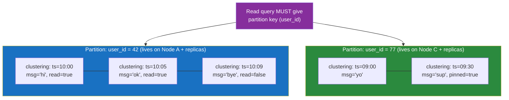

# 🏛️ Wide-Column Stores

> [!abstract] TL;DR
> A **wide-column store** organises data as a giant, sparse, distributed table of **rows keyed by a partition key**, where each row holds a set of **columns grouped into column families** — and different rows can have wildly different columns. It is **NOT** a columnar/OLAP database; the name refers to *rows that can be very wide with flexible columns*, not to on-disk column orientation. **Cassandra** is the archetype: you pick a **partition key** (which node) plus **clustering columns** (sort order *within* the partition) and you **design one table per query** — denormalising aggressively because there are no joins. Under the hood it is a masterless **ring** of peers using **gossip**, **tunable consistency** via quorums, and **LSM-tree** storage that turns every write into a fast sequential append. Built for **massive write throughput, linear scale, and no single point of failure**.

## Intuition — analogy FIRST

Imagine running the world's largest **self-storage facility**, spread across a ring of buildings around a city.

Each customer gets a **unit number** (the *partition key*). That number alone tells the front desk *which building* to send you to — the buildings split the alphabet of unit numbers between them, so no central office is a bottleneck and any building can direct you. Inside your unit, your belongings are kept on **labelled shelves sorted in a fixed order** (the *clustering columns*) — newest boxes at the front, say — so "give me my three most recent boxes" is instant: walk to the front, grab three. You never rummage.

Two things make this facility strange compared to a normal warehouse. First, **every unit can be laid out completely differently** — yours has 4 shelves of camera gear, your neighbour's has 900 shelves of receipts. The facility doesn't impose a uniform floor plan (sparse, flexible columns). Second — and this is the mind-bender — **the facility is optimised for you dropping boxes OFF, not picking them up by searching**. It never re-sorts the whole warehouse to answer a new kind of question. So if tomorrow you want boxes "by colour" instead of "by date," tough luck — unless you *also* rented a second unit and dropped copies in, pre-sorted by colour.

That last point is the entire mental model of Cassandra: **you build a separate, pre-sorted table for every question you'll ask, because the system will never reorganise itself to answer an unplanned one.** Writes are cheap; unplanned reads are impossible.

---

## How It Works

### Data model — partition key + clustering columns

A wide-column table's **primary key** has two parts, and confusing them is the #1 source of Cassandra pain:

- **Partition key** — hashed to decide *which node(s)* own the row. All rows sharing a partition key live **together on the same node**, physically adjacent. This is your unit of distribution *and* the unit you must specify to read efficiently.
- **Clustering columns** — sort the rows *within* a partition on disk. They give you cheap ordered range scans inside a partition ("last 20 messages in this chat, newest first").



Note the rows are **wide and sparse**: `read`, `pinned` exist on some rows and not others; each partition can hold thousands to millions of clustered rows. That's the "wide" in wide-column.

### Ring architecture + gossip (no leader, no SPOF)

Cassandra is **masterless**: every node is a peer. Nodes are arranged on a **consistent-hash ring** (see [[Consistent_Hashing]]); the partition key's hash (token) decides the owner and the next `RF-1` nodes clockwise hold **replicas** (the *replication factor*). There is no primary to fail — any node can coordinate any request, routing it to the replicas. Nodes discover each other's state (up/down, load, schema version) through **gossip**: every second each node exchanges state with a few random peers, so knowledge of the cluster spreads epidemically without a central registry.

### LSM-tree storage — why writes are so fast

Wide-column stores use **Log-Structured Merge-trees**, not B-trees. A write is: append to a **commit log** (durability) + insert into an in-memory **memtable** — both sequential, no disk seeks, so writes are extremely fast and never block on reading existing data. When the memtable fills, it's flushed to an immutable, sorted **SSTable** on disk. Background **compaction** merges SSTables and drops obsolete/**tombstoned** data. The trade: a read may have to check the memtable *and* several SSTables (mitigated by bloom filters), so reads do more work than writes. This write-optimised design is *why* Cassandra swallows enormous write volumes. Full mechanics in [[LSM_Trees]].

---

## Data Model & Query Examples (CQL)

CQL *looks* like SQL to be approachable, but the resemblance is a trap: **no joins, no arbitrary `WHERE`, no ad-hoc aggregation across partitions.** You model tables around queries.

### Query-driven, denormalised modelling

Suppose the app needs two queries: *(a) messages in a conversation, newest first* and *(b) all conversations a user belongs to*. In Cassandra you build **two tables**, duplicating data, one per query:

```sql
-- Table 1: answers "messages in a conversation, newest first"
CREATE TABLE messages_by_convo (
    convo_id   uuid,
    sent_at    timestamp,
    msg_id     timeuuid,
    sender_id  uuid,
    body       text,
    PRIMARY KEY ((convo_id), sent_at, msg_id)   -- partition key: convo_id
) WITH CLUSTERING ORDER BY (sent_at DESC);       -- clustering: sorted newest-first on disk

-- Efficient: single partition, uses clustering order, range-limited
SELECT sender_id, body FROM messages_by_convo
WHERE convo_id = 8b1f... LIMIT 50;

-- Table 2: answers "conversations for a user" — SAME data, different partition key
CREATE TABLE convos_by_user (
    user_id    uuid,
    last_active timestamp,
    convo_id   uuid,
    title      text,
    PRIMARY KEY ((user_id), last_active, convo_id)
) WITH CLUSTERING ORDER BY (last_active DESC);
```

The application writes to **both** tables on each new message (a **denormalised**, dual write). Storage is cheap; the point is that *every* read hits a single partition with a known key. See [[Denormalization]].

```sql
-- ANTI-PATTERN: filtering on a non-key column forces a full-cluster scan
SELECT * FROM messages_by_convo WHERE sender_id = ...;   -- ERROR without ALLOW FILTERING
-- Cassandra makes you type ALLOW FILTERING to acknowledge you're doing something slow.
```

### Tunable consistency (per query)

Cassandra lets you trade consistency for latency/availability on **every single read and write** by choosing how many replicas must acknowledge:

```sql
CONSISTENCY QUORUM;      -- majority of replicas must respond
INSERT INTO messages_by_convo (convo_id, sent_at, msg_id, body)
VALUES (8b1f..., '2026-07-26T10:00', now(), 'hello');
```

The guarantee comes from the quorum inequality: if **R + W > RF**, the read and write replica sets must overlap, so a quorum read is guaranteed to see the latest quorum write — **strong consistency**, tuned per operation. Choose `ONE` for max availability/speed (eventual), `QUORUM` for strong-ish, `ALL` for strongest (least available). This is [[CAP_Theorem]] as a runtime dial; see [[Consistency_Models]].

| Consistency level | Replicas needed (RF=3) | Property |
|---|---|---|
| `ONE` | 1 | Fast, highly available, eventually consistent |
| `QUORUM` | 2 | `R+W>RF` with QUORUM writes → strong consistency |
| `ALL` | 3 | Strongest, but one dead replica fails the query |

### HBase & Bigtable — the other lineage

**Bigtable** (Google, 2006) is the paper that started the family: a sparse, distributed, sorted map indexed by `(row key, column family:qualifier, timestamp)`, built on GFS, with rows sorted lexicographically by key. **HBase** is the open-source Bigtable on HDFS. Key differences from Cassandra: they use a **master-based** architecture (region servers + a coordinator) and rely on the underlying distributed filesystem, and rows are range-partitioned (sorted) rather than hash-partitioned — enabling scans across contiguous row-key ranges but risking hotspots on sequential keys. **ScyllaDB** is a C++ Cassandra-compatible rewrite chasing lower latency.

---

## Trade-offs / When to Use

**Use a wide-column store when:**
- **Write volume is enormous** and roughly uniform — time-series, IoT telemetry, event logging, messaging, activity feeds, clickstream. LSM + append writes are built for this.
- You need **linear horizontal scale** and **no single point of failure** across data centres (Cassandra's multi-DC replication is best-in-class).
- Your **access patterns are known and finite** — you can enumerate the handful of queries and build a table for each.
- **High availability trumps strong consistency**, or you want to tune the balance per request.

**Avoid when:**
- Queries are **ad-hoc / exploratory** — if you can't predict them, you can't build tables for them, and Cassandra will fight you.
- You need **joins, aggregations across partitions, or transactions** spanning rows.
- Data volume is modest — the operational weight of a cluster isn't worth it below the scale where a sharded relational database strains.
- You confused it with a **columnar OLAP** database — for analytics/warehousing you want ClickHouse, BigQuery, Redshift (columnar), not Cassandra. See [[OLTP_vs_OLAP]].

---

## Common Pitfalls

1. **Thinking "wide-column" = "columnar."** It does not. Wide-column = flexible, sparse *rows*; columnar = column-oriented on-disk layout for analytics. Cassandra is an OLTP-ish write engine, not an OLAP warehouse.
2. **Unbounded partitions.** A partition key like `country` puts billions of rows on one node — a fat partition that blows up memory and latency. Add a bucketing component (`(country, day)`) to keep partitions bounded (rule of thumb: under ~100 MB / 100k rows).
3. **`ALLOW FILTERING` in production.** It's Cassandra warning you the query scans beyond a single partition. If you need it regularly, your table doesn't match your query — build another table.
4. **Designing tables like relational schemas.** Normalising and hoping to join later fails: there are no joins. Denormalise and dual-write; design **query-first**.
5. **Tombstone pileups.** Deletes and TTL expiries write **tombstones** (markers), not immediate removals; reads must skip past them until compaction. Heavy delete/overwrite workloads (especially queue-like patterns) drown reads in tombstones. Model to avoid mass deletes.
6. **Hot partitions from a bad key.** A low-cardinality or time-monotonic partition key funnels writes to one node. Aim for high-cardinality, evenly-distributed partition keys.
7. **Expecting immediate read-after-write at `ONE`.** With low consistency levels a read may hit a replica that hasn't received the write yet. Use `QUORUM`/`R+W>RF` when you need read-your-writes.

---

## Related Concepts

- [[_MOC_DB_NoSQL|↑ Section MOC]]
- [[Wide_Column_Store]] — the System Design view of column-family databases
- [[NoSQL_Overview]] — wide-column among the four families
- [[LSM_Trees]] — the write-optimised storage engine underneath Cassandra/HBase/Bigtable
- [[Consistent_Hashing]] — how the ring assigns partitions to nodes
- [[CAP_Theorem]] — Cassandra as the canonical AP system with tunable consistency
- [[Consistency_Models]] — the R+W>RF quorum guarantee explained
- [[Denormalization]] — why you duplicate data across query-specific tables
- [[OLTP_vs_OLAP]] — why wide-column is NOT a columnar analytics store

## Review Questions

1. Explain the difference between a **partition key** and **clustering columns**, and why every efficient Cassandra read must specify the partition key. What happens (and what must you type) if you filter on a non-key column?
2. You must support two queries — "messages in a conversation" and "conversations for a user." Why does idiomatic Cassandra modelling produce **two tables with duplicated data**, and what write-time cost does that impose?
3. State the quorum inequality that guarantees strong consistency and show, for RF=3, which read/write consistency levels satisfy it. Why is this considered a "runtime CAP dial"?

## Sources

- Chang et al., *Bigtable: A Distributed Storage System for Structured Data* (Google, 2006)
- Lakshman & Malik, *Cassandra: A Decentralized Structured Storage System* (Facebook, 2009)
- Apache Cassandra Documentation — Data Modeling & CQL: https://cassandra.apache.org/doc/latest/cassandra/data_modeling/
- Apache HBase Reference Guide: https://hbase.apache.org/book.html
- O'Neil et al., *The Log-Structured Merge-Tree (LSM-Tree)* (1996)

#Database #NoSQL #WideColumn #Cassandra #Bigtable #HBase #LSMTree #TunableConsistency #QueryDrivenModeling
