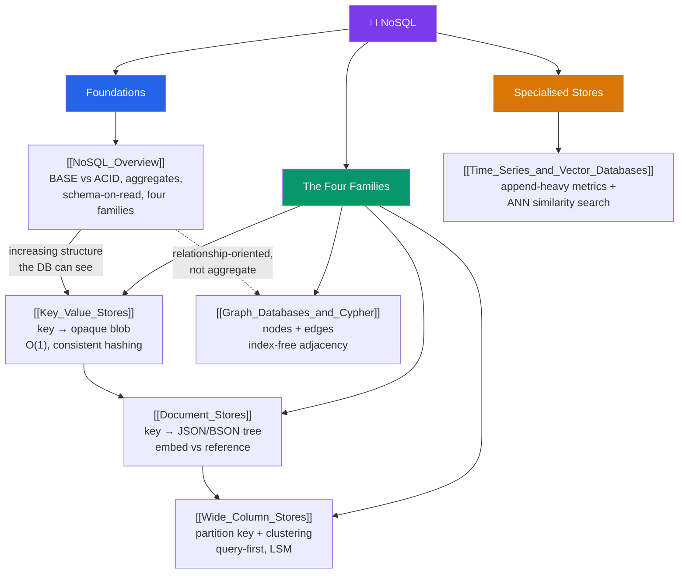

# 🗺️ NoSQL — Map of Content

> [!abstract] What This Section Covers
> NoSQL is not one database — it is four radically different data models plus a growing set of specialised cousins, united only by a single trade: **duplicate-and-self-contain instead of normalise-and-join**, to buy horizontal scale, flexible schema, and developer velocity. This section starts with the [[NoSQL_Overview|umbrella view]] — the ACID-vs-BASE split, aggregate-oriented modelling, and schema-on-read — then walks the four core families in depth: **key-value** (a distributed hash map, O(1) by key), **document** (queryable JSON trees, embed vs reference), **wide-column** (partition + clustering keys, query-first modelling on an LSM engine), and **graph** (index-free adjacency for deep traversals). It closes with the **specialised** families — time-series and vector databases — each shaped by a workload the generic four handle poorly. The recurring lesson: NoSQL modelling is *harder*, not easier — you design around your queries up front and give up joins and cross-aggregate transactions to get scale.

## Concept Map

## Learning Path

1. [[NoSQL_Overview]] — The mental model first: why NoSQL was forged by scale, ACID vs BASE, aggregate-oriented modelling, schema-on-read, and how the four families relate.
2. [[Key_Value_Stores]] — The simplest model and the partitioning foundation: `GET`/`PUT`/`DELETE`, consistent hashing + vnodes, Redis vs DynamoDB vs etcd.
3. [[Document_Stores]] — Add the ability to query *inside* the value: JSON/BSON documents, the embed-vs-reference decision, MongoDB's aggregation pipeline, replica sets and sharding.
4. [[Wide_Column_Stores]] — Add ordered structure and massive write throughput: partition key + clustering columns, the masterless ring, LSM storage, tunable consistency, and query-first denormalised modelling.
5. [[Graph_Databases_and_Cypher]] — The odd-one-out axis: relationships as first-class citizens, index-free adjacency, Cypher pattern-matching, and property graphs vs RDF.
6. [[Time_Series_and_Vector_Databases]] — The specialised cousins: time-partitioned/compressed metrics with downsampling, and ANN (HNSW/IVF) similarity search powering RAG.

## All Notes at a Glance

| Note | Difficulty | What You'll Learn |
| ---- | ---------- | ----------------- |
| [[NoSQL_Overview]] | Intermediate | The four families; ACID vs BASE; aggregate orientation; schema-on-read vs -write; when NoSQL is the *wrong* choice |
| [[Key_Value_Stores]] | Intermediate | `key → opaque value`; consistent hashing + vnodes; Redis data structures, DynamoDB PK+SK, Riak/etcd; hot keys, `Scan` anti-pattern |
| [[Document_Stores]] | Intermediate | BSON documents + collections; embed vs reference; `$match → $group → $lookup`; replica sets, sharding; JSONB as the relational alternative |
| [[Wide_Column_Stores]] | Advanced | Partition key vs clustering columns; masterless ring + gossip; LSM writes; `R+W>RF` tunable consistency; query-driven dual-write modelling |
| [[Graph_Databases_and_Cypher]] | Advanced | Property graph; index-free adjacency; Cypher patterns, variable-length paths, shortest path; RDF/SPARQL vs Gremlin; the sharding problem |
| [[Time_Series_and_Vector_Databases]] | Advanced | Hypertables, compression, retention, continuous aggregates; embeddings + HNSW/IVF ANN; the RAG pipeline; TimescaleDB/pgvector as Postgres extensions |

## Key Questions This Section Answers

- What single trade-off (duplicate-and-self-contain vs normalise-and-join) underlies every NoSQL design decision?
- What is the difference between ACID and BASE, and why is BASE a *tunable* dial rather than "no guarantees"?
- What is an aggregate, and why does the aggregate boundary define both the transaction scope and the sharding unit?
- Why does `hash(key) mod N` break when you add a node, and how does consistent hashing fix it?
- When do you embed a related entity in a document versus reference it separately?
- Why does idiomatic Cassandra produce two tables with duplicated data for two query patterns?
- What is index-free adjacency, and why does it make a 5-hop traversal scale with result size, not database size?
- Why is exact nearest-neighbour search impractical at millions of vectors, and what do HNSW/IVF trade away?
- When is a Postgres extension (JSONB, TimescaleDB, pgvector) the better answer than a dedicated NoSQL system?

## Related Sections
- [[_MOC_Database_Master|↑ Database Master MOC]]
- [[_MOC_DB_Distributed|← Distributed Databases]] — consistent hashing, tunable consistency, and CAP that these stores embody
- [[_MOC_DB_Systems|→ Database Systems]] — Redis, MongoDB, and Cassandra as concrete engines of these families
- System Design: [[SQL_vs_NoSQL]] — the decision framework for when relational still wins
- System Design: [[Key_Value_Store]], [[Document_Store]], [[Wide_Column_Store]], [[Graph_Databases]] — the architecture-level view of each family

#MOC #Database #NoSQL #KeyValue #Document #WideColumn #Graph
