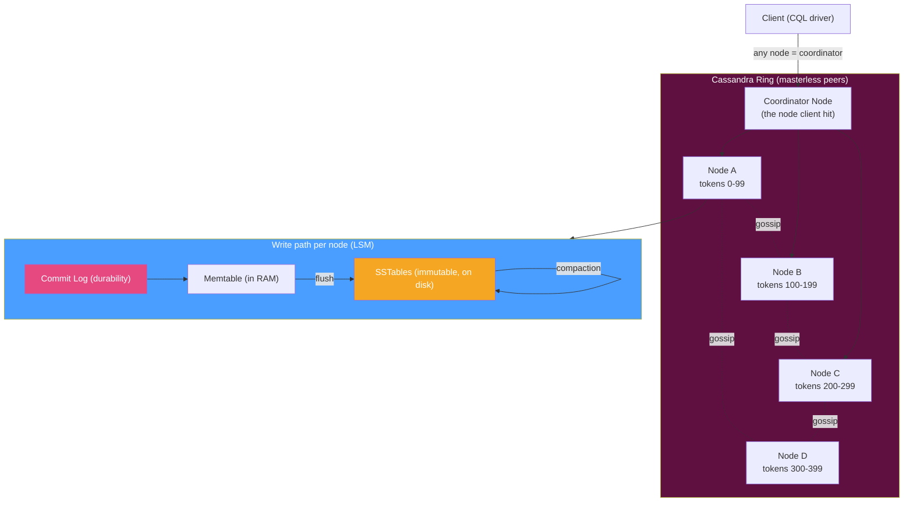

# 💍 Apache Cassandra

> [!abstract] TL;DR
> **Apache Cassandra** is a **wide-column**, **masterless** distributed database built for **linear horizontal scale**, **high availability**, and **multi-datacenter** operation. There is **no leader** — every node is a peer arranged in a **ring**, and data is placed by **consistent hashing** (with **virtual nodes** for even distribution). Consistency is **tunable per query** (`ONE`, `QUORUM`, `ALL`, `LOCAL_QUORUM`…), trading latency against how many replicas must agree. Storage is **LSM-tree**-based (memtable → immutable SSTables → compaction), which makes it **write-optimized** — see [[LSM_Trees]]. Nodes share state via a **gossip** protocol and heal data via **hinted handoff** and **read repair**. The defining discipline is **query-first data modeling**: you denormalize a table *per query pattern* because there are **no joins**. You interact through **CQL** (a SQL-like language). It is the go-to for write-heavy, always-on, globally distributed workloads.

## Intuition — what it is & who uses it

Most databases have a **boss** — a primary node that writes must go through, a single point of failure and a scaling bottleneck. Cassandra removes the boss entirely: **every node is equal**, any node can accept any read or write, and the cluster keeps serving even if a whole datacenter goes dark. You add capacity by adding nodes, and throughput grows roughly **linearly**. The price is that you give up joins, give up strong-by-default consistency, and must **model your tables around the exact queries you will run** — Cassandra makes you denormalize on purpose.

This design was born at Facebook (inbox search) and drew on Amazon's Dynamo (distribution) and Google's Bigtable (data model). Heavy users include **Netflix, Apple, Instagram, Discord, and Uber**, often at thousands of nodes across multiple regions. Managed/compatible forms include **DataStax Astra**, **ScyllaDB** (C++ rewrite), and **Amazon Keyspaces**. Reach for Cassandra when you have massive write volume, need always-on availability across regions, and can define your query patterns up front. For the family view, see [[Wide_Column_Stores]].

## Architecture

Nodes form a **ring**; the total token space is divided into ranges, and each node owns many small ranges thanks to **virtual nodes (vnodes)**. A row's **partition key** is hashed to a token that determines which node is its primary replica; the **replication factor (RF)** places copies on the next RF nodes around the ring. **Gossip** spreads membership/health; a **coordinator** (whichever node the client hit) fans a request out to replicas and enforces the query's **consistency level**.



## Key Features & Data Model

- **Wide-column / partitioned-row model.** Data lives in tables keyed by a **primary key = partition key + clustering columns**. The **partition key** decides which node stores the row and must appear in queries; **clustering columns** define sort order *within* a partition. All rows for a partition key live together on one set of replicas. See [[Wide_Column_Stores]].
- **Masterless ring + consistent hashing.** No primary/leader. `partition token = hash(partition key)`; **vnodes** give each physical node many token ranges so adding/removing nodes rebalances smoothly.
- **Replication & multi-DC.** A **keyspace** sets the **replication factor** and strategy (`NetworkTopologyStrategy` places replicas across racks/datacenters). Built for active-active across regions.
- **Tunable consistency.** Per-request **consistency level** on both reads and writes: `ONE`, `TWO`, `QUORUM`, `LOCAL_QUORUM`, `EACH_QUORUM`, `ALL`. Strong consistency for a key is achieved when `R + W > RF` (e.g., QUORUM reads + QUORUM writes). This is the CAP dial — favor availability or consistency per query.
- **LSM-tree storage (write-optimized).** Writes hit the **commit log** (durability) + **memtable** (RAM), then flush to immutable **SSTables**; background **compaction** merges SSTables and drops **tombstones** (delete markers). No in-place updates → sequential writes → very high write throughput. See [[LSM_Trees]] and [[Write_Ahead_Logging]].
- **Anti-entropy & healing.** **Gossip** for cluster state, **hinted handoff** (coordinator stores a hint for a temporarily-down replica and replays it later), and **read repair** (fix stale replicas detected during a read). Periodic `nodetool repair` reconciles divergence.
- **Query-first data modeling.** No joins, no ad-hoc `WHERE` on non-key columns (without penalty). You **denormalize one table per query pattern**, duplicating data intentionally. Modeling is driven by *how you read*, not by normalization.
- **CQL.** A SQL-*looking* language, but joins/subqueries/arbitrary aggregations are absent by design.

## Strengths / Weaknesses

| Strengths | Weaknesses |
|---|---|
| Linear horizontal scalability — add nodes, gain throughput | No joins; ad-hoc queries not supported — you model per query |
| No single point of failure (masterless); very high availability | Eventual consistency by default; tuning R/W/RF is on you |
| Excellent multi-datacenter / geo-distributed replication | Data-modeling rigidity: new query pattern often = new table + backfill |
| Write-optimized (LSM) — sustains huge write volumes | Read-heavy / large-partition workloads can suffer; tombstones hurt |
| Tunable per-query consistency (CAP dial) | Operational complexity (repair, compaction tuning, GC pauses on JVM) |
| Predictable, tunable performance at massive scale | Weak support for transactions (lightweight transactions are costly) |

## When to Use vs Avoid

**Use Cassandra when:**
- **Write-heavy** workloads at scale: time-series, IoT telemetry, event logging, messaging, activity feeds.
- You need **always-on availability** and can tolerate eventual consistency (or tune it up per query).
- You are **globally distributed** and need active-active, multi-region replication.
- Your **query patterns are known** and stable enough to model tables around them.

**Avoid / think twice when:**
- You need **joins, ad-hoc queries, or complex transactions** — use [[PostgreSQL]]/[[MySQL]].
- Your access patterns are **unpredictable / exploratory** — rigid query-first modeling will fight you.
- Data volume is small and a single relational node would do — Cassandra's operational overhead is not worth it.
- You need strong ACID transactions across many rows — a distributed SQL DB (Spanner/CockroachDB) fits better.

## Example Usage

```sql
-- Keyspace with multi-DC replication factor (NetworkTopologyStrategy)
CREATE KEYSPACE iot WITH replication = {
  'class': 'NetworkTopologyStrategy', 'dc-east': 3, 'dc-west': 3
};

-- QUERY-FIRST modeling: design the table around the read you need.
-- "Get recent readings for a sensor, newest first."
CREATE TABLE iot.readings_by_sensor (
    sensor_id   text,          -- partition key: co-locates one sensor's data
    ts          timestamp,     -- clustering column: sort within partition
    value       double,
    PRIMARY KEY (sensor_id, ts)
) WITH CLUSTERING ORDER BY (ts DESC);

-- Writes are cheap and go to any node (coordinator), tunable durability
INSERT INTO iot.readings_by_sensor (sensor_id, ts, value)
VALUES ('sensor-42', toTimestamp(now()), 21.7)
USING TTL 2592000;                          -- auto-expire after 30 days

-- Read with a per-query consistency level (must include the partition key)
SELECT ts, value FROM iot.readings_by_sensor
WHERE sensor_id = 'sensor-42'
LIMIT 100;

-- Set consistency for the session (strong read when R + W > RF)
CONSISTENCY LOCAL_QUORUM;

-- Need a second access pattern ("readings by day")? Make a SECOND table
-- and write to both — denormalization is intentional, there are no joins.
CREATE TABLE iot.readings_by_day (
    day   date,
    ts    timestamp,
    sensor_id text,
    value double,
    PRIMARY KEY (day, ts, sensor_id)
);
```

```bash
# Operational anti-entropy: reconcile replicas and inspect the ring
nodetool repair iot
nodetool status              # UN = Up/Normal per node, token ownership %
```

## Common Pitfalls

1. **Querying without the partition key.** Filtering on non-key columns forces `ALLOW FILTERING`, a cluster-wide scan that does not scale. Every query must target a partition key — model tables so it can.
2. **Unbounded / large partitions.** A partition key that groups too much (e.g., all events under one key) creates giant partitions that overload a node and slow reads. Bucket the key (e.g., by day) to bound partition size.
3. **Tombstone buildup from deletes/TTLs.** Deletes write tombstones that persist until compaction; heavy delete/overwrite patterns and queries scanning many tombstones cause read latency spikes and errors. Model to avoid mass deletes.
4. **Expecting strong consistency by default.** With `ONE`, reads can return stale data. Use `QUORUM`/`LOCAL_QUORUM` on both reads and writes so `R + W > RF` when you need it.
5. **Treating CQL like SQL.** No joins, no arbitrary `WHERE`, no aggregations at scale. Trying to normalize and join is the classic anti-pattern — denormalize per query instead.
6. **Ignoring repair/compaction.** Skipping `nodetool repair` lets replicas drift; wrong compaction strategy (STCS vs LCS vs TWCS) wrecks read or write performance. These are ongoing operational duties.

## Related Concepts

- [[_MOC_DB_Systems|↑ Section MOC]]
- [[Wide_Column_Stores]] — the database family Cassandra exemplifies (partition + clustering keys)
- [[LSM_Trees]] — the write-optimized storage structure behind memtables, SSTables, and compaction
- [[Write_Ahead_Logging]] — the commit log that makes memtable writes durable
- [[Replication_Strategies]] — replication factor, quorum math, and multi-DC placement
- [[MongoDB]] — a document-model NoSQL contrast (leader-based replica sets vs masterless ring)
- [[PostgreSQL]] — relational contrast (joins/ACID vs scale/availability)
- [[Isolation_Levels]] — why tunable consistency is a different axis from relational isolation

## Review Questions

1. Cassandra is described as "masterless." Explain how a write is accepted and stored when there is no primary node — cover the coordinator, consistent hashing / partition token, replication factor, and the per-node LSM write path.
2. What does **tunable consistency** mean, and how do the read consistency level, write consistency level, and replication factor combine (the `R + W > RF` rule) to give strong consistency for a key when you need it?
3. Explain **query-first data modeling**. Why does Cassandra push you to create a separate denormalized table per query pattern, and what goes wrong if you try to model relationally and query with `ALLOW FILTERING`?

## Sources

- Apache Cassandra Documentation — https://cassandra.apache.org/doc/latest/
- Cassandra: Data Modeling & Query-First Design — https://cassandra.apache.org/doc/latest/cassandra/data_modeling/
- Cassandra: Architecture (gossip, hinted handoff, read repair) — https://cassandra.apache.org/doc/latest/cassandra/architecture/
- Lakshman & Malik, "Cassandra — A Decentralized Structured Storage System" (2010)
- "Cassandra: The Definitive Guide" — Jeff Carpenter & Eben Hewitt

#Database #DatabaseSystems #Cassandra #WideColumn #Masterless #LSMTree #TunableConsistency #NoSQL
