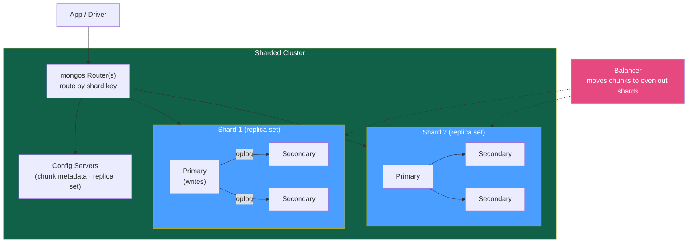

# 🍃 MongoDB

> [!abstract] TL;DR
> **MongoDB** is the leading general-purpose **document database**. It stores records as **BSON** (binary JSON) documents inside collections, with a **flexible schema** — documents in a collection need not share the same fields. You query and transform data with a rich **aggregation pipeline** and a variety of indexes (single, compound, **multikey** for arrays, **text**, **geospatial**, wildcard). High availability comes from **replica sets** (a primary + secondaries with automatic **elections**); horizontal scale comes from **sharding** (a **shard key** partitions data into **chunks** that a **balancer** spreads across shards). Since 4.0 it supports **multi-document ACID transactions**. The core data-modeling decision is **embedding vs referencing**. Its default storage engine is **WiredTiger** (document-level concurrency, MVCC, compression). For the broader family, see [[Document_Stores]].

## Intuition — what it is & who uses it

Relational databases force your data into rows and columns and make you `JOIN` it back together at read time. MongoDB flips that: it stores an entity **the way an application actually uses it** — a whole order, with its line items and shipping address, as one self-contained JSON-like document. Fetching or updating that order is a single lookup, no joins. The schema is flexible, so different documents can carry different fields, which suits fast-evolving products and semi-structured data.

That developer ergonomics is why MongoDB became the default "I just want to store JSON and iterate quickly" database, popularized by the MEAN/MERN stack. Users include **Adobe, eBay, Forbes, Coinbase, and Toyota**, and it is offered as the fully managed **MongoDB Atlas** across AWS/GCP/Azure. Reach for MongoDB when your data is document-shaped, your access patterns are known, and you value schema flexibility and horizontal scale-out over rigid relational constraints and ad-hoc joins.

## Architecture

MongoDB deployments layer two ideas. A **replica set** is the unit of high availability: one **primary** takes writes, **secondaries** replicate its oplog, and if the primary fails the members hold an **election** to promote a new one. A **sharded cluster** partitions a collection by **shard key** across many replica sets; clients talk to `mongos` routers, which use **config servers** (metadata) to route each query to the right shard(s).



## Key Features & Data Model

- **Documents & collections.** A **document** is a BSON object (nested fields, arrays, typed values: dates, ObjectId, decimal). A **collection** groups documents; databases group collections. No fixed schema — but optional **JSON Schema validation** can enforce structure.
- **BSON.** Binary-encoded superset of JSON with extra types and length prefixes for fast traversal; documents are capped at 16 MB.
- **Aggregation pipeline.** A composable sequence of stages (`$match`, `$group`, `$lookup` for joins, `$unwind`, `$project`, `$facet`, `$bucket`) that transforms documents server-side — MongoDB's analytics/query engine.
- **Indexing.** Single-field, **compound**, **multikey** (indexes each element of an array field), **text** (full-text), **geospatial** (`2dsphere`), **hashed**, **wildcard**, TTL, and partial/unique indexes. Index design mirrors your query patterns.
- **Replica sets & elections.** Members exchange heartbeats; on primary failure a **Raft-like election** (majority vote) promotes a secondary. **Write concern** (`w:1`, `w:"majority"`) and **read concern**/**read preference** tune the consistency-vs-latency trade-off. See [[Replication_Strategies]].
- **Sharding.** The **shard key** determines how documents split into **chunks**; the **balancer** migrates chunks to keep shards even. Choose ranged or **hashed** sharding based on access patterns. A bad shard key creates hot spots or jumbo chunks.
- **Transactions.** Multi-document **ACID** transactions since **4.0** (replica sets) and **4.2** (sharded clusters). Single-document writes are always atomic.
- **Storage engine: WiredTiger.** Document-level concurrency control, **MVCC** (snapshots), a write-ahead **journal**, B-tree/LSM options, and compression. See [[Storage_Engine_Internals]] and [[MVCC_Internals]].
- **Embedding vs referencing** — the central modeling choice (below).

## Strengths / Weaknesses

| Strengths | Weaknesses |
|---|---|
| Flexible schema — iterate fast, store semi-structured data | Flexible schema can drift into inconsistency without discipline/validation |
| Document model matches app objects; fewer joins on read | Joins (`$lookup`) exist but are less efficient than relational joins |
| Rich aggregation pipeline for queries and analytics | 16 MB document limit; deep nesting/unbounded arrays cause problems |
| Built-in horizontal scale-out via sharding | Wrong shard key is hard to change and causes hot spots |
| Replica sets give automatic failover / HA | Multi-document transactions work but are costlier than single-doc writes |
| Managed Atlas + strong driver ecosystem | Historically weaker defaults/perception around durability (improved) |

## When to Use vs Avoid

**Use MongoDB when:**
- Your data is naturally **document-shaped** (catalogs, user profiles, content, events) and read as whole objects.
- The **schema evolves rapidly** or varies per record (multi-tenant, product catalogs).
- You want **horizontal write scale-out** built in via sharding.
- You need flexible indexing over nested/array/geo/text fields.

**Avoid / think twice when:**
- Your data is highly **relational** with many-to-many joins and strong referential integrity needs — use [[PostgreSQL]]/[[MySQL]].
- You need heavy ad-hoc analytics with complex joins across entities — a relational/columnar warehouse fits better.
- You require rigid, enforced schemas and constraints as a first principle.
- A simple in-memory cache is the actual need — use [[Redis]].

## Example Usage

```javascript
// Flexible documents; embed line items INSIDE the order (read as one object)
db.orders.insertOne({
  _id: ObjectId(),
  customer: "ada",
  status: "paid",
  items: [                                   // multikey-indexable array
    { sku: "A1", qty: 2, price: 19.99 },
    { sku: "B7", qty: 1, price: 5.00 }
  ],
  shipTo: { city: "Berlin", geo: [13.4, 52.5] }
});

// Index design mirrors queries: compound + geospatial
db.orders.createIndex({ customer: 1, status: 1 });
db.orders.createIndex({ "shipTo.geo": "2dsphere" });

// Aggregation pipeline: revenue per customer for paid orders
db.orders.aggregate([
  { $match: { status: "paid" } },
  { $unwind: "$items" },
  { $group: { _id: "$customer",
              revenue: { $sum: { $multiply: ["$items.qty", "$items.price"] } } } },
  { $sort: { revenue: -1 } }
]);

// Multi-document ACID transaction (replica set, 4.0+)
const s = db.getMongo().startSession();
s.startTransaction();
try {
  db.accounts.updateOne({ _id: "a" }, { $inc: { bal: -100 } }, { session: s });
  db.accounts.updateOne({ _id: "b" }, { $inc: { bal:  100 } }, { session: s });
  s.commitTransaction();
} catch (e) { s.abortTransaction(); }
```

```javascript
// Sharding: pick a shard key with high cardinality + even write distribution
sh.enableSharding("shop");
sh.shardCollection("shop.orders", { customer: "hashed" });  // spreads writes evenly
```

## Common Pitfalls

1. **Choosing a poor shard key.** A low-cardinality or monotonically increasing key (timestamp, ObjectId) creates hot shards or jumbo chunks. It is hard to change later — model it up front.
2. **Unbounded array growth / embedding everything.** Embedding is great for bounded, together-read data, but an ever-growing array (e.g., all comments) blows past the 16 MB doc limit and thrashes updates. Reference instead when data grows unboundedly.
3. **Assuming schema flexibility means no schema design.** Without conventions or JSON Schema validation, fields drift, and queries/indexes become inconsistent across documents.
4. **Ignoring write concern.** Default `w:1` acknowledges after the primary only; a failover can lose that write. Use `w:"majority"` when durability matters.
5. **Missing indexes → collection scans.** The aggregation pipeline and finds are only fast with indexes aligned to `$match`/`$sort`. Check `explain()`.
6. **Overusing `$lookup` as if it were SQL.** Joins are supported but not MongoDB's strength; heavy relational joining is a sign the data may belong in a relational store.

## Related Concepts

- [[_MOC_DB_Systems|↑ Section MOC]]
- [[Document_Stores]] — the database family MongoDB exemplifies (embedding, flexible schema)
- [[PostgreSQL]] — relational alternative (and its JSONB can cover some document use cases)
- [[Cassandra]] — different NoSQL model (wide-column, masterless) for a scale/consistency contrast
- [[Redis]] — in-memory store often paired with Mongo for hot-path caching
- [[Replication_Strategies]] — replica-set oplog replication and elections
- [[MVCC_Internals]] — WiredTiger snapshot concurrency
- [[Storage_Engine_Internals]] — WiredTiger pages, journal, and compression
- [[Isolation_Levels]] — read/write concern mapped to consistency guarantees

## Review Questions

1. Explain the difference between a **replica set** and a **sharded cluster** in MongoDB. Which one gives you high availability, which gives you horizontal scale, and how do they combine in a production deployment?
2. You are modeling orders with line items. Give the trade-offs of **embedding** the line items inside the order document versus **referencing** them in a separate collection. When does each break down?
3. Why is the choice of **shard key** described as one of the most important and hardest-to-reverse decisions in MongoDB? Give an example of a bad shard key and the problem it causes.

## Sources

- MongoDB Manual — https://www.mongodb.com/docs/manual/
- MongoDB: Replica Sets & Elections — https://www.mongodb.com/docs/manual/replication/
- MongoDB: Sharding — https://www.mongodb.com/docs/manual/sharding/
- MongoDB: Aggregation Pipeline — https://www.mongodb.com/docs/manual/core/aggregation-pipeline/
- WiredTiger Storage Engine — https://www.mongodb.com/docs/manual/core/wiredtiger/

#Database #DatabaseSystems #MongoDB #DocumentStore #BSON #Sharding #ReplicaSet #NoSQL
