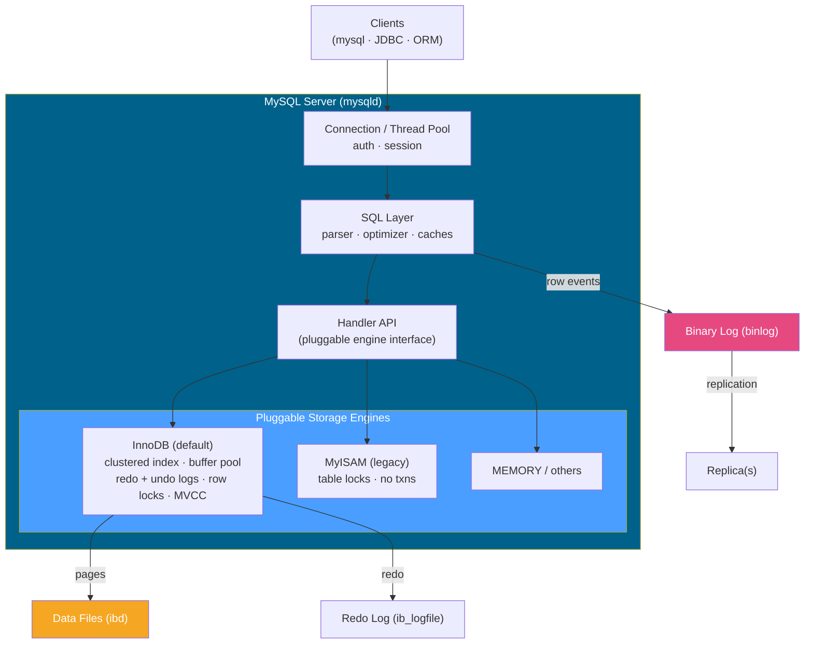

# 🐬 MySQL

> [!abstract] TL;DR
> **MySQL** is the world's most widely deployed open-source relational database, the "M" in the LAMP stack. Its defining trait is a **pluggable storage-engine** architecture: a shared SQL layer (parser, optimizer, connection handling) sits atop swappable engines, of which **InnoDB** (ACID, row locking, MVCC via undo logs) is the modern default and **MyISAM** the legacy table-locking engine. InnoDB stores rows *inside* the primary-key **B+Tree** (a clustered index), buffers pages in the **buffer pool**, and uses **redo + undo logs** for durability and MVCC. Replication is mature: **binlog**-based, with **GTIDs** for easy failover and **Group Replication** for multi-primary/HA. Strengths: ubiquity, battle-tested replication, and excellent read scaling. Weaknesses: historically fewer advanced SQL features (closing fast) and some DDL that is not fully transactional. The ecosystem forks into **MySQL (Oracle)**, **MariaDB**, and **Percona Server**.

## Intuition — what it is & who uses it

MySQL is the **default database of the web**. If you have used WordPress, phpBB, Drupal, or countless PHP/Rails/Django apps, you have used MySQL. Its reputation is built on being *fast, simple to operate, and ubiquitous* — every hosting provider, every ORM, and every ops team knows it.

Its signature idea is the **pluggable storage engine**: MySQL separates *how SQL is parsed and optimized* from *how bytes are stored on disk*, so you can (in principle) choose the engine per table. In practice almost everyone uses **InnoDB**. Heavy users include **Facebook/Meta, YouTube, Uber, Booking.com, GitHub, and Shopify**, many of whom run massively sharded, replicated MySQL fleets. It is the engine behind Amazon RDS/Aurora MySQL, Google Cloud SQL, and PlanetScale (Vitess). Reach for MySQL when you want a proven, operationally simple relational database with a deep replication and tooling ecosystem.

## Architecture

MySQL is a two-layer server: a **SQL layer** (connection thread management, parser, optimizer, caches) and a **storage-engine layer** below it. A thread (often from a thread pool) handles each connection. Queries flow through the optimizer and are executed against whichever engine owns the table — almost always **InnoDB**, which manages the buffer pool, clustered indexes, and redo/undo logs.



## Key Features & Data Model

- **Pluggable storage engines.** The `mysqld` SQL layer talks to engines through a handler API. **InnoDB** = ACID, crash recovery, row-level locking, foreign keys, MVCC (default since 5.5). **MyISAM** = table-level locking, no transactions, fast for read-only/append (legacy). Others: MEMORY, ARCHIVE, CSV, Federated, NDB (cluster).
- **InnoDB internals:**
  - **Clustered index** — the table *is* the primary-key B+Tree; leaves hold full rows in PK order. Secondary indexes store the **PK value**, so non-covered lookups do a second (bookmark) traversal. A fat PK bloats every secondary index. See [[Storage_Engine_Internals]].
  - **Buffer pool** (`innodb_buffer_pool_size`, often 50–75% of RAM) caches pages with LRU + flush lists.
  - **Redo log** for crash recovery (WAL-style; see [[Write_Ahead_Logging]]) and **undo log** for rollback and **MVCC** — old row versions live in the undo log, not the page. See [[MVCC_Internals]].
- **SQL features:** window functions, CTEs (recursive), and JSON functions arrived in **8.0**; generated columns, invisible indexes, and a transactional data dictionary also landed there. `JSON` type stores documents (binary internally).
- **Replication:** asynchronous or semi-sync **binary-log (binlog)** replication (row/statement/mixed formats); **GTID** (Global Transaction IDs) make failover and topology changes far easier; **Group Replication** provides a Paxos-based multi-primary/single-primary HA group (the basis of InnoDB Cluster). See [[Replication_Strategies]].
- **Read scaling** via one primary + many read replicas is a classic, well-trodden pattern. See [[Database_Replication]].

## Strengths / Weaknesses

| Strengths | Weaknesses |
|---|---|
| Ubiquitous — universal tooling, hosting, and ORM support | Historically fewer advanced SQL features (much closed in 8.0) |
| Mature, flexible replication (binlog, GTID, semi-sync, Group Replication) | Some DDL is not fully transactional / atomic in older versions |
| Excellent read scaling via replicas; huge sharded deployments exist (Vitess) | Optimizer historically less sophisticated than Postgres for complex queries |
| InnoDB: proven ACID, row locking, crash recovery | Clustered index means a poor/random PK bloats all secondary indexes |
| Operationally simple; low barrier to entry | Ecosystem fragmentation: MySQL vs MariaDB vs Percona feature drift |
| Fast for simple, high-volume OLTP (LAMP/web) | Foreign keys / CHECK constraints support lagged historically (improved) |

## When to Use vs Avoid

**Use MySQL when:**
- You are building a classic web application (LAMP/LEMP) and want the most standard, well-supported relational database.
- You need proven, flexible replication and straightforward read-replica scaling.
- Operational simplicity and a huge hiring/tooling pool matter.
- You plan to scale horizontally with **Vitess/PlanetScale** (built for MySQL) later.

**Avoid / think twice when:**
- You need the richest possible SQL/extension surface (geospatial, vector, complex analytics) — [[PostgreSQL]] is stronger there.
- You need a natively distributed, auto-sharded database with no operational glue — consider Cassandra/CockroachDB/Spanner.
- You need embedded/single-file storage — use [[SQLite]].
- Your workload is pure caching/ephemeral state — use [[Redis]].

## Example Usage

```sql
-- InnoDB table with a compact, monotonic clustered PK (avoid random UUID PKs)
CREATE TABLE orders (
    id        BIGINT AUTO_INCREMENT PRIMARY KEY,   -- clustered key
    user_id   BIGINT NOT NULL,
    total     DECIMAL(10,2) NOT NULL,
    details   JSON,                                 -- document column (8.0)
    created_at TIMESTAMP DEFAULT CURRENT_TIMESTAMP,
    KEY idx_user (user_id)                          -- secondary index stores the PK
) ENGINE=InnoDB;

-- JSON functions (MySQL 8.0)
SELECT id, JSON_EXTRACT(details, '$.coupon') AS coupon
FROM orders
WHERE JSON_CONTAINS(details, '"BLACKFRIDAY"', '$.coupons');

-- Window function (MySQL 8.0): running total per user
SELECT id, user_id, total,
       SUM(total) OVER (PARTITION BY user_id ORDER BY id) AS running_total
FROM orders;

-- Inspect InnoDB buffer pool + engine status
SHOW VARIABLES LIKE 'innodb_buffer_pool_size';
SHOW ENGINE INNODB STATUS\G
```

```sql
-- Replication with GTIDs: a replica joins the topology and syncs cleanly
CHANGE REPLICATION SOURCE TO
  SOURCE_HOST='primary.db.internal',
  SOURCE_USER='repl',
  SOURCE_AUTO_POSITION=1;        -- GTID-based; no manual binlog file/pos
START REPLICA;
SHOW REPLICA STATUS\G            -- check Replica_IO_Running / Replica_SQL_Running
```

## Common Pitfalls

1. **Random UUID as the PK in InnoDB.** Because the table is clustered on the PK, random keys scatter inserts across the B+Tree, causing page splits and fragmentation. Use `AUTO_INCREMENT`, ULID, or UUIDv7.
2. **Fat primary keys.** Every secondary index stores the full PK. A wide composite/UUID PK inflates all secondary indexes and memory use.
3. **Assuming DDL is transactional.** In older versions an `ALTER TABLE` mid-migration cannot be rolled back cleanly. Use online-DDL tools (gh-ost, pt-online-schema-change) for large tables.
4. **Statement-based replication surprises.** Non-deterministic functions (`NOW()`, `UUID()`, `RAND()`) can diverge replicas under statement-based binlog format; prefer row-based.
5. **Confusing the forks.** MySQL (Oracle), MariaDB, and Percona have drifted — features, replication internals, and even system tables differ. Do not assume a MariaDB-only feature exists in Oracle MySQL and vice versa.
6. **Ignoring `sql_mode`.** Loose defaults historically allowed silent truncation/zero-dates. Use `STRICT_TRANS_TABLES` (default in 8.0) to fail loudly.

## Related Concepts

- [[_MOC_DB_Systems|↑ Section MOC]]
- [[PostgreSQL]] — the other dominant open-source relational engine; integrated vs pluggable storage
- [[SQLite]] — embedded relational alternative for local/edge use
- [[Storage_Engine_Internals]] — InnoDB clustered index, buffer pool, and page layout
- [[MVCC_Internals]] — how InnoDB versions rows via undo logs
- [[Write_Ahead_Logging]] — the redo log and crash recovery
- [[Replication_Strategies]] — binlog, GTID, semi-sync, and Group Replication trade-offs
- [[Database_Replication]] — primary/replica read-scaling patterns (System Design vault)
- [[ACID_and_Transactions]] — the guarantees InnoDB provides (System Design vault)

## Review Questions

1. Explain MySQL's pluggable storage-engine architecture. What does the SQL layer own versus the storage engine, and why is InnoDB chosen over MyISAM for almost all modern workloads?
2. In InnoDB the table is a clustered index on the primary key. Explain how this makes secondary-index lookups work (bookmark lookup) and why a random UUID primary key is especially harmful here.
3. Compare binlog-based replication with GTIDs versus without. What operational problem do GTIDs solve during failover and topology changes?

## Sources

- MySQL 8.0 Reference Manual — https://dev.mysql.com/doc/refman/8.0/en/
- MySQL Docs: InnoDB Storage Engine — https://dev.mysql.com/doc/refman/8.0/en/innodb-storage-engine.html
- MySQL Docs: Replication & GTIDs — https://dev.mysql.com/doc/refman/8.0/en/replication-gtids.html
- "High Performance MySQL" — Baron Schwartz, Peter Zaitsev, Vadim Tkachenko
- MariaDB and Percona Server documentation

#Database #DatabaseSystems #MySQL #InnoDB #Replication #ClusteredIndex #OLTP #LAMP
