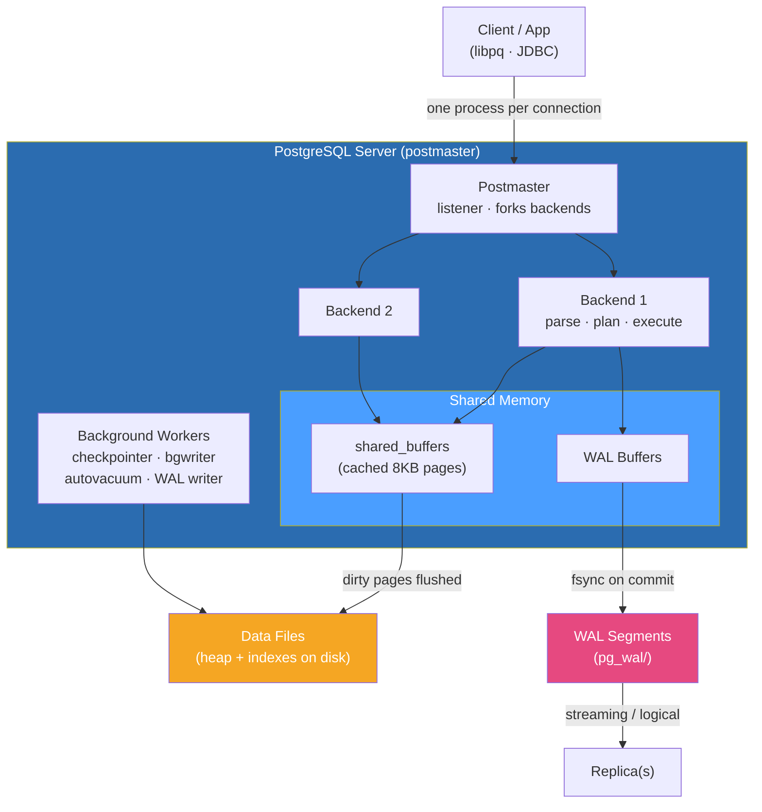

# 🐘 PostgreSQL

> [!abstract] TL;DR
> **PostgreSQL** is an open-source, standards-compliant, **object-relational** database prized for correctness and an enormous feature set. It uses a **process-per-connection** model, a shared **buffer cache** (`shared_buffers`), a **Write-Ahead Log** for durability, and **MVCC** for lock-light concurrency — which is why it needs `VACUUM` to reclaim dead row versions. Beyond plain SQL it ships `JSONB`, arrays, CTEs, window functions, full-text search, and a first-class **extension** system (PostGIS for geospatial, `pgvector` for embeddings, TimescaleDB for time-series, Citus for sharding). Its main operational pain points are **connection scaling** (each connection is an OS process → put a pooler like PgBouncer in front) and **VACUUM/bloat tuning**. Reach for Postgres as a safe, powerful default for OLTP and analytics-leaning workloads.

## Intuition — what it is & who uses it

Think of PostgreSQL as the **Swiss Army knife** of databases: not the absolute fastest at any single thing, but astonishingly capable across a huge range of jobs, and famous for *never silently corrupting or losing your data*. Where some databases cut corners on the SQL standard, Postgres tends to implement the standard faithfully and then add more.

It is the default choice for teams that want one dependable relational engine to grow with them. Users include **Apple, Instagram, Reddit, Twitch, and Spotify**, and it is the engine behind managed services like Amazon RDS/Aurora, Google Cloud SQL, Azure Database for PostgreSQL, Supabase, Neon, and Crunchy Bridge. If a workload starts relational and you are unsure what it will become, Postgres is the low-regret pick because extensions let it stretch into geospatial, vector search, time-series, and horizontal sharding without switching engines.

## Architecture

Postgres runs a supervising **postmaster** process that forks a **dedicated backend process for every client connection**. Backends share memory through `shared_buffers` (the page cache) and coordinate durability through the WAL. Background workers handle checkpointing, background writing, autovacuum, WAL archiving, and replication.



## Key Features & Data Model

- **Object-relational core.** Tables, rich types, custom types/domains, table inheritance, and user-defined functions/operators. Procedural languages: PL/pgSQL, PL/Python, PL/v8, and more.
- **JSONB.** Binary-encoded JSON with GIN indexing and operators (`->`, `->>`, `@>`, `jsonb_path_query`). Lets Postgres serve document-style workloads without leaving SQL — see [[Document_Stores]].
- **Arrays, ranges, `hstore`, `ENUM`, `UUID`, `INET/CIDR`, geometric types** — first-class, not bolted on.
- **Advanced SQL:** CTEs (including recursive), window functions, `LATERAL` joins, `GROUPING SETS`/`CUBE`/`ROLLUP`, `MERGE`, generated columns, and full-text search.
- **MVCC** (Multi-Version Concurrency Control): readers never block writers and vice-versa. Each row carries `xmin`/`xmax` transaction stamps; updates write a *new* version and mark the old one dead, so **`VACUUM`/autovacuum** must reclaim dead tuples. Deep dive: [[MVCC_Internals]].
- **Storage engine:** a single integrated engine — an unordered **heap** plus separate indexes (B-tree, GiST, GIN, BRIN, SP-GiST, Hash). See [[Storage_Engine_Internals]].
- **Durability:** [[Write_Ahead_Logging]] — every change is logged before the data page is flushed; checkpoints bound recovery time.
- **Partitioning:** declarative range/list/hash partitioning for large tables.
- **Replication:** physical **streaming replication** (WAL shipping, sync or async) for hot standbys, and **logical replication** (publish/subscribe of row changes) for selective/cross-version replication and CDC. See [[Replication_Strategies]].
- **Extension ecosystem:** **PostGIS** (geospatial), **pgvector** (vector similarity for AI/embeddings), **TimescaleDB** (time-series hypertables), **Citus** (distributed/sharded Postgres), `pg_stat_statements`, `pg_trgm`, foreign data wrappers (`postgres_fdw`).

## Strengths / Weaknesses

| Strengths | Weaknesses |
|---|---|
| Rigorous SQL-standard compliance and correctness | Each connection is an OS process → high per-connection memory; needs a pooler (PgBouncer/pgcat) past a few hundred |
| Huge feature set (JSONB, CTEs, window fns, FTS, arrays) | MVCC leaves dead tuples → **VACUUM/bloat** tuning is a real operational task |
| Best-in-class extension system (PostGIS, pgvector, Citus) | Transaction ID wraparound must be watched on very high-write systems |
| Powerful indexing (GIN/GiST/BRIN) for JSON, geo, full-text | No built-in multi-master / auto-sharding in core (needs Citus/patroni/foreign tooling) |
| Strong ecosystem + managed offerings (RDS, Aurora, Supabase) | Major-version upgrades historically need `pg_upgrade`/logical replication planning |
| Reliable streaming + logical replication | DDL-heavy migrations can take heavy locks without care (`CONCURRENTLY`, `lock_timeout`) |

## When to Use vs Avoid

**Use PostgreSQL when:**
- You want a single, trustworthy relational default for OLTP that can also handle moderate analytics.
- You need rich data types or mixed relational + document (`JSONB`) modeling in one engine.
- You need geospatial (PostGIS), vector/AI search (pgvector), or time-series (TimescaleDB) alongside relational data.
- Data correctness, constraints, and complex queries (window functions, CTEs) matter.

**Avoid / think twice when:**
- You need massive built-in horizontal write scale-out with no operational glue — a natively distributed system (Cassandra, CockroachDB, Spanner, or Citus on top of PG) may fit better.
- Your workload is a pure in-memory cache or ephemeral counters — use [[Redis]] instead.
- You have thousands of short-lived connections with no pooler — the process model will hurt without PgBouncer.
- You need embedded/serverless single-file storage — use [[SQLite]].

## Example Usage

```sql
-- JSONB: document-style column with a GIN index for containment queries
CREATE TABLE products (
    id     BIGINT GENERATED ALWAYS AS IDENTITY PRIMARY KEY,
    name   TEXT NOT NULL,
    attrs  JSONB NOT NULL DEFAULT '{}'
);
CREATE INDEX idx_products_attrs ON products USING GIN (attrs);

INSERT INTO products (name, attrs)
VALUES ('Trail Shoe', '{"size": 42, "colors": ["red","black"], "waterproof": true}');

-- Containment (@>) query accelerated by the GIN index
SELECT name FROM products WHERE attrs @> '{"waterproof": true}';

-- Window function + CTE: rank products per size bucket
WITH sized AS (
    SELECT name, (attrs->>'size')::int AS size FROM products
)
SELECT name, size,
       rank() OVER (PARTITION BY size ORDER BY name) AS r
FROM sized;

-- Extensions: enable vector similarity search (pgvector)
CREATE EXTENSION IF NOT EXISTS vector;
ALTER TABLE products ADD COLUMN embedding vector(3);
SELECT name FROM products ORDER BY embedding <-> '[0.1,0.2,0.3]' LIMIT 5;

-- Housekeeping: reclaim dead tuples and refresh planner stats
VACUUM (ANALYZE) products;
```

```bash
# Connection pooling is essential at scale — front Postgres with PgBouncer
# pgbouncer.ini (transaction pooling mode)
#   [databases]
#   app = host=127.0.0.1 port=5432 dbname=app
#   [pgbouncer]
#   pool_mode = transaction
#   max_client_conn = 5000
#   default_pool_size = 25

psql "host=localhost dbname=app user=app" -c "SHOW shared_buffers;"
```

## Common Pitfalls

1. **No connection pooler.** Each connection is a full backend process (~5–10 MB+). A few thousand direct connections exhaust RAM. Use PgBouncer/pgcat in transaction mode.
2. **Ignoring autovacuum.** Under-tuned autovacuum lets dead tuples bloat heaps and indexes, wrecking cache hit ratio. Watch `n_dead_tup` and, on write-heavy tables, transaction-ID wraparound.
3. **Random UUID (v4) primary keys.** Hurt index locality; prefer `bigint` identity or UUIDv7/ULID for monotonic inserts.
4. **Blocking DDL migrations.** `ALTER TABLE ... ADD COLUMN ... DEFAULT` (older versions) or adding an index without `CONCURRENTLY` can hold heavy locks. Use `CREATE INDEX CONCURRENTLY` and short `lock_timeout`.
5. **Treating `shared_buffers` as "bigger is always better."** Beyond ~25% of RAM you starve the OS page cache and `work_mem`.
6. **Assuming `JSONB` replaces schema design.** Over-stuffing everything into one JSONB column loses constraints and complicates indexing; model relationally where structure is stable.

## Related Concepts

- [[_MOC_DB_Systems|↑ Section MOC]]
- [[MySQL]] — the other dominant open-source relational engine; pluggable storage vs Postgres's integrated engine
- [[SQLite]] — embedded single-file relational DB, complementary rather than competing
- [[MVCC_Internals]] — `xmin`/`xmax`, snapshot visibility, and why VACUUM exists
- [[Write_Ahead_Logging]] — how Postgres guarantees durability and feeds replication
- [[Storage_Engine_Internals]] — heap pages, buffer cache, TOAST, and index layout
- [[Replication_Strategies]] — streaming vs logical replication trade-offs
- [[Document_Stores]] — where JSONB overlaps with document databases
- [[Isolation_Levels]] — Read Committed vs Repeatable Read (snapshot) vs Serializable in Postgres
- [[ACID_and_Transactions]] — the transactional guarantees Postgres delivers (System Design vault)

## Review Questions

1. PostgreSQL forks one OS process per client connection. Explain the scaling problem this creates and how a connection pooler like PgBouncer (in transaction mode) mitigates it.
2. Because Postgres uses MVCC, an `UPDATE` does not overwrite the old row in place. Describe what physically happens to the old and new row versions, and why `VACUUM`/autovacuum is therefore mandatory rather than optional.
3. A team needs relational data plus geospatial queries plus vector similarity search for AI embeddings. Explain how Postgres can serve all three, and name the extensions involved.

## Sources

- PostgreSQL Documentation — https://www.postgresql.org/docs/current/
- PostgreSQL Docs: Concurrency Control / MVCC — https://www.postgresql.org/docs/current/mvcc.html
- "PostgreSQL 14 Internals" — Egor Rogov
- PgBouncer Documentation — https://www.pgbouncer.org/
- pgvector, PostGIS, TimescaleDB, and Citus project documentation

#Database #DatabaseSystems #PostgreSQL #MVCC #JSONB #Extensions #RelationalDatabase #OLTP
