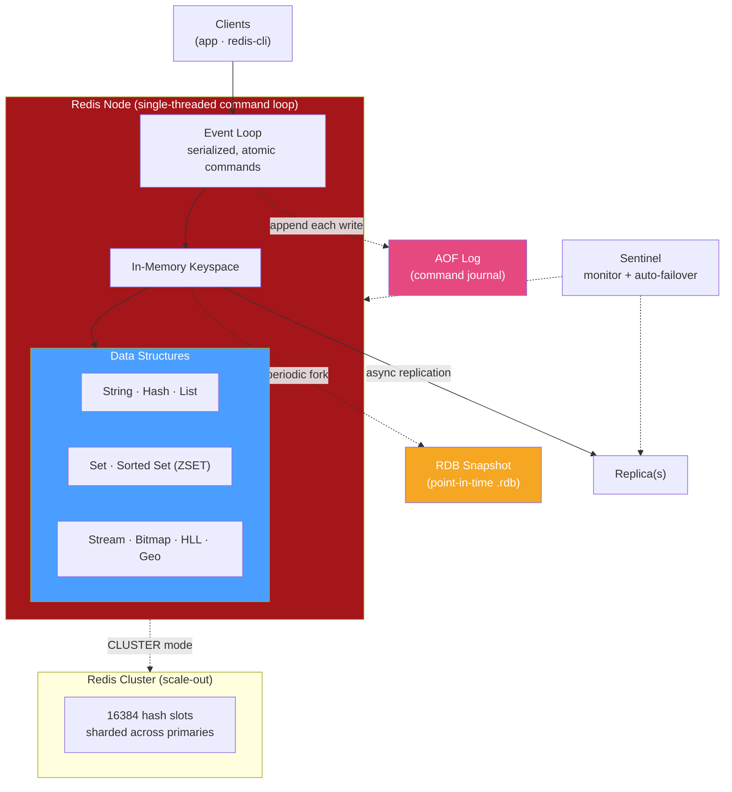

# ⚡ Redis

> [!abstract] TL;DR
> **Redis** (REmote DIctionary Server) is an **in-memory data-structure store** used as a cache, database, and message broker. It is not a plain key→string cache: values are rich data structures — **strings, hashes, lists, sets, sorted sets, streams, bitmaps, HyperLogLog, and geospatial indexes** — with atomic server-side commands over each. It runs a **single-threaded event loop** for command execution (so operations are atomic and simple to reason about), keeps everything in RAM for microsecond latency, and offers optional durability via **RDB snapshots** and/or an **append-only file (AOF)**. It scales out with **Redis Cluster** (16384 **hash slots** sharded across nodes) and achieves HA with replicas plus **Sentinel** (automatic failover). Typical jobs: caching, session store, rate limiter, leaderboard, job queue, and **pub/sub** messaging.

## Intuition — what it is & who uses it

If a normal database is a **library**, Redis is the **notepad on your desk**: everything lives in fast memory, you reach it in microseconds, and it holds exactly the structured scratch data your application touches constantly — the logged-in user's session, the current leaderboard, a rate-limit counter, a queue of pending jobs. Because it stores *data structures* rather than opaque blobs, a single atomic command can `INCR` a counter, push to a list, or add a member to a ranked set — no read-modify-write race from the client.

It is the default caching and ephemeral-state layer for a huge fraction of the internet: **Twitter/X, GitHub, Stack Overflow, Snapchat, Airbnb, and Instagram** all lean on it. Managed forms include AWS ElastiCache/MemoryDB, Azure Cache for Redis, and Redis Cloud; the open-source lineage now also includes the **Valkey** fork. Reach for Redis when you need very low latency, atomic operations on shared counters/structures, or a lightweight queue/pub-sub — as a complement to a durable system of record like [[PostgreSQL]], not a replacement for it. For the cache-specific comparison, see [[Redis_vs_Memcached]].

## Architecture

Redis executes commands on a **single main thread** via an event loop (I/O and some background work are offloaded to helper threads, but command execution is serialized — hence atomicity). Data lives in RAM; durability is optional and asynchronous. A primary can have replicas; **Sentinel** monitors and fails over; **Cluster** shards the keyspace across primaries by hash slot.



## Key Features & Data Model

- **Rich data structures (with atomic ops):**
  - **String** — bytes/numbers; `SET`, `GET`, `INCR`, `SETEX` (cache with TTL).
  - **Hash** — field→value map; ideal for objects (`HSET user:1 name Ada age 30`).
  - **List** — linked list / deque; queues and stacks (`LPUSH`/`BRPOP`).
  - **Set** — unique members; `SADD`, `SINTER` (tags, unique visitors).
  - **Sorted Set (ZSET)** — members ranked by score; the leaderboard/priority-queue structure (`ZADD`, `ZRANGE`).
  - **Stream** — append-only log with consumer groups (Kafka-lite messaging).
  - **Bitmap / HyperLogLog / Geospatial** — space-efficient flags, approximate cardinality, and radius queries.
- **Key-value at the top level** — every structure lives under a key; conceptually a [[Key_Value_Stores]] with typed values.
- **TTL / eviction** — per-key expiry (`EXPIRE`) plus maxmemory eviction policies (`allkeys-lru`, `volatile-ttl`, etc.) make it a first-class cache.
- **Persistence (optional):**
  - **RDB** — periodic fork-and-snapshot to a compact `.rdb` file; fast restart, but you can lose the window since the last snapshot.
  - **AOF** — append every write command to a log (fsync policy tunable: `always`/`everysec`/`no`); more durable, larger, replayed on restart. You can run both.
- **Replication & HA** — async primary→replica replication; **Sentinel** provides monitoring, notification, and automatic failover of a primary.
- **Scale-out** — **Redis Cluster** partitions keys across **16384 hash slots** (a key's slot = CRC16(key) mod 16384); each primary owns a slot range, with replicas per shard.
- **Server-side scripting & transactions** — Lua scripts and `MULTI`/`EXEC` execute atomically on the single thread. Functions and modules (RedisJSON, RediSearch, RedisTimeSeries) extend capability.
- **Pub/Sub & Streams** — lightweight fan-out messaging and durable stream processing.

## Strengths / Weaknesses

| Strengths | Weaknesses |
|---|---|
| Microsecond latency (in-memory) with very high throughput | Dataset limited by RAM; RAM is expensive vs disk |
| Rich atomic data structures beyond simple key→value | Single-threaded command execution — one slow command (`KEYS *`) blocks all clients |
| Simple atomicity model (serialized single thread, Lua, MULTI/EXEC) | Durability is best-effort; a crash can lose the last write window |
| Versatile: cache, session store, queue, rate limiter, pub/sub, leaderboard | Cross-slot multi-key ops are restricted in Cluster mode |
| Built-in TTL + eviction policies make it an ideal cache | Not a full relational system of record — no rich queries/joins |
| HA via Sentinel; horizontal scale via Cluster (hash slots) | Cluster/Sentinel add operational complexity |

## When to Use vs Avoid

**Use Redis when:**
- **Caching** — sit it in front of a slower database to absorb read load (cache-aside / write-through).
- **Session / token store** — fast shared state across stateless app servers.
- **Rate limiting / counters** — atomic `INCR` with `EXPIRE` is the canonical fixed/sliding-window limiter.
- **Leaderboards / ranking** — sorted sets give O(log n) rank queries out of the box.
- **Queues / job processing** — lists (`BRPOP`) or streams with consumer groups.
- **Pub/Sub / real-time fan-out** — chat, notifications, live updates.

**Avoid / think twice when:**
- The dataset far exceeds affordable RAM (unless using tiered/on-disk variants like Redis-on-Flash/MemoryDB).
- You need it as the **only** durable system of record with strong crash guarantees — pair it with a disk-backed DB.
- You need complex queries, joins, or ad-hoc analytics — use a relational or document DB.
- A dumb, multi-threaded string cache is all you need — [[Memcached]] may be simpler (see [[Redis_vs_Memcached]]).

## Example Usage

```bash
# Caching with TTL (cache-aside): SET with expiry, read back
SET session:abc123 '{"user":42}' EX 3600     # expires in 1 hour
GET session:abc123

# Atomic rate limiter: first hit sets TTL, then INCR; block past the limit
INCR   ratelimit:user42:minute
EXPIRE ratelimit:user42:minute 60             # only meaningful on first INCR
# if the returned counter > N within the window, reject the request

# Leaderboard with a sorted set (score = points), then top 3
ZADD  leaderboard 4200 alice 3900 bob 5100 carol
ZREVRANGE leaderboard 0 2 WITHSCORES          # carol, alice, bob

# Hash as an object; List as a work queue
HSET  user:1 name Ada plan pro
LPUSH jobs:email '{"to":"a@x.com"}'
BRPOP jobs:email 5                            # blocking pop, 5s timeout

# Atomic multi-command transaction
MULTI
INCR  counter
LPUSH events "counted"
EXEC
```

```bash
# Persistence & topology basics
CONFIG SET appendonly yes                      # enable AOF alongside RDB
CONFIG SET maxmemory-policy allkeys-lru        # evict LRU keys when full
CLUSTER INFO                                    # cluster state / slot coverage
INFO replication                                # role, connected replicas
```

## Common Pitfalls

1. **Running `KEYS *` in production.** It scans the entire keyspace on the single thread and blocks every other client. Use `SCAN` (cursor-based) instead.
2. **Treating Redis as durable by default.** With only RDB (or `appendfsync no`), a crash loses recent writes. Choose RDB vs AOF (or both) and an fsync policy that matches your tolerance.
3. **No eviction policy for a cache.** Without `maxmemory` + an eviction policy, Redis fills RAM and starts erroring/OOMing. Set both for cache workloads.
4. **Big keys / hot keys.** A single giant list/hash or one hyper-popular key concentrates memory and CPU on one shard/thread — shard the data or split the key.
5. **Assuming cross-slot multi-key ops work in Cluster.** In Cluster mode, multi-key commands must map to the same hash slot; use **hash tags** (`{user1}:profile`) to co-locate related keys.
6. **Unbounded pub/sub or missing consumer acks.** Plain pub/sub drops messages to offline subscribers; for reliable delivery use Streams with consumer groups and acknowledgements.

## Related Concepts

- [[_MOC_DB_Systems|↑ Section MOC]]
- [[Key_Value_Stores]] — the broader family Redis belongs to (typed values on top of keys)
- [[Redis_vs_Memcached]] — when a simpler multi-threaded string cache beats Redis (System Design vault)
- [[Memcached]] — the classic pure-cache alternative
- [[PostgreSQL]] — the durable system of record Redis typically fronts as a cache
- [[MongoDB]] — document store often paired with Redis for hot-path caching
- [[Replication_Strategies]] — Redis async replication and failover context
- [[Write_Ahead_Logging]] — conceptual cousin of the AOF (append-only) durability model

## Review Questions

1. Redis executes commands on a single thread. Explain one major *benefit* (why atomicity is easy) and one major *risk* (what a command like `KEYS *` does to every other client) of this design.
2. Compare RDB snapshots and AOF as durability mechanisms. What does each lose in a crash, and why might you enable both?
3. Give three distinct use cases for Redis beyond simple caching, naming the specific data structure that makes each one natural (e.g., leaderboards, rate limiting, queues).

## Sources

- Redis Documentation — https://redis.io/docs/latest/
- Redis Data Types — https://redis.io/docs/latest/develop/data-types/
- Redis Persistence (RDB & AOF) — https://redis.io/docs/latest/operate/oss_and_stack/management/persistence/
- Redis Cluster Specification — https://redis.io/docs/latest/operate/oss_and_stack/reference/cluster-spec/
- Redis Sentinel — https://redis.io/docs/latest/operate/oss_and_stack/management/sentinel/

#Database #DatabaseSystems #Redis #InMemory #Cache #KeyValue #DataStructures #PubSub
