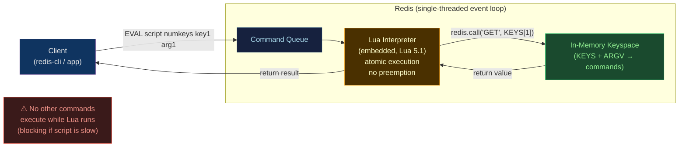

# 🌙 Redis Lua Scripting

> [!abstract] TL;DR
> Redis embeds a Lua 5.1 interpreter and executes Lua scripts **atomically** via the `EVAL` command — no other command can run while a script executes. This guarantees read-modify-write cycles (e.g., check-then-set) are race-free without `MULTI/EXEC` transactions. `EVAL` sends the script each call; `SCRIPT LOAD` + `EVALSHA` caches the script on the server (reducing bandwidth). Key use cases: **sliding-window rate limiter**, **distributed lock acquire/release**, **leaderboard operations**, and **conditional expiry**. Critical pitfalls: long-running scripts block all clients (single-threaded Redis), and scripts cannot call `SUBSCRIBE`, `BLPOP`, or any blocking command.

## Intuition — what it is & who uses it

Imagine Redis has a **notary table** inside it. When you need to perform multiple steps that must be atomic ("check if seat is taken, then reserve it"), instead of running separate commands and risking a race, you hand a sealed envelope (Lua script) to the notary — the notary executes the instructions privately without anyone interrupting until the envelope is processed. The notary doesn't speak to the outside world during this time: no other Redis client gets a turn.

This is why Lua in Redis is used for any operation that is "read, decide, write" in one atomic step — the exact pattern that breaks under concurrent access if done with separate commands.

## Architecture



## EVAL Command Syntax

```bash
# EVAL syntax:
# EVAL <script> <numkeys> [key [key ...]] [arg [arg ...]]
# numkeys: number of keys that follow (keys vs args distinction is important for cluster)

# Simplest script: return a constant
EVAL "return 'hello from Lua'" 0

# Access KEYS and ARGV (1-indexed in Lua)
EVAL "return {KEYS[1], KEYS[2], ARGV[1]}" 2 key1 key2 argvalue
# → ["key1", "key2", "argvalue"]

# Call Redis commands inside Lua
EVAL "redis.call('SET', KEYS[1], ARGV[1]); return redis.call('GET', KEYS[1])" 1 mykey myval
# → "myval"

# redis.call vs redis.pcall
# redis.call  → raises error if command fails (propagates to client)
# redis.pcall → traps errors, returns error table {err: "..."} — use for optional operations

EVAL "
  local result = redis.pcall('INCR', KEYS[1])
  if result.err then
    return 'error: ' .. result.err
  else
    return result
  end
" 1 mycounter
```

## SCRIPT LOAD and EVALSHA

```bash
# SCRIPT LOAD — cache script on server, return SHA1 hash
SCRIPT LOAD "return redis.call('GET', KEYS[1])"
# → "2067d915024a3e1657c4169c84f809f8ec75b9a7"

# EVALSHA — run cached script by its SHA1 (network-efficient)
EVALSHA "2067d915024a3e1657c4169c84f809f8ec75b9a7" 1 mykey
# → value of mykey

# Check if a script is cached
SCRIPT EXISTS 2067d915024a3e1657c4169c84f809f8ec75b9a7
# → [1]  (1 = exists, 0 = not cached)

# Clear all cached scripts (e.g., after deploying new versions)
SCRIPT FLUSH

# In application code (Python, cache SHA on startup)
import redis
r = redis.Redis()

RATE_LIMIT_SCRIPT = """
local current = redis.call('INCR', KEYS[1])
if current == 1 then
    redis.call('EXPIRE', KEYS[1], ARGV[1])
end
return current
"""

# Load once on application startup
rate_limit_sha = r.script_load(RATE_LIMIT_SCRIPT)

# Use EVALSHA for every request (no script transfer overhead)
count = r.evalsha(rate_limit_sha, 1, f"ratelimit:{user_id}", 60)
```

## Use Case: Sliding Window Rate Limiter

```lua
-- Sliding window rate limiter using Sorted Set
-- KEYS[1] = rate limit key (e.g., "ratelimit:user:123:api")
-- ARGV[1] = window duration in seconds
-- ARGV[2] = max requests in window
-- Returns: 1 if allowed, 0 if rate limited

local key = KEYS[1]
local window = tonumber(ARGV[1])
local limit = tonumber(ARGV[2])
local now = tonumber(redis.call('TIME')[1]) * 1000 + tonumber(redis.call('TIME')[2]) / 1000

-- Remove entries older than the window
local window_start = now - (window * 1000)
redis.call('ZREMRANGEBYSCORE', key, '-inf', window_start)

-- Count requests in current window
local count = tonumber(redis.call('ZCARD', key))

if count < limit then
    -- Add this request with current timestamp as score
    redis.call('ZADD', key, now, now)
    -- Set expiry so the key auto-cleans
    redis.call('PEXPIRE', key, window * 1000)
    return 1  -- allowed
else
    return 0  -- rate limited
end
```

```python
# Python usage
SLIDING_WINDOW_SCRIPT = """
local key = KEYS[1]
local window = tonumber(ARGV[1])
local limit = tonumber(ARGV[2])
local now = tonumber(redis.call('TIME')[1]) * 1000 + tonumber(redis.call('TIME')[2]) / 1000
local window_start = now - (window * 1000)
redis.call('ZREMRANGEBYSCORE', key, '-inf', window_start)
local count = tonumber(redis.call('ZCARD', key))
if count < limit then
    redis.call('ZADD', key, now, now)
    redis.call('PEXPIRE', key, window * 1000)
    return 1
else
    return 0
end
"""

sha = r.script_load(SLIDING_WINDOW_SCRIPT)

def is_allowed(user_id: str, window_seconds: int = 60, max_requests: int = 100) -> bool:
    result = r.evalsha(sha, 1, f"ratelimit:{user_id}", window_seconds, max_requests)
    return result == 1
```

## Use Case: Distributed Lock (Redlock-style)

```lua
-- Acquire lock atomically: SET only if not exists, with TTL
-- KEYS[1] = lock key
-- ARGV[1] = unique lock identifier (UUID from client)
-- ARGV[2] = lock TTL in milliseconds
-- Returns: 1 if acquired, 0 if already locked

if redis.call('SET', KEYS[1], ARGV[1], 'NX', 'PX', ARGV[2]) then
    return 1
else
    return 0
end
```

```lua
-- Release lock atomically: only delete if we own it (compare-and-delete)
-- Without Lua, a race can delete another client's lock:
--   1. Check if our value → 2. Other client's lock expires → 3. Third client acquires → 4. We delete third client's lock
-- Lua makes steps 2+3 atomic

-- KEYS[1] = lock key, ARGV[1] = our unique identifier
if redis.call('GET', KEYS[1]) == ARGV[1] then
    return redis.call('DEL', KEYS[1])
else
    return 0
end
```

```python
import uuid

ACQUIRE_LOCK = "if redis.call('SET', KEYS[1], ARGV[1], 'NX', 'PX', ARGV[2]) then return 1 else return 0 end"
RELEASE_LOCK = "if redis.call('GET', KEYS[1]) == ARGV[1] then return redis.call('DEL', KEYS[1]) else return 0 end"

acquire_sha = r.script_load(ACQUIRE_LOCK)
release_sha = r.script_load(RELEASE_LOCK)

def acquire_lock(resource: str, ttl_ms: int = 5000) -> str | None:
    lock_id = str(uuid.uuid4())
    if r.evalsha(acquire_sha, 1, f"lock:{resource}", lock_id, ttl_ms):
        return lock_id
    return None

def release_lock(resource: str, lock_id: str) -> bool:
    return bool(r.evalsha(release_sha, 1, f"lock:{resource}", lock_id))
```

## Use Case: Conditional Expiry and Batch Operations

```lua
-- Increment a counter and set expiry ONLY if the counter was just created
-- Fixes the race condition in: INCR key → EXPIRE key (if INCR=1)
-- The race: two clients both INCR getting 1, then both call EXPIRE → correct
-- But: INCR → (crash before EXPIRE) → key never expires

-- KEYS[1] = counter key, ARGV[1] = TTL in seconds
local count = redis.call('INCR', KEYS[1])
if count == 1 then
    redis.call('EXPIRE', KEYS[1], ARGV[1])
end
return count

-- Batch update with conditional logic
-- KEYS[1] = hash key; ARGV = alternating field:value pairs
local hash_key = KEYS[1]
local updated = 0
for i = 1, #ARGV, 2 do
    local field = ARGV[i]
    local value = ARGV[i+1]
    if redis.call('HGET', hash_key, field) ~= value then
        redis.call('HSET', hash_key, field, value)
        updated = updated + 1
    end
end
return updated
```

## Strengths / Weaknesses

| Aspect | Detail |
|--------|--------|
| **Atomicity** | Script executes without interruption — race-free read-modify-write |
| **Performance** | No round-trip per command; all in one network call; O(1) key access |
| **Flexibility** | Full Lua conditionals, loops, tables — more powerful than MULTI/EXEC |
| **Cluster safety** | All KEYS must hash to the same slot; use hash tags `{prefix}` |
| **Blocking risk** | A slow Lua loop blocks all Redis clients (no preemption) |
| **Debugging** | No native debugger (Redis 7 added `redis.breakpoint()` in debug mode) |
| **No async ops** | Cannot call `BLPOP`, `WAIT`, `SUBSCRIBE` inside Lua |
| **Lua version** | Lua 5.1 (not 5.4) — no `//` integer division, no bitwise operators (use `bit` library) |

## Common Pitfalls

1. **Infinite loops or long computations in Lua** — Redis executes the script on the single thread; a script that takes 1 second blocks all 10,000 concurrent clients for 1 second. Use `lua-time-limit` (default: 5000ms) — after that limit, Redis accepts `SCRIPT KILL` commands but the script continues until a write command finishes.
2. **Not using KEYS[] and ARGV[] for cluster compatibility** — accessing keys constructed inside Lua (not declared in KEYS) bypasses slot routing; in Cluster mode, the key might live on a different node and Redis will throw a `CROSSSLOT` error.
3. **EVALSHA without fallback to EVAL** — if a script is flushed (`SCRIPT FLUSH`) after deployment, `EVALSHA` fails with `NOSCRIPT`; always catch this error and fall back to `EVAL`, then re-cache the SHA.
4. **Lua tables are 1-indexed** — unlike Python/JavaScript; `KEYS[1]` is the first key (not `KEYS[0]`), and using index 0 returns `nil`.
5. **Type coercion surprises** — Redis integers returned from `redis.call` are Lua numbers; strings returned are Lua strings; Lua booleans `true/false` become Redis integer 1/0; Lua `nil` becomes Redis nil (not an empty string).

## Related Concepts

- [[_MOC_DB_Systems|↑ Section MOC]]
- [[Redis]] — base Redis overview; Lua scripting extends core Redis
- [[Redis_Modules]] — modules are another extension mechanism (add new data types); Lua adds custom command logic on top of existing types
- [[Key_Value_Stores]] — distributed locks and rate limiters are common use cases across key-value stores

## Review Questions

1. Explain why the "acquire lock then release lock" operation requires a Lua script. Show the race condition that occurs if you use two separate commands (`GET` then `DEL`).
2. You implement a fixed-window rate limiter with two commands: `INCR ratelimit:user:123` and `EXPIRE ratelimit:user:123 60`. Describe the atomicity problem and rewrite it as a single Lua script that fixes the bug.
3. A Lua script makes 50 Redis calls inside a `for` loop. The loop runs for 10 seconds on a dataset. What happens to all other Redis clients during this 10 seconds, and how would you redesign the script to avoid this problem?

## Sources

- redis.io/docs/manual/programmability/eval-intro/
- redis.io/docs/manual/programmability/lua-api/
- redis.io/docs/manual/programmability/functions-intro/ (Redis 7 Functions — Lua's successor)
- github.com/redis/redis — src/scripting.c for implementation details

#Database #Redis #Lua #Scripting #EVAL #EVALSHA #Atomicity #RateLimiter #DistributedLock #InMemory
