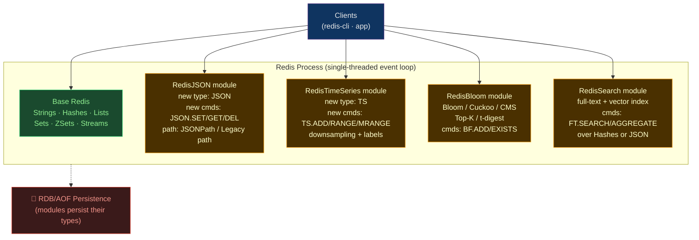

# 🧩 Redis Modules

> [!abstract] TL;DR
> Redis modules extend Redis with new data types and commands loaded at startup — they run inside the Redis process and share the same single-threaded event loop. The four flagship modules (bundled as **Redis Stack**) are: **RedisJSON** (nested JSON document store with path queries), **RedisTimeSeries** (time series data with downsampling and aggregation), **RedisBloom** (probabilistic data structures: Bloom filter, Cuckoo filter, Count-Min sketch, Top-K, HyperLogLog), and **RedisSearch** (full-text and vector search over hashes and JSON). Modules are production-ready but require Redis 6+ and are not available in all managed services (ElastiCache does not support community modules; use Redis Enterprise Cloud or self-hosted).

## Intuition — what it is & who uses it

Think of base Redis as a **Swiss Army knife** — strings, hashes, lists, sets, sorted sets. Redis modules add **specialist attachments**: RedisJSON adds a JSON screwdriver, RedisTimeSeries adds a precision clock gauge, RedisBloom adds a magician's probability wand, and RedisSearch adds a full-text search lens. All attachments are native — they don't require a separate process or serialisation overhead; the Redis event loop handles them directly.

Who uses them: **Snap** and **Twitter** use RedisBloom for large-scale unique-item tracking; **Roblox** uses RedisTimeSeries for real-time metrics; **Shopify** and **Adobe** use RedisSearch for catalogue search. They're ideal when you want the Redis latency profile (<1ms) for data types that base Redis doesn't natively support.

## Architecture



## Module Loading

```bash
# redis.conf — load modules at startup
loadmodule /usr/lib/redis/modules/rejson.so
loadmodule /usr/lib/redis/modules/redistimeseries.so
loadmodule /usr/lib/redis/modules/redisbloom.so
loadmodule /usr/lib/redis/modules/redisearch.so

# Load at runtime (doesn't persist across restart without redis.conf change)
MODULE LOAD /path/to/module.so

# List loaded modules
MODULE LIST

# Redis Stack Docker image — all modules pre-loaded
docker run -p 6379:6379 redis/redis-stack:latest
```

## RedisJSON — JSON Document Store

```bash
# Set a JSON document
JSON.SET user:1 $ '{"name":"Alice","age":30,"address":{"city":"NYC","zip":"10001"},"tags":["admin","billing"]}'

# Get the full document
JSON.GET user:1

# JSONPath queries (dollar-sign syntax)
JSON.GET user:1 $.name           # ["Alice"]
JSON.GET user:1 $.address.city   # ["NYC"]
JSON.GET user:1 $.tags[0]        # ["admin"]

# Update a nested field
JSON.SET user:1 $.age 31
JSON.SET user:1 $.address.city '"Brooklyn"'

# Increment a numeric field atomically
JSON.NUMINCRBY user:1 $.age 1    # ["32"]

# Append to an array
JSON.ARRAPPEND user:1 $.tags '"devops"'
JSON.ARRLEN user:1 $.tags         # [3]

# Delete a field
JSON.DEL user:1 $.address.zip

# Get type of a path
JSON.TYPE user:1 $.tags           # ["array"]
JSON.TYPE user:1 $.age            # ["integer"]

# Multi-key operations
JSON.MGET user:1 user:2 user:3 $.name

# Conditional set (fails if path exists)
JSON.SET user:1 $.phone '"555-1234"' NX   # only if $.phone doesn't exist
```

## RedisTimeSeries — Time Series Data

```bash
# Create a time series (with retention and labels)
TS.CREATE sensor:temperature:room1 \
  RETENTION 86400000 \              # keep 24 hours (ms)
  LABELS room room1 building A floor 2

# Add data points (timestamp in ms; * = server timestamp)
TS.ADD sensor:temperature:room1 * 22.5
TS.ADD sensor:temperature:room1 * 23.1
TS.ADD sensor:temperature:room1 1722000000000 21.8   # explicit timestamp

# Batch add (for IoT/bulk ingestion)
TS.MADD \
  sensor:temperature:room1 * 22.9 \
  sensor:temperature:room2 * 24.1 \
  sensor:humidity:room1 * 55.2

# Query a time range (last 1 hour)
TS.RANGE sensor:temperature:room1 \
  - +                              # - = earliest, + = latest
  COUNT 100                        # limit to 100 points

# Downsampling with aggregation rules
TS.CREATERULE sensor:temperature:room1 \
  sensor:temperature:room1:1min \  # destination key
  AGGREGATION avg 60000            # 1-minute average

# Query downsampled data
TS.RANGE sensor:temperature:room1:1min - + AGG avg 3600000   # hourly avg

# Multi-series query (cross-key with label filtering)
TS.MRANGE - + \
  FILTER building=A \              # query by labels
  AGGREGATION max 60000 \          # 1-min max per series
  WITHLABELS

# Get latest value for all matching series
TS.MGET FILTER building=A WITHLABELS
```

## RedisBloom — Probabilistic Data Structures

```bash
# --- Bloom Filter (membership: "have I seen this before?") ---
# False positive rate: ~1% by default; never false negatives
BF.RESERVE email:seen 0.001 1000000    # 0.1% error rate, 1M capacity
BF.ADD email:seen "user@example.com"   # add item
BF.EXISTS email:seen "user@example.com" # 1 (definitely seen) or 0 (probably not)
BF.MADD email:seen "a@x.com" "b@x.com" "c@x.com"  # batch add
BF.MEXISTS email:seen "a@x.com" "d@x.com"          # batch check

# Use case: "has this user already received this email campaign?"
# Rather than querying a 100M-row table, check a Bloom filter in O(1)

# --- Cuckoo Filter (like Bloom, but supports deletion) ---
CF.RESERVE url:seen 1000000
CF.ADD url:seen "https://example.com/page1"
CF.EXISTS url:seen "https://example.com/page1"  # 1
CF.DEL url:seen "https://example.com/page1"     # 1 (deleted)

# --- Count-Min Sketch (frequency estimation, fixed memory) ---
CMS.INITBYDIM user:events 1000 5    # 1000 width, 5 depth
CMS.INCRBY user:events "click" 1 "scroll" 3 "click" 2
CMS.QUERY user:events "click"        # approximate count: 3

# --- Top-K (heavy hitters — top N most frequent items) ---
TOPK.RESERVE trending:hashtags 100 2000 7 0.925
TOPK.ADD trending:hashtags "ai" "kubernetes" "rust" "ai" "kubernetes" "ai"
TOPK.LIST trending:hashtags          # ["ai", "kubernetes", "rust", ...]
TOPK.QUERY trending:hashtags "ai"    # 1 (in top-K)

# --- HyperLogLog (cardinality estimation — built into base Redis) ---
PFADD unique:visitors:day:2026-07-30 "user123" "user456" "user789"
PFCOUNT unique:visitors:day:2026-07-30  # ~3 (estimate, ~0.81% error)
PFMERGE unique:visitors:week \
  unique:visitors:day:2026-07-28 \
  unique:visitors:day:2026-07-29 \
  unique:visitors:day:2026-07-30
```

## RedisSearch — Full-Text and Vector Search

```bash
# Create a search index on Hash documents
FT.CREATE idx:products \
  ON HASH PREFIX 1 "product:" \
  SCHEMA
    name TEXT WEIGHT 2.0 \       # name field, 2x relevance boost
    description TEXT \
    price NUMERIC SORTABLE \
    category TAG \               # TAG = exact match / filter
    color TAG

# Index JSON documents
FT.CREATE idx:users \
  ON JSON PREFIX 1 "user:" \
  SCHEMA
    $.name AS name TEXT \
    $.age AS age NUMERIC SORTABLE \
    $.tags[*] AS tags TAG

# Add products (as Hashes)
HSET product:1 name "MacBook Pro" description "Apple laptop" price 2499 category laptop color silver
HSET product:2 name "ThinkPad X1" description "IBM business laptop" price 1899 category laptop color black

# Full-text search
FT.SEARCH idx:products "laptop"
FT.SEARCH idx:products "apple OR IBM"
FT.SEARCH idx:products "@description:laptop @price:[1000 3000]"   # field filter + range
FT.SEARCH idx:products "@category:{laptop} @color:{silver|black}" # tag filter

# Aggregation (like SQL GROUP BY)
FT.AGGREGATE idx:products "*" \
  GROUPBY 1 @category \
  REDUCE AVG 1 @price AS avg_price \
  REDUCE COUNT 0 AS count \
  SORT 2 @avg_price DESC

# Vector similarity search (semantic search, requires RedisSearch 2.4+)
FT.CREATE idx:docs \
  ON HASH PREFIX 1 "doc:" \
  SCHEMA
    embedding VECTOR HNSW 6 TYPE FLOAT32 DIM 1536 DISTANCE_METRIC COSINE

# Add document with embedding
HSET doc:1 text "Introduction to Kubernetes" embedding <1536-float32-bytes>

# KNN search: find 5 most similar documents
FT.SEARCH idx:docs "*=>[KNN 5 @embedding $query_vec AS score]" \
  PARAMS 2 query_vec <query-embedding-bytes> \
  RETURN 2 text score \
  SORTBY score
```

## Strengths / Weaknesses

| Module | Strength | Weakness |
|--------|----------|----------|
| **RedisJSON** | O(1) path access, atomic partial updates, no deserialization round-trip | JSON stored as proprietary format (not a raw string); larger memory than Hash |
| **RedisTimeSeries** | Purpose-built aggregation/downsampling; label-based multi-series queries | Not a full TSDB replacement (no long-term retention without external archival) |
| **RedisBloom** | Fixed memory regardless of set size; O(1) membership test | Bloom filter: no deletion; false positives; one-way (no enumeration) |
| **RedisSearch** | Redis-speed full-text + vector search; no separate Elasticsearch cluster | Inverted index lives in RAM; large corpora need significant memory |

## Common Pitfalls

1. **Loading modules on ElastiCache/Memorydb** — AWS ElastiCache for Redis does not support community modules; use Redis Enterprise Cloud or self-hosted Redis Stack for modules.
2. **RedisJSON memory overhead** — JSON objects use more memory than equivalent Hash structures; use `DEBUG OBJECT key` to measure; choose JSON only if path queries justify the overhead.
3. **Bloom filter capacity exhaustion** — if you add more items than the `BF.RESERVE` capacity, the error rate increases silently; monitor filter occupancy and pre-create with headroom.
4. **RedisSearch index lag** — the FT index is updated synchronously on write (`HSET`); bulk imports slow dramatically due to indexing overhead; use `FT.CREATE SKIPINITIALSCAN` then `FT.SYNINDEX` for bulk scenarios.
5. **Forgetting `MODULE LIST` after restart** — if modules are loaded dynamically (not in redis.conf), they don't survive a restart; always add to redis.conf for persistence.

## Related Concepts

- [[_MOC_DB_Systems|↑ Section MOC]]
- [[Redis]] — base Redis overview; modules build on top of this
- [[Redis_Lua_Scripting]] — Lua scripting is another extension mechanism for Redis
- [[Time_Series_and_Vector_Databases]] — RedisTimeSeries and RedisSearch vector search are alternatives to specialized TSDBs and vector stores
- [[Key_Value_Stores]] — base Redis is the key-value store; modules extend it to specialized data types

## Review Questions

1. A system needs to answer "has this user ID ever placed an order?" for 500 million historical orders, with <1ms latency and a budget of 256 MB memory. Which Redis module would you use, and how would you configure it?
2. You use RedisSearch for full-text search. Your team notices that bulk imports (1 million documents) take 40 minutes. What causes this slowness and how do you resolve it?
3. Compare RedisTimeSeries to using a Sorted Set (`ZADD sensor:temp <timestamp> <value>`) for time series storage. When would each approach be appropriate?

## Sources

- redis.io/docs/stack/
- redis.io/docs/stack/json/ (RedisJSON)
- redis.io/docs/stack/timeseries/ (RedisTimeSeries)
- redis.io/docs/stack/bloom/ (RedisBloom)
- redis.io/docs/stack/search/ (RedisSearch)

#Database #Redis #RedisJSON #RedisTimeSeries #RedisBloom #RedisSearch #Modules #InMemory #FullTextSearch #VectorSearch
