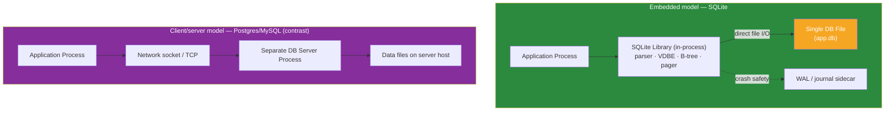

# 🪶 SQLite

> [!abstract] TL;DR
> **SQLite** is an **embedded, serverless, zero-configuration** relational database that lives as a **single file** on disk and runs **in-process** as a linked library — there is no separate server, no network port, no daemon. Your application calls C functions directly; there is nothing to install or administer. It is fully ACID (with a rollback journal or, better, **WAL mode**), speaks a large subset of SQL, and is the **most widely deployed database in the world** — shipped in every Android and iOS device, every major browser, and countless desktop apps. Its famous positioning: *"SQLite is not a competitor to client/server databases; it competes with `fopen()`."* Its constraints follow directly from the design: **a single writer at a time**, no network access, and limited high-concurrency write throughput — but excellent read concurrency and rock-solid reliability.

## Intuition — what it is & who uses it

SQLite is best understood not as "a small database server" but as **a better file format**. When an application needs to save structured data — settings, a document, a cache, a game's save state — the naive approach is to invent a custom binary or JSON file and hand-parse it. SQLite replaces that with a single `.db` file you can query with full SQL and transactions, so a crash mid-write cannot corrupt half your data.

Because it is a library compiled *into* your program, there is no server to run, secure, or scale. It is embedded in essentially **every smartphone (Android, iOS), every browser (Chrome, Firefox, Safari), macOS, Windows, and apps like Photoshop, Skype, and Firefox**. It also powers testing environments, edge/IoT devices, small-to-medium websites, and increasingly "edge SQL" platforms (Turso/libSQL, Cloudflare D1). Reach for SQLite whenever a single machine or process owns the data and you want SQL without operating a server.

## Architecture

The key architectural difference from PostgreSQL/MySQL is that **there is no separate process**. SQLite is a library statically or dynamically linked into the application. The application, the SQL engine, and the database file all live in one process; "the database" is just the file (plus a small journal/WAL sidecar).



## Key Features & Data Model

- **Single-file database.** The entire database — schema, tables, indexes, data — is one cross-platform file you can copy, email, or version. A companion `-wal`/`-shm` or `-journal` file exists transiently for crash safety.
- **Serverless / in-process.** No daemon, no config, no ports, no auth server. The app links `libsqlite3` and calls its C API (or a binding: Python `sqlite3`, better-sqlite3, etc.).
- **ACID transactions.** Atomic commit via a **rollback journal** (default) or **Write-Ahead Log (WAL) mode** (`PRAGMA journal_mode=WAL`), which lets readers proceed concurrently with a writer. Conceptually related to [[Write_Ahead_Logging]].
- **Dynamic typing (type affinity).** Columns have *affinity* (TEXT, NUMERIC, INTEGER, REAL, BLOB) rather than rigid types; a value's storage class is per-row. `STRICT` tables (added in 3.37) enforce rigid typing when you want it.
- **Rich SQL subset.** Joins, subqueries, views, triggers, CTEs, window functions, `JSON1` functions, full-text search (FTS5), R-Tree spatial index, generated columns, `UPSERT`, and partial/expression indexes.
- **Small and reliable.** ~600 KB library, no dependencies, and one of the most thoroughly tested codebases in existence (100% branch test coverage). The file format is a long-term stable, cross-platform archival format.
- **Concurrency model.** Many concurrent **readers**, but **one writer at a time** (a database-level write lock; WAL mode lets that writer coexist with readers). No fine-grained row locking.

## Strengths / Weaknesses

| Strengths | Weaknesses |
|---|---|
| Zero configuration — nothing to install, run, or administer | **Single writer** at a time; not for high-concurrency write workloads |
| Single portable file; trivial to back up, copy, ship, version | No network access — it is in-process only (needs a wrapper like libSQL/rqlite to go remote) |
| Fully ACID and crash-safe (WAL mode) | No user/role management or per-table security (uses OS file permissions) |
| Tiny footprint, no dependencies, extremely reliable | Limited to one machine's disk; no built-in replication/sharding |
| Fast for local reads and read-heavy workloads | Dynamic typing can surprise (mitigate with STRICT tables) |
| Great as an application file format and for testing | Very large datasets / heavy analytics outgrow it |

## When to Use vs Avoid

**Use SQLite when:**
- **Mobile & desktop apps** need local structured storage (the dominant use case).
- **Edge / IoT** devices need an embedded database with no server.
- **Testing** — spin up a fast, disposable in-memory (`:memory:`) or file DB per test.
- **Small-to-medium websites** with modest, read-mostly traffic (SQLite can serve surprising load with WAL + a single writer).
- You want an **application file format** with query power (think "SQL instead of a custom binary/JSON file").

**Avoid when:**
- Many clients across a network need **concurrent write** access — use [[PostgreSQL]] or [[MySQL]].
- You need high write throughput, replication, sharding, or role-based security.
- You need a shared server multiple machines connect to over the network.

> **The mental model:** *SQLite competes with `fopen()`, not with Postgres.* If you were about to hand-roll a file format, use SQLite. If you were about to stand up a database server, use a client/server DB.

## Example Usage

```sql
-- Turn on WAL mode: readers no longer block the single writer (big concurrency win)
PRAGMA journal_mode = WAL;
PRAGMA foreign_keys = ON;              -- FK enforcement is OFF by default!

-- STRICT table enforces rigid typing (opt in to escape dynamic affinity)
CREATE TABLE notes (
    id       INTEGER PRIMARY KEY,       -- rowid alias; auto-increments
    title    TEXT NOT NULL,
    body     TEXT,
    tags     TEXT,                       -- store JSON and query with json1
    created  TEXT DEFAULT (datetime('now'))
) STRICT;

INSERT INTO notes (title, body, tags)
VALUES ('Trip', 'Pack bags', json('["travel","todo"]'));

-- JSON1 + full-text search available in the amalgamation build
SELECT title FROM notes
WHERE json_extract(tags, '$[0]') = 'travel';
```

```bash
# The whole database is one file — back it up by copying (safely with .backup)
sqlite3 app.db ".backup 'backup.db'"

# Inspect it from the CLI; ':memory:' gives a throwaway in-RAM DB for tests
sqlite3 app.db ".tables"
sqlite3 :memory: "SELECT sqlite_version();"
```

## Common Pitfalls

1. **Expecting multi-writer concurrency.** SQLite serializes writers with a database-level lock. Concurrent writers get `SQLITE_BUSY`. Use WAL mode, keep write transactions short, and set a `busy_timeout`.
2. **Forgetting to enable WAL.** The default rollback-journal mode blocks readers during writes. `PRAGMA journal_mode=WAL` dramatically improves read/write concurrency for most apps.
3. **Foreign keys off by default.** `PRAGMA foreign_keys = ON;` must be set **per connection** or FK constraints are silently ignored.
4. **Surprise from dynamic typing.** Without `STRICT` tables, a `TEXT` value can land in an `INTEGER` column. Use `STRICT` when you want rigid types.
5. **Putting the file on a network share.** SQLite's locking assumes a local filesystem; NFS/SMB locking is unreliable and can corrupt the DB under concurrent access.
6. **Using it as a network server.** It is in-process by design. If you need remote access, wrap it (rqlite, libSQL/Turso) or use a client/server database.

## Related Concepts

- [[_MOC_DB_Systems|↑ Section MOC]]
- [[PostgreSQL]] — client/server relational DB you graduate to when you outgrow single-writer/local
- [[MySQL]] — the other mainstream client/server relational option
- [[Redis]] — in-memory store; different job (caching/ephemeral state), also often embedded-adjacent
- [[Write_Ahead_Logging]] — the WAL journaling mode SQLite uses for crash-safe concurrent reads
- [[Storage_Engine_Internals]] — B-tree pages and the pager concept SQLite shares with bigger engines
- [[ACID_and_Transactions]] — the transactional guarantees SQLite still provides serverless (System Design vault)

## Review Questions

1. The SQLite project says it "competes with `fopen()`, not with client/server databases." Explain what that means and give two situations where SQLite is the right choice and one where it is clearly the wrong one.
2. Describe SQLite's concurrency model. How many concurrent readers and writers does it allow, and what specific benefit does turning on WAL mode provide?
3. Two common footguns are foreign keys and typing. What is the default behavior of each in SQLite, and what do you do to get strict enforcement of both?

## Sources

- SQLite Documentation — https://www.sqlite.org/docs.html
- "Appropriate Uses For SQLite" — https://www.sqlite.org/whentouse.html
- SQLite: Write-Ahead Logging — https://www.sqlite.org/wal.html
- SQLite: STRICT Tables — https://www.sqlite.org/stricttables.html
- "SQLite as an Application File Format" — https://www.sqlite.org/appfileformat.html

#Database #DatabaseSystems #SQLite #Embedded #Serverless #WAL #EdgeDatabase
