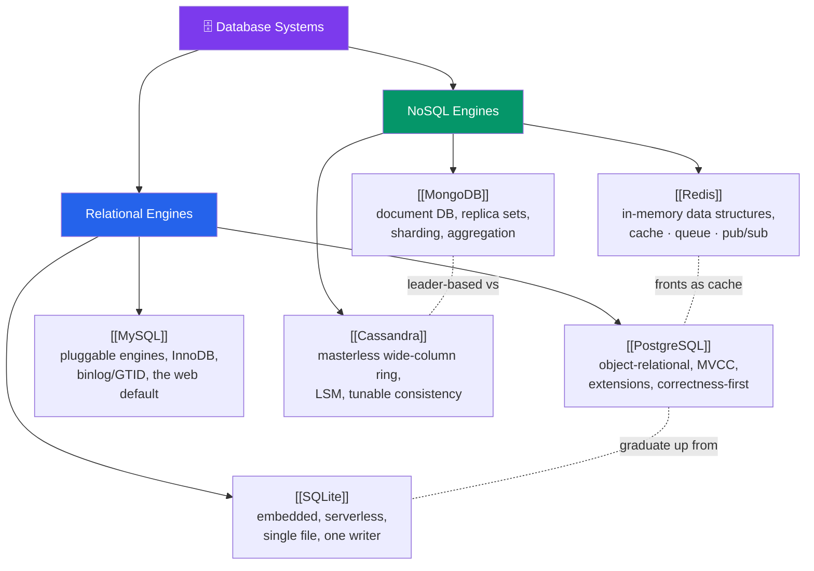

# 🗺️ Database Systems — Map of Content

> [!abstract] What This Section Covers
> Concepts become concrete in the engines that ship them. This section profiles the six databases every backend engineer meets, split into the relational trio and the NoSQL trio. **PostgreSQL** (the correctness-first, extension-rich object-relational default), **MySQL** (the ubiquitous pluggable-storage web workhorse), and **SQLite** (the embedded, serverless single-file library that "competes with `fopen()`") anchor the relational side. **Redis** (in-memory data-structure store and cache), **MongoDB** (the leading document database), and **Cassandra** (the masterless, write-optimised wide-column ring) anchor the NoSQL side. Each note is a practitioner profile — architecture, storage internals, replication/HA model, when to reach for it, and the footguns — so you can map a workload to the right engine and know its operational personality before you deploy it.

## Concept Map

## Learning Path

1. [[SQLite]] — Begin with the simplest: an in-process, single-file relational library — what "serverless" really means and where the single-writer limit bites.
2. [[PostgreSQL]] — The safe, powerful relational default: process-per-connection, MVCC + VACUUM, WAL durability, and the extension ecosystem (PostGIS, pgvector, Citus).
3. [[MySQL]] — The other dominant relational engine: pluggable storage, InnoDB's clustered index, and mature binlog/GTID/Group Replication.
4. [[Redis]] — The in-memory complement to a relational system of record: rich data structures, single-threaded atomicity, RDB/AOF persistence, Cluster + Sentinel.
5. [[MongoDB]] — The document engine in practice: BSON, replica sets and elections, sharding by shard key, WiredTiger, and multi-document transactions.
6. [[Cassandra]] — The masterless scale-out engine: the ring + consistent hashing, LSM write path, per-query tunable consistency, and query-first data modelling.

## All Notes at a Glance

| Note | Difficulty | What You'll Learn |
| ---- | ---------- | ----------------- |
| [[SQLite]] | Beginner | Embedded/serverless single-file model; WAL mode; dynamic typing + STRICT; one-writer concurrency; "competes with `fopen()`" |
| [[PostgreSQL]] | Intermediate | Process-per-connection + pooling; MVCC and VACUUM; WAL; JSONB and the extension system; correctness-first strengths and pitfalls |
| [[MySQL]] | Intermediate | Pluggable storage engines; InnoDB clustered index + buffer pool; redo/undo logs; binlog/GTID/Group Replication; the fork landscape |
| [[Redis]] | Intermediate | In-memory data structures + atomic ops; RDB vs AOF durability; TTL/eviction; Cluster hash slots, Sentinel; cache/queue/pub-sub uses |
| [[MongoDB]] | Intermediate | Documents + collections; replica sets & elections; sharding, chunks, balancer; aggregation pipeline; embed vs reference; write concern |
| [[Cassandra]] | Advanced | Masterless ring + consistent hashing + vnodes; LSM write path; `R+W>RF` tunable consistency; gossip/hinted-handoff/read-repair; query-first modelling |

## Key Questions This Section Answers

- Why does PostgreSQL need a connection pooler, and what does MVCC's dead-tuple problem mean for VACUUM?
- What is MySQL's pluggable storage-engine architecture, and why is InnoDB's clustered index hostile to random UUID primary keys?
- What does SQLite mean by "competes with `fopen()`", and when is it exactly the wrong choice?
- Why is Redis single-threaded, and what does `KEYS *` do to every other client?
- What is the difference between a MongoDB replica set and a sharded cluster, and why is the shard key so hard to change?
- How does Cassandra accept a write with no leader, and how do read/write consistency levels and RF combine into `R + W > RF`?
- Which engine do you reach for: relational default, embedded, in-memory cache, document flexibility, or masterless write scale?

## Related Sections
- [[_MOC_Database_Master|↑ Database Master MOC]]
- [[_MOC_DB_NoSQL|← NoSQL]] — the families Redis, MongoDB, and Cassandra each exemplify
- [[_MOC_DB_Storage_Indexing|← Storage & Indexing]] — the heap/B-tree/LSM internals and WAL these engines are built on
- [[_MOC_DB_Distributed|→ Distributed Databases]] — the replication, sharding, and consensus these systems implement
- [[_MOC_DB_Administration|→ Administration & Ops]] — backing up, monitoring, and tuning these engines in production

#MOC #Database #DatabaseSystems #PostgreSQL #MySQL #Redis #MongoDB #Cassandra
