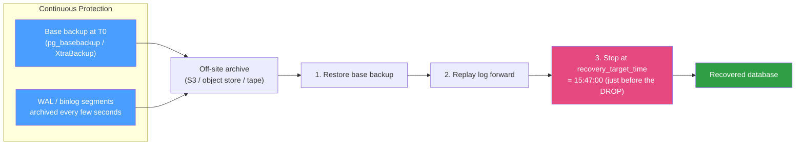

# 💾 Backup and Recovery

> [!abstract] TL;DR
> A backup you have never restored is not a backup — it is a hope. There are two families: **logical backups** (`pg_dump` / `mysqldump` / `mydumper`) that emit SQL or a portable archive of *logical* objects, and **physical backups** (`pg_basebackup`, Percona **XtraBackup**, filesystem/volume snapshots) that copy the raw data files byte-for-byte. **Point-in-Time Recovery (PITR)** combines a physical base backup with a continuous archive of the transaction log ([[Write_Ahead_Logging|WAL]] in Postgres, **binlog** in MySQL) so you can roll forward to *any* second — including the moment right before an accidental `DROP TABLE`. Everything is governed by two numbers: **RPO** (how much data you can afford to lose) and **RTO** (how long you can afford to be down). Retention, off-site copies, and regular **restore drills** turn all of this from theatre into insurance.

## Intuition — analogy FIRST

Think of protecting a novel you are writing.

- A **logical backup** is *retyping the whole manuscript into a fresh document*. It is portable — you can paste it into any word processor, any version — but slow to produce and slow to re-type back in for a 900-page book.
- A **physical backup** is *photocopying the printed pages exactly as they sit*. Fast, faithful to the layout, but the copy only works on the same kind of printer (same DB engine major version, same page size, same architecture).
- The **transaction log archive** (WAL / binlog) is *keeping every edit slip you scribbled since the last photocopy*. Given last night's photocopy plus tonight's stack of edit slips, you can reconstruct the manuscript as it existed at **3:47 PM**, one slip before you spilled coffee on chapter 12. That is **PITR**.
- **RPO** is "how many edit slips am I willing to lose in a fire?" **RTO** is "how fast can I have a working manuscript back on my desk?"

The whole discipline exists because storage fails, humans `DELETE` without a `WHERE`, and ransomware encrypts your primary *and* your standby.

---

## How It Works

### Logical vs physical

| | Logical backup | Physical backup |
|---|---|---|
| What it copies | SQL statements / rows (logical objects) | Raw data files / pages, byte-for-byte |
| Postgres tools | `pg_dump`, `pg_dumpall` | `pg_basebackup`, filesystem snapshot + WAL |
| MySQL tools | `mysqldump`, `mydumper` (parallel) | Percona **XtraBackup**, LVM/EBS snapshot |
| Portability | High — cross-version, cross-platform, selective | Low — same engine major version & platform |
| Speed to take | Slow on large DBs (single-threaded scans) | Fast — bulk file copy, can be incremental |
| Speed to restore | Slow — replays SQL, rebuilds indexes | Fast — files are already in final form |
| Enables PITR | No (a point snapshot only) | Yes, with continuous log archiving |
| Granularity | Single table / schema / row-level dump | Whole cluster / instance |

Rule of thumb: **logical** for portability, migrations, and small/selective restores; **physical + log archive** for large databases where you need fast restores and second-level PITR.

### Point-in-Time Recovery = base backup + log replay

PITR needs two ingredients captured continuously:

1. A **base backup** — a consistent physical copy taken at time *T0*.
2. A **continuous archive** of every transaction-log segment written after *T0*.

Recovery = restore the base backup, then **replay** the log forward and *stop* at your chosen `recovery_target_time`. The engine reaches a transaction-consistent state at that instant.



### RPO vs RTO — the two dials that drive design

- **RPO (Recovery Point Objective)** — the maximum *data loss* window. If you archive WAL every 60 s, your worst-case RPO is ~60 s. Synchronous [[Replication_Strategies|replication]] can push RPO toward zero.
- **RTO (Recovery Time Objective)** — the maximum *downtime*. A 2 TB logical restore that replays SQL for 9 hours has a 9-hour RTO; a physical restore + short log replay might be minutes. HA [[Failover|failover]] shrinks RTO by not restoring at all.

The strategy is chosen by the *tighter* of the two, weighed against cost. Zero-RPO/zero-RTO is achievable but expensive (sync standbys + automated failover); most systems pick a pragmatic point on the curve.

### Full, incremental, and differential

- **Full** — everything, every time. Simple; large; slow.
- **Incremental** — only blocks/pages changed since the *previous* backup (XtraBackup `--incremental`, Postgres 17 `pg_basebackup --incremental`, or WAL itself as a continuous increment).
- **Differential** — changes since the last *full*. Larger than incremental but simpler restore chains.

Fewer files in the restore chain = faster, more reliable RTO; more increments = smaller storage but longer, more fragile restores.

### Retention & the 3-2-1 rule

Keep **3** copies, on **2** different media, with **1** off-site (and ideally **1** immutable/air-gapped against ransomware). Retention tiers commonly look like: hourly for 24 h, daily for 30 days, monthly for a year, plus regulatory long-term archives. Retention must cover your **longest realistic "when did the corruption start?"** detection window.

---

## Commands / Config Examples

```sql
-- ============ PostgreSQL ============

-- Logical: single database (custom format = compressed, parallel-restorable, selective)
-- $ pg_dump -Fc -j 4 -f shop.dump shop
-- Restore selectively (only one table) with 4 parallel workers:
-- $ pg_restore -j 4 -d shop_restored --table=orders shop.dump

-- Logical: whole cluster incl. roles/tablespaces (globals)
-- $ pg_dumpall > cluster_full.sql          -- schema+data+globals as plain SQL

-- Physical base backup (streams the data dir + required WAL)
-- $ pg_basebackup -D /backup/base -Ft -z -X stream -c fast

-- Enable continuous WAL archiving for PITR (postgresql.conf)
-- wal_level = replica
-- archive_mode = on
-- archive_command = 'test ! -f /wal_archive/%f && cp %p /wal_archive/%f'

-- PITR: after restoring the base backup, set the target then start the server
-- postgresql.conf (or recovery-time settings):
--   restore_command = 'cp /wal_archive/%f %p'
--   recovery_target_time = '2026-07-26 15:47:00+00'
--   recovery_target_action = 'promote'
-- Create the standby.signal / recovery.signal file, start postgres, watch it replay.
```

```sql
-- ============ MySQL ============

-- Logical: consistent single-transaction dump (no long locks on InnoDB)
-- $ mysqldump --single-transaction --routines --triggers --events \
--            --source-data=2 shop > shop.sql   -- --source-data records binlog pos

-- Faster parallel logical dump/restore
-- $ mydumper  --threads 8 --outputdir /backup/shop  --database shop
-- $ myloader  --threads 8 --directory /backup/shop  --database shop

-- Physical + PITR-capable backup with Percona XtraBackup
-- $ xtrabackup --backup   --target-dir=/backup/full
-- $ xtrabackup --prepare  --target-dir=/backup/full   -- make it consistent
-- Incremental against the full:
-- $ xtrabackup --backup --target-dir=/backup/inc1 --incremental-basedir=/backup/full

-- Enable binary logging for PITR (my.cnf)
-- [mysqld]
-- log_bin        = /var/log/mysql/binlog
-- binlog_format  = ROW
-- server_id      = 1

-- PITR: restore the physical backup, then replay binlog up to a stop time
-- $ mysqlbinlog --stop-datetime="2026-07-26 15:47:00" \
--     binlog.000045 binlog.000046 | mysql -u root -p
```

---

## Best Practices

- **Test restores on a schedule**, not just backups. Run automated restore drills into a scratch instance and compare row counts / checksums. A green backup job proves nothing about recoverability.
- **Track RPO/RTO explicitly** per database tier and design backup frequency + method to meet them; document them so on-call knows the promise.
- **Archive the transaction log continuously** (WAL/binlog) if you need PITR — a nightly dump alone gives up to 24 h RPO.
- **Follow 3-2-1** and keep at least one **immutable / offline** copy to survive ransomware and fat-fingered `aws s3 rm`.
- **Encrypt backups at rest and in transit**, and store keys separately — a stolen backup is a full data breach (see [[Database_Security]]).
- **Verify integrity**: checksum every backup, and use `pg_verifybackup` / `xtrabackup --prepare` to confirm consistency before you rely on it.
- **Automate retention/expiry** so storage does not silently overflow and old, useless fulls are pruned.
- **Keep globals**: `pg_dump` of one database excludes roles/tablespaces — pair it with `pg_dumpall --globals-only`.

## Common Pitfalls

1. **Never testing restores.** The single most common — and most catastrophic — failure. The disaster is the wrong time to discover a corrupt or incomplete backup chain.
2. **Backing up only the data, not the log archive.** Without continuous WAL/binlog you have snapshots, not PITR, and your RPO is silently the full backup interval.
3. **Storing backups next to the primary.** Same disk, same host, same region, or same cloud account = one blast radius wipes both. Off-site and cross-account are non-negotiable.
4. **`mysqldump` without `--single-transaction`** on InnoDB — takes table locks and can block writes, or produces an inconsistent dump across tables.
5. **Physical backup restored to a different major version / architecture.** Physical formats are engine-version and platform specific; that is what logical backups are for.
6. **Ignoring restore time (RTO).** A 5 TB logical dump can take a full day to replay and rebuild indexes; if your RTO is 1 hour you need a physical strategy or HA, not a bigger dump.
7. **Forgetting the retention/detection gap.** If corruption is discovered after 40 days but you only keep 30 days, the last clean copy is already gone.

## Related Concepts

- [[_MOC_DB_Administration|↑ Section MOC]]
- [[Write_Ahead_Logging]] — the WAL/redo log that PITR replays to roll forward
- [[Replication_Strategies]] — a hot standby complements (but never replaces) backups
- [[High_Availability_and_Failover]] — HA reduces RTO; backups protect against data *corruption* HA would just replicate
- [[Failover]] — systems-level failover for downtime, distinct from data-loss recovery (System Design vault)
- [[Database_Security]] — encrypting and access-controlling backups
- [[Database_Monitoring]] — alerting on backup-job failure and archiving lag

## Review Questions

1. You accidentally run `DELETE FROM orders;` (no `WHERE`) at 15:47 and notice at 15:52. Walk through exactly how you would recover to 15:46:59 in PostgreSQL, and what must have been configured *beforehand* for that to be possible.
2. Distinguish RPO from RTO, and give one concrete configuration change that lowers RPO and a different one that lowers RTO. Why can optimizing one work against the other?
3. When would you deliberately choose a logical backup (`pg_dump` / `mysqldump`) over a physical one (`pg_basebackup` / XtraBackup), even though the physical backup restores faster?

## Sources

- PostgreSQL Documentation — Backup and Restore; Continuous Archiving and PITR — https://www.postgresql.org/docs/current/continuous-archiving.html
- MySQL Reference Manual — Backup and Recovery; Point-in-Time Recovery — https://dev.mysql.com/doc/refman/8.0/en/point-in-time-recovery.html
- Percona XtraBackup Documentation — https://docs.percona.com/percona-xtrabackup/
- "Database Reliability Engineering" — Campbell & Majors (backup/recovery, RPO/RTO)

#Database #Administration #Ops #Backup #PITR #DisasterRecovery #RPO #RTO
