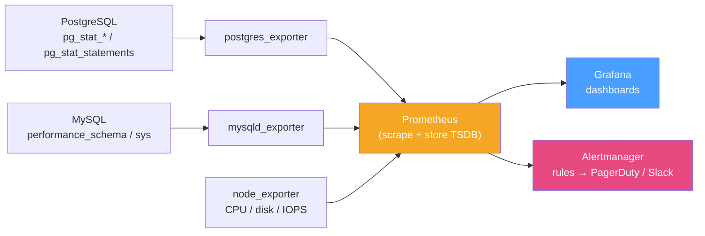

# 📈 Database Monitoring

> [!abstract] TL;DR
> You cannot tune, capacity-plan, or fail over safely what you cannot see. Database monitoring collects a handful of **golden metrics** — **throughput** (QPS/TPS), **latency**, **active connections**, **cache hit ratio** (shared_buffers / InnoDB buffer pool), **[[Replication_Strategies|replication lag]]**, **locks / [[Deadlocks|deadlocks]]**, **slow queries**, **disk & IOPS**, and Postgres-specific **bloat / vacuum health** — and turns them into dashboards and alerts. The raw numbers live in the engine itself: Postgres exposes `pg_stat_*` views and the **`pg_stat_statements`** extension; MySQL exposes **`performance_schema`**, the **`sys`** schema, and the **slow query log**. In production you scrape those with an **exporter** (`postgres_exporter`, `mysqld_exporter`), store time series in **Prometheus**, visualize in **Grafana**, and page on-call via **Alertmanager**. Alert on **symptoms users feel** (latency, errors, saturation), not just raw counters.

## Intuition — analogy FIRST

Monitoring a database is like the instrument panel of a car you're driving flat-out.

- The **speedometer** is throughput (QPS/TPS) — how much work is flowing.
- The **tachometer / lap time** is latency — how long each request takes; the number the passenger (user) actually feels.
- The **fuel gauge** is connections and disk headroom — run out and everything halts.
- The **temperature gauge** is cache hit ratio and lock contention — creeping heat that precedes a seizure.
- The **check-engine light** is the alert: it should fire on *something the driver must act on now* (overheating), not blink for every trivial fluctuation, or you learn to ignore it.

Raw gauges alone are noise; the skill is watching the *few* that predict a crash and wiring a light to each — and, crucially, recording them over **time** so you can see the trend before the wall.

---

## How It Works

### The golden metrics

| Metric | Why it matters | Postgres source | MySQL source |
|---|---|---|---|
| Throughput (QPS/TPS) | Baseline load; sudden drops = stall | `pg_stat_database.xact_commit` | `Com_*`, `Questions` status vars |
| Latency (query time) | The user-felt number | `pg_stat_statements.mean_exec_time` | `performance_schema` events, slow log |
| Connections / max | Saturation; pool exhaustion | `pg_stat_activity` | `Threads_connected`, `max_connections` |
| Cache hit ratio | Disk-read pressure | `pg_statio_*` (blks_hit/read) | `Innodb_buffer_pool_read_requests` vs `_reads` |
| Replication lag | Failover RPO, stale reads | `pg_stat_replication` (LSN diff) | `Seconds_Behind_Source`, GTID gaps |
| Locks / deadlocks | Contention, blocked txns | `pg_locks`, `pg_stat_activity.wait_event` | `data_locks`, `SHOW ENGINE INNODB STATUS` |
| Slow queries | Tuning targets | `pg_stat_statements`, `log_min_duration_statement` | slow query log, `sys.statements_with_*` |
| Disk / IOPS | Saturation, running out of space | node/OS metrics + `pg_database_size` | node metrics + `information_schema.TABLES` |
| Bloat / vacuum (PG) | Dead tuples slow scans | `pg_stat_user_tables` (n_dead_tup) | (InnoDB self-manages via purge) |

### Pull-based pipeline: exporter → Prometheus → Grafana → alerts



An **exporter** runs beside the database, queries its stats views, and publishes them as Prometheus metrics on an HTTP endpoint. **Prometheus** scrapes every ~15 s into a time-series DB. **Grafana** renders dashboards; **Alertmanager** evaluates rules and routes pages. Managed alternatives (**PMM** for MySQL/Mongo, `pgAdmin`, Cloud provider dashboards) bundle the same idea.

### Cache hit ratio — read it correctly

Hit ratio = `blocks served from memory / total block requests`. For [[OLTP_vs_OLAP|OLTP]] you generally want **> 99 %** (Postgres `shared_buffers`, InnoDB buffer pool). But a high ratio is not automatically healthy: a workload doing huge sequential scans can show 99 % hits while still being pathologically slow. Read it *alongside* latency and IOPS, never alone.

### Latency: percentiles, not averages

Averages hide pain. A mean of 5 ms with a **p99 of 900 ms** means 1 % of users — often your busiest — suffer. Track **p50 / p95 / p99** latency. `pg_stat_statements` gives per-statement mean/min/max/stddev; MySQL's `sys.statements_with_runtimes_in_95th_percentile` and slow log surface the tail.

### Reset counters and rates

Most stat views are **cumulative counters** since last reset/startup. A single reading is meaningless; you need the **rate of change** (Prometheus `rate()`), or a manual `pg_stat_statements_reset()` / `pg_stat_reset()` before a measurement window.

---

## Commands / Config Examples

```sql
-- ============ PostgreSQL ============

-- Enable the query-stats extension (postgresql.conf: shared_preload_libraries = 'pg_stat_statements')
CREATE EXTENSION IF NOT EXISTS pg_stat_statements;

-- Top 5 queries by total time (the real tuning targets)
SELECT calls, round(mean_exec_time::numeric, 2) AS avg_ms,
       round(total_exec_time::numeric, 2) AS total_ms, query
FROM pg_stat_statements
ORDER BY total_exec_time DESC
LIMIT 5;

-- Cache hit ratio (want > 0.99 for OLTP)
SELECT round(sum(blks_hit) * 100.0 / nullif(sum(blks_hit + blks_read), 0), 2) AS cache_hit_pct
FROM pg_stat_database;

-- Replication lag in bytes, per standby
SELECT client_addr, state,
       pg_wal_lsn_diff(pg_current_wal_lsn(), replay_lsn) AS lag_bytes
FROM pg_stat_replication;

-- Dead-tuple bloat / vacuum health
SELECT relname, n_live_tup, n_dead_tup, last_autovacuum
FROM pg_stat_user_tables
ORDER BY n_dead_tup DESC
LIMIT 10;

-- Log slow queries (postgresql.conf)
-- log_min_duration_statement = '500ms'
```

```sql
-- ============ MySQL ============

-- Slowest statements by total latency (sys schema is a friendly view over perf_schema)
SELECT query, exec_count, avg_latency, rows_examined_avg
FROM sys.statements_with_runtimes_in_95th_percentile
LIMIT 5;

-- Buffer pool hit ratio  (1 - reads/read_requests)
SELECT round((1 - (
  (SELECT VARIABLE_VALUE FROM performance_schema.global_status WHERE VARIABLE_NAME='Innodb_buffer_pool_reads') /
  (SELECT VARIABLE_VALUE FROM performance_schema.global_status WHERE VARIABLE_NAME='Innodb_buffer_pool_read_requests')
)) * 100, 2) AS buffer_pool_hit_pct;

-- Connections and saturation
SHOW STATUS LIKE 'Threads_connected';
SHOW VARIABLES LIKE 'max_connections';

-- Current locks / deadlock diagnostics
SELECT * FROM performance_schema.data_locks LIMIT 20;
SHOW ENGINE INNODB STATUS\G     -- LATEST DETECTED DEADLOCK section

-- Enable the slow query log (my.cnf)
-- [mysqld]
-- slow_query_log      = 1
-- long_query_time     = 0.5
-- log_output          = FILE
```

---

## Best Practices

- **Alert on symptoms, not causes.** Page on user-visible latency, error rate, and saturation (the RED/USE method); treat raw counters as *diagnostic* context you look at *after* the page.
- **Track percentiles (p95/p99), not averages** — the tail is where the outages and angry users live.
- **Store history.** A single reading tells you nothing; trends over hours/days reveal creep (bloat, connection growth, lag drift) before it becomes an incident.
- **Baseline first.** Know your normal QPS/latency/hit-ratio so anomaly thresholds are meaningful rather than guesses.
- **Monitor replication lag as a first-class alert** — it is your live [[High_Availability_and_Failover|failover]] RPO and drives stale-read behaviour.
- **Watch autovacuum / bloat in Postgres** — rising `n_dead_tup` and missed autovacuums silently degrade every scan.
- **Enable `pg_stat_statements` / the slow query log everywhere** — they are the cheapest, highest-value tuning input ([[Query_Tuning]]).
- **Instrument the connection pool too** — pool saturation and wait time often precede DB-level symptoms.

## Common Pitfalls

1. **Averaging away the tail.** A great average latency with a terrible p99 looks healthy on the dashboard while a slice of users times out.
2. **Reading a cumulative counter as an instantaneous value.** `pg_stat_*` and `SHOW STATUS` counters are since-reset totals; you must take rates/deltas.
3. **Trusting cache hit ratio alone.** 99.9 % hits with heavy sequential scans can still be slow; correlate with latency and IOPS.
4. **Alert fatigue.** Too many noisy, non-actionable alerts train on-call to ignore the panel — then the real one is missed. Every alert must be actionable.
5. **No historical retention.** Diagnosing "why was it slow last Tuesday?" is impossible without stored time series.
6. **Ignoring lock waits and deadlocks** until users complain — contention shows up in `pg_locks` / `data_locks` long before it becomes a visible stall.
7. **Monitoring the DB but not the OS.** Disk full, IOPS throttling, and CPU steal cause "database" incidents that no `pg_stat` view explains; pair `node_exporter` with the DB exporter.

## Related Concepts

- [[_MOC_DB_Administration|↑ Section MOC]]
- [[Query_Tuning]] — slow-query metrics here feed directly into query optimization
- [[Performance_Tuning]] — hit ratio, connections, and IOPS metrics guide server/config tuning
- [[High_Availability_and_Failover]] — replication-lag and quorum-health monitoring makes failover safe
- [[Monitoring]] — systems-level observability, SLIs/SLOs, RED & USE methods (System Design vault)
- [[Backup_and_Recovery]] — alerting on backup-job failure and WAL-archiving lag

## Review Questions

1. Why is a mean query latency of 4 ms potentially misleading, and which metric would reveal the users who are actually suffering? How do you capture it in Postgres and in MySQL?
2. Your Grafana panel shows a 99.9 % buffer-pool hit ratio, yet users report slowness. Give two distinct explanations that are consistent with a high hit ratio, and what other metrics you'd correlate.
3. Sketch the pull-based monitoring pipeline from raw engine stats to an on-call page, naming the component at each stage and what it does. Why is "alert on symptoms, not counters" the guiding rule?

## Sources

- PostgreSQL Documentation — The Cumulative Statistics System & pg_stat_statements — https://www.postgresql.org/docs/current/monitoring-stats.html
- MySQL Reference Manual — Performance Schema & sys Schema — https://dev.mysql.com/doc/refman/8.0/en/performance-schema.html
- Prometheus & Grafana documentation; postgres_exporter / mysqld_exporter READMEs
- "Site Reliability Engineering" — Google (Golden Signals, alerting philosophy)

#Database #Administration #Ops #Monitoring #Observability #Prometheus #Grafana #Metrics
