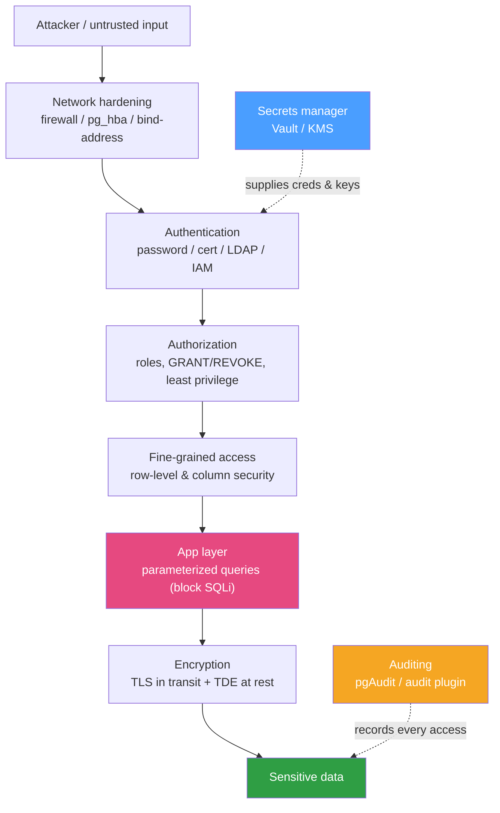

# 🔐 Database Security

> [!abstract] TL;DR
> Database security is **defense in depth**: no single control is trusted, and each layer assumes the one outside it failed. **Authentication** proves *who* you are (password, client **cert**, **LDAP/Kerberos**, cloud **IAM**); **authorization** decides *what* you may touch (roles + `GRANT`/`REVOKE`, **least privilege**, **row-level security**, column privileges). Data is encrypted **in transit** (TLS) and **at rest** (**TDE** / filesystem/disk encryption). The single highest-impact application rule is **preventing SQL injection with parameterized queries / prepared statements** — never string-concatenate user input into SQL. Everything sensitive is **audited** (pgAudit, [[MySQL]] audit plugin), secrets live in a **vault** (not in code), and the network is hardened (`pg_hba.conf`, `bind-address`, firewalls). The database holds the crown jewels; treat every layer as if the others are already breached.

## Intuition — analogy FIRST

Picture the database as the vault in a bank, protected by concentric rings — not one big wall.

- The **perimeter fence** is the network: firewalls and `bind-address` decide who can even *approach* (network hardening).
- The **guard at the door** checks ID — is this really you? (authentication: password, badge/cert, corporate SSO/LDAP).
- The **key-card access levels** say which rooms your badge opens — the teller can't enter the gold room (authorization / least privilege, RLS, column grants).
- The **armored transport** moves cash so no one reads it in the street (TLS in transit); the **safe deposit boxes** keep contents unreadable even if someone hauls the whole safe away (encryption at rest / TDE).
- The **CCTV log** records every entry and withdrawal for later review (auditing).
- And the **vault combination is never written on a sticky note** — it lives in a separate secure system (secrets management).

If any one ring fails, the next still holds. A robber who scales the fence still faces the guard, the key-cards, and the safe. That layering *is* database security — a single failed control should never mean total loss.



---

## How It Works

### Authentication (who are you?)

- **Password** — salted+hashed (Postgres **SCRAM-SHA-256**, MySQL `caching_sha2_password`). Never `md5`/`mysql_native_password` for new systems.
- **Client certificate (mutual TLS)** — the client presents an x509 cert; strong, phishing-resistant.
- **External identity** — **LDAP / Kerberos / GSSAPI** for enterprise SSO, or cloud **IAM** tokens (RDS/Cloud SQL IAM auth) so no long-lived DB password exists.
- [[PostgreSQL|Postgres]] maps all of this in **`pg_hba.conf`** (host-based auth: *which user, from which network, using which method*); MySQL binds identity to `user@host` accounts and auth plugins.

### Authorization (what may you do?) — least privilege

- **Roles + `GRANT`/`REVOKE`** — grant the *minimum* needed. An app's read path should connect as a role that cannot `DROP`, `TRUNCATE`, or write to unrelated tables.
- **Row-Level Security (RLS)** — Postgres `CREATE POLICY` filters rows per session (e.g. a tenant only sees its own rows) enforced *in the engine*, not just the app.
- **Column privileges** — `GRANT SELECT (name, email) ON users` hides sensitive columns (salary, SSN) from roles that don't need them.
- **Separate roles per concern** — migration role, app-read role, app-write role, analytics-read role; never let everything run as superuser/`root`.

### Encryption — in transit and at rest

- **In transit (TLS)** — require encrypted connections so credentials and data can't be sniffed. Postgres `ssl = on` + `hostssl` rules; MySQL `require_secure_transport = ON` / `REQUIRE SSL` per account.
- **At rest** — **TDE (Transparent Data Encryption)** encrypts data files transparently (MySQL InnoDB tablespace encryption; Postgres via enterprise forks or, most commonly, **filesystem/disk encryption** like LUKS/dm-crypt or cloud volume encryption). Protects against stolen disks/backups — but *not* against a valid logged-in attacker.

### SQL injection prevention — the #1 application rule

SQL injection happens when user input is **concatenated** into a query string, letting `'; DROP TABLE users; --` become executable SQL. The fix is not "escaping" or "sanitizing" — it is **parameterized queries / prepared statements**, where the SQL structure and the data travel *separately* so input can never change the command's meaning. This is the single most important, highest-leverage control at the application layer; it ties directly to [[API_Security|API security]].

### Auditing, secrets, and network hardening

- **Auditing** — **pgAudit** (Postgres) and the **MySQL Enterprise / MariaDB audit plugin** log who ran what, when. Essential for compliance (PCI, HIPAA, SOC 2) and forensics.
- **Secrets management** — DB credentials and encryption keys live in **HashiCorp Vault / AWS Secrets Manager / KMS**, rotated automatically, *never* committed to code or config repos.
- **Network hardening** — `bind-address`/`listen_addresses` to trusted interfaces only, `pg_hba.conf` least-privilege network rules, cloud security groups/firewalls, private subnets, no public internet exposure.

---

## Commands / Config Examples

```sql
-- ============ PostgreSQL ============

-- Least privilege: a read-only app role, no DDL/DML on other tables
CREATE ROLE app_read LOGIN PASSWORD 'via-secrets-manager';
GRANT CONNECT ON DATABASE shop TO app_read;
GRANT USAGE ON SCHEMA public TO app_read;
GRANT SELECT ON orders, order_items TO app_read;   -- only what's needed

-- Column privileges: hide sensitive columns
REVOKE SELECT ON users FROM app_read;
GRANT SELECT (id, name, email) ON users TO app_read;  -- not salary/ssn

-- Row-Level Security: each tenant sees only its rows
ALTER TABLE orders ENABLE ROW LEVEL SECURITY;
CREATE POLICY tenant_isolation ON orders
  USING (tenant_id = current_setting('app.tenant_id')::int);

-- Enforce TLS and SCRAM in pg_hba.conf (host-based auth):
--   hostssl  shop  app_read  10.0.0.0/24  scram-sha-256   # encrypted only

-- Parameterized query (psql / any driver): input is DATA, never SQL
PREPARE get_order (int) AS SELECT * FROM orders WHERE id = $1;
EXECUTE get_order(42);
```

```sql
-- ============ MySQL ============

-- Least privilege account, restricted to one host/network, TLS required
CREATE USER 'app_read'@'10.0.0.%'
  IDENTIFIED WITH caching_sha2_password BY 'via-secrets-manager'
  REQUIRE SSL;
GRANT SELECT ON shop.orders TO 'app_read'@'10.0.0.%';   -- no DROP/UPDATE/DELETE

-- Column-level grant
GRANT SELECT (id, name, email) ON shop.users TO 'app_read'@'10.0.0.%';

-- Transparent Data Encryption for InnoDB tablespaces (my.cnf + keyring plugin)
-- early-plugin-load = keyring_file.so
-- innodb_encrypt_tables = ON
CREATE TABLE cards (id INT PRIMARY KEY, pan VARBINARY(64)) ENCRYPTION='Y';

-- Force encrypted transport globally (my.cnf)
-- [mysqld]
-- require_secure_transport = ON
-- bind-address = 10.0.0.5           # never 0.0.0.0 on an untrusted network

-- Parameterized / prepared statement: structure and data kept separate
PREPARE get_order FROM 'SELECT * FROM orders WHERE id = ?';
SET @id = 42;
EXECUTE get_order USING @id;
```

---

## Best Practices

- **Parameterize every query** with user input — prepared statements are the definitive SQL-injection defense; concatenation and manual escaping are not.
- **Grant least privilege**: distinct roles for migrations, app-read, app-write, and analytics; the app role must not be superuser/`root` and must not own DDL rights it never uses.
- **Require TLS** for all connections and **encrypt data (and backups) at rest**; store keys in a KMS separate from the data.
- **Keep secrets out of code** — use Vault/Secrets Manager/KMS with automatic rotation; scan repos for leaked credentials.
- **Harden the network**: bind to private interfaces, restrictive `pg_hba.conf`/security groups, no public exposure, and defense-in-depth so one failed layer is not fatal.
- **Enable auditing** (pgAudit / audit plugin) for privileged actions and sensitive tables; ship logs off-box where an attacker can't delete them.
- **Use RLS / column privileges** to enforce multi-tenant and data-minimization rules in the engine, not only in application code.
- **Patch promptly** and disable legacy weak auth (`md5`, `mysql_native_password`) and unused features.

## Common Pitfalls

1. **String-concatenating user input into SQL.** The root cause of nearly every injection breach; "sanitizing" is a leaky substitute for parameterization.
2. **The app connects as superuser / `root`.** One injected or leaked query then drops tables or dumps everything. Least privilege contains blast radius.
3. **Encryption at rest mistaken for total protection.** TDE stops stolen-disk/backup theft; it does *nothing* against a valid session, SQL injection, or an over-privileged role.
4. **Secrets in code, config files, or environment dumps.** Committed credentials and keys leak via repos, logs, and CI artifacts. Use a secrets manager with rotation.
5. **Database reachable from the public internet** (`bind-address = 0.0.0.0`, permissive `pg_hba.conf`, `0.0.0.0/0` security group). Automated scanners find it within minutes.
6. **No auditing, or audit logs writable/deletable by the DB account.** Attackers erase their tracks; forensics and compliance both fail.
7. **RLS/authorization enforced only in the app.** A direct connection or a bug bypasses it; enforce in the engine as the last line.

## Related Concepts

- [[_MOC_DB_Administration|↑ Section MOC]]
- [[API_Security]] — the application-layer side: parameterized queries, authN/authZ, secrets (System Design vault)
- [[Backup_and_Recovery]] — backups must be encrypted and access-controlled or they become the breach
- [[Database_Monitoring]] — auditing/anomaly detection surfaces intrusion and privilege abuse
- [[High_Availability_and_Failover]] — replication channels and standbys must also be TLS-secured and hardened

## Review Questions

1. Explain why parameterized/prepared statements stop SQL injection where "escaping" and input sanitization fall short. What is physically kept separate that closes the hole?
2. An auditor says "the data files are TDE-encrypted, so the database is secure." Give three attacks that TDE does nothing to prevent, and the layer that actually addresses each.
3. Design the role/privilege model for a multi-tenant SaaS app on Postgres: which roles exist, what does each `GRANT`, and how do RLS and column privileges enforce tenant isolation and data minimization *in the engine*?

## Sources

- OWASP — SQL Injection Prevention Cheat Sheet — https://cheatsheetseries.owasp.org/cheatsheets/SQL_Injection_Prevention_Cheat_Sheet.html
- PostgreSQL Documentation — Client Authentication (pg_hba.conf), Row Security Policies, SSL — https://www.postgresql.org/docs/current/auth-pg-hba-conf.html
- MySQL Reference Manual — Security, Encrypted Connections, InnoDB Data-at-Rest Encryption — https://dev.mysql.com/doc/refman/8.0/en/security.html
- pgAudit documentation — https://www.pgaudit.org/

#Database #Administration #Ops #Security #SQLInjection #Encryption #LeastPrivilege #Auditing
