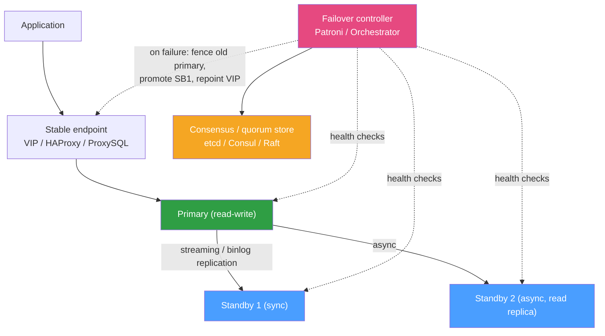

# 🔁 High Availability and Failover

> [!abstract] TL;DR
> **High availability (HA)** keeps a database serving even when a node dies, by running one **primary** plus one or more **standbys** kept current through [[Replication_Strategies|replication]] and promoting a standby when the primary fails. A **planned** promotion is a **switchover**; an **unplanned** one triggered by failure is a **failover**. The hard problem is not detecting failure — it is avoiding **split-brain**, where two nodes both think they are primary and accept conflicting writes. You prevent it with a **[[Consensus_and_Quorums|consensus/quorum]]** layer plus **fencing** (STONITH — "shoot the other node in the head"), and you hide the moving primary behind a stable endpoint (**virtual IP** or a proxy like **HAProxy / ProxySQL / PgBouncer**). In [[PostgreSQL|Postgres]] this is usually **Patroni + etcd/Consul** (or repmgr); in [[MySQL]], **Orchestrator** or native **Group Replication / InnoDB Cluster** (or legacy **MHA**). Your worst-case data loss on failover (**RPO**) is bounded by **replication lag** — which is why synchronous standbys exist.

## Intuition — analogy FIRST

Picture a call centre with one **lead operator** taking every customer order, and two **shadow operators** who copy down each order in real time.

- If the lead operator collapses, you cannot have two shadows both start answering the phone — customers would get contradictory promises. That is **split-brain**.
- So there is a **supervisor with a rulebook** (the consensus layer) who declares *exactly one* new lead, and physically **unplugs the old lead's headset** before promoting anyone (that unplugging is **fencing / STONITH**) so a briefly-fainted operator can't wake up and keep taking orders.
- Customers never dial an operator directly — they dial **one hotline number** (the virtual IP / proxy) that the supervisor re-routes to whoever is currently lead. The callers don't even notice the handover.
- If a shadow was **three orders behind** when the lead collapsed, those three orders are lost unless the lead waited for a shadow to confirm each one before promising the customer (**synchronous** replication). That backlog is your **RPO**.

HA is choreography: detect, agree, fence, promote, re-route — fast, and without ever having two leads at once.

---

## How It Works

### The building blocks



- **Primary / standby** — one node accepts writes; standbys replay its log ([[Write_Ahead_Logging|WAL]] shipping in Postgres, **binlog** relay in MySQL). Standbys can also serve read-only traffic (read replicas).
- **Failover controller** — health-checks nodes and orchestrates promotion (Patroni, repmgr, Orchestrator, Group Replication's built-in group membership).
- **Consensus / quorum store** — an odd number of nodes (etcd, Consul, or an internal Raft/Paxos group) that agree on *who is primary* so the decision is authoritative and survives network partitions.
- **Stable endpoint** — a **virtual IP** that migrates to the new primary, or a **proxy** (HAProxy, ProxySQL, PgBouncer) that routes writes to the current primary and can spread reads across standbys.

### Failover vs switchover

| | Switchover (planned) | Failover (unplanned) |
|---|---|---|
| Trigger | Maintenance, upgrade, rebalancing | Crash, hardware/network failure |
| Old primary | Cleanly demoted, in sync | Possibly dead, possibly *not* — must be fenced |
| Data loss risk | ~Zero (waits for sync) | Bounded by replication lag (RPO) |
| Automation | Often manual/scheduled | Should be automatic to hit RTO |

### Split-brain and fencing (STONITH)

**Split-brain** happens when a network partition isolates the primary but does not kill it: the controller promotes a standby, yet the old primary is still alive on the other side of the partition, still accepting writes. Now two primaries diverge — data corruption on reunion.

Defences, layered:

1. **Quorum** — a node may only *be* primary if it holds a lock in a majority-quorum store (etcd/Consul). A partitioned old primary loses its lease and must **demote itself**.
2. **Fencing / STONITH** — before promoting, forcibly isolate the old primary: power it off (IPMI), revoke its storage/network, or drop its VIP. "Shoot The Other Node In The Head."
3. **Witness / tie-breaker** — a third, lightweight vote prevents a 1-vs-1 deadlock and stops a minority side from self-promoting.

Without fencing, quorum alone can still let a laggy client keep writing to a zombie primary; fencing makes the old primary *provably* unable to serve.

### Replication lag defines your failover RPO

- **Asynchronous** standby — the primary acknowledges the client *before* the standby confirms. Fast writes, but on failover you lose whatever was in flight = **RPO > 0** (equal to the lag at the moment of death).
- **Synchronous** standby — the primary waits for at least one standby to persist each commit. **RPO ≈ 0**, at the cost of write latency and a hard dependency on the standby being reachable. Postgres `synchronous_commit` + `synchronous_standby_names`; MySQL semi-synchronous (`rpl_semi_sync`) or Group Replication's certified commits.

A common pattern: one **sync** standby in the same AZ for zero-RPO failover, plus **async** replicas elsewhere for read scaling and DR.

### The engine-specific stacks

- **PostgreSQL** — **Patroni** (agent on each node) + a DCS (**etcd**/Consul/ZooKeeper) holds the leader lock and drives promotion; **repmgr** is a lighter alternative; managed services (RDS/Aurora, Cloud SQL) hide it entirely. HAProxy/PgBouncer front the current leader.
- **MySQL** — **Orchestrator** discovers topology and automates failover; **Group Replication / InnoDB Cluster** provides native, Paxos-style multi-node consensus with automatic membership and a **MySQL Router** front end; **MHA** is the legacy toolkit. **ProxySQL** routes read/write splits and follows the current primary.

---

## Commands / Config Examples

```ini
# ============ PostgreSQL: Patroni (patroni.yml, per node) ============
scope: shop-cluster
namespace: /db/
name: node1
restapi:
  listen: 0.0.0.0:8008
etcd3:
  hosts: etcd1:2379,etcd2:2379,etcd3:2379   # quorum store = 3 nodes (odd)
bootstrap:
  dcs:
    ttl: 30
    loop_wait: 10
    synchronous_mode: true                  # zero-RPO: require a sync standby
postgresql:
  parameters:
    synchronous_commit: 'on'
    synchronous_standby_names: 'ANY 1 (*)'  # wait for 1 standby to confirm each commit
```

```sql
-- PostgreSQL: inspect replication health and lag on the primary
SELECT client_addr, state, sync_state,
       pg_wal_lsn_diff(sent_lsn, replay_lsn) AS replay_bytes_behind
FROM pg_stat_replication;

-- Manual controlled switchover / see cluster state with Patroni CLI:
-- $ patronictl -c patroni.yml list
-- $ patronictl -c patroni.yml switchover --leader node1 --candidate node2
```

```sql
-- ============ MySQL: Group Replication / InnoDB Cluster ============
-- my.cnf essentials
-- [mysqld]
-- server_id                        = 1
-- gtid_mode                        = ON
-- enforce_gtid_consistency         = ON
-- plugin_load_add                  = 'group_replication.so'
-- group_replication_single_primary_mode = ON     -- one writable primary

-- Check who is primary and member health (auto-managed by consensus)
SELECT MEMBER_HOST, MEMBER_ROLE, MEMBER_STATE
FROM performance_schema.replication_group_members;

-- Check replication lag on a classic async replica
SHOW REPLICA STATUS\G     -- watch Seconds_Behind_Source and SQL/IO thread state
```

```
# MySQL: ProxySQL routes writes to the current primary, reads to replicas.
# HAProxy alternative fronts Patroni's REST health check so only the leader is "up":
#   option httpchk GET /primary
#   server node1 node1:5432 check port 8008
#   server node2 node2:5432 check port 8008 backup
```

---

## Best Practices

- **Automate failover** to meet RTO — human-in-the-loop promotion at 3 AM is how minutes become hours. Reserve *manual* control for switchovers.
- **Always fence the old primary** (STONITH / VIP revocation / storage fencing) before promoting. Quorum decides *who*; fencing guarantees the loser *stops*.
- **Use an odd number of quorum/witness nodes** across failure domains so a partition always has a clear majority.
- **Keep one synchronous standby** if your RPO must be ~0, and monitor that it stays reachable — a lost sync standby can stall writes.
- **Front the cluster with a stable endpoint** (VIP/proxy) so applications never hardcode a node; the primary can move without redeploys.
- **Spread nodes across AZs/racks/power** — three nodes in one rack share a single failure domain.
- **Rehearse failover regularly** (game days) and **watch replication lag** ([[Database_Monitoring]]) as a first-class alert — lag is your live RPO.
- **HA is not backup** — replication faithfully copies a `DROP TABLE` to every standby. Keep independent [[Backup_and_Recovery|backups]].

## Common Pitfalls

1. **No fencing → split-brain.** The classic disaster: a partition-isolated old primary keeps taking writes, and reconciliation on reunion corrupts data. Quorum without fencing is not enough.
2. **Even-numbered quorum.** Two-node or four-node quorum stores deadlock (no majority) on a symmetric partition. Always use an odd count / add a witness.
3. **Confusing HA with disaster recovery.** Standbys replicate logical mistakes and corruption instantly. HA protects against *node* failure, not *data* loss — you still need PITR backups.
4. **Ignoring replication lag as RPO.** An async standby 30 s behind means a failover silently drops ~30 s of committed-looking writes. Alert on lag.
5. **Applications hardcoding the primary's IP.** After failover the app keeps hammering a dead node. Route through a VIP/proxy and use connection strings that support multiple hosts (`target_session_attrs=read-write`).
6. **Flapping / premature failover.** Aggressive health-check timeouts promote on a transient network blip, then flap back. Tune TTLs and require sustained failure.
7. **Standby that can't handle production write volume.** A promoted standby on weaker hardware or a cold cache melts under real load. Size standbys like primaries.

## Related Concepts

- [[_MOC_DB_Administration|↑ Section MOC]]
- [[Replication_Strategies]] — the data-copying substrate HA promotion depends on; sync vs async sets RPO
- [[Backup_and_Recovery]] — the *other* half of resilience; HA ≠ backup
- [[Failover]] — systems-level failover patterns (active-passive, active-active) (System Design vault)
- [[Connection_Pooling]] — poolers like PgBouncer/ProxySQL also serve as the moving-primary front end (System Design vault)
- [[Database_Monitoring]] — replication-lag and quorum-health alerting that makes failover safe
- [[Write_Ahead_Logging]] — the log stream standbys replay to stay current

## Review Questions

1. Define split-brain and explain why a quorum/consensus store alone (etcd/Consul) is *not* sufficient to prevent it. What does fencing (STONITH) add, and give two concrete fencing mechanisms.
2. Your primary fails while an async standby is 12 seconds behind. What is your data-loss exposure, how would a synchronous standby change it, and what does that trade-off cost you during normal operation?
3. Contrast a switchover with a failover across three axes: trigger, data-loss risk, and how the old primary is handled. Why should failover be automated but switchover often stay manual?

## Sources

- Patroni Documentation — https://patroni.readthedocs.io/
- MySQL Reference Manual — Group Replication & InnoDB Cluster — https://dev.mysql.com/doc/refman/8.0/en/group-replication.html
- Orchestrator (MySQL topology/failover) — https://github.com/openark/orchestrator
- "Designing Data-Intensive Applications" — Martin Kleppmann, Ch. 5 & 8 (replication, leader failover, split-brain)

#Database #Administration #Ops #HighAvailability #Failover #SplitBrain #STONITH #Patroni
