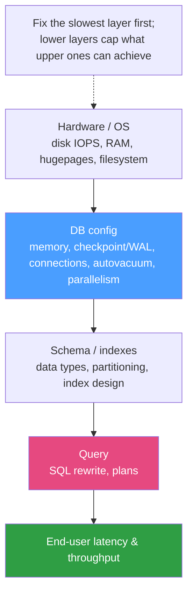

# ⚙️ Performance Tuning

> [!abstract] TL;DR
> **Server-level performance tuning** is making the database *engine and its host* fit the workload — distinct from [[Query_Tuning|query-level tuning]] (rewriting SQL and adding indexes). It works top-down through layers: **hardware/OS** (disk IOPS, RAM, hugepages, filesystem), **DB configuration** (memory, checkpoint/WAL/redo, connections & pooling, autovacuum, parallelism), then schema/index, then query. The biggest knob is **memory**: [[PostgreSQL|Postgres]] `shared_buffers` (buffer cache, ~25 % RAM) + `work_mem` (per-sort/hash) + `maintenance_work_mem`; [[MySQL]] `innodb_buffer_pool_size` (~50–75 % RAM). Size the cache to the **working set**; do connection **math** so `max_connections × work_mem` can't exhaust RAM, and put a **pooler** in front ([[Connection_Pooling]]). Tune **checkpoints/redo** to smooth I/O, keep **autovacuum** ahead of bloat (Postgres), and remember: **fix the slowest layer first** — a perfect config can't rescue a missing index, and a great index can't rescue a starved buffer pool.

## Intuition — analogy FIRST

Think of an engine running a delivery warehouse.

- The **loading docks and forklifts** are the hardware/OS — disk IOPS and RAM. No amount of clever scheduling helps if trucks can only load one box a minute.
- The **shelf space you keep near the door** is the buffer cache (`shared_buffers` / buffer pool). If your hottest inventory (the **working set**) fits on the near shelves, workers rarely walk to the far warehouse (disk). If it doesn't, every order becomes a long walk.
- The **number of workers on the floor** is connections. Adding more past a point just creates a traffic jam at the aisles — throughput *drops*. Better to have a **dispatch desk** (connection pooler) hand a small crew of workers a queue of jobs.
- The **nightly restocking crew** is autovacuum/checkpointing — do too little and the aisles clog with empty boxes (bloat); do it all at once and you block the day shift (I/O spikes).

Tuning is balancing these so the common order is served from the near shelves by a right-sized crew — and you always fix the *worst* bottleneck first, not the most fun one.



---

## How It Works

### Memory — the highest-leverage knob

| Setting | Postgres | MySQL / InnoDB | Purpose |
|---|---|---|---|
| Main data cache | `shared_buffers` (~25 % RAM) | `innodb_buffer_pool_size` (~50–75 % RAM) | Keep hot pages in RAM |
| Per-operation work memory | `work_mem` (per sort/hash node!) | `sort_buffer_size`, `join_buffer_size` (per session) | Avoid spilling sorts/hashes to disk |
| Maintenance ops | `maintenance_work_mem` | (buffer pool + `innodb_sort_buffer_size`) | Speed up VACUUM, index builds |

The size split differs by design: Postgres deliberately leaves most RAM to the **OS page cache** (so `shared_buffers` ~25 %), while InnoDB largely bypasses the OS cache and wants the [[Storage_Engine_Internals|buffer pool]] to hold the working set directly (~50–75 %). The goal in both is that the **working set** — the pages actually touched by live queries — lives in memory, giving a cache hit ratio > 99 % ([[Database_Monitoring]]).

### `work_mem` is per-operation, not per-connection

This is the classic footgun. Postgres `work_mem` is allocated **per sort/hash node, per query** — a single complex query with 5 sorts and 20 parallel workers can use many multiples of `work_mem`. Worst-case RAM ≈ `max_connections × avg_nodes × work_mem`. Set it modestly globally and raise it per-session for known heavy analytical queries.

### Connection math and pooling

Each connection costs memory (a backend process in Postgres, a thread in MySQL) and adds scheduling contention. Beyond roughly `cores × 2–4` *active* connections, throughput **plateaus then falls**. So:

- Keep `max_connections` bounded (e.g. 100–300), and
- Put a **connection pooler** in front — **PgBouncer** (Postgres), **ProxySQL** (MySQL), or an app-side pool — to multiplex thousands of client connections onto a small server-side set. See [[Connection_Pooling]].

### Checkpoints, WAL, and redo

Writes go to the [[Write_Ahead_Logging|WAL/redo log]] first, then dirty pages are flushed at **checkpoints**. Tuning trades recovery time against steady I/O:

- **Postgres** — `max_wal_size` / `checkpoint_timeout` set how often checkpoints occur; `checkpoint_completion_target` (~0.9) spreads the flush over the interval to avoid I/O spikes; `wal_compression`, `wal_buffers`.
- **MySQL/InnoDB** — `innodb_log_file_size` / `innodb_redo_log_capacity` (bigger = fewer, larger checkpoints, longer recovery), `innodb_flush_log_at_trx_commit` (1 = durable, 2/0 = faster but riskier), `innodb_io_capacity` to match your disk.

Larger logs/less frequent checkpoints = smoother throughput but longer crash recovery.

### Autovacuum (Postgres) and purge

[[MVCC_Internals|MVCC]] leaves **dead tuples** that bloat tables/indexes and slow scans. **Autovacuum** must keep pace: tune `autovacuum_vacuum_scale_factor` (lower for big hot tables), `autovacuum_max_workers`, and `autovacuum_vacuum_cost_limit` (raise so vacuum isn't throttled). Also guards against transaction-ID wraparound. InnoDB handles the equivalent via background **purge threads** on the undo log — usually self-managing, but `innodb_purge_threads` can be raised under heavy update load.

### Parallelism and hardware/OS

- **Parallel query** — Postgres `max_parallel_workers_per_gather`; MySQL has more limited parallelism. Helps big scans/aggregations, hurts high-concurrency OLTP (workers compete).
- **Hardware/OS** — provision **IOPS and low latency** (NVMe/SSD over spinning disk), enough RAM to hold the working set, **hugepages** (`huge_pages` / `large-pages`) to reduce TLB pressure for large buffers, and a filesystem tuned for the DB (noatime, appropriate readahead).

### Capacity planning

Size deliberately, don't guess: measure the **working-set size** and provision buffer cache to cover it; do the **connection math** (`peak_active_conns` and per-conn memory) so you never over-commit RAM; project growth in data volume, QPS, and IOPS. Then verify against the monitoring baseline.

---

## Commands / Config Examples

```sql
-- ============ PostgreSQL (postgresql.conf) ============
-- shared_buffers = 8GB                 # ~25% of a 32GB host
-- effective_cache_size = 24GB          # planner's estimate of OS cache + shared_buffers
-- work_mem = 32MB                      # PER sort/hash node — keep modest, raise per-session
-- maintenance_work_mem = 1GB           # faster VACUUM / index builds
-- max_connections = 200                # bounded; PgBouncer fans clients in
-- checkpoint_timeout = 15min
-- max_wal_size = 8GB
-- checkpoint_completion_target = 0.9   # spread checkpoint I/O
-- autovacuum_vacuum_cost_limit = 2000  # let autovacuum keep up on busy tables
-- max_parallel_workers_per_gather = 4

-- Raise work_mem only for a heavy analytical session, not globally:
SET work_mem = '512MB';
SELECT region, sum(total) FROM orders GROUP BY region;  -- big sort/hash
RESET work_mem;

-- Sanity checks
SHOW shared_buffers;
SELECT name, setting, unit FROM pg_settings WHERE name IN
  ('work_mem','max_connections','max_wal_size');
```

```sql
-- ============ MySQL / InnoDB (my.cnf) ============
-- [mysqld]
-- innodb_buffer_pool_size      = 24G          # ~75% of a 32GB dedicated host
-- innodb_buffer_pool_instances = 8            # reduce mutex contention on big pools
-- innodb_redo_log_capacity     = 4G           # 8.0.30+ (replaces innodb_log_file_size)
-- innodb_flush_log_at_trx_commit = 1          # full ACID durability
-- innodb_io_capacity           = 2000         # match SSD/NVMe throughput
-- innodb_flush_neighbors       = 0            # 0 for SSD (no rotational grouping)
-- max_connections              = 300          # bounded; ProxySQL multiplexes
-- large_pages                  = ON           # hugepages for the buffer pool

-- Is the buffer pool big enough? (want a very low miss rate)
SHOW ENGINE INNODB STATUS\G   -- BUFFER POOL: reads vs read requests, free buffers
SELECT VARIABLE_NAME, VARIABLE_VALUE FROM performance_schema.global_status
WHERE VARIABLE_NAME IN ('Innodb_buffer_pool_reads','Innodb_buffer_pool_read_requests');
```

---

## Best Practices

- **Fix the slowest layer first.** Profile before turning knobs; a missing index or a bad query dwarfs any `shared_buffers` tweak. Server tuning is for when the config, not the SQL, is the bottleneck.
- **Size the cache to the working set** — enough `shared_buffers` / buffer pool that hot pages stay resident (hit ratio > 99 %); more than that just steals RAM from `work_mem`/OS cache.
- **Do the connection math** and **use a pooler.** Keep `max_connections` bounded and let PgBouncer/ProxySQL multiplex; more connections past `~cores × 2–4` active reduces throughput.
- **Treat `work_mem` as per-operation** — set it low globally, raise per-session for known heavy queries, and verify worst-case total against RAM.
- **Smooth checkpoint/redo I/O** (`checkpoint_completion_target`, right-sized WAL/redo) to avoid periodic latency spikes; balance against recovery time.
- **Keep autovacuum ahead of bloat** on Postgres — under-tuned autovacuum silently degrades every scan and risks wraparound.
- **Provision real IOPS and RAM**; enable hugepages for large buffers; use SSD/NVMe and `innodb_flush_neighbors=0`.
- **Change one thing at a time and re-measure** against a monitoring baseline; cargo-culted configs from blog posts often hurt.

## Common Pitfalls

1. **Cranking `max_connections` to "fix" load.** More connections add contention and memory pressure; throughput plateaus then falls. Pool instead.
2. **Setting `work_mem` high globally.** It's per sort/hash *per query* — a spike of concurrent complex queries can OOM the host. Keep it modest; raise per-session.
3. **Tuning config to rescue a bad query.** No `shared_buffers` value fixes a missing index or an N+1 pattern — that's [[Query_Tuning|query tuning]], a different layer.
4. **Oversizing `shared_buffers` past ~25 %** (Postgres), starving the OS page cache and `work_mem` and lengthening checkpoints/recovery. Bigger isn't better.
5. **Ignoring autovacuum** until bloat and dead tuples have already tanked scan performance and index size.
6. **Copying my.cnf/postgresql.conf from a blog** without matching it to your RAM, disk, and workload — defaults exist for portability, not your box.
7. **`innodb_flush_log_at_trx_commit = 2/0` in production for speed** — you trade away durability and can lose committed transactions on crash. Understand the risk before relaxing it.

## Related Concepts

- [[_MOC_DB_Administration|↑ Section MOC]]
- [[Query_Tuning]] — the query/index layer; performance tuning here is the *server/config* layer above it
- [[Connection_Pooling]] — bounding and multiplexing connections, essential to server tuning (System Design vault)
- [[Database_Monitoring]] — the hit-ratio, IOPS, and lock metrics that tell you which layer to tune
- [[Write_Ahead_Logging]] — the WAL/redo path that checkpoint and durability settings govern
- [[Schema_Migrations]] — index/partitioning changes applied as migrations feed performance

## Review Questions

1. Explain why raising `work_mem` globally is dangerous in Postgres. How does the per-operation nature interact with concurrency and parallel workers to threaten host memory, and what's the safer pattern?
2. Postgres recommends `shared_buffers` ~25 % of RAM while InnoDB wants `innodb_buffer_pool_size` ~50–75 %. Why the difference, and what is the buffer cache trying to hold in both cases?
3. A team facing high load doubles `max_connections` and sees throughput *drop*. Explain the mechanism, and describe the correct fix using connection math and pooling.

## Sources

- PostgreSQL Documentation — Server Configuration (Resource Consumption, WAL, Autovacuum) — https://www.postgresql.org/docs/current/runtime-config-resource.html
- MySQL Reference Manual — Optimizing InnoDB (Buffer Pool, Redo Log, I/O) — https://dev.mysql.com/doc/refman/8.0/en/optimizing-innodb.html
- "PostgreSQL 14 Internals" — Egor Rogov (buffer cache, checkpoints, autovacuum)
- "High Performance MySQL" — Schwartz, Zaitsev, Tkachenko (server & InnoDB tuning)

#Database #Administration #Ops #PerformanceTuning #BufferPool #Autovacuum #Checkpoints #CapacityPlanning
