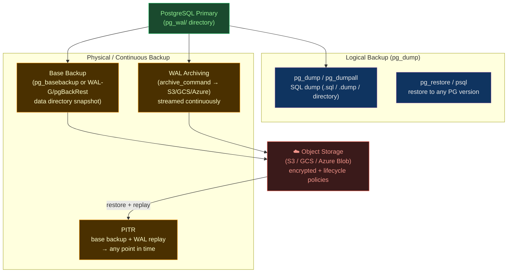

# 💾 PostgreSQL Backup Tools

> [!abstract] TL;DR
> PostgreSQL has two fundamentally different backup approaches: **logical backups** (`pg_dump`) capture a consistent SQL snapshot of schema + data — fast and portable, but no point-in-time recovery; and **physical/continuous backups** (`pg_basebackup` + WAL archiving) capture raw data files + a stream of WAL segments, enabling **PITR** (Point-in-Time Recovery) to any second. **WAL-G** (Go, cloud-native, fast compression) and **pgBackRest** (C, parallel, enterprise-grade) are the two dominant tools for continuous archiving. WAL shipping copies WAL to replicas for replication; WAL archiving copies to object storage (S3/GCS) for backup. A backup strategy without periodic **restore testing** is not a backup strategy.

## Intuition — what it is & who uses it

If your Postgres database is a **river of water flowing through time**, `pg_dump` is a **photograph of the river at one moment** — useful, easy to take, but you can't go back to any moment you didn't photograph. Continuous archiving is like recording every ripple in the river with a video camera: you can rewind to any second and resume from exactly there.

`pg_dump` is what most developers use day-to-day. WAL-G and pgBackRest are what **production DBAs and SREs** use to protect against data loss — combined with Patroni HA for redundancy, they form the full PostgreSQL resilience stack.

## Architecture



## Logical Backups — pg_dump

```bash
# Dump a single database (custom format — most flexible)
pg_dump \
  --host=localhost \
  --username=postgres \
  --dbname=mydb \
  --format=custom \          # -Fc — supports parallel restore
  --file=mydb_$(date +%Y%m%d).dump \
  --verbose

# Dump all databases + global objects (roles, tablespaces)
pg_dumpall \
  --host=localhost \
  --username=postgres \
  --file=full_cluster_$(date +%Y%m%d).sql

# Parallel dump (directory format, uses multiple connections)
pg_dump -Fd mydb \
  --jobs=4 \                 # 4 parallel worker processes
  --file=/backups/mydb_dir/

# Restore from custom format (parallel)
pg_restore \
  --host=localhost \
  --username=postgres \
  --dbname=mydb_restored \
  --jobs=4 \                 # parallel restore
  --verbose \
  mydb_$(date +%Y%m%d).dump

# Restore only a specific table
pg_restore --table=orders mydb.dump | psql mydb_restored

# Dump schema only (no data) — for DDL comparison
pg_dump --schema-only mydb > schema.sql

# Dump data only (no DDL)
pg_dump --data-only mydb > data.sql
```

**pg_dump limitations**: captures a point-in-time snapshot; no granular PITR; restoring large databases takes hours; no incremental backup.

## WAL — Write-Ahead Log and Archiving

```bash
# postgresql.conf — enable WAL archiving
wal_level = replica              # minimum for archiving (also enables replication)
archive_mode = on                # enable archiving
archive_command = 'test ! -f /mnt/wal_archive/%f && cp %p /mnt/wal_archive/%f'
# %p = path to WAL file, %f = filename

# With WAL-G (archive directly to S3)
archive_command = 'wal-g wal-push %p'
restore_command = 'wal-g wal-fetch %f %p'  # used during PITR

# Check archiving status
SELECT * FROM pg_stat_archiver;
# last_archived_wal, last_failed_wal, archived_count, failed_count
```

## WAL-G — Cloud-Native Backup Tool

```bash
# Install WAL-G
curl -L https://github.com/wal-g/wal-g/releases/latest/download/wal-g-pg-ubuntu-22.04-amd64.tar.gz \
  | tar -xz && mv wal-g /usr/local/bin/

# Environment configuration (S3)
export WALG_S3_PREFIX=s3://my-pg-backups/production
export AWS_REGION=us-east-1
export WALG_COMPRESSION_METHOD=brotli    # brotli, lz4, zstd, none
export WALG_DELTA_MAX_STEPS=6           # incremental backup: up to 6 deltas before full
export PGPASSWORD=$DB_PASSWORD

# Take a full base backup
wal-g backup-push /var/lib/postgresql/data

# List backups
wal-g backup-list DETAIL
# name                    last_modified           wal_segment_backup_start  start_lsn    finish_lsn
# base_00000001000001F80   2026-07-30T10:00:00Z   000000010000001F80000023  1/F80000A0   1/F9000000

# Archive a WAL file (called from archive_command)
wal-g wal-push /var/lib/postgresql/data/pg_wal/000000010000001F80000023

# PITR — restore to a specific time
wal-g backup-fetch /var/lib/postgresql/data LATEST
# or: wal-g backup-fetch /var/lib/postgresql/data base_00000001000001F80

# Create recovery.conf (PG < 12) or postgresql.conf (PG >= 12)
cat > /var/lib/postgresql/data/postgresql.conf << EOF
restore_command = 'wal-g wal-fetch %f %p'
recovery_target_time = '2026-07-30 09:30:00 UTC'   # recover to this exact second
recovery_target_action = 'promote'                  # promote after reaching target
EOF

# Create recovery signal file (PG >= 12)
touch /var/lib/postgresql/data/recovery.signal

# Start Postgres — it will replay WAL until the target time
pg_ctlcluster 14 main start
```

## pgBackRest — Enterprise-Grade Backup

```bash
# /etc/pgbackrest/pgbackrest.conf
[global]
repo1-path=/var/lib/pgbackrest
repo1-type=s3
repo1-s3-bucket=my-pg-backups
repo1-s3-region=us-east-1
repo1-s3-endpoint=s3.amazonaws.com
repo1-cipher-type=aes-256-cbc         # encrypt backup at rest
repo1-cipher-pass=SuperSecretKey

# Retention policy
repo1-retention-full=2                # keep 2 full backups
repo1-retention-diff=4                # keep 4 differential backups

process-max=4                         # parallel processes for backup/restore
log-level-console=info
log-level-file=detail

[prod-db]
pg1-path=/var/lib/postgresql/14/main
pg1-port=5432
pg1-user=postgres
```

```bash
# Initialize repository
pgbackrest --stanza=prod-db stanza-create

# Configure archive_command in postgresql.conf
# archive_command = 'pgbackrest --stanza=prod-db archive-push %p'
# restore_command = 'pgbackrest --stanza=prod-db archive-get %f %p'

# Full backup
pgbackrest --stanza=prod-db --type=full backup

# Incremental backup (only changed blocks since last backup)
pgbackrest --stanza=prod-db --type=incr backup

# Differential backup (changed blocks since last full)
pgbackrest --stanza=prod-db --type=diff backup

# List backups
pgbackrest --stanza=prod-db info

# Restore PITR to a specific time
pgbackrest --stanza=prod-db restore \
  --target='2026-07-30 09:30:00' \
  --target-action=promote \
  --delta                         # delta restore: only replace changed files (fast)

# Verify backup integrity (without restoring)
pgbackrest --stanza=prod-db check
```

## Backup Verification — The Most Skipped Step

```bash
# Spin up a test Postgres instance and restore (automated weekly)
#!/bin/bash
# verify-restore.sh

# 1. Restore latest backup to a test volume
RESTORE_DIR=$(mktemp -d)
wal-g backup-fetch "$RESTORE_DIR" LATEST

# 2. Recover WAL (point-in-time: yesterday)
TARGET_TIME=$(date -d "yesterday" +"%Y-%m-%d %H:%M:%S")
cat > "$RESTORE_DIR/postgresql.conf.append" << EOF
restore_command = 'wal-g wal-fetch %f %p'
recovery_target_time = '$TARGET_TIME'
recovery_target_action = 'promote'
EOF
touch "$RESTORE_DIR/recovery.signal"

# 3. Start Postgres on non-conflicting port
pg_ctl -D "$RESTORE_DIR" -o "-p 5433" start

# 4. Verify data integrity
psql -h localhost -p 5433 -c "SELECT count(*) FROM orders WHERE created_at < NOW() - INTERVAL '1 day'"

# 5. Compare row counts with production
PROD_COUNT=$(psql -h production-db -c "SELECT count(*) FROM orders" -t)
TEST_COUNT=$(psql -h localhost -p 5433 -c "SELECT count(*) FROM orders" -t)

if [ "$PROD_COUNT" -ne "$TEST_COUNT" ]; then
  echo "BACKUP VERIFICATION FAILED: row count mismatch" | notify-slack
  exit 1
fi

# 6. Cleanup
pg_ctl -D "$RESTORE_DIR" stop
rm -rf "$RESTORE_DIR"
echo "Backup verification passed. RTO measured: $SECONDS seconds"
```

## Comparison: WAL-G vs pgBackRest vs pg_dump

| Feature | WAL-G | pgBackRest | pg_dump |
|---------|-------|------------|---------|
| **Backup type** | Full + WAL archiving | Full + Incr + Diff + WAL | Logical snapshot |
| **PITR support** | Yes | Yes | No |
| **Incremental** | Delta (block-level) | Yes (block-level) | No |
| **Parallel** | Yes | Yes (configurable) | Yes (-j flag) |
| **Compression** | brotli/lz4/zstd | lz4/bz2/zstd | gzip/custom |
| **Encryption** | AES-256 | AES-256 | Via OS/GPG |
| **Cloud support** | S3/GCS/Azure/Swift | S3/GCS/Azure/SFTP | Manual |
| **Restore speed** | Fast (delta possible) | Fast (delta restore) | Slow (full replay) |
| **Complexity** | Low-medium | Medium-high | Very low |

## Common Pitfalls

1. **Never testing restores** — the only backup that matters is one you've tested successfully. Schedule automated restore verification weekly.
2. **`archive_status` filling up** — if `archive_command` fails silently (e.g., S3 permissions lapse), `pg_wal/archive_status/` fills with `.ready` files, and disk fills up; alert on `pg_stat_archiver.failed_count` increasing.
3. **Not backing up `pg_hba.conf` and config files** — `pg_dump` and WAL-G only backup data; keep config files in a separate Git repo or include in backup scripts.
4. **RTO blindness** — knowing your RPO (how much data you can lose) without knowing your RTO (how long restore takes) is half the picture; measure actual restore time from your largest backup.
5. **Single-region backup storage** — if your S3 backup bucket is in the same region as your database and that region goes down, you've lost both; replicate backups cross-region.

## Related Concepts

- [[_MOC_DB_Administration|↑ Section MOC]]
- [[Backup_and_Recovery]] — general DB backup concepts; this note is PostgreSQL-specific tools
- [[Write_Ahead_Logging]] — WAL is the foundation that makes continuous archiving possible
- [[PostgreSQL_HA_and_Patroni]] — HA complements backup; HA protects uptime, backup protects data
- [[PostgreSQL]] — the PostgreSQL engine overview
- [[PostgreSQL_Maintenance]] — VACUUM/bloat impacts backup size and speed

## Review Questions

1. Explain the difference between WAL shipping (used in streaming replication) and WAL archiving (used in backup). Can you use both simultaneously?
2. A production database suffers data corruption at 14:37. Your last `pg_dump` was at 02:00. You also have WAL-G continuous archiving running. What is your RPO in each scenario? Which do you use?
3. Your pgBackRest `backup-check` command fails with "archive_command not configured". What does this mean for your PITR capability, and what is the precise risk?

## Sources

- github.com/wal-g/wal-g
- pgbackrest.org
- postgresql.org/docs/current/continuous-archiving.html
- postgresql.org/docs/current/app-pgdump.html

#Database #PostgreSQL #Backup #Recovery #WAL-G #pgBackRest #PITR #WALArchiving #Administration
