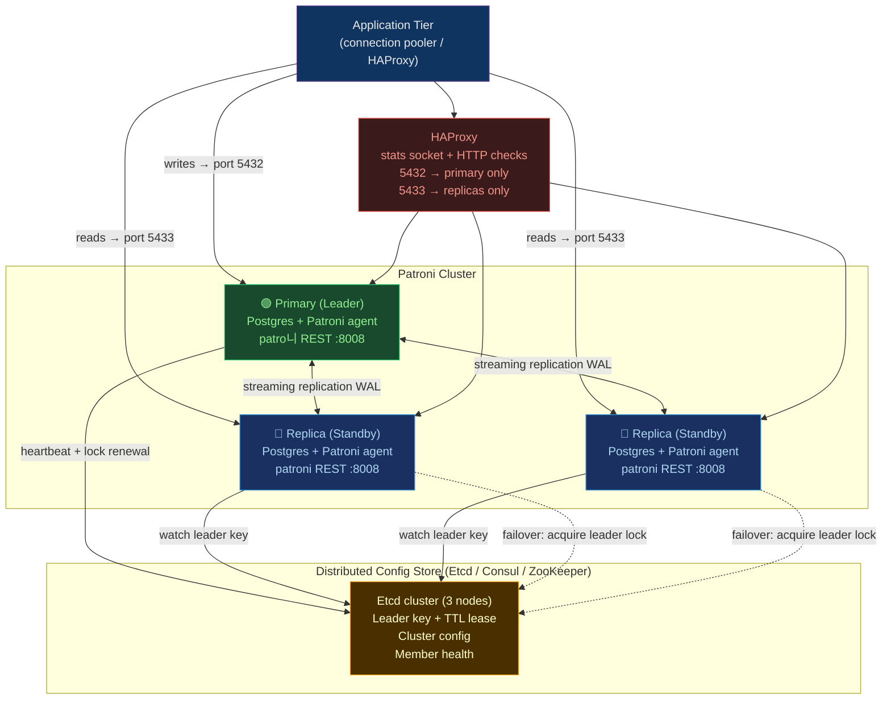

# 🏛️ PostgreSQL HA and Patroni

> [!abstract] TL;DR
> **Patroni** is the de-facto open-source HA solution for PostgreSQL — it wraps Postgres streaming replication with a **Distributed Configuration Store (DCS)** (Etcd, Consul, or ZooKeeper) to provide automatic **leader election**, failover, and a REST API to inspect/control cluster state. The DCS provides consensus so only one primary ever exists. **HAProxy** sits in front of the cluster to route writes to the current primary (via Patroni's health endpoint) and reads to replicas. The key operations are: **switchover** (controlled, planned, zero data loss) vs **failover** (automatic, unplanned, potential data loss). **pg_auto_failover** is a lighter-weight alternative requiring no external DCS.

## Intuition — what it is & who uses it

If Postgres streaming replication is a **train with multiple carriages** (primary + replicas) on parallel tracks, Patroni is the **train dispatcher + signal box**: it watches all carriages continuously, knows which one is the locomotive (primary), and instantly throws the signal when the locomotive stalls — promoting a carriage to a new locomotive, all without the passengers (applications) needing to know the route changed. The signal box consensus (Etcd/Consul) ensures two dispatchers never simultaneously appoint two locomotives — preventing "split-brain."

Without Patroni, streaming replication gives you redundancy but no automatic failover — a human must manually promote a replica during an outage. Patroni automates the entire state machine.

## Architecture



## Patroni Configuration

```yaml
# /etc/patroni/patroni.yml — installed on each Postgres node
scope: postgres-cluster       # cluster name (shared across all nodes)
namespace: /service/          # DCS key prefix
name: pg-node-1               # unique name for this node

restapi:
  listen: 0.0.0.0:8008        # Patroni REST API (HAProxy health checks here)
  connect_address: 10.0.1.10:8008

etcd3:                         # DCS: etcd v3
  hosts:
    - 10.0.0.1:2379
    - 10.0.0.2:2379
    - 10.0.0.3:2379

bootstrap:
  dcs:
    ttl: 30                    # leader lock TTL (seconds); failover triggers if primary misses renewal
    loop_wait: 10              # how often Patroni checks state
    retry_timeout: 10
    maximum_lag_on_failover: 1048576   # 1 MB: only promote replicas within this lag
    postgresql:
      use_pg_rewind: true      # use pg_rewind to resync old primary after failover
      parameters:
        max_connections: 200
        wal_level: replica
        hot_standby: "on"
        max_wal_senders: 5
        max_replication_slots: 5
        wal_log_hints: "on"    # required for pg_rewind

  initdb:
    - encoding: UTF8
    - data-checksums

postgresql:
  listen: 0.0.0.0:5432
  connect_address: 10.0.1.10:5432
  data_dir: /var/lib/postgresql/14/main
  bin_dir: /usr/lib/postgresql/14/bin
  pgpass: /tmp/pgpass0
  authentication:
    replication:
      username: replicator
      password: secret
    superuser:
      username: postgres
      password: supersecret

tags:
  nofailover: false            # set to true to exclude this node from leader election
  noloadbalance: false
  clonefrom: false
  nosync: false
```

### HAProxy Configuration for Patroni

```ini
# /etc/haproxy/haproxy.cfg
global
    log /dev/log local0
    maxconn 4096

defaults
    log     global
    mode    tcp
    retries 2
    timeout client  30m
    timeout connect 4s
    timeout server  30m
    timeout check   5s

# Primary port — only routes to the current leader
frontend postgres-write
    bind *:5432
    default_backend postgres-primary

backend postgres-primary
    option httpchk GET /primary        # Patroni REST: returns 200 for primary, 503 for replica
    http-check expect status 200
    default-server inter 3s fall 3 rise 2 on-marked-down shutdown-sessions
    server pg-node-1 10.0.1.10:5432 maxconn 100 check port 8008
    server pg-node-2 10.0.1.11:5432 maxconn 100 check port 8008
    server pg-node-3 10.0.1.12:5432 maxconn 100 check port 8008

# Replica port — routes to any replica (load-balanced reads)
frontend postgres-read
    bind *:5433
    default_backend postgres-replicas

backend postgres-replicas
    option httpchk GET /replica        # Patroni REST: returns 200 for replica, 503 for primary
    http-check expect status 200
    balance roundrobin
    default-server inter 3s fall 3 rise 2 on-marked-down shutdown-sessions
    server pg-node-1 10.0.1.10:5432 maxconn 100 check port 8008
    server pg-node-2 10.0.1.11:5432 maxconn 100 check port 8008
    server pg-node-3 10.0.1.12:5432 maxconn 100 check port 8008
```

### Switchover vs Failover

```bash
# ---- SWITCHOVER (planned, graceful) ----
# Demotes the current primary, promotes the best replica
# Zero data loss guaranteed (waits for replica to be fully caught up)
patronictl -c /etc/patroni/patroni.yml switchover postgres-cluster \
  --master pg-node-1 \
  --candidate pg-node-2 \
  --scheduled now \
  --force

# ---- FAILOVER (emergency, unplanned) ----
# Forces promotion even if replica has lag (potential data loss)
patronictl -c /etc/patroni/patroni.yml failover postgres-cluster \
  --master pg-node-1 \
  --candidate pg-node-2 \
  --force

# Inspect cluster state
patronictl -c /etc/patroni/patroni.yml list
# + Cluster: postgres-cluster ----+----+-----------+
# | Member    | Host             | Role    | State   | TL | Lag in MB |
# +-----------+------------------+---------+---------+----+-----------+
# | pg-node-1 | 10.0.1.10:5432  | Leader  | running |  1 |           |
# | pg-node-2 | 10.0.1.11:5432  | Replica | running |  1 |         0 |
# | pg-node-3 | 10.0.1.12:5432  | Replica | running |  1 |         0 |
```

### Patroni REST API

```bash
# Health endpoints (polled by HAProxy)
curl http://10.0.1.10:8008/primary    # 200 if leader, 503 if not
curl http://10.0.1.10:8008/replica    # 200 if replica, 503 if not
curl http://10.0.1.10:8008/health     # 200 for any healthy member

# Cluster info
curl http://10.0.1.10:8008/cluster | python3 -m json.tool

# Pause/resume automatic failover (maintenance mode)
curl -X PATCH http://10.0.1.10:8008/config \
  -H "Content-Type: application/json" \
  -d '{"pause": true}'

curl -X PATCH http://10.0.1.10:8008/config \
  -d '{"pause": false}'

# Reinitialize a replica (after major breakage)
patronictl -c /etc/patroni/patroni.yml reinit postgres-cluster pg-node-3
```

### pg_auto_failover — Lightweight Alternative

```bash
# pg_auto_failover: simpler, no external DCS required
# Monitor node (single point of coordination)
pg_autoctl create monitor \
  --pgdata /var/lib/postgresql/monitor \
  --hostname monitor.example.com

# Primary node
pg_autoctl create postgres \
  --pgdata /var/lib/postgresql/primary \
  --hostname pg-primary.example.com \
  --monitor postgres://autoctl_node@monitor.example.com/pg_auto_failover

# Replica node
pg_autoctl create postgres \
  --pgdata /var/lib/postgresql/replica \
  --hostname pg-replica.example.com \
  --monitor postgres://autoctl_node@monitor.example.com/pg_auto_failover

# Show state
pg_autoctl show state --pgdata /var/lib/postgresql/primary
```

## Strengths / Weaknesses

| Aspect | Patroni | pg_auto_failover |
|--------|---------|-----------------|
| **External DCS required** | Yes (Etcd/Consul/ZK) | No (monitor node) |
| **Cluster size** | 2+ nodes | 2 nodes (primary + 1 replica) |
| **Split-brain protection** | Strong (DCS quorum) | Moderate (monitor node SPOF) |
| **Operational complexity** | High (DCS + Patroni) | Low |
| **HAProxy integration** | First-class (REST endpoints) | Third-party |
| **Production use** | Zalando, GitLab, many banks | Smaller deployments |

## Common Pitfalls

1. **`maximum_lag_on_failover` too high** — a replica with 100 MB of lag gets promoted; those 100 MB of transactions are lost. Set to 0 for zero-RPO (but means failover may not happen if all replicas are lagging).
2. **DCS not HA itself** — a single-node Etcd is a SPOF; run Etcd in a 3-node (or 5-node) cluster on separate machines from Postgres.
3. **Forgetting `pg_rewind` prerequisites** — `wal_log_hints = on` and checksums must be enabled at `initdb` time; enabling them later requires a full base backup.
4. **Pausing Patroni and forgetting to resume** — if you pause automation for maintenance and forget to resume, the cluster won't failover during a real outage.
5. **Connection pooler not updated** — PgBouncer / pgpool-II must also be Patroni-aware (query the `/primary` endpoint); otherwise, it continues routing to the demoted primary.

## Related Concepts

- [[_MOC_DB_Administration|↑ Section MOC]]
- [[High_Availability_and_Failover]] — broader HA concepts; Patroni is PostgreSQL's primary HA implementation
- [[Replication_Strategies]] — streaming replication is the transport layer Patroni manages
- [[PostgreSQL]] — the database engine Patroni wraps
- [[PostgreSQL_Backup_Tools]] — PITR backup strategy complements HA
- [[PostgreSQL_Maintenance]] — VACUUM and maintenance windows interact with replication lag

## Review Questions

1. Explain the role of Etcd in a Patroni cluster. What happens if the Etcd cluster loses quorum while Postgres is healthy?
2. A replica has 5 MB of replication lag when the primary crashes. `maximum_lag_on_failover` is set to `1048576` (1 MB). Will Patroni promote this replica? What data risk exists?
3. Compare switchover and failover in Patroni. When would you choose each, and what is the RPO (Recovery Point Objective) for each?

## Sources

- patroni.readthedocs.io
- github.com/patroni/patroni
- pg-auto-failover.readthedocs.io
- haproxy.org — TCP health check configuration
- Zalando Engineering Blog — Patroni in production

#Database #PostgreSQL #HighAvailability #Patroni #Etcd #HAProxy #Failover #Administration #Replication
