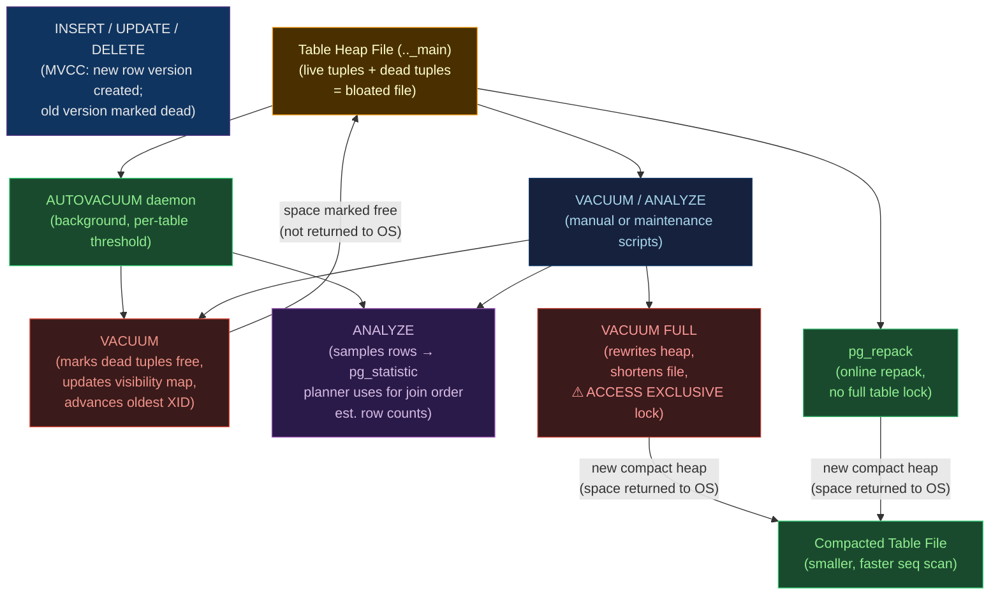

# 🔧 PostgreSQL Maintenance

> [!abstract] TL;DR
> PostgreSQL's MVCC model means **deleted and updated rows are not immediately removed** — they become "dead tuples" that bloat tables. **VACUUM** reclaims dead tuple space (making it reusable); **VACUUM FULL** physically compacts tables (rewrites the heap); **ANALYZE** updates planner statistics. **AUTOVACUUM** runs both automatically but must be tuned for write-heavy workloads — default settings under-vacuum busy tables. Bloat detection uses `pg_stat_user_tables` and `pgstattuple`; remediation options range from `VACUUM FULL` (table lock) to `pg_repack` (online repack, no long lock). **REINDEX** rebuilds index corruption or bloat — use `REINDEX CONCURRENTLY` for zero-downtime.

## Intuition — what it is & who uses it

Imagine every UPDATE in PostgreSQL is implemented as two operations: **insert a new version of the row** and **mark the old version as deleted** — this is MVCC (Multi-Version Concurrency Control). Over time, the table file fills with dead versions (like a whiteboard with old notes that were crossed out but never erased). **VACUUM** is the eraser: it marks crossed-out space as "free" without shrinking the whiteboard. **VACUUM FULL** replaces the whiteboard entirely with a clean one that's half the size — but you can't write on the whiteboard while the replacement is happening.

## Architecture



## VACUUM — Reclaiming Dead Tuples

```sql
-- Basic VACUUM (doesn't compact file, no lock)
VACUUM orders;

-- VACUUM ANALYZE — vacuum then update statistics in one pass
VACUUM ANALYZE orders;

-- VACUUM VERBOSE — see what it's doing
VACUUM VERBOSE orders;
-- INFO:  vacuuming "public.orders"
-- INFO:  scanned index "orders_pkey" to remove 12500 row versions
-- INFO:  "orders": removed 12500 row versions in 1563 pages
-- INFO:  "orders": found 12500 removable, 287312 nonremovable row versions

-- VACUUM FULL — rewrite (requires ACCESS EXCLUSIVE lock — table is locked!)
-- Use only in maintenance windows for heavily bloated tables
VACUUM FULL orders;

-- Check if VACUUM FULL is needed: table size vs. live rows
SELECT
    schemaname,
    relname,
    n_live_tup,
    n_dead_tup,
    round(n_dead_tup::numeric / NULLIF(n_live_tup + n_dead_tup, 0) * 100, 2) AS dead_pct,
    pg_size_pretty(pg_total_relation_size(schemaname||'.'||relname)) AS total_size,
    last_vacuum,
    last_autovacuum
FROM pg_stat_user_tables
WHERE n_live_tup + n_dead_tup > 1000    -- skip tiny tables
ORDER BY dead_pct DESC NULLS LAST;

-- Monitor active VACUUM progress (PG 9.6+)
SELECT
    phase,
    heap_blks_total,
    heap_blks_scanned,
    round(heap_blks_scanned::numeric / NULLIF(heap_blks_total, 0) * 100, 1) AS pct_done,
    index_vacuum_count
FROM pg_stat_progress_vacuum
WHERE relid = 'orders'::regclass;
```

## AUTOVACUUM Tuning

```sql
-- Default autovacuum triggers vacuum when:
-- dead_tuples > autovacuum_vacuum_threshold + autovacuum_vacuum_scale_factor * n_live_tup
-- Default: 50 + 0.2 * n_live_tup   →  for 10M row table: 50 + 2,000,000 dead tuples before vacuum!

-- Check current autovacuum settings
SHOW autovacuum_vacuum_scale_factor;    -- default: 0.2 (20%)
SHOW autovacuum_vacuum_threshold;       -- default: 50 rows
SHOW autovacuum_analyze_scale_factor;   -- default: 0.1 (10%)

-- Per-table override (for high-write tables)
ALTER TABLE orders SET (
    autovacuum_vacuum_scale_factor = 0.01,   -- vacuum after 1% dead rows
    autovacuum_vacuum_threshold = 100,        -- baseline: 100 dead rows
    autovacuum_analyze_scale_factor = 0.005  -- analyze after 0.5% changes
);

-- postgresql.conf — global defaults (for write-heavy workloads)
autovacuum_vacuum_scale_factor = 0.05    -- 5% (more aggressive than default 20%)
autovacuum_vacuum_threshold = 50
autovacuum_max_workers = 6               -- default: 3; increase for many tables
autovacuum_vacuum_cost_delay = 2ms       -- default: 2ms; lower = more aggressive
autovacuum_vacuum_cost_limit = 400       -- default: 200; higher = more work per round

-- Disable autovacuum for a specific table (use with extreme care)
ALTER TABLE log_archive SET (autovacuum_enabled = false);
-- Only do this if you manually vacuum via cron (partition-based log tables)
```

## Bloat Detection

```sql
-- Method 1: pg_stat_user_tables (approximate, always available)
SELECT
    relname AS table,
    pg_size_pretty(pg_total_relation_size(schemaname||'.'||relname)) AS total_size,
    pg_size_pretty(pg_relation_size(schemaname||'.'||relname)) AS table_size,
    n_live_tup,
    n_dead_tup,
    round(n_dead_tup::numeric / NULLIF(n_live_tup + n_dead_tup, 0) * 100, 2) AS dead_pct,
    last_vacuum,
    last_autovacuum,
    last_analyze
FROM pg_stat_user_tables
ORDER BY pg_total_relation_size(schemaname||'.'||relname) DESC;

-- Method 2: pgstattuple (precise, samples disk pages — use on replicas)
CREATE EXTENSION IF NOT EXISTS pgstattuple;

SELECT * FROM pgstattuple('orders');
-- table_len: 1073741824    (1GB physical file)
-- live_len:  644245504     (600MB of live data)
-- dead_len:  429496320     (400MB dead tuples = 40% bloat!)
-- free_space: 0

-- Method 3: index bloat (B-tree index bloat estimate)
SELECT
    indexrelname AS index,
    pg_size_pretty(pg_relation_size(indexrelid)) AS index_size,
    idx_blks_read,
    idx_blks_hit
FROM pg_statio_user_indexes
ORDER BY pg_relation_size(indexrelid) DESC;

-- Popular bloat estimation query (no extension needed)
WITH bloat_estimate AS (
    SELECT
        schemaname, tablename,
        pg_total_relation_size(schemaname||'.'||tablename) AS total_bytes,
        (SELECT sum(bytes) FROM
            (SELECT 24 + 4 * COUNT(*) AS bytes
             FROM pg_attribute
             WHERE attrelid = (schemaname||'.'||tablename)::regclass
               AND attnum > 0 AND NOT attisdropped) t
        ) AS row_fixed_overhead
    FROM pg_tables
    WHERE schemaname NOT IN ('pg_catalog', 'information_schema')
)
SELECT schemaname, tablename,
    pg_size_pretty(total_bytes) AS total_size
FROM bloat_estimate
ORDER BY total_bytes DESC
LIMIT 20;
```

## Bloat Remediation Options

```sql
-- OPTION 1: VACUUM FULL — compact table (ACCESS EXCLUSIVE lock, offline operation)
-- Schedule during maintenance window; table fully locked for duration
VACUUM FULL orders;
-- Fast but: no concurrent reads/writes, double disk space needed temporarily

-- OPTION 2: pg_repack — online repack (no full table lock, minimal downtime)
-- Install: apt install postgresql-14-repack
-- Works by: creates new table, copies data in background, swaps at end
pg_repack --host=localhost --dbname=mydb --table=orders
pg_repack -h localhost -d mydb -t orders --jobs=4 --elevel=WARNING

-- OPTION 3: Partition + archive old data
-- Instead of bloating one table, partition by time range
CREATE TABLE orders_2024 PARTITION OF orders
    FOR VALUES FROM ('2024-01-01') TO ('2025-01-01');
-- Detach and archive old partition:
ALTER TABLE orders DETACH PARTITION orders_2023;
-- Now VACUUM only affects active partitions

-- OPTION 4: CLUSTER — rewrite table in index order (briefly locks, like VACUUM FULL)
CLUSTER orders USING orders_created_at_idx;
-- Bonus: improves sequential scan performance for time-based queries
```

## ANALYZE and Planner Statistics

```sql
-- Update statistics for the planner
ANALYZE orders;                 -- one table
ANALYZE;                        -- entire database

-- View current statistics
SELECT
    attname AS column,
    n_distinct,
    correlation,                 -- -1 to 1: how physically ordered the column is
    most_common_vals,
    most_common_freqs
FROM pg_stats
WHERE tablename = 'orders'
  AND attname = 'status';

-- Increase statistics target for columns with many distinct values
-- (default: 100 samples per column — may be too low for status with 50 values)
ALTER TABLE orders ALTER COLUMN customer_id SET STATISTICS 500;
ANALYZE orders;

-- When planner makes a bad plan, check if stale statistics are the cause
EXPLAIN (ANALYZE, BUFFERS, FORMAT TEXT)
SELECT * FROM orders WHERE status = 'pending' AND created_at > NOW() - INTERVAL '7 days';
-- Look at: "rows=X (actual rows=Y)" — large discrepancy → stale statistics
```

## REINDEX — Rebuild Indexes

```sql
-- Rebuild a single index (locks the index until complete)
REINDEX INDEX orders_customer_id_idx;

-- Rebuild all indexes on a table
REINDEX TABLE orders;

-- REINDEX CONCURRENTLY — no long lock (PG 12+)
-- Creates a new index in background, then swaps; only briefly locks
REINDEX INDEX CONCURRENTLY orders_customer_id_idx;
REINDEX TABLE CONCURRENTLY orders;

-- Rebuild all indexes in a database concurrently
REINDEX DATABASE CONCURRENTLY mydb;

-- Check index validity (invalid indexes from failed REINDEX CONCURRENTLY)
SELECT indexrelid::regclass AS index, pg_relation_size(indexrelid) AS size, indisvalid
FROM pg_index
WHERE NOT indisvalid;   -- invalid indexes won't be used by the planner!

-- Drop and recreate invalid index
DROP INDEX orders_customer_id_idx;
CREATE INDEX CONCURRENTLY orders_customer_id_idx ON orders(customer_id);
```

## Strengths / Weaknesses Summary

| Operation | Locks? | Disk overhead | Online? | When to use |
|-----------|--------|---------------|---------|-------------|
| **VACUUM** | No | Minimal | Yes | Routine dead tuple cleanup |
| **VACUUM ANALYZE** | No | Minimal | Yes | After bulk loads / updates |
| **VACUUM FULL** | ACCESS EXCLUSIVE (full) | 2× table size | No | Heavy bloat, maintenance window |
| **pg_repack** | Brief row-level | 2× table size | Yes | Heavy bloat, production uptime |
| **ANALYZE** | ShareUpdateExclusiveLock | None | Yes | After bulk loads, poor query plans |
| **REINDEX** | Exclusive | 2× index size | No | Index corruption, maintenance window |
| **REINDEX CONCURRENTLY** | Minimal | 2× index size | Yes | Index corruption, production |

## Common Pitfalls

1. **Transaction ID (XID) wraparound** — if autovacuum cannot keep up, PostgreSQL will force a vacuum to prevent XID wraparound (which would make old data invisible); watch `pg_database.datfrozenxid` and alert when the age exceeds 1.5 billion.
2. **VACUUM FULL causes surprise locks** — `VACUUM FULL` takes `ACCESS EXCLUSIVE` — nobody reads or writes the table during it; use `pg_repack` for production.
3. **Ignoring `last_autovacuum` being NULL** — a table that was never autovacuumed (e.g., autovacuum disabled) will silently bloat; monitor `pg_stat_user_tables.last_autovacuum`.
4. **Running ANALYZE after REINDEX but not after large bulk loads** — bulk `INSERT`s dramatically change the data distribution; always `ANALYZE` after loading large datasets.
5. **`REINDEX CONCURRENTLY` leaving invalid indexes** — if cancelled, the new index is left in an invalid state (still in `pg_index`); it won't be used and wastes space; detect with the `indisvalid` query above.

## Related Concepts

- [[_MOC_DB_Administration|↑ Section MOC]]
- [[MVCC_Internals]] — dead tuples are the direct consequence of MVCC; understanding MVCC explains why VACUUM exists
- [[PostgreSQL]] — the PostgreSQL engine overview
- [[PostgreSQL_Backup_Tools]] — VACUUM activity impacts WAL volume and backup size
- [[Performance_Tuning]] — bloat and stale statistics are the top two causes of query performance degradation
- [[PostgreSQL_HA_and_Patroni]] — autovacuum on replicas (in hot_standby mode) has restrictions; understand replica maintenance

## Review Questions

1. A DBA notices a table's `n_dead_tup` is 5 million rows but `last_autovacuum` ran 2 minutes ago. Autovacuum ran, but the dead tuple count hasn't dropped. What are two possible explanations?
2. Explain transaction ID wraparound. Why is it so dangerous, and what query would you use to detect an approaching wraparound risk?
3. You need to reduce a 200 GB table that is 60% bloat to its true size. You cannot schedule a maintenance window (production 24/7). Describe your approach, including the specific tool and any caveats.

## Sources

- postgresql.org/docs/current/routine-vacuuming.html
- postgresql.org/docs/current/sql-vacuum.html
- github.com/reorg/pg_repack
- postgresql.org/docs/current/monitoring-stats.html#MONITORING-PG-STAT-USER-TABLES-VIEW

#Database #PostgreSQL #VACUUM #AUTOVACUUM #Bloat #REINDEX #Maintenance #Administration #MVCC
