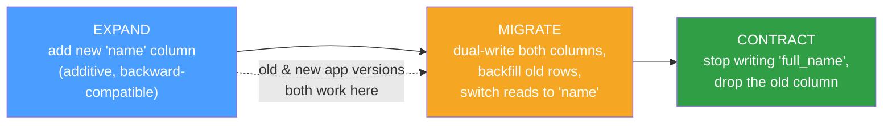

# 🧬 Schema Migrations

> [!abstract] TL;DR
> A **schema migration** is a database change ([[DDL_and_DML|DDL]] like `ALTER TABLE`, plus data backfills) captured as **versioned, reviewable code** and applied by a tool — **Flyway**, **Liquibase**, **Alembic**, **Rails/Django migrations**, or **sqitch** — so every environment reaches the same schema deterministically. The tool keeps a **schema-version table** recording which migrations have run. The two style axes are **forward-only** vs **up/down (reversible)** migrations, and **offline** vs **zero-downtime online** DDL. On modern engines most DDL can run without downtime — [[PostgreSQL|Postgres]] wraps most DDL in a transaction and offers `CREATE INDEX CONCURRENTLY`; [[MySQL|MySQL 8]] offers **online DDL** (`ALGORITHM=INPLACE/INSTANT`) plus **pt-online-schema-change** and **gh-ost** for the rest. The safety pattern that ties it together is **expand → migrate → contract** (parallel change): make additive, backward-compatible changes first, migrate readers/writers, and only then remove the old shape.

## Intuition — analogy FIRST

Renovating a busy restaurant's kitchen *while dinner service continues* is the whole problem in miniature.

- You do **not** knock down the old stove before the new one works — you'd stop all cooking. Instead you **install the new stove alongside the old one** (expand), start cooking on it, confirm it's fine, and only *then* remove the old stove (contract). That is **expand/contract / parallel change**.
- The **renovation blueprint, version-numbered and signed off**, is the migration file in source control. Anyone can rebuild the exact same kitchen from it.
- A **logbook by the door** lists which renovations are already done, so the crew never redoes step 3 — that's the **schema-version table**.
- Some jobs (repainting a wall) can be done with diners present without interruption (**online DDL**); others (replacing the floor) traditionally required closing (**offline DDL**), unless you use a clever trick that builds a shadow copy and swaps it in at the end (**gh-ost / pt-online-schema-change**).

The art is sequencing changes so the running application never sees a half-renovated kitchen it can't cook in.

---

## How It Works

### Migrations as versioned code

Each change is a numbered file (`V3__add_email_to_users.sql`) checked into git, code-reviewed, and applied in order. The migration tool records applied versions in a metadata table (Flyway `flyway_schema_history`, Liquibase `DATABASECHANGELOG`, Alembic `alembic_version`), so re-running is idempotent and every environment converges to the same state.

| Tool | Ecosystem | Style |
|---|---|---|
| **Flyway** | JVM, standalone CLI | SQL/Java, versioned + repeatable |
| **Liquibase** | JVM, DB-agnostic | XML/YAML/SQL changesets, up/down |
| **Alembic** | Python / SQLAlchemy | Python `upgrade()`/`downgrade()` |
| **Rails / Django migrations** | Ruby / Python ORMs | code-defined up/down |
| **sqitch** | Native SQL, VCS-style | deploy / revert / verify scripts |

### Forward-only vs up/down

- **Up/down (reversible)** — each migration ships a `down`/`revert` that undoes it. Clean in theory; in practice **down-migrations are rarely safe in production** because a rollback of a change that already deleted data can't restore it.
- **Forward-only** — you never roll *back*; you roll *forward* with a new corrective migration. This is the dominant production philosophy: to fix a bad migration you write another migration.

### Zero-downtime / online DDL

The danger of naive DDL is **long locks** that block reads/writes while a large table is rewritten.

- **PostgreSQL** — most DDL is **transactional** (wrap several `ALTER`s in one `BEGIN`, all-or-nothing). Key tools: `CREATE INDEX CONCURRENTLY` (builds without blocking writes, at the cost of not being transactional), and version-dependent behavior for `ADD COLUMN ... DEFAULT` — **PG 11+** adds a column with a *constant* default instantly (metadata-only), but a **volatile** default or a `NOT NULL` on old versions rewrites the whole table under a lock.
- **MySQL / InnoDB** — **online DDL** algorithms: `ALGORITHM=INSTANT` (metadata-only, e.g. add column at end in 8.0.12+), `ALGORITHM=INPLACE` (rebuilds in place, mostly non-blocking), or `ALGORITHM=COPY` (full table copy, locks). For changes the engine can't do online, **pt-online-schema-change** and **gh-ost** build a shadow copy, backfill it, keep it in sync via triggers/binlog, then atomically swap.

### The expand → migrate → contract pattern

To rename a column `full_name` → `name` with zero downtime, you never do it in one step. You do three deploys:



At every step the **currently deployed and previously deployed** application versions both function against the schema — which is exactly what makes rolling deploys and instant rollbacks safe. Contract only after you're certain no code references the old shape.

### Migrations and application deploys are coupled

A migration that removes a column will break any still-running old app instance that selects it. So schema changes must be **ordered relative to code deploys**: additive migrations *before* the code that uses them; destructive migrations *after* all code that referenced the old shape is gone.

---

## Commands / Config Examples

```sql
-- ============ PostgreSQL: zero-downtime patterns ============

-- Build an index WITHOUT blocking writes (note: cannot run inside a txn block)
CREATE INDEX CONCURRENTLY idx_orders_user ON orders (user_id);

-- Safe additive column (PG 11+: constant default is instant, metadata-only)
ALTER TABLE users ADD COLUMN name text;               -- instant
-- AVOID on big tables/old versions: a volatile default rewrites the whole table
--   ALTER TABLE users ADD COLUMN token uuid DEFAULT gen_random_uuid();  -- rewrite!

-- Add NOT NULL without a long lock (PG 12+): validate separately
ALTER TABLE users ADD CONSTRAINT users_name_nn CHECK (name IS NOT NULL) NOT VALID;
ALTER TABLE users VALIDATE CONSTRAINT users_name_nn;  -- scans without blocking writes

-- Wrap related, transactional DDL so it's all-or-nothing
BEGIN;
  ALTER TABLE orders ADD COLUMN status text NOT NULL DEFAULT 'new';
  ALTER TABLE orders ADD COLUMN note text;
COMMIT;
```

```sql
-- ============ MySQL: online DDL & shadow-copy tools ============

-- Prefer INSTANT, then INPLACE; fail loudly rather than silently locking (COPY)
ALTER TABLE users ADD COLUMN name VARCHAR(255), ALGORITHM=INSTANT, LOCK=NONE;
ALTER TABLE orders ADD INDEX idx_user (user_id), ALGORITHM=INPLACE, LOCK=NONE;

-- For changes the engine can't do online, use a shadow-copy tool:
-- $ pt-online-schema-change --alter "ADD COLUMN name VARCHAR(255)" \
--       D=shop,t=users --execute
-- $ gh-ost --database=shop --table=users \
--       --alter="ADD COLUMN name VARCHAR(255)" --execute
```

```sql
-- ============ Migration tool metadata (Flyway example) ============
-- File: V3__add_name_to_users.sql   (versioned, in git, reviewed)
ALTER TABLE users ADD COLUMN name text;
-- Flyway records V3 in flyway_schema_history; re-running is a no-op.
-- $ flyway migrate        # applies pending versions in order
-- $ flyway info           # shows applied vs pending
```

---

## Best Practices

- **Version every change as code**, review it, and apply it through a tool — never hand-edit production schema. The version table makes environments converge deterministically.
- **Prefer forward-only migrations** in production; fix mistakes with a new migration rather than a risky `down`.
- **Use expand → migrate → contract** for any breaking change so old and new app versions coexist and rollbacks stay instant.
- **Keep each migration small, backward-compatible, and additive** where possible; separate the additive deploy from the destructive one by time.
- **Use online DDL / `CONCURRENTLY` / gh-ost / pt-osc** for large tables; know your engine's locking behavior *before* you `ALTER` a 500 M-row table.
- **Test migrations on production-sized data** in staging — a change that's instant on 1 000 rows can lock for 40 minutes on 500 million.
- **Set lock timeouts** (`lock_timeout` / `--max-lag`) so a migration fails fast instead of stalling the app behind a lock queue.
- **Decouple and order migrations vs deploys** — additive before code, destructive after all old code is gone.

## Common Pitfalls

1. **A single-step breaking change.** Renaming/dropping a column in one deploy breaks in-flight old app instances and forbids rollback. Use expand/contract.
2. **`ADD COLUMN ... DEFAULT <volatile>` on a huge table.** On older Postgres and non-instant MySQL algorithms this rewrites the entire table under a lock — a surprise outage.
3. **Trusting down-migrations in production.** A `down` that "restores" dropped data can't; reversibility is largely a dev-environment convenience.
4. **Long-held DDL locks blocking traffic.** An `ALTER` waiting behind a long transaction queues every subsequent query. Set `lock_timeout` and use online methods.
5. **`CREATE INDEX` (non-concurrent) on a hot table** — blocks writes for the whole build. Use `CONCURRENTLY` (PG) / `ALGORITHM=INPLACE` (MySQL).
6. **Editing an already-applied migration file.** Checksums drift and environments diverge; write a *new* migration instead.
7. **Testing only on tiny dev data.** Locking and duration are functions of table size and traffic; validate on realistic volumes.

## Related Concepts

- [[_MOC_DB_Administration|↑ Section MOC]]
- [[DDL_and_DML]] — the `ALTER`/`CREATE` statements migrations wrap and version
- [[Performance_Tuning]] — index/DDL choices made here directly affect runtime performance
- [[High_Availability_and_Failover]] — DDL must also replicate cleanly to standbys without breaking replication
- [[Backup_and_Recovery]] — take a backup before a risky migration; migrations are a top cause of "restore me"
- [[Connection_Pooling]] — lock waits during DDL surface as pool saturation (System Design vault)

## Review Questions

1. Walk through the expand → migrate → contract steps to rename `full_name` to `name` on a live, high-traffic table with rolling deploys. At which point is it safe to drop the old column, and why does each step keep both app versions working?
2. Why is `CREATE INDEX CONCURRENTLY` (Postgres) or `ALGORITHM=INPLACE, LOCK=NONE` (MySQL) preferable on a large hot table, and what do you give up by using the concurrent/online path?
3. Explain why most teams run production migrations forward-only rather than relying on up/down reversibility. How do you "roll back" a bad migration under that philosophy?

## Sources

- Flyway & Liquibase documentation — versioned migrations, schema history
- PostgreSQL Documentation — ALTER TABLE, CREATE INDEX (CONCURRENTLY), transactional DDL — https://www.postgresql.org/docs/current/sql-altertable.html
- MySQL Reference Manual — Online DDL Operations — https://dev.mysql.com/doc/refman/8.0/en/innodb-online-ddl-operations.html
- gh-ost (GitHub) & pt-online-schema-change (Percona Toolkit) documentation
- "Refactoring Databases" — Ambler & Sadalage (evolutionary DB design, parallel change)

#Database #Administration #Ops #Migrations #ZeroDowntime #OnlineDDL #ExpandContract
