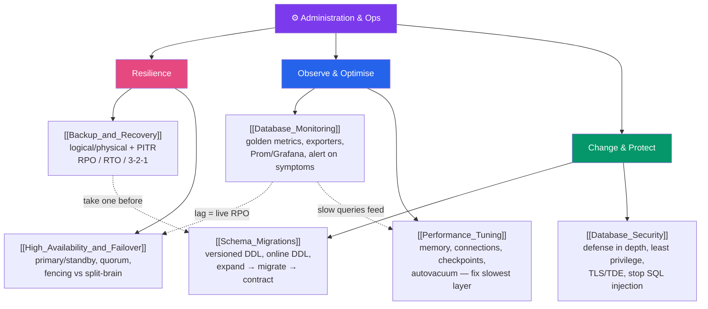

# 🗺️ Administration & Ops — Map of Content

> [!abstract] What This Section Covers
> A database is only as good as its operations. This section is the DBA/SRE half of the vault — keeping a production database durable, available, observable, secure, changeable, and fast. **Backup & recovery** protects against corruption and human error with logical/physical backups and point-in-time recovery, governed by RPO/RTO. **High availability & failover** keeps serving through node death via primary/standby promotion, quorum, and fencing against split-brain. **Monitoring** turns golden metrics into dashboards and actionable alerts. **Security** applies defense-in-depth from network to SQL-injection prevention. **Schema migrations** evolve the schema as versioned, zero-downtime code via expand→migrate→contract. **Performance tuning** fits the engine and host to the workload from the memory/config layer down. The connective tissue: HA is not backup, monitoring makes failover safe, and you always fix the slowest layer first.

## Concept Map

## Learning Path

1. [[Database_Monitoring]] — Start here: you can't tune, fail over, or capacity-plan what you can't see. The golden metrics, the exporter → Prometheus → Grafana pipeline, percentiles, and alerting on symptoms.
2. [[Backup_and_Recovery]] — The safety net: logical vs physical backups, point-in-time recovery from a base backup + log archive, RPO/RTO, retention, and testing restores.
3. [[High_Availability_and_Failover]] — Staying up through failure: primary/standby, switchover vs failover, quorum + fencing against split-brain, and why replication lag *is* your failover RPO.
4. [[Performance_Tuning]] — Fitting the engine to the workload: the memory knobs (`shared_buffers`/buffer pool, `work_mem`), connection math + pooling, checkpoints/redo, and autovacuum.
5. [[Schema_Migrations]] — Evolving the schema safely: versioned DDL as code, online DDL / `CONCURRENTLY` / gh-ost, forward-only philosophy, and the expand→migrate→contract pattern.
6. [[Database_Security]] — Locking it down: defense-in-depth, authentication/authorization + least privilege, TLS/TDE, and the #1 rule — parameterized queries to stop SQL injection.

## All Notes at a Glance

| Note | Difficulty | What You'll Learn |
| ---- | ---------- | ----------------- |
| [[Backup_and_Recovery]] | Advanced | Logical vs physical backups; PITR = base backup + WAL/binlog replay; RPO vs RTO; full/incremental/differential; 3-2-1 and restore drills |
| [[High_Availability_and_Failover]] | Advanced | Primary/standby promotion; switchover vs failover; split-brain, quorum + STONITH fencing; Patroni/etcd, Orchestrator/Group Replication; lag = RPO |
| [[Database_Monitoring]] | Intermediate | Golden metrics; `pg_stat_*`/`performance_schema`; exporter → Prometheus → Grafana → Alertmanager; percentiles; alert on symptoms not counters |
| [[Database_Security]] | Advanced | Defense in depth; authN vs authZ + least privilege, RLS, column grants; TLS + TDE; auditing/secrets; parameterized queries stop SQLi |
| [[Schema_Migrations]] | Intermediate | Migrations as versioned code; forward-only vs up/down; online DDL, `CONCURRENTLY`, gh-ost/pt-osc; expand → migrate → contract |
| [[Performance_Tuning]] | Advanced | Memory sizing to the working set; `work_mem` per-op footgun; connection math + poolers; checkpoint/redo; autovacuum; fix the slowest layer |

## Key Questions This Section Answers

- How do you recover to the second just before an accidental `DROP TABLE`, and what must have been configured beforehand?
- What is the difference between RPO and RTO, and how does a config change lower one at the expense of the other?
- Why is a quorum store alone insufficient to prevent split-brain — what does fencing (STONITH) add?
- Why is a 4 ms mean latency misleading, and which metric reveals the users actually suffering?
- Why do parameterized/prepared statements stop SQL injection where escaping and sanitization fall short?
- How do you rename a column on a live, high-traffic table with zero downtime using expand→migrate→contract?
- Why does doubling `max_connections` often *reduce* throughput, and what is the correct fix?
- Why is HA not a substitute for backups, and monitoring not optional for safe failover?

## Related Sections
- [[_MOC_Database_Master|↑ Database Master MOC]]
- [[_MOC_DB_Systems|← Database Systems]] — the Postgres/MySQL engines these ops practices operate on
- [[_MOC_DB_Storage_Indexing|← Storage & Indexing]] — WAL, MVCC, and buffer-pool internals that backup, HA, and tuning depend on
- [[_MOC_DB_Distributed|← Distributed Databases]] — the replication and consensus that HA promotion builds on
- System Design: [[Monitoring]] — systems-level observability, SLIs/SLOs, RED & USE methods
- System Design: [[Failover]], [[Connection_Pooling]] — architecture-level failover patterns and connection multiplexing

#MOC #Database #Administration #Ops #Backup #HighAvailability #Monitoring #Security
