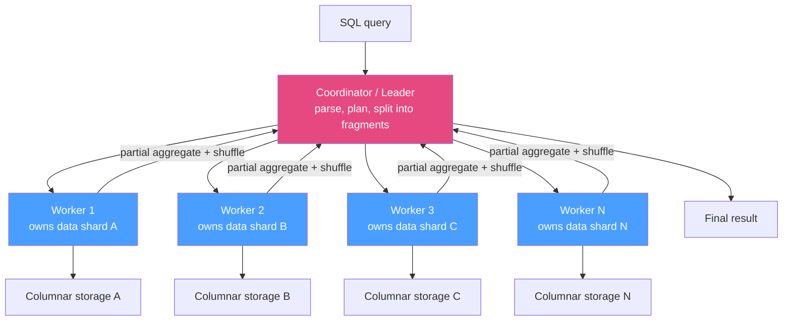

# 🏛️ Analytical Databases

> [!abstract] TL;DR
> Analytical databases are engines purpose-built to scan and aggregate huge datasets, and they mostly share two ideas: **columnar storage** (see [[Columnar_Storage]]) and **MPP** — *massively parallel processing*, a **shared-nothing** design where a coordinator splits a query across many workers that each own a slice of data and run in parallel. The field splits into: **cloud warehouses** — **Snowflake** (separated storage/compute, micro-partitions), **Google BigQuery** (serverless, Dremel, columnar Capacitor), **Amazon Redshift** (MPP clusters, RA3 managed storage), **Databricks SQL** (lakehouse over Parquet/Delta) — for large-scale SQL analytics and modeling; **real-time [[OLTP_vs_OLAP|OLAP]]** — **ClickHouse, Apache Druid, Apache Pinot** — for sub-second dashboards over fresh, high-ingest event data; and **embedded** — **DuckDB** — an in-process engine for local/analyst-scale analytics. They differ from [[PostgreSQL|Postgres]]/[[MySQL]] by optimizing for *scan throughput and parallelism* over *point-transaction latency*: columnar + vectorized + MPP + read-mostly, versus row-oriented + [[BTree_Indexes|B-tree]] + single-node [[Transactions_and_ACID|ACID]]. See [[Data_Lake_and_Lakehouse]] for the lakehouse angle.

## Intuition — analogy FIRST

Imagine you must count every word in a **10,000-book library** by tomorrow.

- **Postgres/MySQL (one super-fast librarian):** brilliant at "fetch book #4501 and hand me page 3" in milliseconds. But asked to count all words, one person walks every aisle sequentially — accurate, hopeless on time.
- **MPP warehouse (a coordinator + 100 assistants):** the coordinator says "assistants 1–100, each take 100 books, count your pile, report your subtotal." They work **in parallel**, each on their *own shelf* (shared-nothing), and the coordinator just sums 100 subtotals. A day's job becomes minutes. That's **massively parallel processing** — and it only works because each assistant owns a disjoint slice and needs no one else's shelf.
- **Cloud separation of storage & compute (Snowflake/BigQuery):** the books live in a central **warehouse basement** (object storage). When the job comes, you *hire* 100 temps for an hour, point them at the basement, and dismiss them when done. Tonight you can hire 1,000 for a bigger job without moving a single book. Elastic compute over shared storage.
- **DuckDB (one very clever person at their desk):** for a *single shelf's* worth of books, you don't need a warehouse and a crew — one sharp person with a good method (columnar + vectorized) finishes right at their laptop.

Different scales, same core trick: read only the columns you need, compress hard, and split the scan across as many workers as the problem needs.

---

## How It Works

### MPP: shared-nothing parallelism



**MPP (massively parallel processing)** = a **shared-nothing** cluster: each worker has its own CPU, memory, and data slice; nodes don't share disk or RAM. The **coordinator** parses/plans a query, splits it into fragments, and pushes them to workers that scan their local (columnar) shard in parallel, compute **partial aggregates**, and **shuffle** intermediate results (e.g. to co-locate join/`GROUP BY` keys) before the coordinator merges the final answer. Scaling out adds workers → more parallel scan throughput. This is horizontal scale for *scans*, distinct from OLTP [[Database_Sharding|sharding]] which scales *transactions*.

### Cloud data warehouses

| System | Key idea | Storage / compute |
|---|---|---|
| **Snowflake** | Separated storage & compute; **micro-partitions** (~16 MB immutable columnar files with min/max metadata for pruning); elastic **virtual warehouses** | Central object storage; independent, resizable compute clusters — scale each separately, pay for compute by the second |
| **Google BigQuery** | **Serverless** — no clusters to manage; **Dremel** engine with a tree of slots executes queries; **Capacitor** columnar format on Colossus | Fully decoupled; you buy slots/on-demand bytes-scanned, Google manages all resources |
| **Amazon Redshift** | Classic **MPP** cluster (leader + compute nodes); columnar, zone maps, sort/dist keys; **RA3** nodes add managed S3-backed storage; Serverless option | Historically coupled node storage+compute; RA3 & Serverless move toward separation |
| **Databricks SQL** | **Lakehouse** — SQL analytics directly over **Parquet + Delta Lake** in a data lake; **Photon** vectorized C++ engine | Compute (clusters/SQL warehouses) over open-format files in object storage — see [[Data_Lake_and_Lakehouse]] |

The unifying cloud shift: **separate storage from compute** so you scale each independently, spin compute up/down elastically, and let multiple compute clusters read the same data without contention.

### Real-time OLAP

Built for **low-latency queries over fresh, high-throughput event streams** (user-facing analytics, live dashboards) — where a batch warehouse's minutes-of-lag and seconds-per-query are too slow:

- **ClickHouse** — blistering columnar engine (MergeTree family); ingests millions of rows/sec, sub-second aggregations; can run single-node or distributed. Great for logs, events, observability, product analytics.
- **Apache Druid** — real-time + historical segments, time-partitioned, pre-aggregation (rollup), bitmap indexes; built for slice-and-dice on time-series event data with high concurrency.
- **Apache Pinot** — ultra-low-latency, high-QPS user-facing analytics (powers LinkedIn/Uber-style in-app metrics); rich indexing (inverted, star-tree, sorted) and real-time Kafka ingestion.

These trade some SQL generality and ad-hoc flexibility for **fresh data + sub-second latency at high concurrency** that cloud warehouses aren't tuned for.

### Embedded analytics

- **DuckDB** — an **in-process** columnar + vectorized OLAP engine ("SQLite for analytics"). No server: it runs inside your Python/R/CLI process and queries Parquet/Arrow/CSV directly, even straight off object storage. Ideal for analyst-scale (GBs to low TBs) local analysis, CI data tests, and as a fast local layer over lake files — no cluster required.

### How they differ from Postgres/MySQL

| Aspect | Postgres / MySQL (OLTP) | Analytical databases (OLAP) |
|---|---|---|
| Storage | Row-oriented pages + buffer pool | Columnar (see [[Columnar_Storage]]) |
| Execution | Tuple-at-a-time, B-tree seeks | Vectorized/SIMD batches, table scans |
| Parallelism | Mostly single-node, per-connection | MPP shared-nothing across many workers |
| Optimized for | Point-transaction latency, high write concurrency, ACID | Scan throughput, big aggregations, read-mostly bulk load |
| Scale axis | Vertical + read replicas + sharding for writes | Horizontal scan parallelism; storage/compute separation |
| Updates | Cheap in-place / MVCC | Expensive; append + compaction |

Postgres/MySQL *can* do analytics (and add-ons like Citus columnar help — see [[Storage_Engine_Internals]]), but they're engineered for the opposite workload; at warehouse scale a purpose-built analytical engine is orders of magnitude faster.

---

## SQL / Examples

```sql
-- Snowflake: compute (virtual warehouse) is elastic and separate from storage.
CREATE WAREHOUSE analytics_wh WAREHOUSE_SIZE = 'LARGE' AUTO_SUSPEND = 60;
USE WAREHOUSE analytics_wh;                 -- scale up for a heavy job, auto-suspend when idle
SELECT region, SUM(amount)
FROM sales                                   -- micro-partitions pruned by min/max metadata
WHERE sale_date >= '2026-01-01'
GROUP BY region;
```

```sql
-- BigQuery: serverless. Cost/perf hinge on BYTES SCANNED, so partition + cluster,
-- and never SELECT * (columnar pruning saves money directly).
SELECT region, SUM(amount)
FROM `proj.dataset.sales`
WHERE sale_date >= '2026-01-01'              -- partition pruning limits scanned bytes
GROUP BY region;
```

```sql
-- ClickHouse: real-time OLAP, sub-second over billions of rows.
CREATE TABLE events (ts DateTime, user_id UInt64, country LowCardinality(String), amount Decimal(10,2))
ENGINE = MergeTree ORDER BY (ts, user_id);
SELECT country, count(), sum(amount) FROM events
WHERE ts >= now() - INTERVAL 1 HOUR GROUP BY country;   -- fresh, fast, high-ingest

-- DuckDB: no server; query lake Parquet in-process from a laptop.
-- SELECT country, sum(amount) FROM read_parquet('s3://bucket/events/*.parquet') GROUP BY country;
```

---

## Trade-offs

| Category | Strength | Weakness |
|---|---|---|
| Cloud warehouse (Snowflake/BigQuery/Redshift) | Huge scale, elastic, separated storage/compute, full SQL & modeling | Query latency in seconds; per-scan/compute cost; not sub-second concurrent |
| Real-time OLAP (ClickHouse/Druid/Pinot) | Sub-second, fresh data, high ingest & QPS | Less SQL/ad-hoc generality; more ops; some need pre-aggregation/careful modeling |
| Embedded (DuckDB) | Zero infra, fast local analytics, queries lake files directly | Single-node / single-machine scale ceiling; not a shared serving system |
| Postgres/MySQL + columnar add-on | One system for OLTP + light analytics | Not competitive at true warehouse scale |
| MPP shared-nothing generally | Linear-ish scan scale-out | Data skew & shuffles hurt; joins across shards costly; needs good distribution keys |

---

## Common Pitfalls

1. **`SELECT *` on a cloud warehouse.** On BigQuery/Snowflake you pay (money and time) roughly per **bytes scanned**; reading every column defeats columnar pruning and inflates cost. Select only needed columns and partition/cluster on filter keys.
2. **Using a batch warehouse for user-facing sub-second dashboards.** Snowflake/BigQuery excel at big periodic analytics but aren't tuned for thousands of concurrent sub-second queries on fresh data — that's Druid/Pinot/ClickHouse territory. Match the engine to the latency/QPS SLA.
3. **Ignoring data distribution/skew in MPP.** A bad distribution (dist/sort/order) key co-locates most rows on one worker or forces giant shuffles, so 99 workers wait on 1. Choose high-cardinality, join-aligned distribution keys.
4. **Treating an analytical DB as OLTP.** Row-at-a-time `UPDATE`/`DELETE`/point-lookup churn is exactly what these engines are bad at (append + compaction, no per-row seeks). Keep transactional writes in Postgres/MySQL and load analytics in bulk.
5. **Forgetting compute is billable and elastic.** Leaving a large Snowflake warehouse or Redshift cluster running idle burns money; not scaling up for a heavy job wastes time. Use auto-suspend/auto-scale and right-size per workload.
6. **Reaching for a cluster when DuckDB would do.** For GB–low-TB analyst work, an in-process DuckDB query over Parquet is faster to set up and run than provisioning distributed infrastructure. Don't over-engineer small analytics.

---

## Related Concepts

- [[_MOC_DB_Analytical|↑ Section MOC]]
- [[Columnar_Storage]] — the storage layer every one of these engines is built on
- [[Analytical_Processing_Overview]] — why these engines exist separately from OLTP
- [[Data_Warehouse_Modeling]] — the dimensional/wide models you build inside them
- [[Data_Integration_and_ETL]] — how data lands in these warehouses (ELT/CDC)
- [[Storage_Engine_Internals]] — the row-oriented Postgres/MySQL engines these contrast with
- [[Data_Lake_and_Lakehouse]] — the lakehouse pattern (Databricks/Delta) (System Design vault)
- [[Data_Warehouse]] — warehouse concept at the systems level (System Design vault)
- [[Database_Sharding]] — OLTP horizontal partitioning vs MPP scan parallelism

---

## Review Questions

1. Explain MPP shared-nothing execution end to end: what the coordinator does, what workers do, and why data distribution (dist/sort key) choice can make or break performance.
2. A team needs thousands of concurrent, sub-second dashboard queries over event data that's seconds old. Would you reach for Snowflake/BigQuery or ClickHouse/Druid/Pinot, and why?
3. Give two concrete reasons an analytical database outperforms Postgres on a `GROUP BY` over 1B rows, and one workload where Postgres would still be the right choice.

---

## Sources

- Snowflake — *The Snowflake Elastic Data Warehouse* (SIGMOD 2016) & architecture docs: https://docs.snowflake.com/
- Melnik et al. — *Dremel: Interactive Analysis of Web-Scale Datasets* (VLDB 2010) — BigQuery's engine
- Amazon Redshift architecture: https://docs.aws.amazon.com/redshift/latest/dg/c_high_level_system_architecture.html
- ClickHouse: https://clickhouse.com/docs ; Apache Druid: https://druid.apache.org/ ; Apache Pinot: https://docs.pinot.apache.org/
- DuckDB: https://duckdb.org/why_duckdb ; Databricks Lakehouse / Photon whitepapers

#Database #Analytical #DataWarehousing #MPP #Snowflake #BigQuery #ClickHouse #DuckDB
