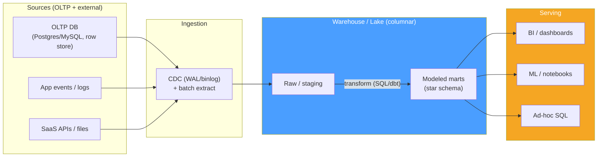

# 📊 Analytical Processing Overview

> [!abstract] TL;DR
> Transactional (**OLTP**) and analytical (**OLAP**) workloads pull a database in opposite directions: OLTP wants many tiny reads/writes of *whole rows*, [[Normalization|normalized]] schemas, and [[BTree_Indexes|B-tree]] point lookups; OLAP wants a *few* huge scans over *a handful of columns*, denormalized/dimensional schemas, and columnar storage with vectorized execution. Running both on one instance means your reporting queries table-scan the same pages your checkout flow needs — so the standard pattern is to **physically separate** them: OLTP source databases feed an ingestion pipeline (batch or CDC) into a **warehouse/lake**, which serves BI and ML. **HTAP** systems try to serve both from one engine (a row store for writes + an in-memory/columnar replica for analytics), useful for real-time dashboards but not a replacement for a full warehouse. See [[OLTP_vs_OLAP]] for the systems-level framing; this note is the database-internals angle.

## Intuition — analogy FIRST

Think of a busy **restaurant kitchen** versus the **accountant** who audits it at month-end.

- The **kitchen** (OLTP) is all about *fast individual orders*: grab this ticket, cook it, plate it, next. Every action touches one order fully and finishes in seconds. You optimize the layout for quick access to any single dish's ingredients.
- The **accountant** (OLAP) never cares about one order. They ask "what was the total revenue by dish category, per week, this quarter?" — they sweep *every* ticket but only look at two fields on each (category, amount) and roll them up.

If you force the accountant to work *in the kitchen during dinner rush*, spreading receipts across every counter, the cooks can't move. So the restaurant **photocopies the tickets into a back office** (the pipeline) and lets the accountant grind through them there. The kitchen stays fast; the accountant gets a layout built for sweeping and summing. That physical separation — and the *different* optimal layout on each side — is the whole story of analytical processing.

---

## How It Works

### Two workloads, opposite optima

| Dimension | OLTP (transactional) | OLAP (analytical) |
|---|---|---|
| Query shape | Point read/write, few rows, whole row | Aggregate scan, millions of rows, few columns |
| Latency target | Single-digit ms, high concurrency | Seconds–minutes, low concurrency |
| Writes | Constant `INSERT`/`UPDATE`/`DELETE` | Bulk load / append; rarely update in place |
| Storage layout | **Row-oriented** (tuple contiguous) | **Columnar** (column contiguous) — see [[Columnar_Storage]] |
| Schema | **Normalized** (3NF), many narrow tables | **Denormalized** / dimensional (star), wide tables — see [[Denormalization]] |
| Indexing | Many B-tree/hash indexes for selectivity | Few or none; zone maps / min-max, sort keys, partition pruning |
| Correctness model | Strict ACID, row locks, MVCC | Snapshot / eventual; read-mostly; big scans |
| Sizing | Working set in RAM; IOPS-bound | Scan throughput (GB/s), compression-bound |
| Example engines | [[PostgreSQL]], [[MySQL\|MySQL/InnoDB]] | ClickHouse, BigQuery, Snowflake, DuckDB — see [[Analytical_Databases]] |

The indexing contrast is subtle: OLTP adds indexes to *avoid* reading most rows (high selectivity). OLAP queries deliberately read *most* rows, so a B-tree helps nothing — instead you rely on **column pruning** (touch only referenced columns), **partition pruning** (skip whole date partitions), and **zone maps / min-max blocks** (skip blocks whose value range can't match the predicate). See [[Storage_Engine_Internals]] for how row engines physically lay out pages that OLAP has to fight against.

### Why physically separate them

1. **Resource isolation.** A single analytical scan can evict the entire OLTP working set from the buffer pool and saturate disk/CPU, spiking p99 latency on the transactional path. Separation gives each workload its own hardware and cache.
2. **Conflicting physical design.** You cannot simultaneously store a table row-major *and* column-major, nor keep it both normalized *and* pre-joined. Each workload needs its own copy in its own layout.
3. **Independent scaling.** OLTP scales on write throughput / connections; OLAP scales on scan parallelism and storage. Decoupling lets each grow on its own axis (and, in the cloud, storage separately from compute).
4. **Blast radius.** A runaway `GROUP BY` in a BI tool should never be able to lock or stall the checkout database.

### HTAP — the hybrid middle

**HTAP (Hybrid Transactional/Analytical Processing)** serves both from one system, typically a row store for writes plus an automatically-maintained in-memory or columnar replica for analytics — e.g. TiDB (TiFlash columnar replicas), SingleStore, SAP HANA, Oracle In-Memory, or PostgreSQL with logical replication to a column store. It removes pipeline lag (query truly fresh data) and reduces moving parts. The catch: maintaining two representations costs write throughput and memory, and it doesn't give you the *historical depth*, conformed dimensions, or cheap object storage of a real warehouse. HTAP shines for **real-time operational analytics** on recent data; a warehouse still owns cross-source, multi-year analytics.

### The modern analytics stack



The flow: **sources → ingestion → warehouse/lake → BI**. Sources are OLTP databases and event/SaaS feeds; ingestion is batch extract and/or [[Data_Integration_and_ETL|CDC]]; the [[Data_Warehouse|warehouse]] (or [[Data_Lake_and_Lakehouse|lakehouse]]) stores data columnar and models it dimensionally (see [[Data_Warehouse_Modeling]]); serving is BI, ML, and ad-hoc SQL.

---

## SQL / Examples

The *same logical question* is cheap for one engine and brutal for the other.

```sql
-- OLTP-shaped: point lookup, whole row, index seek — trivial on Postgres/MySQL
SELECT * FROM orders WHERE id = 918273;             -- 1 row, B-tree seek, <1ms

-- OLAP-shaped: full scan of 2 columns over 500M rows, then aggregate
SELECT date_trunc('day', created_at) AS d,
       SUM(amount) AS revenue
FROM   orders                                        -- reads every row...
WHERE  created_at >= now() - interval '90 days'      -- ...partition pruning helps
GROUP BY 1
ORDER BY 1;                                           -- seconds on a column store,
                                                      -- minutes+ (and cache-thrashing) on OLTP
```

On a **row store** the aggregate must fault in every 8/16 KB page to reach two columns buried inside each wide row. On a **column store** it streams only the `created_at` and `amount` columns, decompressed and vectorized — often 10–100x less I/O. That gap is *why* analytical processing exists as a separate discipline.

```sql
-- HTAP hint (TiDB): route this query to the columnar TiFlash replica,
-- leaving the row-store (TiKV) free for transactions.
SELECT /*+ read_from_storage(tiflash[orders]) */
       region, COUNT(*), SUM(amount)
FROM orders GROUP BY region;
```

---

## Trade-offs

| Approach | Benefit | Cost |
|---|---|---|
| Single DB for OLTP + reporting | Simple, one copy, always fresh | Analytics stalls transactions; wrong physical layout for scans |
| Separate warehouse (batch/CDC pipeline) | Isolation, columnar layout, historical depth, independent scaling | Pipeline lag (minutes–hours), extra system, data duplication |
| HTAP single engine | Fresh analytics, fewer moving parts | Lower write throughput, more memory, limited history/modeling |
| Read replica for reporting | Cheap isolation from primary | Still row-oriented & normalized — slow for big aggregates |

---

## Common Pitfalls

1. **Running BI directly on the production OLTP database.** One analyst's un-tuned `GROUP BY` scans the same pages checkout needs, blows the buffer pool, and spikes transaction p99. Even a read replica is still row-major and normalized — it isolates, but it doesn't make aggregates fast.
2. **Adding more B-tree indexes to speed up analytics.** OLAP queries read *most* rows; a selective index helps nothing and slows every write. The right lever is columnar storage, partitioning, and zone maps — not more indexes.
3. **Treating HTAP as a warehouse.** HTAP is great for real-time operational analytics on recent data but lacks multi-year history, conformed dimensions, and cheap object storage. Don't cancel the warehouse project because you bought an HTAP box.
4. **Ignoring pipeline freshness in the SLA.** A batch-loaded warehouse is minutes to hours stale. Stakeholders reading "today's revenue" must know the load cutoff, or they'll mistake staleness for a bug.
5. **Normalizing the warehouse like an OLTP schema.** 3NF minimizes update anomalies for writers; analytics wants pre-joined, denormalized wide/star tables so scans avoid runtime joins. Copying the OLTP schema verbatim into the warehouse is a classic mistake — see [[Data_Warehouse_Modeling]].

---

## Related Concepts

- [[_MOC_DB_Analytical|↑ Section MOC]]
- [[OLTP_vs_OLAP]] — the systems-level contrast; this note is the database-internals deep dive
- [[Columnar_Storage]] — the storage layout that makes OLAP scans cheap
- [[Data_Warehouse_Modeling]] — dimensional/star schemas that replace OLTP normalization
- [[Data_Integration_and_ETL]] — how source data reaches the warehouse (batch, ELT, CDC)
- [[Analytical_Databases]] — the engines (Snowflake, BigQuery, ClickHouse, DuckDB) built for OLAP
- [[Storage_Engine_Internals]] — row-oriented pages & buffer pool that OLTP relies on
- [[Denormalization]] — trading normalization for scan-friendly read models
- [[Data_Warehouse]] / [[Data_Lake_and_Lakehouse]] — the serving stores (System Design vault)

---

## Review Questions

1. Both OLTP and OLAP can run `SELECT SUM(amount) FROM orders`. Explain physically why this is cheap on a column store and cache-thrashing on a row store, and why adding a B-tree index does not fix the OLTP case.
2. Give three distinct reasons to run analytics on a *separate* system rather than a read replica of the OLTP primary. Which of those reasons does a read replica actually solve, and which does it not?
3. When is HTAP the right choice over a dedicated warehouse, and what specifically does HTAP fail to provide that a warehouse does?

---

## Sources

- Kleppmann, *Designing Data-Intensive Applications* — Ch. 3, "Transaction Processing or Analytics?"
- Kimball & Ross, *The Data Warehouse Toolkit* (3rd ed.) — Ch. 1, DW/BI goals
- TiDB Docs — HTAP & TiFlash columnar replicas: https://docs.pingcap.com/tidb/stable/tiflash-overview
- Snowflake / BigQuery architecture docs (separation of storage & compute)

#Database #Analytical #DataWarehousing #OLAP #OLTP #HTAP #ColumnarStorage
