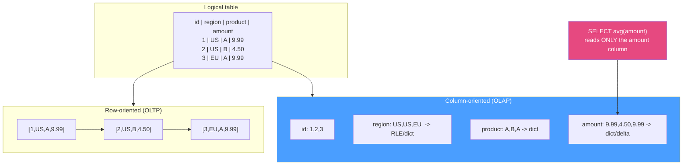

# 🧊 Columnar Storage

> [!abstract] TL;DR
> A **row store** keeps every column of a row contiguous on disk (great for "give me this whole row"); a **column store** keeps every value of one column contiguous (great for "sweep and aggregate one or two columns over billions of rows"). Analytics touches few columns of many rows, so columnar wins three ways: (1) **column pruning** — read only the columns the query references; (2) **extreme compression** — a column is one datatype with low cardinality, so run-length, dictionary, delta, and bit-packing encodings shrink it 5–20x, cutting I/O; (3) **vectorized/SIMD execution** — process a compressed batch of one column at a time, often on encoded data directly, with **late materialization** (stitch rows back only at the end). The price: point writes and per-row updates are expensive, so column stores are read-optimized, append/bulk-load systems. Formats: **Parquet, ORC** (on-disk) and **Arrow** (in-memory). Engines: **ClickHouse, DuckDB, Vertica**, [[PostgreSQL|Postgres]] via **Citus columnar / cstore_fdw**.

## Intuition — analogy FIRST

Picture a giant **spreadsheet of every sale**, and two ways to store it on paper.

- **Row-major (a stack of receipts):** each receipt has *all* fields — date, region, product, qty, price — printed together. Perfect if you want "receipt #4501, everything about it." But to answer "average price across all sales," you must pick up *every* receipt and read past date, region, product just to reach the price. You handle the whole stack to extract one field.
- **Column-major (ledgers by field):** one thin ledger lists *only prices*, top to bottom; another lists *only regions*. Now "average price" reads a single ledger cover-to-cover and ignores the rest. And because the price ledger is *all numbers of the same kind*, you can compress it viciously — "1.99 repeated 4,000 times" becomes one line.

Analytics is almost always "run down one or two ledgers and sum," so column-major turns a whole-warehouse handling job into reading a couple of thin, highly-compressed books. The cost shows up only when you want to *add or edit one full receipt* — now you must touch every ledger.

---

## How It Works

### Same table, two physical layouts



Row store lays out `[row1][row2][row3]…`; column store lays out `[all ids][all regions][all products][all amounts]`. The query `SELECT avg(amount)` reads **only** the `amount` column stripe — the other three columns are never touched. On a wide fact table with 200 columns, referencing 3 of them means reading ~1.5% of the bytes.

### Why columnar wins for analytics

1. **Column (projection) pruning.** Only referenced columns are read from disk. Row stores must read whole rows (whole pages) even to reach one field.
2. **Massive compression** — because a column is one datatype with local regularity:
   - **Run-length encoding (RLE):** sorted/low-cardinality columns (`region = US,US,US,…`) become `(US × 3)`. Predicates and even aggregates can run on the encoded runs.
   - **Dictionary encoding:** map distinct values → small integer codes (`{A:0,B:1}`), store the tiny codes; strings become 1–2 byte ints and comparisons happen on ints.
   - **Delta / frame-of-reference:** store differences from a base (timestamps, monotonic ids) then bit-pack the small deltas.
   - **Bit-packing:** if a column needs only 5 bits of range, use 5 bits, not 32/64.
   Less data on disk = fewer I/Os = faster scans; compression *is* a performance feature here, not just a space feature.
3. **Vectorized / SIMD execution.** Instead of a tuple-at-a-time interpreter loop, the engine processes a **batch** (e.g. 1,024–65,536 values) of one column through tight loops that map onto CPU SIMD lanes and stay cache-resident. Many operations run **directly on encoded data** (sum over RLE runs, filter over dictionary codes) without full decompression.
4. **Late materialization.** Apply filters and aggregates on individual compressed columns first, carrying only *positions* (row ids / selection vectors); reconstruct full rows only at the very end for the surviving positions. This avoids stitching wide rows you're about to discard. (Contrast: **early materialization** rebuilds rows up front — simpler, but wasteful.)
5. **Block-level pruning (zone maps / min-max).** Column stripes carry per-block min/max (and sometimes [[Bloom_Filter|bloom filters]]); a predicate like `amount > 1000` skips any block whose max ≤ 1000 without reading it. Combined with partitioning, huge swaths of data are skipped.

### On-disk vs in-memory formats

| Format | Where | Notes |
|---|---|---|
| **Apache Parquet** | On-disk, open | De-facto lake standard. Row groups → column chunks → pages; per-column encoding + compression (Snappy/ZSTD), footer with stats for pruning. |
| **Apache ORC** | On-disk, open | Hive/Hadoop lineage; stripes with lightweight indexes, built-in ACID delta files. |
| **Apache Arrow** | In-memory, open | Language-agnostic columnar *memory* layout for zero-copy interchange between engines (Spark, DuckDB, pandas, Polars). Arrow Flight moves it over the wire. |

Parquet/ORC optimize for compressed *storage and scanning*; Arrow optimizes for *in-memory processing and zero-copy sharing* (little/no compression, cache-friendly). They compose: read Parquet off object storage, decode into Arrow batches, vectorize over them.

### Systems that use columnar storage

- **Native column stores:** ClickHouse (MergeTree), Vertica, Amazon Redshift, Google BigQuery (Capacitor), Snowflake (micro-partitions), Apache Druid, Apache Pinot — see [[Analytical_Databases]].
- **Embedded:** **DuckDB** — an in-process columnar+vectorized engine ("SQLite for analytics") that queries Parquet/Arrow directly.
- **Postgres add-ons:** **Citus columnar** (formerly `cstore_fdw`) adds a compressed columnar table access method to Postgres for append-mostly analytics, coexisting with normal row tables. Contrast with the native row-oriented [[Storage_Engine_Internals|heap + buffer pool]].

---

## SQL / Examples

```sql
-- ClickHouse: a columnar table. ORDER BY defines the on-disk sort ->
-- great compression + a sparse primary index for range pruning.
CREATE TABLE events (
    event_date  Date,
    user_id     UInt64,
    country     LowCardinality(String),   -- explicit dictionary encoding
    amount      Decimal(10,2)
) ENGINE = MergeTree
ORDER BY (event_date, user_id);            -- sort key, not a B-tree per row

-- Reads ONLY the amount + event_date column stripes; prunes by date partition.
SELECT event_date, avg(amount)
FROM events
WHERE event_date >= today() - 30
GROUP BY event_date;
```

```sql
-- DuckDB: query Parquet files on disk directly, no load step. Columnar + vectorized.
SELECT country, count(*), sum(amount)
FROM read_parquet('s3://bucket/events/*.parquet')
WHERE event_date >= DATE '2026-01-01'
GROUP BY country;                          -- reads country/amount/event_date columns only
```

```sql
-- PostgreSQL with Citus columnar: a compressed, append-optimized columnar table
-- living beside normal row tables in the same database.
CREATE TABLE events_columnar (
    event_date date, user_id bigint, country text, amount numeric
) USING columnar;                          -- columnar access method

-- Bulk load is cheap; single-row UPDATE/DELETE is where columnar hurts.
INSERT INTO events_columnar SELECT * FROM events_staging;
```

---

## Trade-offs

| Property | Row store | Column store |
|---|---|---|
| Whole-row fetch (`SELECT *` one id) | Excellent (one page) | Poor (gather N column stripes) |
| Scan/aggregate few columns of many rows | Poor (reads whole rows) | Excellent (column pruning) |
| Compression ratio | Modest (mixed types per page) | High (one type, RLE/dict/delta) |
| Single-row `INSERT`/`UPDATE`/`DELETE` | Cheap (in-place / heap append) | Expensive (rewrite/merge column blocks; often append + tombstone) |
| Point-lookup indexing | B-tree seek | Sparse/zone-map skipping, not per-row seek |
| Execution style | Tuple-at-a-time | Vectorized batches / SIMD, late materialization |
| Best fit | [[OLTP_vs_OLAP\|OLTP]], operational | OLAP, warehouse, BI, ML feature scans |

---

## Common Pitfalls

1. **Running OLTP write patterns on a column store.** Frequent single-row `UPDATE`/`DELETE` forces block rewrites or piles up delta/tombstone files that must be merged (compaction). Column stores want **bulk loads and appends**, not row-at-a-time churn.
2. **`SELECT *` on a wide columnar table.** You just defeated column pruning — the engine must read and reassemble *every* column stripe. Select only the columns you need; it's the single biggest columnar win.
3. **Ignoring the sort/clustering key.** Compression *and* zone-map pruning depend on physical ordering. An unsorted column store gets weak RLE and can't skip blocks. Sort by your common filter columns (usually time).
4. **Tiny files / tiny row groups on a lake.** Parquet gains come from sizeable row groups (e.g. 128 MB) so stats-based pruning and vectorization pay off. Thousands of 1 MB files ("small-files problem") wreck scan performance and metadata overhead.
5. **Confusing Arrow with Parquet.** Parquet is a *compressed on-disk* format; Arrow is an *uncompressed in-memory* layout for zero-copy processing. You store Parquet and *compute over* Arrow — they are complementary, not competitors.
6. **Expecting a point lookup to be fast.** `WHERE id = 12345` on a column store with no matching sort/zone-map may scan large ranges. Column stores optimize scans, not needle-in-haystack seeks — that's what OLTP row stores and B-trees are for.

---

## Related Concepts

- [[_MOC_DB_Analytical|↑ Section MOC]]
- [[Storage_Engine_Internals]] — the row-oriented page/heap/buffer-pool layout columnar contrasts with
- [[Analytical_Processing_Overview]] — why analytics needs a different layout than OLTP
- [[Analytical_Databases]] — engines built on columnar storage (ClickHouse, BigQuery, DuckDB)
- [[Data_Warehouse_Modeling]] — wide fact tables that columnar compression loves
- [[OLTP_vs_OLAP]] — row vs columnar at the systems level (System Design vault)
- [[Data_Lake_and_Lakehouse]] — Parquet/ORC as the open lakehouse storage layer (System Design vault)

---

## Review Questions

1. Enumerate the three main reasons columnar storage speeds up analytical queries, and for each give a concrete encoding or execution technique that delivers it.
2. Why is a single-row `UPDATE` cheap on an InnoDB row store but expensive on a column store? What write pattern do column stores prefer instead, and how do they usually handle the deletes/updates that do occur?
3. Distinguish Parquet from Arrow: where does each live, is each compressed, and how do the two work together in a modern query engine like DuckDB?

---

## Sources

- Abadi, Boncz, et al. — *The Design and Implementation of Modern Column-Oriented Database Systems* (Foundations and Trends in Databases)
- Kleppmann, *Designing Data-Intensive Applications* — Ch. 3, "Column-Oriented Storage"
- Apache Parquet format spec: https://parquet.apache.org/docs/file-format/
- Apache Arrow columnar format: https://arrow.apache.org/docs/format/Columnar.html
- ClickHouse MergeTree docs: https://clickhouse.com/docs/engines/table-engines/mergetree-family/mergetree
- DuckDB internals: https://duckdb.org/why_duckdb

#Database #Analytical #DataWarehousing #Columnar #Parquet #Arrow #Compression #Vectorization
