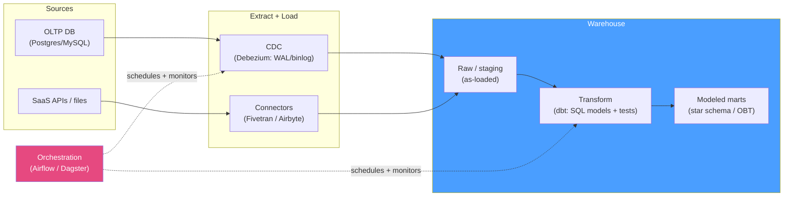

# 🔄 Data Integration and ETL

> [!abstract] TL;DR
> Getting data *into* the [[Data_Warehouse|warehouse]] is data integration. The old way, **ETL**, transforms/cleans data *before* loading (needed when warehouse compute was scarce/expensive); the modern way, **ELT**, dumps **raw** data in first and transforms it *inside* the warehouse with SQL (cheap elastic cloud compute made this win). Ingestion is either **batch** (periodic bulk loads) or **streaming** (continuous). To pull changes efficiently you use **Change Data Capture (CDC)** — reading the source's write-ahead log / binlog (e.g. via **Debezium**) instead of re-scanning whole tables — which makes **incremental loads** cheap and enables near-real-time pipelines. The modern **ELT stack** is: **extract/load** (Fivetran / Airbyte / CDC) → **transform** (dbt, SQL in the warehouse) → **orchestrate** (Airflow / Dagster). Two properties make it safe: **idempotency** (re-running a load doesn't duplicate or corrupt) and **incremental** processing (only touch new/changed rows). Layer **data quality** tests throughout. See [[ETL_vs_ELT]], [[Stream_Processing]], and the source-side [[Write_Ahead_Logging|WAL]].

## Intuition — analogy FIRST

Imagine moving into a new house, and you have two strategies for the kitchen.

- **ETL = unpack-and-sort at the truck.** Before anything enters the house, you stand at the truck, wash each dish, sort the silverware, throw out chipped plates, and only carry in the finished, organized boxes. Clean house — but the sorting happens outside where you have limited counter space, and if you later decide you wanted the "chipped" plates for the garden, they're gone.
- **ELT = dump everything in the garage, then sort inside.** You haul *every* box into the garage as-is (raw), then use your big kitchen counters to wash and organize at your leisure — and you keep the original boxes, so you can re-sort differently next month. This wins once your kitchen (the warehouse) is huge and cheap to use.

Now, **how do you keep the house in sync with the old one you're still living in?** Re-carrying *every* box every night (full reload) is wasteful. Instead you keep a **change log** — "today I bought 2 mugs, broke 1 plate" — and only move those. That change log is the database's **write-ahead log**, and reading it to ship just the deltas is **CDC**. And crucially: if you accidentally run tonight's move twice, you must not end up with 4 mugs — the process has to be **idempotent**.

---

## How It Works

### ETL vs ELT — where transformation happens

| | **ETL** (transform → load) | **ELT** (load → transform) |
|---|---|---|
| Transform location | Separate ETL engine, *before* the warehouse | *Inside* the warehouse (SQL) |
| Raw data kept? | Usually no (only cleaned output lands) | Yes — raw/staging layer preserved |
| Driven by | Scarce/costly warehouse compute (legacy) | Cheap elastic cloud compute (modern) |
| Re-model later? | Hard (raw discarded) | Easy (re-transform raw anytime) |
| Typical tools | Informatica, Talend, SSIS | Fivetran/Airbyte + **dbt** |

The pivot to ELT happened because cloud warehouses (BigQuery, Snowflake — see [[Analytical_Databases]]) made in-warehouse transformation cheaper and more scalable than a separate ETL cluster, and keeping raw data lets you fix/extend models without re-extracting from sources. See [[ETL_vs_ELT]] for the systems framing.

### Batch vs streaming ingestion

- **Batch:** move data in periodic chunks (hourly/daily) — a bulk `COPY`/load of files or a windowed extract. Simple, high-throughput, easy to reason about; the trade-off is **latency** (data is as fresh as the last batch).
- **Streaming:** move each change (or micro-batch) continuously via a log/queue (Kafka, Kinesis) into the warehouse in seconds. Lower latency, enables real-time dashboards; more operational complexity and harder exactly-once semantics. See [[Stream_Processing]].

### Change Data Capture (CDC)

Instead of `SELECT *`-ing a source table every load (full extract — slow, load-heavy, misses deletes), **CDC reads the database's transaction log** — [[PostgreSQL|Postgres]] **WAL** (logical replication), [[MySQL]] **binlog**, Oracle redo — and emits a stream of row-level `INSERT`/`UPDATE`/`DELETE` events *in commit order*. **Debezium** is the de-facto open-source CDC connector, publishing these change events to Kafka.

Why log-based CDC wins:
- **Efficient** — reads only what changed, no full-table scans; minimal load on the source.
- **Captures deletes** (a timestamp-based `WHERE updated_at > ?` poll silently misses them).
- **Low latency & ordered** — changes arrive near-real-time in transaction order.
- **Complete history** — every mutation, enabling SCD Type 2 and audit — see [[Data_Warehouse_Modeling]].

The source-side mechanism is exactly the durability log described in [[Write_Ahead_Logging]] and [[Storage_Engine_Internals]] — CDC just *tails* it as a change feed.

### The modern ELT stack + pipeline



Flow: **sources → CDC/extract → load (raw) → transform (dbt) → warehouse marts**, with an orchestrator scheduling and monitoring the whole DAG.
- **Extract/Load:** managed connectors (**Fivetran, Airbyte**) or CDC (**Debezium**) land raw data.
- **Transform:** **dbt** runs versioned SQL `SELECT`s as models (staging → intermediate → marts), builds the [[Data_Warehouse_Modeling|dimensional models]], and runs **tests** — all in the warehouse.
- **Orchestrate:** **Airflow / Dagster** schedule runs, express dependencies as a DAG, retry failures, and alert. Dagster is asset-aware (models data assets); Airflow is task-centric.

### Idempotency & incremental loads

- **Idempotency:** re-running a load (after a crash/retry) must yield the same result, not duplicates. Achieve it with **`MERGE`/upsert** on a business key, **delete-and-reload of a partition** (idempotent by partition), or dedupe on a unique load key. Never blind-`INSERT` in a retryable pipeline.
- **Incremental loads:** process only new/changed rows since the last successful run — via a **high-water mark** (`WHERE updated_at > :last_run`) or a CDC offset — instead of a full reload. Cheaper and faster, but you must handle **late-arriving data**, deletes (CDC or soft-delete flags), and backfills.

### Data quality

Bad data silently poisons every downstream metric, so tests run *in* the pipeline: uniqueness/not-null on keys, referential integrity (every fact FK resolves to a dimension), accepted-value ranges, row-count/freshness anomaly checks, and reconciliation totals vs source. dbt tests and tools like Great Expectations / Soda encode these as gates that **fail the run** before bad data reaches BI.

---

## SQL / Examples

```sql
-- Postgres source: enable logical replication so CDC (Debezium) can tail the WAL.
ALTER SYSTEM SET wal_level = 'logical';                   -- requires restart
CREATE PUBLICATION dbz_pub FOR TABLE orders, customers;   -- what CDC will stream
```

```sql
-- ELT transform (dbt-style incremental model): only process new/changed rows,
-- and MERGE for idempotency so a retry never duplicates.
MERGE INTO analytics.fact_orders AS tgt
USING (
    SELECT order_id, customer_id, amount, updated_at
    FROM   raw.orders
    WHERE  updated_at > (SELECT COALESCE(MAX(updated_at), '1900-01-01')
                         FROM analytics.fact_orders)        -- high-water mark (incremental)
) AS src
ON  tgt.order_id = src.order_id                             -- business key
WHEN MATCHED     THEN UPDATE SET amount = src.amount, updated_at = src.updated_at
WHEN NOT MATCHED THEN INSERT (order_id, customer_id, amount, updated_at)
                     VALUES (src.order_id, src.customer_id, src.amount, src.updated_at);
```

```sql
-- Idempotent partition reload: deleting + reloading one day is safe to re-run.
DELETE FROM analytics.fact_events WHERE event_date = DATE '2026-07-26';
INSERT INTO analytics.fact_events
SELECT * FROM raw.events WHERE event_date = DATE '2026-07-26';
```

```yaml
# dbt data-quality tests as pipeline gates (schema.yml) — fail the run on bad data
models:
  - name: fact_orders
    columns:
      - name: order_id
        tests: [unique, not_null]
      - name: customer_id
        tests:
          - relationships: { to: ref('dim_customer'), field: customer_id }  # every FK resolves
```

---

## Trade-offs

| Choice | Benefit | Cost |
|---|---|---|
| ETL (transform before load) | Only clean data lands; less warehouse compute | Raw discarded; hard to re-model; separate engine to run |
| ELT (transform in warehouse) | Keep raw, re-model anytime, elastic scale | Raw storage cost; heavy transforms consume warehouse compute |
| Batch ingestion | Simple, high throughput, easy retries | Data only as fresh as last batch |
| Streaming ingestion | Seconds-fresh, real-time BI | Complex, exactly-once is hard, ops overhead |
| Log-based CDC | Efficient, catches deletes, low latency, ordered | Needs source log access/config; connector to operate |
| Full reload | Dead simple, self-correcting | Expensive at scale; heavy source load |
| Incremental load | Cheap, fast | Must handle late data, deletes, backfills, water-mark bugs |

---

## Common Pitfalls

1. **Timestamp polling instead of CDC.** `WHERE updated_at > :last_run` misses **deletes** entirely and any row whose `updated_at` isn't reliably bumped, silently drifting the warehouse from the source. Log-based CDC captures deletes and every change.
2. **Non-idempotent loads.** A blind `INSERT` in a pipeline that retries after a crash duplicates rows and doubles your metrics. Use `MERGE`/upsert on a key or delete-and-reload a partition so re-runs are safe.
3. **Full reloads that don't scale.** Fine at 1 GB, catastrophic at 1 TB — it hammers the source and blows the load window. Move to incremental/CDC before the table gets big, not after it breaks.
4. **Ignoring late-arriving and out-of-order data.** Events can arrive after their window closed; a naive high-water mark skips them. Use lookback windows, event-time (not processing-time) logic, and periodic backfills.
5. **No data-quality gates.** Without uniqueness/not-null/referential tests, one bad upstream deploy corrupts every dashboard and nobody notices until a number looks wrong in a meeting. Fail the run on quality violations *before* marts update.
6. **Transforming in the extract step (re-inventing ETL badly).** Baking business logic into the loader couples ingestion to modeling and loses the raw layer. Keep extract/load thin; do transformation as versioned, testable SQL (dbt) in the warehouse.
7. **Under-provisioning WAL retention / replication slots.** If the CDC consumer falls behind, an inactive Postgres replication slot pins WAL and can fill the source disk. Monitor slot lag and set retention limits.

---

## Related Concepts

- [[_MOC_DB_Analytical|↑ Section MOC]]
- [[ETL_vs_ELT]] — ETL/ELT/CDC at the systems level (System Design vault)
- [[Stream_Processing]] — streaming ingestion & real-time transformation (System Design vault)
- [[Write_Ahead_Logging]] — the source-side WAL that CDC tails for changes
- [[Storage_Engine_Internals]] — WAL/redo log and how databases record changes
- [[Data_Warehouse_Modeling]] — the dimensional models these pipelines build (SCD, facts, dims)
- [[Analytical_Databases]] — the cloud warehouses ELT transforms run inside
- [[Data_Lake_and_Lakehouse]] — raw/staging landing zone for ELT (System Design vault)

---

## Review Questions

1. Contrast ETL and ELT on *where* transformation runs and *whether raw data is preserved*, and explain why cheap cloud warehouse compute pushed the industry toward ELT.
2. Why is log-based CDC (e.g. Debezium reading the WAL/binlog) preferable to polling `WHERE updated_at > :last_run`? Name two things the polling approach silently gets wrong.
3. Define idempotency for a data load and give two concrete SQL patterns that make a retried load safe from duplicates.

---

## Sources

- Debezium documentation — CDC connectors: https://debezium.io/documentation/
- dbt Labs — incremental models & tests: https://docs.getdbt.com/docs/build/incremental-models
- Fivetran / Airbyte — managed connector docs
- Apache Airflow: https://airflow.apache.org/ ; Dagster: https://docs.dagster.io/
- Reis & Housley — *Fundamentals of Data Engineering* (ingestion, CDC, transformation)

#Database #Analytical #DataWarehousing #ETL #ELT #CDC #dbt #DataQuality
