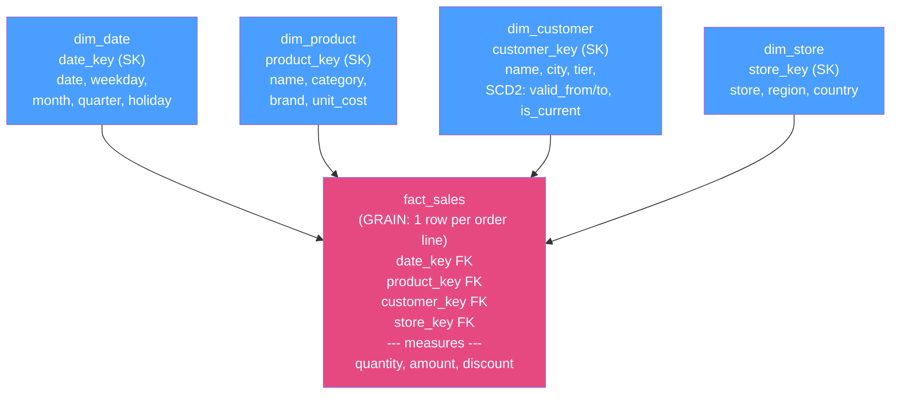

# ⭐ Data Warehouse Modeling

> [!abstract] TL;DR
> Warehouses model data **dimensionally**, not in 3NF. You split the world into **facts** (measurable business events — a sale, a click, tall/narrow tables) and **dimensions** (the descriptive "who/what/where/when" you slice by — customer, product, date, wide/short tables). Arrange them as a **star schema**: one central fact table with foreign keys to surrounding dimension tables. The **grain** — "one row per ___" — is the single most important design decision. Facts hold numeric **measures** classed as additive / semi-additive / non-additive by whether you can `SUM` them across dimensions. Dimensions use **surrogate keys** (warehouse-generated integers) and handle history with **Slowly Changing Dimensions (SCD Type 1/2/3)**. **Conformed dimensions** shared across facts let you drill across the business. **Kimball** (bottom-up dimensional marts, star schemas) vs **Inmon** (top-down normalized enterprise warehouse feeding marts) are the two classic philosophies; modern cloud warehouses often go **One Big Table** — wide denormalized flat tables — because [[Columnar_Storage|columnar storage]] and cheap compute make joins and redundancy cheap. See [[Data_Warehouse]] and [[Denormalization]].

## Intuition — analogy FIRST

Think of a **museum**. Every visit generates an **event ticket**: who visited, which exhibit, what day, how long, ticket price. Millions of these tickets pile up — that's your **fact table**: tall, narrow, mostly numbers and a few reference codes.

Around the ticket desk are **reference binders**: the *Visitors* binder (name, city, membership tier), the *Exhibits* binder (title, gallery, curator), the *Calendar* binder (date, weekday, holiday flag). Each binder is short but wide — lots of descriptive attributes. Those are your **dimensions**.

A ticket doesn't repeat "visitor lives in Boston, is a Gold member"; it just writes a small code that points into the *Visitors* binder. To ask "revenue by city and month," you sweep the huge stack of tickets, glancing at each code to look up city (Visitors binder) and month (Calendar binder), and sum the price. That hub-and-spoke shape — one giant fact stack surrounded by descriptive binders you join through codes — is a **star schema**. The "one row per ___" rule for the ticket stack is the **grain**, and it's the first thing you must nail down.

---

## How It Works

### Facts vs dimensions

- **Fact table** — one row per business event at a chosen grain. Columns are (a) **foreign keys** to dimensions and (b) **measures** (numeric facts). Tall and narrow: billions of rows, few columns. Almost never updated; new events are appended.
- **Dimension table** — the descriptive context you filter, group, and label by. Wide (many attributes) and short (thousands to millions of rows). Contains a surrogate key + a natural/business key + descriptive attributes.

### Grain — decide this first

The **grain** is the precise meaning of one fact row: "one row per line item per order," or "one row per sensor per minute." Declaring it forces every dimension and measure into consistency and prevents accidental double-counting. **Rule: pick the lowest (most atomic) grain you can afford** — you can always aggregate up, but you can never disaggregate a pre-summarized fact back to detail.

### Star schema vs snowflake schema



- **Star schema:** dimensions are **denormalized** — each dimension is one flat table even if that repeats values (every product row repeats its category name). One join hop from fact to each dimension. Simpler queries, fewer joins, faster on columnar engines. This is the Kimball default.
- **Snowflake schema:** dimensions are **normalized** into sub-dimensions (product → category → department as separate tables). Saves some space and avoids update anomalies in the dimension, but adds join hops and complexity. Rarely worth it on modern columnar warehouses where storage is cheap and joins on small dimensions are fine.

### Measures: additive, semi-additive, non-additive

| Class | Can `SUM` across... | Example |
|---|---|---|
| **Additive** | *all* dimensions | `amount`, `quantity` — sum across product, store, and time freely |
| **Semi-additive** | some but **not** time | `account_balance`, `inventory_on_hand` — sum across accounts, but across days use last/avg, not sum |
| **Non-additive** | *no* dimension (ratios) | `unit_price`, `margin_%`, `conversion_rate` — must recompute from additive components, never sum |

Store **fully-additive raw components** (e.g. `revenue` and `cost`) and compute ratios at query time; summing a stored `margin_%` is the classic non-additive trap.

### Surrogate keys

Dimensions use a **surrogate key** — a meaningless warehouse-generated integer (identity/sequence) — as the primary key and the fact's foreign key, *not* the source system's natural/business key. Why:
- **Decouples from source systems** (re-numbered ids, merged systems, reused keys don't break the warehouse).
- **Enables SCD Type 2 history** — the same business entity can have multiple dimension rows (versions), each with its own surrogate key; the fact points to the version that was current at event time.
- **Compact & fast joins** — a 4-byte int beats a long composite natural key, and helps columnar compression.
Keep the natural/business key as a regular attribute for lineage.

### Slowly Changing Dimensions (SCD)

How you handle a dimension attribute changing over time (a customer moves city):

| Type | Behavior | History kept? | Use when |
|---|---|---|---|
| **Type 1** | Overwrite the old value in place | **No** — only current truth | Corrections; history irrelevant |
| **Type 2** | Insert a **new dimension row** (new surrogate key) with `valid_from`/`valid_to`/`is_current` flags; facts link to the version current at their time | **Full** | You must report "as it was then" (most common for analytics) |
| **Type 3** | Add a column like `previous_city` alongside `current_city` | **One prior value** | You need "current vs prior" but not full history |

Type 2 is the analytics workhorse: it lets "sales by customer city" reflect the city the customer *had at the time of each sale*, not their city today.

### Conformed dimensions

A **conformed dimension** is a single dimension (same keys, same attributes, same meaning) shared across *multiple* fact tables — e.g. one `dim_date` and one `dim_product` used by both `fact_sales` and `fact_returns`. Because the keys and labels match, you can **drill across** facts and combine metrics (sales vs returns by product/month) consistently. Conformed dimensions are the backbone of an integrated warehouse (Kimball's "bus architecture").

### Kimball vs Inmon vs the modern wide table

- **Kimball (bottom-up):** build **dimensional data marts** (star schemas) per business process, integrated via **conformed dimensions** on a shared "bus." Fast to deliver, business-user friendly, query-optimized.
- **Inmon (top-down):** first build a **normalized (3NF) enterprise data warehouse** as the single source of truth, then spin **dimensional marts** off it. More upfront rigor and integration, slower to deliver.
- **Modern cloud / One Big Table (OBT):** columnar storage + cheap elastic compute make redundancy and re-joins cheap, so teams often flatten stars into **wide denormalized tables** (dbt models). Fewer joins, dead simple for BI, at the cost of storage and some maintenance duplication. Dimensional concepts (grain, SCD, conformed keys) still apply *inside* the wide tables — they're not obsolete, just physically flattened. See [[Denormalization]].

---

## SQL / Examples

```sql
-- Dimension with a surrogate key + SCD Type 2 versioning columns
CREATE TABLE dim_customer (
    customer_key   BIGINT GENERATED ALWAYS AS IDENTITY PRIMARY KEY,  -- surrogate
    customer_id    BIGINT NOT NULL,          -- natural/business key (from source)
    name           TEXT,
    city           TEXT,
    tier           TEXT,
    valid_from     TIMESTAMP NOT NULL,
    valid_to       TIMESTAMP,                -- NULL = open/current version
    is_current     BOOLEAN NOT NULL DEFAULT true
);

-- Fact at grain "one row per order line", linking to the CURRENT-at-event-time dim version
CREATE TABLE fact_sales (
    date_key       INT     NOT NULL REFERENCES dim_date(date_key),
    product_key    BIGINT  NOT NULL REFERENCES dim_product(product_key),
    customer_key   BIGINT  NOT NULL REFERENCES dim_customer(customer_key),  -- SK, not customer_id
    quantity       INT,
    amount         NUMERIC(12,2),            -- additive
    discount       NUMERIC(12,2)             -- additive
);
```

```sql
-- SCD Type 2 update: a customer moves city. Close the old version, insert a new one.
UPDATE dim_customer
SET valid_to = now(), is_current = false
WHERE customer_id = 4711 AND is_current;

INSERT INTO dim_customer (customer_id, name, city, tier, valid_from, valid_to, is_current)
VALUES (4711, 'Ada Lovelace', 'Berlin', 'Gold', now(), NULL, true);
```

```sql
-- Analytical query: revenue by product category and month, honoring SCD2 history.
-- amount is additive, so SUM across product+time is valid.
SELECT d.month, p.category, SUM(f.amount) AS revenue
FROM fact_sales f
JOIN dim_date    d ON d.date_key    = f.date_key
JOIN dim_product p ON p.product_key = f.product_key
GROUP BY d.month, p.category
ORDER BY d.month, revenue DESC;

-- Non-additive trap: NEVER SUM a stored margin_%. Recompute from additive parts:
SELECT SUM(f.amount - f.cost) / NULLIF(SUM(f.amount), 0) AS margin_pct
FROM fact_sales f;
```

---

## Trade-offs

| Choice | Benefit | Cost |
|---|---|---|
| Star (denormalized dims) | Few joins, simple BI queries, columnar-friendly | Redundant attribute values in dimensions |
| Snowflake (normalized dims) | Less storage, no dimension update anomalies | More joins, more complex, marginal on cheap storage |
| SCD Type 1 (overwrite) | Simple, small dimension | Loses history; past reports silently change |
| SCD Type 2 (versioned rows) | Full "as-was" history | Bigger dimension, ETL complexity, must pick correct version |
| Fine grain (atomic facts) | Maximum analytic flexibility | Large storage, more rows to scan |
| One Big Table (wide) | Zero-join BI, dead simple | Storage duplication, maintenance/consistency burden |
| Kimball marts | Fast delivery, business-aligned | Integration relies on disciplined conformed dims |
| Inmon 3NF core | Strong single source of truth | Heavy upfront modeling, slower time-to-value |

---

## Common Pitfalls

1. **Not declaring the grain first.** Mixed-grain fact rows (some per-order, some per-line) cause silent double-counting in every `SUM`. Write "one row per ___" before you create a single column.
2. **Summing a non-additive measure.** Averaging averages or summing percentages/prices produces nonsense. Store additive components (revenue, cost, count) and derive ratios at query time.
3. **Summing a semi-additive measure across time.** `account_balance`/`inventory` can be summed across accounts but *not* across days — use the last (or average) value per period.
4. **Using the source natural key as the fact FK.** It couples you to source-system quirks and makes SCD Type 2 impossible (you can't distinguish versions). Always join facts to dimensions on the **surrogate key**.
5. **Overwriting (SCD1) when you needed history (SCD2).** Once you overwrite, last quarter's report can no longer reproduce; if anyone asks "as it was then," you've lost the data. Decide history requirements per attribute up front.
6. **Snowflaking everything to "save space."** On columnar warehouses storage is cheap and extra join hops cost more than the redundancy. Default to a flat star; snowflake only a genuinely large, volatile sub-hierarchy.
7. **Non-conformed dimensions across marts.** If `dim_product` differs between `fact_sales` and `fact_returns`, you cannot reliably compare them. Conform shared dimensions or lose cross-process analysis.

---

## Related Concepts

- [[_MOC_DB_Analytical|↑ Section MOC]]
- [[Data_Warehouse]] — the storage/serving system these models live in (System Design vault)
- [[Denormalization]] — star schemas and One Big Table are deliberate denormalization
- [[Columnar_Storage]] — why wide denormalized fact tables scan cheaply
- [[Analytical_Processing_Overview]] — why warehouses model dimensionally instead of 3NF
- [[Data_Integration_and_ETL]] — the ELT/dbt process that builds and maintains these models
- [[Normalization]] — the OLTP 3NF discipline dimensional modeling deliberately departs from
- [[ER_Modeling]] — entity-relationship modeling for the OLTP source side

---

## Review Questions

1. What is the "grain" of a fact table, why is declaring it the first modeling step, and what goes wrong if a single fact table mixes grains?
2. Classify `revenue`, `inventory_on_hand`, and `profit_margin_percent` as additive / semi-additive / non-additive, and explain how you'd correctly aggregate each across time.
3. Walk through what physically happens to `dim_customer` and to a new `fact_sales` row when a customer changes city under SCD Type 2, and explain why surrogate keys are required for this to work.

---

## Sources

- Kimball & Ross — *The Data Warehouse Toolkit* (3rd ed.): grain, star schema, SCD, conformed dimensions
- Inmon — *Building the Data Warehouse* (4th ed.): the top-down 3NF enterprise warehouse
- Kimball Group — Slowly Changing Dimensions techniques: https://www.kimballgroup.com/data-warehouse-business-intelligence-resources/kimball-techniques/dimensional-modeling-techniques/
- dbt Labs — dimensional modeling & wide-table patterns: https://docs.getdbt.com/

#Database #Analytical #DataWarehousing #DimensionalModeling #StarSchema #SCD #Kimball #Inmon
