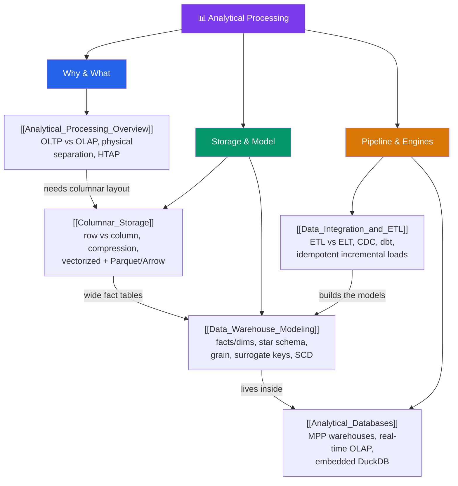

# 🗺️ Analytical — Map of Content

> [!abstract] What This Section Covers
> Transactional (OLTP) and analytical (OLAP) workloads pull a database in opposite directions, so analytics gets its own physical layout, its own modelling, its own pipeline, and its own engines. This section follows that stack top to bottom: the [[Analytical_Processing_Overview|OLTP-vs-OLAP contrast]] and why you physically separate them (with HTAP as the hybrid middle); **columnar storage** — the row-vs-column layout, compression, and vectorized execution that make big scans cheap; **data-warehouse modelling** — facts, dimensions, star schemas, grain, surrogate keys, and slowly changing dimensions; **data integration & ETL/ELT** — how source data reaches the warehouse via batch, CDC, dbt, and idempotent incremental loads; and the **analytical databases** themselves — MPP cloud warehouses (Snowflake, BigQuery, Redshift), real-time OLAP (ClickHouse, Druid, Pinot), and embedded DuckDB. The throughline: analytics reads *few columns of many rows*, so every layer is redesigned around scan throughput instead of point-transaction latency.

## Concept Map

## Learning Path

1. [[Analytical_Processing_Overview]] — The framing: why OLTP and OLAP have opposite optima, why you physically separate them, the modern sources → ingestion → warehouse → BI stack, and where HTAP fits.
2. [[Columnar_Storage]] — The storage layer that makes it fast: row-vs-column layout, column pruning, RLE/dictionary/delta compression, vectorized/SIMD execution, and Parquet vs Arrow.
3. [[Data_Warehouse_Modeling]] — How you model for analytics instead of 3NF: facts vs dimensions, grain, star vs snowflake, additive measures, surrogate keys, SCD types, and Kimball vs Inmon vs One Big Table.
4. [[Data_Integration_and_ETL]] — How data gets in: ETL vs ELT, batch vs streaming, log-based CDC (Debezium), the dbt/Airflow stack, and idempotent incremental loads with data-quality gates.
5. [[Analytical_Databases]] — The engines that run it all: MPP shared-nothing execution, cloud warehouses (Snowflake/BigQuery/Redshift), real-time OLAP (ClickHouse/Druid/Pinot), and embedded DuckDB.

## All Notes at a Glance

| Note | Difficulty | What You'll Learn |
| ---- | ---------- | ----------------- |
| [[Analytical_Processing_Overview]] | Intermediate | OLTP vs OLAP opposite optima; why to physically separate them; HTAP; the sources → CDC → warehouse → BI pipeline |
| [[Columnar_Storage]] | Advanced | Row vs column layout; column pruning; RLE/dictionary/delta compression; vectorized/SIMD + late materialization; Parquet vs ORC vs Arrow |
| [[Data_Warehouse_Modeling]] | Advanced | Facts vs dimensions; grain; star vs snowflake; additive/semi/non-additive measures; surrogate keys; SCD 1/2/3; Kimball/Inmon/OBT |
| [[Data_Integration_and_ETL]] | Intermediate | ETL vs ELT; batch vs streaming; log-based CDC; dbt + Airflow/Dagster; idempotency, incremental loads, data-quality tests |
| [[Analytical_Databases]] | Advanced | MPP shared-nothing + coordinator/workers; Snowflake/BigQuery/Redshift; real-time OLAP (ClickHouse/Druid/Pinot); DuckDB; vs Postgres/MySQL |

## Key Questions This Section Answers

- Why is `SELECT SUM(amount)` cheap on a column store and cache-thrashing on a row store — and why doesn't a B-tree index fix the OLTP case?
- Why physically separate analytics from the OLTP database, and which of those reasons does a read replica actually solve?
- What are the three reasons columnar storage speeds up analytics, and which encoding delivers each?
- What is the "grain" of a fact table, and why is declaring it the first modelling step?
- How does SCD Type 2 preserve "as it was then" history, and why does it require surrogate keys?
- Why did cheap cloud compute push the industry from ETL to ELT, and why is log-based CDC better than timestamp polling?
- What is MPP shared-nothing execution, and why can a bad distribution key make 99 workers wait on 1?
- When do you reach for a batch warehouse vs real-time OLAP vs embedded DuckDB?

## Related Sections
- [[_MOC_Database_Master|↑ Database Master MOC]]
- [[_MOC_DB_Storage_Indexing|← Storage & Indexing]] — the row-oriented heap/buffer-pool layout columnar storage contrasts with
- [[_MOC_DB_Distributed|← Distributed Databases]] — MPP scan parallelism vs OLTP sharding, and CDC atop the WAL/binlog
- [[_MOC_DB_Data_Modeling|← Data Modeling]] — the OLTP normalization that dimensional modelling deliberately departs from
- System Design: [[OLTP_vs_OLAP]] — the systems-level row-vs-columnar and warehouse framing
- System Design: [[Data_Warehouse]], [[Data_Lake_and_Lakehouse]], [[ETL_vs_ELT]] — the serving stores and pipeline patterns

#MOC #Database #Analytical #DataWarehousing #Columnar #OLAP #ETL
