# 🗃️ Database — Master Map of Content

> [!abstract] About This Vault
> A complete database-engineering reference: **~74 notes across 11 sections**, anchored in **PostgreSQL** and **MySQL** and cross-linked to the System Design and DSA vaults. It runs the full stack — from the relational model, data modelling, and SQL, through the engine internals every backend engineer should know (transactions & isolation, storage & indexing, query processing), into scaling out (distributed databases, NoSQL families, the concrete systems), and finishing with production operations and analytics. Every note pairs an intuition-first analogy with runnable PostgreSQL/MySQL examples, trade-off tables, common pitfalls, and review questions. Start at the section that matches your goal below, or follow one of the four learning paths.

## Vault Architecture

```mermaid
graph TD
    Master["🗃️ Database Master"]

    %% Fundamentals — Blue (00-02)
    Master --> S00["00 Foundations"]
    Master --> S01["01 Data Modeling"]
    Master --> S02["02 SQL"]

    %% Engine Internals — Green (03-05)
    Master --> S03["03 Transactions & Concurrency"]
    Master --> S04["04 Storage & Indexing"]
    Master --> S05["05 Query Processing"]

    %% Scale — Orange (06-08)
    Master --> S06["06 Distributed Databases"]
    Master --> S07["07 NoSQL"]
    Master --> S08["08 Database Systems"]

    %% Operations — Red (09-10)
    Master --> S09["09 Administration & Ops"]
    Master --> S10["10 Analytical"]

    style Master fill:#7c3aed,color:#fff
    style S00 fill:#2563eb,color:#fff
    style S01 fill:#2563eb,color:#fff
    style S02 fill:#2563eb,color:#fff
    style S03 fill:#059669,color:#fff
    style S04 fill:#059669,color:#fff
    style S05 fill:#059669,color:#fff
    style S06 fill:#d97706,color:#fff
    style S07 fill:#d97706,color:#fff
    style S08 fill:#d97706,color:#fff
    style S09 fill:#dc2626,color:#fff
    style S10 fill:#dc2626,color:#fff
```

## Sections at a Glance

| # | Section | Notes | Entry Point | Difficulty |
|---|---------|-------|-------------|------------|
| 00 | Foundations | 5 | [[_MOC_DB_Foundations]] | Beginner |
| 01 | Data Modeling | 5 | [[_MOC_DB_Data_Modeling]] | Beginner → Intermediate |
| 02 | SQL | 12 | [[_MOC_DB_SQL]] | Beginner → Advanced |
| 03 | Transactions & Concurrency | 6 | [[_MOC_DB_Transactions]] | Intermediate → Advanced |
| 04 | Storage & Indexing | 6 | [[_MOC_DB_Storage_Indexing]] | Intermediate → Advanced |
| 05 | Query Processing | 5 | [[_MOC_DB_Query_Processing]] | Intermediate → Advanced |
| 06 | Distributed Databases | 7 | [[_MOC_DB_Distributed]] | Advanced |
| 07 | NoSQL | 6 | [[_MOC_DB_NoSQL]] | Intermediate → Advanced |
| 08 | Database Systems | 8 | [[_MOC_DB_Systems]] | Beginner → Advanced |
| 09 | Administration & Ops | 9 | [[_MOC_DB_Administration]] | Intermediate → Advanced |
| 10 | Analytical | 5 | [[_MOC_DB_Analytical]] | Intermediate → Advanced |

---

## Learning Paths

### Path 1 — SQL & Application Developer

> Best for: engineers who write queries and design app schemas and want to make them correct and fast.

**Foundations → Data Modeling → SQL → Query Tuning**

[[_MOC_DB_Foundations]] → [[Relational_Model]] → [[_MOC_DB_Data_Modeling]] → [[Normalization]] → [[_MOC_DB_SQL]] → [[SQL_Fundamentals]] → [[Joins]] → [[Window_Functions]] → [[_MOC_DB_Query_Processing]] → [[Execution_Plans]] → [[Query_Tuning]]

---

### Path 2 — Backend Engineer

> Best for: engineers building services who need engine internals and how to scale beyond one node.

**Foundations → SQL → Transactions/Isolation → Indexing → Distributed**

[[_MOC_DB_Foundations]] → [[Database_Fundamentals]] → [[_MOC_DB_SQL]] → [[_MOC_DB_Transactions]] → [[Isolation_Levels]] → [[MVCC_Internals]] → [[_MOC_DB_Storage_Indexing]] → [[BTree_Indexes]] → [[Index_Design_Strategy]] → [[_MOC_DB_Distributed]] → [[Partitioning_and_Sharding]] → [[Replication_Strategies]]

---

### Path 3 — Interview Prep

> Best for: a focused sweep of the highest-yield database interview topics.

- Foundations: [[Database_Fundamentals]] → [[Relational_Model]] → [[Keys_and_Relationships]]
- SQL: [[SQL_Fundamentals]] → [[Joins]] → [[Aggregation_and_Grouping]] → [[SQL_Antipatterns]]
- Transactions & isolation: [[Transactions_and_ACID]] → [[Isolation_Levels]] → [[Deadlocks]]
- Indexing: [[BTree_Indexes]] → [[Index_Design_Strategy]]
- Sharding & replication: [[Partitioning_and_Sharding]] → [[Replication_Strategies]]
- SQL vs NoSQL: [[NoSQL_Overview]] → [[SQL_vs_NoSQL]]

---

### Path 4 — DBA / Ops

> Best for: DBAs and SREs running databases in production.

**Systems → Administration → Storage → Tuning**

[[_MOC_DB_Systems]] → [[PostgreSQL]] → [[MySQL]] → [[_MOC_DB_Administration]] → [[High_Availability_and_Failover]] → [[Backup_and_Recovery]] → [[Database_Monitoring]] → [[_MOC_DB_Storage_Indexing]] → [[Write_Ahead_Logging]] → [[_MOC_DB_Query_Processing]] → [[Query_Tuning]] → [[Performance_Tuning]]

---

## Cross-Vault Links

This vault is the DB-engineering deep dive that grounds the systems-level and algorithmic views elsewhere:

- **System Design vault** — [[Databases]] (System Design/12_Databases) is the architecture-level companion: [[SQL_vs_NoSQL]], [[Database_Sharding]], [[Database_Replication]], [[Database_Federation]], [[CAP_Theorem]], [[PACELC_Theorem]], [[OLTP_vs_OLAP]], [[Data_Warehouse]], and [[Consensus_and_Raft]]. Where those notes frame the *decision*, this vault covers the *mechanics*.
- **DSA vault** — the data structures under the engines: [[B_Plus_Tree]] (the shape of a clustered/secondary index) and [[Indexing]] (why ordered structures make lookups logarithmic). Storage & Indexing here is the applied form of that theory.

---

## Section MOC Index

- [[_MOC_DB_Foundations]] — What a database is: the relational model, DBMS architecture, keys/relationships, and the landscape of database types.
- [[_MOC_DB_Data_Modeling]] — Turning a domain into tables: ER modelling, normalization, constraints, schema-design patterns, and worked case studies.
- [[_MOC_DB_SQL]] — The query language end to end: DDL/DML, joins, aggregation, subqueries, CTEs, window functions, views, JSON, and antipatterns.
- [[_MOC_DB_Transactions]] — Correctness under concurrency: ACID, isolation levels, concurrency control, MVCC internals, locking, and deadlocks.
- [[_MOC_DB_Storage_Indexing]] — How bytes live on disk: the storage engine, B-tree vs LSM, specialized indexes, write-ahead logging, and index design strategy.
- [[_MOC_DB_Query_Processing]] — From SQL text to results: the execution pipeline, the optimizer, reading execution plans, join algorithms, and query tuning.
- [[_MOC_DB_Distributed]] — Scaling past one node: partitioning/sharding, replication, consistency models, distributed transactions, consensus/quorums, NewSQL, and polyglot persistence.
- [[_MOC_DB_NoSQL]] — Beyond tables: the BASE/aggregate mindset and the four families (key-value, document, wide-column, graph) plus time-series and vector stores.
- [[_MOC_DB_Systems]] — The engines in practice: PostgreSQL, MySQL, SQLite, Redis (incl. [[Redis_Modules]] and [[Redis_Lua_Scripting]]), MongoDB, and Cassandra.
- [[_MOC_DB_Administration]] — Running it in production: backup & recovery ([[PostgreSQL_Backup_Tools]]), high availability & failover ([[PostgreSQL_HA_and_Patroni]]), maintenance ([[PostgreSQL_Maintenance]]), monitoring, security, schema migrations, and performance tuning.
- [[_MOC_DB_Analytical]] — Analytics at scale: OLTP vs OLAP, columnar storage, data-warehouse modelling, ETL/ELT integration, and analytical databases.

#MOC #Database #MasterMOC
