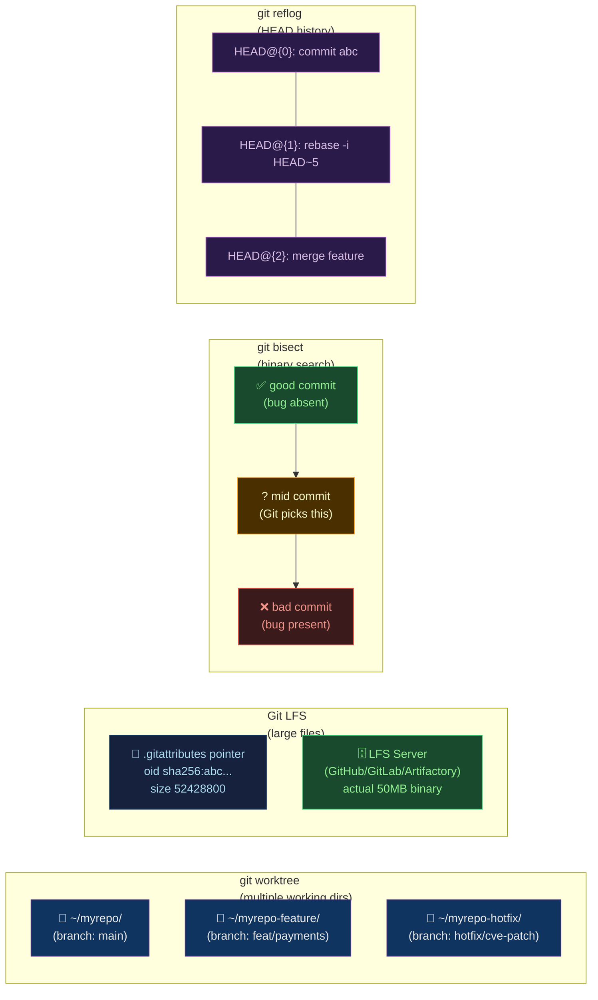

# 🔬 Advanced Git

> [!abstract] TL;DR
> Beyond commits and branches, Git offers powerful tools for large-scale and complex workflows: **Git LFS** stores binary files (models, images, videos) in external storage while keeping small pointer files in the repo; **`git bisect`** performs a binary search over commit history to find the exact commit that introduced a bug; **`git worktree`** lets you check out multiple branches simultaneously in separate directories; **`git reflog`** is the "safety net" that records every HEAD movement — your last resort for recovering from bad rebases; **interactive rebase (`git rebase -i`)** rewrites history by squashing, reordering, or editing commits; **sparse checkout** and **partial clone** reduce local disk usage in monorepos; **`git filter-repo`** is the canonical tool for removing sensitive data or large files from Git history.

---

## Intuition — analogy FIRST

Regular Git is like a **family photo album**: you can add photos, label them, and flip back to any point in time. Advanced Git is the **professional photographer's studio tools**: LFS is an external storage room for large prints (binaries) while only thumbnails live in the album; `bisect` is a forensic investigator who halves the search space to find when a problem crept in; `worktree` is having multiple simultaneous sittings (branches) in different rooms; `reflog` is the studio's security camera that records every movement — you can rewind even after deleting an album page.

---

## How It Works



---

## Key Concepts / Details

### Git LFS — Large File Storage

```bash
# Install Git LFS
git lfs install   # one-time setup (writes hooks to repo)

# Track file patterns with LFS (writes to .gitattributes)
git lfs track "*.psd"
git lfs track "*.mp4"
git lfs track "models/**/*.bin"   # ML model weights
git lfs track "*.zip"

# .gitattributes (committed to the repo)
# *.psd filter=lfs diff=lfs merge=lfs -text
# models/**/*.bin filter=lfs diff=lfs merge=lfs -text

# Commit as normal — Git transparently stores to LFS
git add .gitattributes design.psd
git commit -m "add LFS tracking and Photoshop file"
git push                          # LFS objects uploaded to LFS server automatically

# Check which files are tracked in LFS
git lfs ls-files

# See LFS status
git lfs status

# Migrate existing repo to LFS (retroactively move large files)
git lfs migrate import --include="*.psd" --everything
git push --force-with-lease       # rewritten history requires force push

# Clone without LFS objects (get only pointer files)
GIT_LFS_SKIP_SMUDGE=1 git clone https://github.com/myorg/myrepo

# Fetch specific LFS files
git lfs pull --include="models/gpt/*.bin"
```

### git bisect — Binary Search for Bugs

```bash
# Scenario: "tests were passing last week, now they fail — which commit broke them?"

# Start bisect session
git bisect start

# Mark the current HEAD as bad (bug is present here)
git bisect bad HEAD

# Mark a known good commit (e.g., last week's tag)
git bisect good v2.3.0

# Git checks out the midpoint commit — test it
# Run your test: if bug exists → bad, else → good
git bisect bad     # or:
git bisect good

# Git halves the search space and checks out the next midpoint
# After log₂(n) steps, Git prints: "abc1234 is the first bad commit"

# Automate with a test script
git bisect run ./run-tests.sh
# Script must exit 0 (good) or non-zero (bad); exit 125 to skip a commit

# Example automated bisect script
#!/bin/bash
# run-tests.sh
cargo test --test integration 2>&1 | grep -q "FAILED"
if [ $? -eq 0 ]; then exit 1; else exit 0; fi

# End bisect (returns to original HEAD)
git bisect reset

# Visualize bisect range in git log
git log --oneline v2.3.0..HEAD --graph
```

### git worktree — Multiple Simultaneous Checkouts

```bash
# Problem: you're mid-feature when a hotfix is needed.
# Without worktree: stash → checkout hotfix → fix → push → pop stash.
# With worktree: work on both branches simultaneously in different directories.

# Create a new worktree for the hotfix branch
git worktree add ../myrepo-hotfix hotfix/cve-2026-001
# Creates ../myrepo-hotfix/ checked out at hotfix/cve-2026-001

# Create worktree for a new branch that doesn't exist yet
git worktree add -b feat/payments ../myrepo-payments main

# List all worktrees
git worktree list
# /home/user/myrepo          abc1234 [main]
# /home/user/myrepo-hotfix   def5678 [hotfix/cve-2026-001]
# /home/user/myrepo-payments ghi9012 [feat/payments]

# Work in the hotfix worktree independently
cd ../myrepo-hotfix
vim security_fix.go
git commit -am "fix: CVE-2026-001 path traversal"
git push origin hotfix/cve-2026-001

# Remove a worktree when done
git worktree remove ../myrepo-hotfix
git worktree prune              # clean up stale worktree metadata
```

### git reflog — The Safety Net

```bash
# reflog records every HEAD movement (30-day retention by default)
git reflog
# HEAD@{0}  abc1234 (HEAD -> main) commit: add user auth
# HEAD@{1}  def5678 rebase (finish): returning to refs/heads/main
# HEAD@{2}  ghi9012 rebase (squash): squash 3 commits
# HEAD@{3}  jkl3456 rebase (start): checkout main
# HEAD@{4}  mno7890 commit: WIP: payments module
# HEAD@{5}  pqr2345 reset: moving to HEAD~1

# Scenario: you accidentally deleted a branch or ran a bad reset
git reset --hard HEAD~10   # oops, went back 10 commits

# Recover using reflog
git reflog                       # find the commit you need
git checkout -b recovery-branch HEAD@{3}   # restore from reflog position
# or:
git reset --hard HEAD@{4}       # reset to a specific reflog entry

# Find a commit by time
git reflog --date=iso | grep "2026-07-29"
git checkout HEAD@{2.hours.ago}

# Recover a dropped stash
git stash drop     # oops
git reflog stash   # show stash reflog
git stash apply stash@{1}
```

### Interactive Rebase — Rewriting History

```bash
# Rewrite the last 5 commits interactively
git rebase -i HEAD~5

# Opens editor with a commit list:
# pick abc1234 add user model
# pick def5678 WIP: fix typo
# pick ghi9012 fix: correct email validation
# pick jkl3456 WIP: more fixes
# pick mno7890 feat: complete user auth

# Commands: pick, squash (s), fixup (f), reword (r), edit (e), drop (d), exec (x)

# Example: squash WIP commits into clean history
# pick abc1234 add user model
# squash def5678 WIP: fix typo      ← merged into abc1234
# squash jkl3456 WIP: more fixes    ← merged into abc1234
# pick ghi9012 fix: correct email validation
# pick mno7890 feat: complete user auth

# Reword a commit message without changing content
# reword abc1234 add user model     ← editor opens for new message

# Split a commit: use 'edit' then reset + re-commit incrementally
# edit abc1234 mixed changes
# → git rebase --continue will pause here
# → git reset HEAD~1           (unstages the commit)
# → git add user.go && git commit -m "feat: user model"
# → git add auth.go && git commit -m "feat: auth middleware"
# → git rebase --continue

# Autosquash: create fixup commits targeting specific commits
git commit --fixup abc1234       # creates "fixup! add user model" commit
git rebase -i --autosquash HEAD~5  # automatically squashes fixup! commits
```

### Sparse Checkout — Partial Working Directory

```bash
# Use case: monorepo with 50 services; you only work on services/payments/

# Enable sparse checkout in a new clone
git clone --no-checkout https://github.com/myorg/monorepo
cd monorepo
git sparse-checkout init --cone       # cone mode: directory-level patterns

# Set which directories to checkout
git sparse-checkout set services/payments shared/utils

# Now only services/payments/ and shared/utils/ exist locally
git checkout main

# Add more directories to the sparse set
git sparse-checkout add services/notifications

# List currently checked-out patterns
git sparse-checkout list

# Disable sparse checkout (restore full working tree)
git sparse-checkout disable
```

### Partial Clone — Fetch Only What You Need

```bash
# Blobless clone: fetch all commits and trees, but blobs on demand
# (~30% faster clone for large repos with many files)
git clone --filter=blob:none https://github.com/myorg/monorepo

# Treeless clone: fetch only commits; trees+blobs on demand
# (~60–80% faster clone, but slower first checkout)
git clone --filter=tree:0 https://github.com/myorg/monorepo

# Check what was fetched
git cat-file --batch-check --batch-all-objects | grep blob | head

# Partial clone + sparse checkout (combine for maximum efficiency)
git clone --filter=blob:none --no-checkout https://github.com/myorg/monorepo
cd monorepo
git sparse-checkout init --cone
git sparse-checkout set services/payments
git checkout main
# Only services/payments/ files downloaded — everything else fetched on demand
```

### git filter-repo — Rewrite History

```bash
# Install
pip install git-filter-repo

# Remove a specific file from ALL history (e.g., accidentally committed secret)
git filter-repo --path secrets.txt --invert-paths

# Remove a directory from history
git filter-repo --path credentials/ --invert-paths

# Remove files by pattern
git filter-repo --path-glob "*.env" --invert-paths

# Strip large files > 50MB from history
git filter-repo --strip-blobs-bigger-than 50M

# Rename a directory in history (e.g., rebrand 'mylib' to 'ourlib')
git filter-repo --path-rename mylib/:ourlib/

# Extract a subdirectory as a new repo (monorepo split)
git filter-repo --subdirectory-filter services/payments
# Result: only payments/ content remains, with rewritten history

# After filter-repo: force push (history is rewritten)
git remote add origin https://github.com/myorg/myrepo
git push --force --all
git push --force --tags

# WARNING: All collaborators must re-clone after a filter-repo rewrite
```

---

## Real-World Notes

- **`git bisect` and CI**: tag your release commits and keep per-commit test artifacts; then `git bisect run` can automatically determine good/bad using CI result APIs rather than running tests locally.
- **Worktrees and IDE**: most IDEs (VS Code, IntelliJ) treat each worktree as an independent project window — you can open two IDE instances, one per worktree.
- **`git filter-repo` vs `git filter-branch`**: `filter-branch` is deprecated and 10–1000x slower; always use `filter-repo` for history rewriting.
- **Partial clone in CI**: combine `--filter=blob:none` with `--depth=1` for CI pipelines that only need recent commits — dramatically reduces clone time for large repos.

---

## Common Pitfalls

1. **Rebasing public branches** — `git rebase -i` rewrites commit SHAs; if anyone has pulled the branch, their history diverges; only rebase private/feature branches.
2. **LFS files not tracked on clone** — if a teammate clones without `git lfs install`, they get pointer files, not the actual binaries; ensure LFS is installed in your onboarding docs and CI.
3. **Reflog expiry** — reflog entries expire after 30 days (90 days for unreachable); if you need to recover something older, it may be gone unless you have remote backups.
4. **Sparse checkout and untracked files** — files outside the sparse set are excluded from `git status` and `git add`; a teammate may unknowingly leave changes untracked.
5. **filter-repo without backup** — always work on a clone when using `filter-repo`; a mistake can irreversibly corrupt history.

---

## Related Concepts

- [[_MOC_Git_Version_Control|↑ Git & Version Control MOC]]
- [[Git_Internals|← Git Internals]] — objects, refs, and pack files that underpin these commands
- [[Rebasing_and_History|← Rebasing & History]] — interactive rebase fundamentals
- [[Monorepo_Tools|← Monorepo Tools]] — sparse checkout and partial clone are critical for monorepo performance
- [[../13_Git_and_GitHub/Git_Advanced_Operations|→ Git Advanced Operations (GitHub section)]]

---

## Review Questions

1. You discover an API key was committed 200 commits ago and has been in every commit since. Describe the `git filter-repo` command to remove it, and list the steps your team must follow after running it.
2. Your team's CI pipeline builds are slow because cloning the monorepo takes 8 minutes. Propose a specific combination of `git clone` flags and `git sparse-checkout` configuration that would reduce this to under 1 minute, and explain what each flag/command does.
3. A bad `git reset --hard` removed 3 commits. Walk through using `git reflog` to identify the right reference and restore those commits to a new branch.

---

## Sources

- git-lfs.com
- git-scm.com/docs/git-bisect
- git-scm.com/docs/git-worktree
- git-scm.com/docs/git-reflog
- github.com/newren/git-filter-repo

#DevOps #Git #VersionControl #GitLFS #GitBisect #GitWorktree #InteractiveRebase #SparseCheckout #PartialClone #GitFilterRepo
