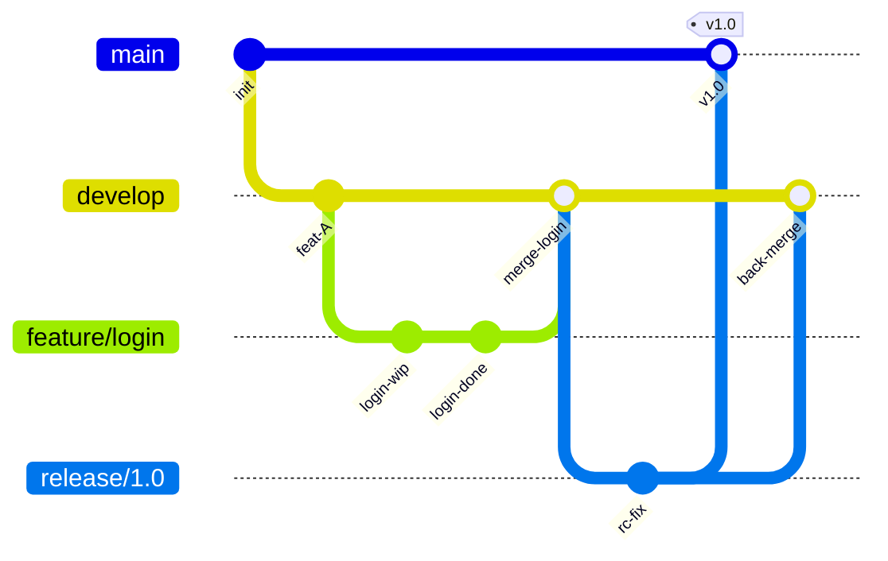

# 🌲 Branching Strategies

> [!abstract] TL;DR
> Branch strategy choice is primarily a **delivery velocity vs isolation tradeoff**. Conflict probability grows as `conflict ∝ p·(λt)` where p=team size, λ=commit rate, t=branch lifetime. GitFlow uses long-lived release/hotfix branches for versioned products; GitHub Flow keeps only `main` deployable with short-lived feature branches; Trunk-Based Development (TBD) mandates branches live ≤1 day, using feature flags to hide incomplete work, minimizing integration lag and enabling DORA-elite deploy frequency.

---

## Intuition — analogy FIRST

Branching strategy is like **highway design**. GitFlow is a city with many roads and roundabouts — great for coordinating complex traffic but slow. GitHub Flow is an expressway with on-ramps — fast and direct. Trunk-Based Development is a single autobahn with invisible lane markers (feature flags) — maximum throughput but requires every driver to be disciplined.

The cost of merging is proportional to how long two lanes of traffic have been diverging.

---

## How It Works



### Strategy Comparison

| Dimension | GitFlow | GitHub Flow | Trunk-Based |
|-----------|---------|-------------|-------------|
| Permanent branches | main, develop | main | main only |
| Feature branch lifetime | Days–weeks | Days | ≤1 day |
| Release mechanism | Release branch | Tag on main | Feature flags + tag |
| Best for | Versioned software, semver | SaaS, web apps | Elite DevOps, high-frequency |
| Deploy frequency | Release-gated | Continuous | Multiple per day |
| Rollback mechanism | Hotfix branch | Revert commit | Feature flag off |
| Merge complexity | High (back-merges) | Low | Minimal |

---

## Key Concepts / Details

### Conflict Probability Formula

```
conflict_probability ∝ p · (λt)
```

Where:
- `p` = number of developers on the branch
- `λ` = commit rate (commits/day)  
- `t` = branch lifetime (days)

**Implication**: A team of 10 (p=10) with a 2-week branch (t=14) at 5 commits/day (λ=5) creates 10×70=700 conflict-units. TBD with t=0.5 reduces this to 10×2.5=25 — a 28× reduction.

### GitFlow — Detailed

```bash
# Branch naming conventions
git checkout -b feature/TICKET-123-user-auth develop
git checkout -b release/1.2.0 develop
git checkout -b hotfix/CVE-2026-1234 main

# After hotfix: merge to BOTH main AND develop
git checkout main && git merge --no-ff hotfix/CVE-2026-1234
git tag -a v1.1.1 -m "security patch"
git checkout develop && git merge --no-ff hotfix/CVE-2026-1234
git branch -d hotfix/CVE-2026-1234
```

**When to use**: Mobile apps with App Store releases, libraries following semver, enterprise software with regulated change windows.

### GitHub Flow — Detailed

```bash
# 1. Create branch from main (never develop)
git checkout -b feat/payment-v2 main

# 2. Small, focused commits
git commit -m "feat(payment): add Stripe webhook handler"

# 3. Open PR early (Draft PR for feedback)
gh pr create --draft --title "feat: payment v2" --base main

# 4. Pass CI, get review, merge
gh pr merge --squash --delete-branch

# 5. main is always deployable — deploy immediately
```

**Key rule**: `main` must always be deployable. Every PR gets CI + review before merge.

### Trunk-Based Development + Feature Flags

```python
# Feature flag pattern — hides incomplete work behind a flag
from feature_flags import is_enabled

def checkout():
    if is_enabled("new_checkout_flow", user_id=current_user.id):
        return new_checkout()
    else:
        return legacy_checkout()
```

```bash
# Short-lived branch: merged within 24 hours
git checkout -b trunk/payment-step1
git commit -m "wip: add payment model (behind flag)"
git push && gh pr create --base main
# Merge same day; flag is OFF in production
```

**Feature flag lifecycle**:
1. Create flag (default OFF)
2. Merge code behind flag
3. Enable for internal users → 1% canary → 100%
4. **Delete flag and dead code** (technical debt if skipped)

### CODEOWNERS and Branch Protection

```
# .github/CODEOWNERS
/src/payments/       @team-payments
/infrastructure/     @team-platform
*.md                 @team-docs
```

```yaml
# Branch protection rules (GitHub)
# Require: 2 reviews, passing CI, CODEOWNERS review
# Restrict: force push, deletion
# Enforce: linear history (no merge commits)
```

---

## Real-World Notes

- **Merge commit vs squash vs rebase**: Squash collapses PR into 1 commit (clean history), rebase linearizes (no merge bubbles), merge commit preserves full history (useful for audits). Choose per team convention, not per PR.
- **Release branches in GitFlow go stale fast**: Teams often forget to back-merge bugfixes from `release/` into `develop`, creating silent divergence. Automate this with post-merge CI.
- **Feature flags are not free**: Each flag is a conditional branch in code + a flag store (LaunchDarkly/Unleash/Flipt). >50 active flags becomes cognitive overhead — schedule flag retirement in the same sprint as the feature GA.
- **Stale branch detector**: Add a weekly CI job that lists branches with last commit >30 days and posts to Slack.

---

## Common Pitfalls

1. **Long-lived "feature" branches** in TBD teams — the strategy breaks down if branches live >1 day; enforce with branch age CI check.
2. **Hotfix forgetting develop merge** in GitFlow — the fix ships to production but regresses in the next release; use a merge-both script.
3. **Unprotected main** — without branch protection, anyone can force-push and rewrite public history.
4. **Flag proliferation without cleanup** — dead flags add permanent conditional branches; set a TTL on every flag at creation.
5. **Draft PRs never leaving draft** — teams treat draft PRs as "in progress" parking lots for weeks; enforce a stale-draft policy.

---

## Related Concepts

- [[_MOC_Git_Version_Control|↑ Git & Version Control MOC]]
- [[Git_Internals|← Git Internals]] — branches are 41-byte files on the DAG
- [[Rebasing_and_History|→ Rebasing & History]] — history linearization options
- [[Git_Hooks_and_Automation|→ Git Hooks]] — enforce branch naming, commit messages
- [[../02_CICD_Pipelines/CICD_Principles_and_Patterns|→ CI/CD Principles]] — pipeline triggers per strategy

---

## Review Questions

1. A team switches from GitFlow to TBD. What is the first operational change they must make before merging to main multiple times per day?
2. Calculate conflict probability for: team of 8, feature branches average 5 days, 3 commits/day each. How much does switching to TBD (1-day branches) reduce this?
3. A hotfix is merged to `main` in GitFlow. List every branch it must also be merged into and why each one matters.

---

## Sources

- Trunk-Based Development: trunkbaseddevelopment.com
- GitFlow: nvie.com/posts/a-successful-git-branching-model
- DORA State of DevOps Report 2024

#DevOps #Git #Branching #GitFlow #TrunkBased #FeatureFlags
