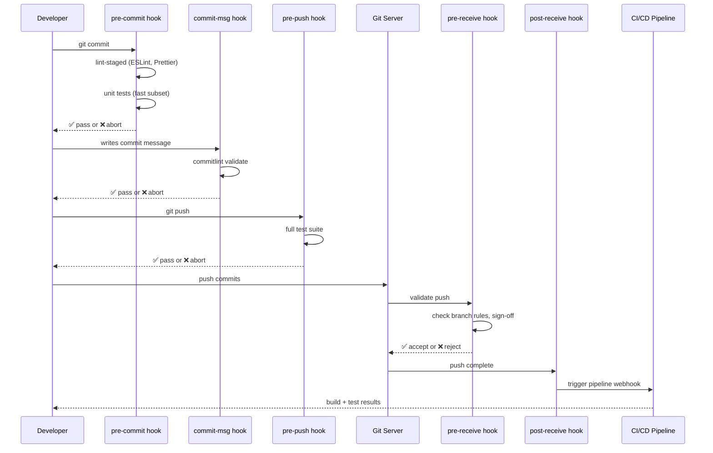

# 🪝 Git Hooks and Automation

> [!abstract] TL;DR
> Git hooks are shell scripts in `.git/hooks/` that execute at lifecycle events. **Client-side**: `pre-commit` (lint/test before commit), `commit-msg` (validate message format), `pre-push` (final gate before remote). **Server-side**: `pre-receive` (reject bad pushes), `update` (per-ref checks), `post-receive` (trigger deploys). Husky manages client hooks in `package.json`, commitlint enforces Conventional Commits (`type(scope): subject`), and `lint-staged` runs linters only on staged files for speed.

---

## Intuition — analogy FIRST

Git hooks are **airport security checkpoints**. Client-side hooks are the baggage check before you leave home (you can skip them, but you'll be caught later). Server-side hooks are the actual TSA checkpoint — you cannot bypass them. Conventional Commits are the boarding pass format — a standardized structure that automated systems (changelogs, semantic-release) can read without human parsing.

---

## How It Works



---

## Key Concepts / Details

### Client-Side Hooks

| Hook | Trigger | Typical Use | Can Skip? |
|------|---------|-------------|-----------|
| `pre-commit` | Before commit created | Lint, format, fast tests | `--no-verify` |
| `prepare-commit-msg` | Before editor opens | Insert branch name into msg | `--no-verify` |
| `commit-msg` | After message written | Commitlint validation | `--no-verify` |
| `post-commit` | After commit created | Notifications, IDE hooks | N/A |
| `pre-rebase` | Before rebase starts | Warn about rebase risks | N/A |
| `post-checkout` | After checkout | Install deps if package.json changed | N/A |
| `pre-push` | Before push | Integration tests, secrets scan | `--no-verify` |

### Server-Side Hooks

| Hook | Trigger | Typical Use | Bypassable? |
|------|---------|-------------|------------|
| `pre-receive` | Before any refs updated | Reject force-push, validate signatures | No (admin only) |
| `update` | Per-ref being updated | Per-branch policies | No |
| `post-receive` | After all refs updated | Trigger CI, send notifications | N/A (already done) |

```bash
# Server hook example: reject commits without JIRA ticket
#!/bin/bash
# .git/hooks/update
refname="$1"
sha1_old="$2"
sha1_new="$3"

if [[ "$refname" == "refs/heads/main" ]]; then
  git log --pretty="%s" "$sha1_old..$sha1_new" | while read msg; do
    if ! echo "$msg" | grep -qE "^[A-Z]+-[0-9]+"; then
      echo "ERROR: Commit '$msg' missing JIRA ticket prefix"
      exit 1
    fi
  done
fi
```

### Husky — Hook Management for JS Projects

```bash
# Install
npm install --save-dev husky lint-staged commitlint @commitlint/config-conventional

# Initialize
npx husky init

# Creates .husky/ directory with managed hooks
```

```bash
# .husky/pre-commit
#!/usr/bin/env sh
. "$(dirname -- "$0")/_/husky.sh"
npx lint-staged
```

```bash
# .husky/commit-msg
#!/usr/bin/env sh
. "$(dirname -- "$0")/_/husky.sh"
npx --no -- commitlint --edit "$1"
```

```json
// package.json
{
  "lint-staged": {
    "*.{ts,tsx,js}": ["eslint --fix", "prettier --write"],
    "*.{css,scss}": ["prettier --write"],
    "*.py": ["black", "flake8"]
  }
}
```

### Commitlint & Conventional Commits

**Conventional Commit format:**
```
<type>(<scope>): <subject>

[optional body]

[optional footer(s)]
```

**Types:**

| Type | Semver Bump | Changelog Section |
|------|------------|-------------------|
| `feat` | minor | Features |
| `fix` | patch | Bug Fixes |
| `feat!` / `BREAKING CHANGE` | major | Breaking Changes |
| `docs` | none | Documentation |
| `chore` | none | (omitted) |
| `refactor` | none | (omitted) |
| `test` | none | (omitted) |
| `perf` | patch | Performance |
| `ci` | none | (omitted) |

```js
// commitlint.config.js
module.exports = {
  extends: ['@commitlint/config-conventional'],
  rules: {
    'scope-enum': [2, 'always', ['api', 'ui', 'infra', 'auth', 'payments']],
    'subject-max-length': [2, 'always', 72],
    'body-max-line-length': [2, 'always', 100],
  }
};
```

### Secrets Scanning Hook

```bash
# .husky/pre-commit — add secrets detection
#!/usr/bin/env sh
. "$(dirname -- "$0")/_/husky.sh"

# Detect common secret patterns
if git diff --cached --diff-filter=A -u | grep -qE \
  "(AKIA[0-9A-Z]{16}|AIza[0-9A-Za-z_-]{35}|password\s*=\s*['\"][^'\"]+['\"])"; then
  echo "ERROR: Potential secret detected in staged changes"
  echo "Use 'git commit --no-verify' only if this is a false positive"
  exit 1
fi

npx lint-staged
```

Better approach: use **detect-secrets** or **gitleaks**:

```bash
# Install gitleaks
brew install gitleaks

# .husky/pre-commit
gitleaks protect --staged -v
```

### Semantic Release — Automated Versioning

```json
// .releaserc.json
{
  "branches": ["main"],
  "plugins": [
    "@semantic-release/commit-analyzer",
    "@semantic-release/release-notes-generator",
    "@semantic-release/changelog",
    "@semantic-release/npm",
    "@semantic-release/github"
  ]
}
```

With Conventional Commits + semantic-release:
- `fix:` → patch bump (1.2.3 → 1.2.4)
- `feat:` → minor bump (1.2.3 → 1.3.0)
- `feat!:` → major bump (1.2.3 → 2.0.0)
- CHANGELOG.md auto-generated
- GitHub Release created automatically

---

## Real-World Notes

- **`--no-verify` is a team risk**: If developers routinely skip hooks, the hooks provide false confidence. Address the root cause (slow hooks) rather than normalizing bypassing.
- **Hook performance matters**: `pre-commit` should complete in <5s or developers disable it. Use `lint-staged` to lint only changed files, not the whole codebase.
- **Monorepo hook optimization**: In a monorepo, `pre-commit` running the full test suite is prohibitive. Use affected-only tools like `nx affected:test --base=HEAD^1`.
- **Server hooks for compliance**: Git hosting platforms (GitHub, GitLab, Bitbucket) have native branch protection rules that are more reliable than server hook scripts.

---

## Common Pitfalls

1. **Hooks not executable** — `chmod +x .git/hooks/pre-commit` required; Husky handles this automatically.
2. **Hooks not version-controlled** — `.git/hooks/` is not tracked; Husky stores hooks in `.husky/` which is tracked.
3. **Slow pre-commit killing adoption** — running full test suite in pre-commit; use fast linting only, reserve tests for CI.
4. **commitlint blocking emergency fixes** — have a documented `--no-verify` exception process for genuine emergencies.
5. **Forgetting to run `husky install` in CI** — `prepare` script handles this: `"prepare": "husky install"` in package.json.

---

## Related Concepts

- [[_MOC_Git_Version_Control|↑ Git & Version Control MOC]]
- [[Branching_Strategies|← Branching Strategies]] — hooks enforce branch naming
- [[Monorepo_Tools|→ Monorepo Tools]] — affected-only hooks in monorepos
- [[../02_CICD_Pipelines/GitHub_Actions|→ GitHub Actions]] — CI pipelines complement hooks

---

## Review Questions

1. A developer uses `git commit --no-verify` to bypass a pre-commit hook. What server-side mechanism can catch violations they introduced?
2. Design a `commit-msg` hook that enforces: type must be `feat|fix|chore`, scope is optional but if present must be in a whitelist, subject max 72 chars.
3. Your `pre-commit` hook takes 45 seconds. List three specific techniques to bring it under 5 seconds.

---

## Sources

- git-scm.com/docs/githooks
- commitlint.js.org
- semantic-release.gitbook.io
- typicode/husky GitHub

#DevOps #Git #Hooks #Husky #Commitlint #ConventionalCommits #Automation
