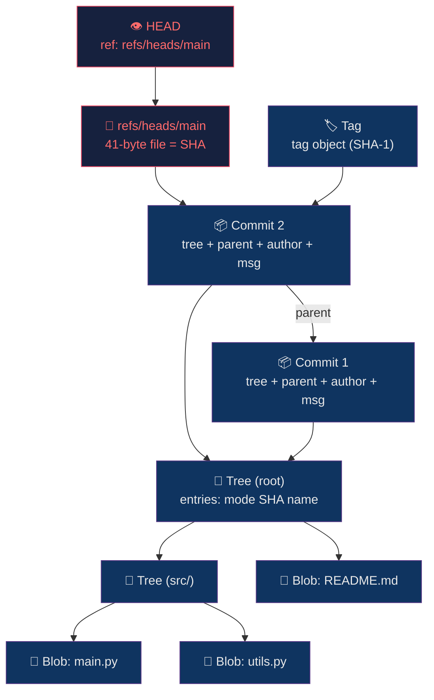

# 🔩 Git Internals

> [!abstract] TL;DR
> Git is a content-addressable filesystem layered with a VCS UX. Every object — blob, tree, commit, tag — is stored by its SHA-1 hash (migrating to SHA-256) in `.git/objects/`. A branch is just a 41-byte file containing a commit hash. Packfiles use delta compression to reduce storage. The reflog provides a 2-week safety net for any `HEAD` movement.

---

## Intuition — analogy FIRST

Think of Git's object store as a **key–value ledger where the key is a fingerprint of the value**. A librarian who catalogs books by MD5 of their content: two identical books always get the same catalog number — that's deduplication. Change one word and the whole fingerprint changes — that's integrity. Git's Merkle DAG is this system applied recursively: file → blob → tree → commit, each hash covering everything below it.

---

## How It Works



### The Four Object Types

| Object | Contains | `git cat-file -t` |
|--------|----------|-------------------|
| **blob** | Raw file content (no filename, no metadata) | `blob` |
| **tree** | List of `(mode, SHA, name)` tuples pointing to blobs/trees | `tree` |
| **commit** | `tree` SHA + parent SHAs + author/committer + message | `commit` |
| **tag** | Annotated tag: points to commit + tagger + message | `tag` |

### Plumbing vs Porcelain

```bash
# Plumbing: low-level commands Git uses internally
git hash-object -w README.md          # write blob, print SHA
git cat-file -p <sha>                 # print object content
git ls-tree HEAD                      # list tree entries
git rev-parse HEAD                    # resolve reference to SHA
git update-ref refs/heads/main <sha>  # move branch

# Porcelain: user-facing commands
git add / git commit / git log / git diff
```

---

## Key Concepts / Details

### Content-Addressable Storage

```bash
# SHA-1 hash of a blob is computed as:
# "blob <length>\0<content>"
printf "blob 5\0hello" | sha1sum
# => aabbcc... (consistent, deterministic)

# Verify object integrity
git fsck --full
```

Git is migrating from **SHA-1** (160-bit) to **SHA-256** (256-bit) via `--object-format=sha256` repositories. The collision risk in SHA-1 (SHAttered attack, 2017) prompted this. Transition is backward-incompatible; most hosted platforms still default to SHA-1.

### Branch = 41-byte File

```bash
# A branch is nothing more than:
cat .git/refs/heads/main
# a491f...  (40 hex chars + newline = 41 bytes)

# HEAD is a symbolic ref:
cat .git/HEAD
# ref: refs/heads/main
# (or a raw SHA if in detached HEAD state)
```

**Branch creation is O(1)** — Git writes a 41-byte file. No copying of files, no forking of directories.

### Packfiles & Delta Compression

When objects accumulate, Git runs `git gc` (garbage collection) or `git repack`, which:
1. Collects loose objects from `.git/objects/xx/yyyy...`
2. Builds a **packfile** (`.git/objects/pack/*.pack`) with index (`.idx`)
3. Applies **delta compression**: stores only diffs between similar objects (e.g., consecutive versions of a large file)
4. Dramatically reduces repo size for text-heavy histories

```bash
git count-objects -vH          # see loose vs packed object counts
git gc --aggressive            # full repack + prune
git verify-pack -v pack-*.idx  # inspect pack contents
```

### Reflog — The Safety Net

```bash
# Reflog records every position HEAD has pointed to (2-week default)
git reflog                     # show HEAD movement history
git reflog show main           # show branch-specific movements

# Recover accidentally deleted branch:
git checkout -b recovered-branch <sha-from-reflog>

# Undo reset --hard:
git reset --hard HEAD@{2}      # go back 2 reflog entries
```

Reflog entries expire: `gc.reflogExpire=90d` (default 90 days for reachable, 30 for unreachable). Always check reflog before declaring commits lost.

### The Index (Staging Area)

The index (`.git/index`) is a **binary file** representing the next commit's tree. `git add` writes blobs to object store and updates the index. `git commit` creates a tree from the index, then a commit pointing to it.

```bash
git ls-files --stage           # inspect raw index entries
git diff --cached              # diff between index and last commit
git diff                       # diff between working tree and index
```

### SHA-1 Namespace & Abbreviation

Git requires only enough characters to be unambiguous within the repo. Default abbreviation: 7 chars. Large repos (e.g., Linux kernel): 12+ chars needed. Configure:

```bash
git config core.abbrev 12      # use 12-char abbreviations
```

---

## Real-World Notes

- **Never `git push --force` to shared branches** — it rewrites remote history; use `--force-with-lease` which fails if someone else has pushed since your last fetch.
- **Shallow clones** (`--depth=50`) fetch only recent history — faster CI clones. `git fetch --unshallow` restores full history.
- **Partial clone** (`--filter=blob:none`) fetches commit/tree objects but defers blobs until checkout — critical for large binary repos.
- **Git LFS** replaces large binaries with pointer files; actual bytes stored in LFS server. Reduces clone size but adds LFS dependency.
- `git maintenance start` schedules background gc/prefetch/commit-graph updates — reduces perceived latency in interactive use.

---

## Common Pitfalls

1. **Mutating history on shared branches** — rebasing or amending pushed commits forces teammates to `reset --hard`, losing work.
2. **Over-relying on SHA abbreviations** — abbreviations that are unique today can collide as the repo grows; scripts should use full SHAs.
3. **Ignoring packfile growth** — repos with large generated files that belong in LFS balloon in size; `git count-objects -vH` monthly.
4. **Detached HEAD state confusion** — commits made in detached HEAD are unreachable after checkout; create a branch immediately.
5. **Reflog expiry blindspot** — reflog doesn't help after `git gc --prune=now --aggressive` or after 90 days.

---

## Related Concepts

- [[_MOC_Git_Version_Control|↑ Git & Version Control MOC]]
- [[Branching_Strategies|→ Branching Strategies]] — branches are just refs on the DAG
- [[Rebasing_and_History|→ Rebasing & History]] — rebase creates new commit objects (new SHAs)
- [[Monorepo_Tools|→ Monorepo Tools]] — sparse-checkout and partial-clone exploit the object model

---

## Review Questions

1. Why does changing a single character in a file produce a completely different commit SHA all the way up the tree?
2. A colleague deleted `main` accidentally. Walk through the exact commands to recover it using the reflog.
3. A repo has 500k loose objects after a CI burst. What command do you run, and what does it produce on disk?

---

## Sources

- Pro Git Book, Scott Chacon — Chapter 10: Git Internals
- git-scm.com/docs/git-cat-file
- SHA-1 collision: "SHAttered" paper, Stevens et al., 2017

#DevOps #Git #Internals #ObjectModel
