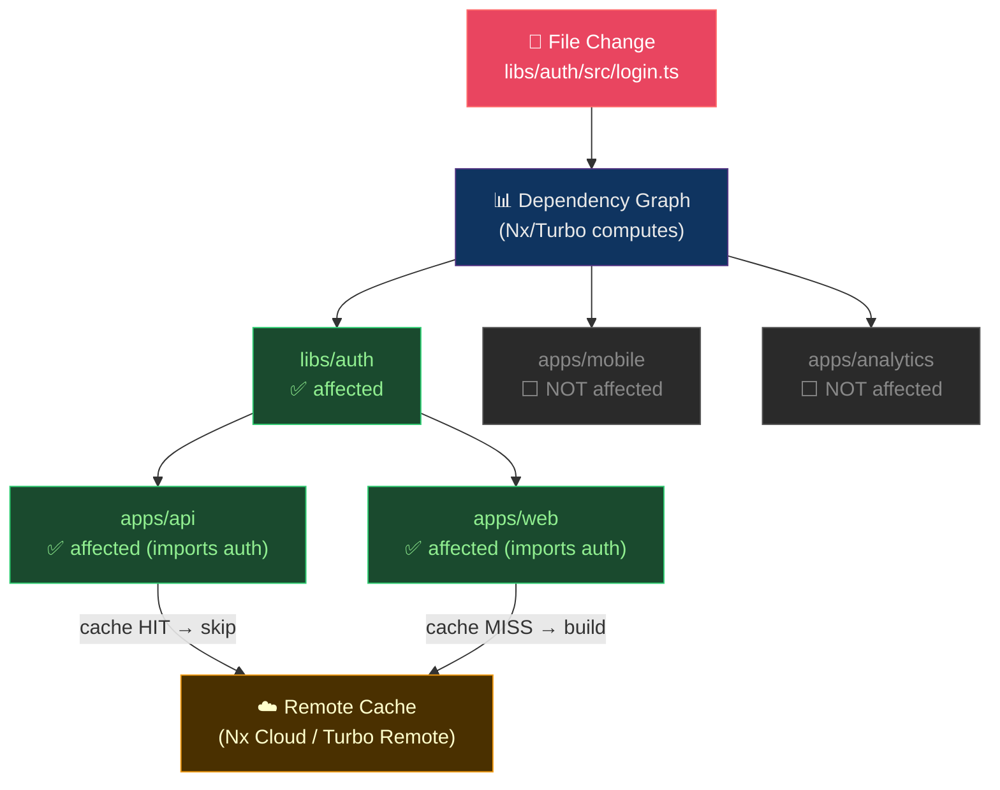

# 🏗️ Monorepo Tools

> [!abstract] TL;DR
> A monorepo houses multiple projects in one repository. The core problem is **build/test blast radius**: changing one package shouldn't rebuild everything. Nx uses a **content-addressed computation cache** and `nx affected` to run only tasks whose dependency graph includes changed files. Turborepo uses `turbo.json` pipeline with `^build` (build dependencies first) and a remote cache. Bazel provides hermetic sandboxed builds with per-action caching. Git's `sparse-checkout` and `partial-clone` optimize checkout size; `git worktree` enables parallel branch work. CODEOWNERS gates review requirements per directory.

---

## Intuition — analogy FIRST

A monorepo without affected-detection is a factory where **changing one screw triggers a full factory inspection**. Nx/Turborepo add a **dependency map**: change the screw → only inspect the machines that use that screw, not the whole floor. Bazel is the most extreme version: every build step is like a sealed lab experiment — only the declared inputs can affect the output, so results are perfectly cacheable and reproducible anywhere.

---

## How It Works



---

## Key Concepts / Details

### Nx — Computation Cache & Affected

```bash
# Install Nx in existing repo
npx nx@latest init

# Run affected tests only (vs base branch)
nx affected:test --base=origin/main --head=HEAD

# Run affected build
nx affected:build --base=origin/main --parallel=5

# Visualize dependency graph
nx graph

# Run specific project and its dependencies
nx run-many -t build -p api web --with-deps
```

```json
// nx.json — core configuration
{
  "tasksRunnerOptions": {
    "default": {
      "runner": "nx/tasks-runners/default",
      "options": {
        "cacheableOperations": ["build", "test", "lint", "e2e"],
        "remoteCache": {
          "enabled": true,
          "url": "https://api.nx.app"
        }
      }
    }
  },
  "targetDefaults": {
    "build": {
      "dependsOn": ["^build"],
      "inputs": ["production", "^production"],
      "outputs": ["{projectRoot}/dist"]
    },
    "test": {
      "inputs": ["default", "^production", "{workspaceRoot}/jest.config.ts"]
    }
  },
  "namedInputs": {
    "production": ["default", "!{projectRoot}/**/*.spec.ts"],
    "default": ["{projectRoot}/**/*", "sharedGlobals"]
  }
}
```

**Content-addressed cache**: Nx computes a **hash of all inputs** (source files + config + env vars + node_modules hash) to generate a task hash. Cache hit = task skipped, artifacts restored from cache. This is **hermetic** — same inputs always produce same outputs (assuming deterministic builds).

### Turborepo — Pipeline DSL

```json
// turbo.json
{
  "$schema": "https://turborepo.org/schema.json",
  "pipeline": {
    "build": {
      "dependsOn": ["^build"],
      "outputs": [".next/**", "dist/**"]
    },
    "test": {
      "dependsOn": ["^build"],
      "inputs": ["src/**/*.ts", "test/**/*.ts"],
      "outputs": ["coverage/**"]
    },
    "lint": {
      "outputs": []
    },
    "dev": {
      "cache": false,
      "persistent": true
    }
  },
  "remoteCache": {
    "signature": true
  }
}
```

```bash
# Run all builds in parallel (respecting deps)
turbo run build

# Run only affected (using --filter)
turbo run test --filter=...[origin/main]

# Filter by package name
turbo run build --filter=@acme/api

# Remote cache via Vercel or self-hosted
TURBO_TOKEN=xxx TURBO_TEAM=myteam turbo run build
```

**`^build`**: The caret means "first build all packages this package depends on." Topological ordering is automatic.

### Bazel — Hermetic Builds

```python
# BUILD file (Bazel)
load("@npm//:defs.bzl", "npm_link_all_packages")
load("@aspect_rules_ts//ts:defs.bzl", "ts_project")

ts_project(
    name = "auth_lib",
    srcs = glob(["src/**/*.ts"]),
    deps = [
        "//libs/shared:utils",
        "@npm//:lodash",
    ],
    declaration = True,
)
```

```bash
# Build specific target
bazel build //apps/api:bundle

# Test with caching
bazel test //libs/auth/...

# Remote execution + caching
bazel build //... --remote_executor=grpcs://rbe.example.com
```

**Bazel's hermetic sandbox**: Each action runs in an isolated environment with only declared inputs accessible. No access to system PATH, env vars, or undeclared files. This guarantees **reproducibility** — the same action on any machine produces identical outputs (enabling distributed caching with zero false-sharing).

| Tool | Cache Scope | Hermeticity | Learning Curve | Best For |
|------|-------------|-------------|----------------|----------|
| Nx | Project-task level | Moderate | Low | JS/TS monorepos |
| Turborepo | Package-task level | Moderate | Very Low | Next.js, Vercel teams |
| Bazel | Action level | High | High | Polyglot, large scale |

### Git Sparse-Checkout

```bash
# Clone without checking out all files
git clone --no-checkout --depth=1 https://github.com/org/mono-repo.git
cd mono-repo
git sparse-checkout init --cone

# Specify which paths to materialize
git sparse-checkout set apps/api libs/auth libs/shared

# Checkout
git checkout main

# Add more paths later
git sparse-checkout add apps/web
```

**Cone mode**: Only includes directories explicitly listed (no glob matching), which is significantly faster for large repos.

### Git Partial Clone

```bash
# Clone with no blob objects (deferred download)
git clone --filter=blob:none https://github.com/org/mono-repo.git

# Or exclude large blobs
git clone --filter=blob:limit=1m https://github.com/org/mono-repo.git

# Combine with sparse-checkout for maximum speed
git clone --filter=blob:none --sparse https://github.com/org/mono-repo.git
```

### Git Worktree

```bash
# Work on two branches simultaneously without stashing
git worktree add ../hotfix-1234 origin/main
cd ../hotfix-1234
git checkout -b hotfix/CVE-1234
# ... make fix ...
cd ../mono-repo    # original workspace unaffected

# List worktrees
git worktree list

# Remove when done
git worktree remove ../hotfix-1234
```

### CODEOWNERS

```
# .github/CODEOWNERS
# Default reviewers
*                    @org/platform-team

# Per-directory owners
/apps/web/           @org/frontend-team @alice
/apps/api/           @org/backend-team
/libs/auth/          @org/security-team @org/backend-team
/infrastructure/     @org/platform-team
/docs/               @org/tech-writers

# File-pattern owners
*.go                 @org/backend-team
*.tf                 @org/platform-team
Dockerfile           @org/platform-team @org/security-team
```

**CODEOWNERS behavior**: GitHub/GitLab automatically requests review from owners when their paths are changed. In branch protection, "Require review from CODEOWNERS" makes this mandatory.

---

## Real-World Notes

- **Remote cache hit rates**: Teams report 70–95% cache hit rates with Nx Cloud after initial warm-up. This translates to CI pipelines dropping from 20 min to 3 min.
- **Nx vs Turborepo choice**: If you're already in the React/Next.js ecosystem and want zero config, Turborepo. If you need project graph, code generation, and cross-framework support, Nx.
- **Bazel adoption cost**: Bazel is powerful but requires significant investment in BUILD files and rule sets. Evaluate carefully unless you have >500k lines of code and CI bottlenecks.
- **Sparse-checkout in CI**: Dramatically speeds up checkout step in CI for large monorepos. Combine with `--depth=1` for maximum speed.

---

## Common Pitfalls

1. **Non-deterministic builds defeat caching** — if your build embeds timestamps or random UUIDs, cache hits are impossible; audit `Date.now()` usage in build scripts.
2. **Missing `outputs` in turbo.json** — if outputs aren't declared, Turborepo can't restore them from cache; CI builds pass locally but fail in CI.
3. **CODEOWNERS with typos** — GitHub silently ignores invalid CODEOWNERS entries; validate with GitHub's CODEOWNERS linter.
4. **Sparse-checkout leaving stale paths** — after removing a path from sparse-checkout, the files remain; must run `git sparse-checkout reapply`.
5. **Worktree branch conflicts** — a branch checked out in a worktree can't be checked out in another; Git errors clearly but confuses newcomers.

---

## Related Concepts

- [[_MOC_Git_Version_Control|↑ Git & Version Control MOC]]
- [[Git_Internals|← Git Internals]] — sparse-checkout exploits the object model
- [[Git_Hooks_and_Automation|← Git Hooks]] — affected-only hooks in CI
- [[../02_CICD_Pipelines/CICD_Principles_and_Patterns|→ CI/CD Principles]] — affected-only CI pipelines

---

## Review Questions

1. A monorepo has 50 packages. Changing `libs/auth` should trigger tests for `apps/api` and `apps/web` (which import auth) but not `apps/analytics`. How does Nx determine this, and what file/config drives it?
2. Explain the difference between `dependsOn: ["^build"]` and `dependsOn: ["build"]` in Turborepo's pipeline.
3. A CI run takes 25 minutes rebuilding everything. After implementing Nx remote cache, the team reports 80% cache hit rate. Estimate the new p50 CI duration, assuming individual task times are uniformly distributed.

---

## Sources

- nx.dev — Official Nx documentation
- turbo.build/repo — Turborepo documentation
- bazel.build — Bazel documentation
- git-scm.com/docs/git-sparse-checkout

#DevOps #Git #Monorepo #Nx #Turborepo #Bazel #SparseCheckout #CODEOWNERS
