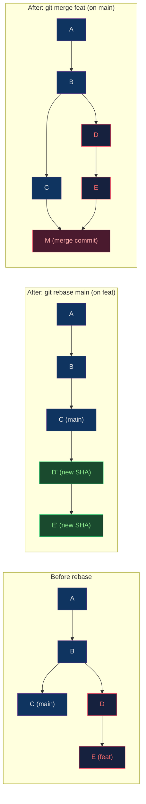

# ♻️ Rebasing and History

> [!abstract] TL;DR
> `git merge` preserves the full branching history (diverge + reconverge) with a merge commit. `git rebase` *copies* commits onto a new base — same code, **new SHA-1 hashes** — producing a linear history. Interactive rebase (`-i`) offers pick/reword/edit/squash/fixup/drop with `--autosquash` to auto-apply fixup! commits. `git bisect` performs binary search to find regressions in ⌈log₂n⌉ steps. Never force-push without `--force-with-lease`.

---

## Intuition — analogy FIRST

Think of commits as Lego instructions. **Merge** takes two instruction manuals and staples a "combine here" page between them — both histories are intact, but the binder gets thick. **Rebase** photocopies your instructions and retypes them as if you'd started from your colleague's latest page — the steps are identical but the paper is new (new SHA). The linear result looks cleaner but requires discipline: photocopied instructions on a shared desk confuse everyone.

---

## How It Works



### Merge vs Rebase Comparison

| Aspect | Merge | Rebase |
|--------|-------|--------|
| History shape | Non-linear (diverge/converge) | Linear |
| Commit SHAs | Preserved | New hashes (D→D', E→E') |
| Merge commit | Yes | No |
| Safe to use on shared branches | Yes | **No — rewrites history** |
| Conflict resolution | Once (at merge point) | Once per replayed commit |
| `git log --graph` | Branchy, complex | Clean, sequential |

---

## Key Concepts / Details

### Basic Rebase

```bash
# On feature branch, rebase onto latest main
git checkout feat/login
git fetch origin
git rebase origin/main

# Conflict during rebase:
# 1. Fix conflict in file
# 2. git add <file>
# 3. git rebase --continue
# OR: git rebase --abort (return to pre-rebase state)

# Rebase with onto (graft branch onto different base):
git rebase --onto main server client
# Takes commits reachable from client but not server,
# and replays them onto main
```

### Interactive Rebase — The Power Tool

```bash
git rebase -i HEAD~5       # interactively edit last 5 commits
git rebase -i <base-sha>   # interactively edit from base

# Editor opens with:
pick a1b2c3 add user model
pick d4e5f6 WIP: fix typo
pick g7h8i9 fixup! add user model
pick j1k2l3 add user tests
pick m4n5o6 squash! add user model
```

**Commands in interactive rebase:**

| Command | Alias | Effect |
|---------|-------|--------|
| `pick` | `p` | Keep commit as-is |
| `reword` | `r` | Keep commit, edit message |
| `edit` | `e` | Pause after commit (amend, split) |
| `squash` | `s` | Meld into previous, edit message |
| `fixup` | `f` | Meld into previous, discard message |
| `drop` | `d` | Remove commit entirely |
| `exec` | `x` | Run shell command after each step |

### `--autosquash` with Conventional Fixups

```bash
# Create a fixup commit (auto-squashed during rebase)
git commit --fixup=a1b2c3        # creates "fixup! original message"
git commit --squash=a1b2c3       # creates "squash! original message"

# Auto-apply fixups in order
git rebase -i --autosquash HEAD~10

# Configure permanently
git config --global rebase.autosquash true
```

### Cherry-Pick

```bash
# Apply a specific commit from another branch
git cherry-pick <sha>              # single commit
git cherry-pick <sha1>..<sha2>     # range (exclusive start)
git cherry-pick <sha1>^..<sha2>    # range (inclusive start)

# Cherry-pick without auto-committing (inspect first)
git cherry-pick -n <sha>           # --no-commit

# Typical use: port hotfix from main to release/1.x
git checkout release/1.2
git cherry-pick abc123def          # the hotfix commit
```

### Git Bisect — Binary Search for Bugs

```bash
# ⌈log₂n⌉ steps to find the bad commit among n commits
# 1000 commits → max 10 tests

git bisect start
git bisect bad                     # current commit is broken
git bisect good v1.0               # v1.0 was known-good

# Git checks out the midpoint; you test:
# runs your test suite
make test
git bisect good                    # or: git bisect bad

# Automate with a script:
git bisect run ./test.sh           # exits 0=good, 1=bad, 125=skip

# When found:
# "abc123 is the first bad commit"
git bisect reset                   # return to original HEAD
```

**Formula**: ⌈log₂(1000)⌉ = ⌈9.97⌉ = **10 tests** to isolate among 1000 commits.

### `--force-with-lease` vs `--force`

```bash
# NEVER use --force on shared branches
git push --force origin main         # DANGEROUS: overwrites remote

# --force-with-lease: fails if remote has new commits you haven't fetched
git push --force-with-lease origin feat/login
# Error if someone else pushed since your last fetch
# Safe: confirms your local "expected" state matches remote

# Even safer: --force-if-includes (Git 2.30+)
git push --force-if-includes --force-with-lease origin feat/login
```

### Splitting a Commit

```bash
git rebase -i HEAD~3
# Change "pick" to "edit" for the commit to split

git reset HEAD^                    # unstage the commit's changes
git add -p                         # interactively stage part 1
git commit -m "part 1"
git add -p                         # interactively stage part 2
git commit -m "part 2"
git rebase --continue
```

---

## Real-World Notes

- **Rebase before merge**: On teams using PRs, rebase your branch onto main before requesting review — it simplifies the diff and eliminates "merge conflicts" the reviewer has to mentally untangle.
- **Merge commits for audits**: Regulated environments (SOX, PCI) often require explicit merge commits to record the integration event and approver. Don't blindly rebase in these contexts.
- **Git reflog + bisect combo**: If a bisect reveals a commit that introduced a regression but you've since rebased, use `git reflog` to find the original SHA.
- **`git log --graph --decorate --oneline`**: Always alias this. It's the single most useful command for understanding a repo's branching topology.

```bash
# Useful alias
git config --global alias.lg "log --graph --pretty=format:'%Cred%h%Creset -%C(yellow)%d%Creset %s %Cgreen(%cr) %C(bold blue)<%an>%Creset' --abbrev-commit"
```

---

## Common Pitfalls

1. **Rebasing a branch others have checked out** — their local branch diverges; they must `git fetch && git reset --hard origin/feat` to recover.
2. **Squashing merge commits** — squash can destroy the record of which PR introduced a change, breaking `git blame` back-tracing.
3. **Cherry-pick conflicts that silently win** — cherry-pick with `-X theirs` auto-resolves conflicts by preferring the picked commit; easy to silently lose important context.
4. **Bisect not resetting on abort** — if you forget `git bisect reset`, you're in a detached HEAD; future commits are unreachable.
5. **`--autosquash` without reviewing** — auto-squashed commits reorder the history; always review the resulting rebase plan before proceeding.

---

## Related Concepts

- [[_MOC_Git_Version_Control|↑ Git & Version Control MOC]]
- [[Git_Internals|← Git Internals]] — why rebase creates new SHAs
- [[Branching_Strategies|← Branching Strategies]] — when to merge vs rebase
- [[Git_Hooks_and_Automation|→ Git Hooks]] — pre-push hook to block force-push

---

## Review Questions

1. A rebase of 5 commits hits conflicts on commit 3. Describe the exact steps to resolve, continue, and verify the result.
2. A bug was introduced somewhere in the last 512 commits. How many `git bisect` steps are needed, and what happens if a test is flaky (sometimes passes, sometimes fails)?
3. Your teammate ran `git push --force` on a shared branch. Walk through the exact recovery steps to restore the remote to its correct state.

---

## Sources

- Pro Git Book: Chapter 3 (Branching), Chapter 7 (Tools)
- git-scm.com/docs/git-rebase
- git-scm.com/docs/git-bisect

#DevOps #Git #Rebase #History #Bisect #CherryPick
