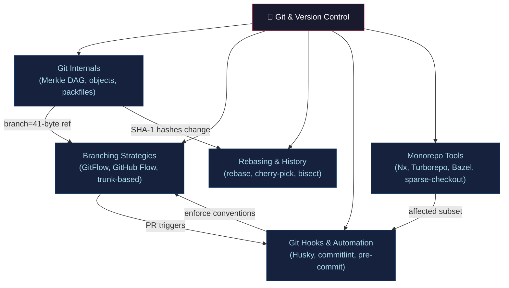

# 🌿 Git & Version Control — Section MOC

> [!abstract] Section Overview
> Git is a content-addressable distributed version control system built on a Merkle DAG of immutable objects. Mastering Git internals unlocks confident use of rebase, cherry-pick, bisect, and monorepo tooling at scale.

---

## Concept Map



---

## Notes in This Section

| Note | Key Concepts | Difficulty |
|------|-------------|------------|
| [[Git_Internals\|Git Internals]] | blob/tree/commit/tag objects, SHA-1, packfiles, reflog | Intermediate |
| [[Branching_Strategies\|Branching Strategies]] | GitFlow, GitHub Flow, trunk-based, conflict probability | Intermediate |
| [[Rebasing_and_History\|Rebasing & History]] | rebase vs merge, interactive rebase, bisect, --force-with-lease | Intermediate |
| [[Git_Hooks_and_Automation\|Git Hooks & Automation]] | client/server hooks, Husky, commitlint, Conventional Commits | Beginner |
| [[Monorepo_Tools\|Monorepo Tools]] | Nx, Turborepo, Bazel, sparse-checkout, CODEOWNERS | Advanced |

---

## Learning Path

```
Git Internals → Branching Strategies → Rebasing & History
→ Git Hooks & Automation → Monorepo Tools
```

---

## Key Questions

1. How does Git's content-addressable store guarantee data integrity?
2. Why does rebasing change commit SHAs, and when is that dangerous?
3. How does trunk-based development reduce integration conflict probability?
4. What is the performance difference between Nx computation cache and full rebuilds?
5. When should you use `--force-with-lease` instead of `--force`?

---

## Related Sections

- [[_MOC_DevOps_Master|↑ DevOps Master MOC]]
- [[../02_CICD_Pipelines/_MOC_CICD_Pipelines|→ CI/CD Pipelines]] — hooks trigger pipelines
- [[../05_Infrastructure_as_Code/_MOC_Infrastructure_as_Code|→ IaC]] — GitOps pattern origins

---

#DevOps #Git #MOC
