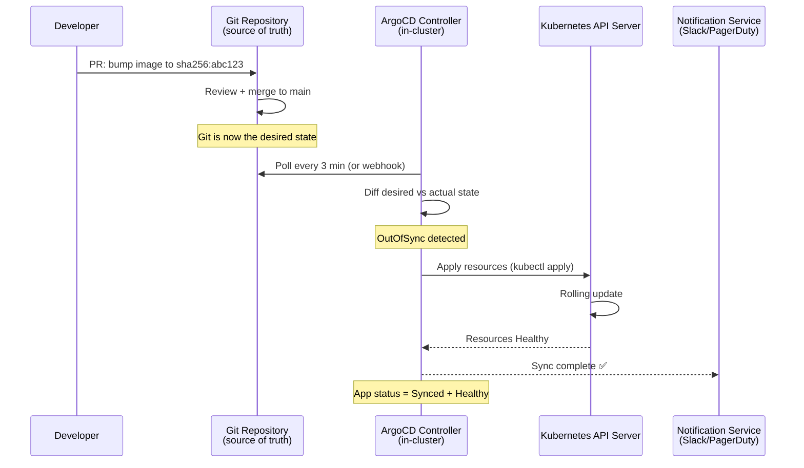

# 🔄 ArgoCD and GitOps

> [!abstract] TL;DR
> GitOps treats **Git as the single source of truth** for infrastructure and application state. ArgoCD is a pull-based Kubernetes GitOps controller: it continuously compares the desired state in Git against the actual state in the cluster and reconciles differences. Core CRD: `Application` (Git repo + path → K8s cluster + namespace). Advanced: sync-waves (order resource creation), sync-hooks (pre/post-sync Jobs), `ApplicationSets` (generate Applications from templates), and app-of-apps pattern. Flux is the CNCF alternative with Kustomize-native design.

---

## Intuition — analogy FIRST

Traditional CI/CD is **push-based**: your pipeline SSH-es into the server and deploys. GitOps is **pull-based**: the cluster runs a controller that watches Git like an employee watching a whiteboard — when the whiteboard (Git) shows a new diagram, the employee (controller) updates the factory (cluster) to match. Nobody needs to hand the employee instructions; they keep checking and self-correcting.

The key insight: **auditability** is built-in. Every change to the cluster was first a Git commit with author, message, and review. Drift (cluster differs from Git) is automatically corrected.

---

## How It Works



---

## Key Concepts / Details

### Application CRD

```yaml
# ArgoCD Application manifest
apiVersion: argoproj.io/v1alpha1
kind: Application
metadata:
  name: myapp-production
  namespace: argocd
  finalizers:
    - resources-finalizer.argocd.argoproj.io  # cascade delete
spec:
  project: production                           # AppProject RBAC scope
  source:
    repoURL: https://github.com/org/k8s-config
    targetRevision: HEAD
    path: apps/myapp/overlays/production
    # Helm alternative:
    # chart: myapp
    # helm:
    #   valueFiles: [values-production.yaml]
    #   parameters:
    #     - name: image.tag
    #       value: "sha256:abc123"

  destination:
    server: https://kubernetes.default.svc     # in-cluster
    namespace: myapp-production

  syncPolicy:
    automated:
      prune: true          # delete resources removed from Git
      selfHeal: true       # revert manual kubectl changes
      allowEmpty: false    # never sync empty application
    syncOptions:
      - CreateNamespace=true
      - PrunePropagationPolicy=foreground
      - ApplyOutOfSyncOnly=true
    retry:
      limit: 5
      backoff:
        duration: 5s
        factor: 2
        maxDuration: 3m
```

### Sync Waves — Ordering Resources

```yaml
# Resource with sync wave annotation
# Wave -1: CRDs (must exist before instances)
apiVersion: apiextensions.k8s.io/v1
kind: CustomResourceDefinition
metadata:
  name: myresources.example.com
  annotations:
    argocd.argoproj.io/sync-wave: "-1"

# Wave 0 (default): Namespaces, ConfigMaps, Secrets
apiVersion: v1
kind: ConfigMap
metadata:
  annotations:
    argocd.argoproj.io/sync-wave: "0"

# Wave 1: Deployments
apiVersion: apps/v1
kind: Deployment
metadata:
  annotations:
    argocd.argoproj.io/sync-wave: "1"

# Wave 2: HPA, PodDisruptionBudget (after pods exist)
apiVersion: autoscaling/v2
kind: HorizontalPodAutoscaler
metadata:
  annotations:
    argocd.argoproj.io/sync-wave: "2"
```

**Wave ordering**: ArgoCD applies resources in ascending wave order. Each wave must reach Healthy status before the next wave begins. This ensures databases are ready before applications, CRDs before CRs.

### Sync Hooks — Pre/Post Actions

```yaml
# Pre-sync hook: database migration before deployment
apiVersion: batch/v1
kind: Job
metadata:
  name: db-migration
  annotations:
    argocd.argoproj.io/hook: PreSync
    argocd.argoproj.io/hook-delete-policy: HookSucceeded
spec:
  template:
    spec:
      containers:
        - name: migrate
          image: myapp:latest
          command: ["python", "manage.py", "migrate"]
      restartPolicy: Never

# Post-sync hook: smoke test after deployment
apiVersion: batch/v1
kind: Job
metadata:
  name: smoke-test
  annotations:
    argocd.argoproj.io/hook: PostSync
    argocd.argoproj.io/hook-delete-policy: HookFailed
spec:
  template:
    spec:
      containers:
        - name: smoke
          image: curlimages/curl
          command:
            - /bin/sh
            - -c
            - |
              curl -f https://myapp.example.com/health || exit 1
      restartPolicy: Never
```

**Hook types**: `PreSync`, `Sync`, `PostSync`, `SyncFail`, `Skip`
**Delete policies**: `HookSucceeded`, `HookFailed`, `BeforeHookCreation`

### ApplicationSet — Generate Applications at Scale

```yaml
# Generate one Application per cluster from a list
apiVersion: argoproj.io/v1alpha1
kind: ApplicationSet
metadata:
  name: myapp-all-clusters
  namespace: argocd
spec:
  generators:
    - list:
        elements:
          - cluster: staging
            url: https://staging.k8s.example.com
            values:
              replicas: "2"
          - cluster: production-us
            url: https://prod-us.k8s.example.com
            values:
              replicas: "5"
          - cluster: production-eu
            url: https://prod-eu.k8s.example.com
            values:
              replicas: "5"

  template:
    metadata:
      name: "myapp-{{cluster}}"
    spec:
      project: default
      source:
        repoURL: https://github.com/org/k8s-config
        targetRevision: HEAD
        path: "apps/myapp"
        helm:
          parameters:
            - name: replicaCount
              value: "{{values.replicas}}"
      destination:
        server: "{{url}}"
        namespace: myapp
      syncPolicy:
        automated:
          selfHeal: true
          prune: true
```

**Other generators**: Git (directory per cluster), Cluster (from registered clusters), Matrix (cartesian product), Pull Request (ephemeral preview environments per PR).

### App-of-Apps Pattern

```yaml
# Root application that manages all other applications
apiVersion: argoproj.io/v1alpha1
kind: Application
metadata:
  name: root-app
  namespace: argocd
spec:
  source:
    repoURL: https://github.com/org/k8s-config
    path: argocd/apps          # directory of Application manifests
    targetRevision: HEAD
  destination:
    server: https://kubernetes.default.svc
    namespace: argocd
  syncPolicy:
    automated:
      selfHeal: true
```

### ArgoCD vs Flux Comparison

| Feature | ArgoCD | Flux v2 |
|---------|--------|---------|
| UI | Rich web UI + CLI | CLI + Grafana dashboard |
| Config approach | Application CRD | GitRepository + Kustomization CRDs |
| Multi-cluster | ApplicationSet | Native GitOps Toolkit |
| Helm support | Native | HelmRelease CRD |
| Notification | argocd-notifications | alert-manager / notification-controller |
| CNCF project | Incubating → Graduated | Graduated |
| SSO | Native | Via Weave GitOps |
| Preview environments | ApplicationSet PR generator | N/A (external tools) |

### ArgoCD CLI

```bash
# Login
argocd login argocd.example.com --sso

# List applications
argocd app list

# Check sync status
argocd app get myapp-production

# Manual sync
argocd app sync myapp-production

# Sync specific resource
argocd app sync myapp-production --resource apps:Deployment:myapp

# Rollback to previous revision
argocd app rollback myapp-production 3

# Diff (what would change)
argocd app diff myapp-production

# Wait for sync completion
argocd app wait myapp-production --health --timeout 300
```

---

## Real-World Notes

- **Git repo structure**: Separate config repo from app code repo. Config repo contains K8s manifests/Helm values. CI pipeline commits image tags to config repo; ArgoCD picks up changes.
- **selfHeal prevents config drift**: `selfHeal: true` means if someone runs `kubectl scale deployment myapp --replicas=10`, ArgoCD reverts it within minutes. This enforces Git as the only valid change mechanism.
- **RBAC with AppProjects**: Define `AppProject` resources to limit which Git repos, clusters, and namespaces each team's Applications can reference. Prevents one team's misconfiguration from affecting another.
- **Notification controller**: ArgoCD notifications sends Slack/PagerDuty alerts on sync events. Configure triggers like `on-sync-failed`, `on-health-degraded`.

---

## Common Pitfalls

1. **`prune: true` removing manually created resources** — resources not tracked in Git get deleted; add `argocd.argoproj.io/managed-by: argocd` annotation to exempt resources.
2. **No sync window for production** — allow unexpected syncs to production at 3AM; configure sync windows restricting automated sync to business hours.
3. **Hook Jobs not cleaned up** — without `hook-delete-policy`, PreSync Jobs accumulate; always set a delete policy.
4. **ApplicationSet with Git generator and broad path** — generating 100+ apps unintentionally; test with dry-run first.
5. **Secrets in Git** — ArgoCD pulls from Git as-is; use Sealed Secrets, External Secrets Operator, or SOPS to encrypt secrets before committing.

---

## Related Concepts

- [[_MOC_CICD_Pipelines|↑ CI/CD Pipelines MOC]]
- [[CICD_Principles_and_Patterns|← CI/CD Principles]] — pull vs push deploy
- [[Release_Strategies|→ Release Strategies]] — Argo Rollouts for canary/blue-green
- [[../04_Kubernetes/Helm_Charts|→ Helm Charts]] — ArgoCD manages Helm releases
- [[../04_Kubernetes/Operators_and_CRDs|→ Operators & CRDs]] — Application CRD pattern

---

## Review Questions

1. An operator manually scales a deployment to 20 replicas to handle a traffic spike. ArgoCD reverts it to 3 replicas 2 minutes later. How do you immediately prevent this while preserving GitOps practices?
2. Your application requires a database migration before each deployment. Design the sync-wave and hook strategy to ensure migrations complete before pods start.
3. You need to deploy the same application to 15 clusters across 3 regions with different replica counts. Which ApplicationSet generator would you use and how would you structure the configuration?

---

## Sources

- argo-cd.readthedocs.io
- fluxcd.io/flux/
- gitops.tech — GitOps principles
- OpenGitOps CNCF Working Group

#DevOps #CICD #ArgoCD #GitOps #Flux #Kubernetes #SyncWaves #ApplicationSet
