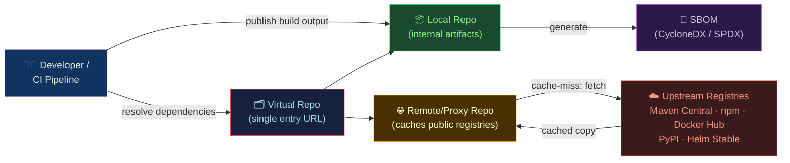

# 📦 Artifact Management

> [!abstract] TL;DR
> Artifact management is the discipline of storing, versioning, and distributing build outputs — JARs, npm packages, Docker images, Helm charts, Python wheels, and more — in a **binary repository**. The two dominant tools are **JFrog Artifactory** (enterprise feature-rich) and **Sonatype Nexus Repository** (OSS-friendly, widely used). They serve three roles simultaneously: (1) a **local repository** for internally built artifacts, (2) a **remote proxy** that caches public registries (Maven Central, Docker Hub, npm), and (3) a **virtual repository** that merges multiple sources into one URL. Combined with **SBOM** (Software Bill of Materials), artifact repositories become the cornerstone of software supply chain security.

---

## Intuition — analogy FIRST

Think of an artifact repository as a **company's internal parts warehouse**. When a mechanic (CI pipeline) needs a bolt (library), they first check the warehouse — if it's in stock (cached from a prior build), they grab it immediately. If not, the warehouse orders it from the supplier (Maven Central / npm) and keeps a copy for the next request. When the mechanic finishes manufacturing a new part (building an artifact), they deposit it in the warehouse with a part number (version) so other mechanics can use it. Nothing goes directly to the assembly line (production) without passing through the warehouse — quality-controlled, tracked, and versioned.

---

## How It Works



---

## Key Concepts / Details

### Artifact Types and Repository Formats

| Format | Tool/Ecosystem | Example Artifact |
|--------|---------------|-----------------|
| **Maven/Gradle** | Java | `com.example:mylib:1.2.3.jar` |
| **npm** | Node.js | `@myorg/utils@1.0.0.tgz` |
| **PyPI** | Python | `mylib-1.2.3-py3-none-any.whl` |
| **Docker (OCI)** | Containers | `registry.example.com/app:sha256-abc…` |
| **Helm** | Kubernetes charts | `myapp-1.2.3.tgz` |
| **Generic** | Any binary | `.tar.gz`, `.zip`, `binary` |
| **NuGet** | .NET | `MyLib.1.2.3.nupkg` |
| **Go** | Go modules | `github.com/myorg/lib@v1.2.3` |

### JFrog Artifactory — Setup and Usage

```yaml
# docker-compose.yml — Artifactory OSS
services:
  artifactory:
    image: releases-docker.jfrog.io/jfrog/artifactory-oss:latest
    ports:
      - "8081:8081"    # main API/UI port
      - "8082:8082"    # router / metrics
    volumes:
      - ./artifactory_data:/var/opt/jfrog/artifactory
    environment:
      - JF_SHARED_DATABASE_TYPE=postgresql
```

```bash
# Configure Artifactory CLI (JFrog CLI)
jf config add myserver \
  --url=https://artifactory.example.com \
  --user=admin \
  --password=$ARTIFACTORY_PASSWORD

# Upload a JAR to a local Maven repo
jf rt upload "target/*.jar" "libs-release-local/com/example/mylib/1.2.3/"

# Download an artifact
jf rt download "libs-release-local/com/example/mylib/1.2.3/mylib-1.2.3.jar"

# Publish npm package
echo "registry=https://artifactory.example.com/artifactory/api/npm/npm-local/" > .npmrc
npm publish

# Push Docker image
docker tag myapp:latest artifactory.example.com/docker-local/myapp:1.2.3
docker push artifactory.example.com/docker-local/myapp:1.2.3

# Search artifacts with AQL (Artifactory Query Language)
jf rt search --aql '
items.find({
  "repo": "libs-release-local",
  "name": {"$match": "mylib-*.jar"},
  "created": {"$gt": "2026-01-01T00:00:00.000Z"}
})'
```

### Nexus Repository OSS — Setup and Usage

```yaml
# docker-compose.yml — Nexus 3
services:
  nexus:
    image: sonatype/nexus3:latest
    ports:
      - "8081:8081"
      - "8082:8082"    # Docker hosted repo port
    volumes:
      - nexus-data:/nexus-data
volumes:
  nexus-data:
```

```xml
<!-- Maven settings.xml — point to Nexus proxy -->
<settings>
  <mirrors>
    <mirror>
      <id>nexus</id>
      <mirrorOf>*</mirrorOf>
      <url>http://nexus.example.com:8081/repository/maven-public/</url>
    </mirror>
  </mirrors>
  <servers>
    <server>
      <id>nexus</id>
      <username>admin</username>
      <password>${NEXUS_PASSWORD}</password>
    </server>
  </servers>
</settings>
```

### Proxying Public Registries

```bash
# Docker — configure daemon to use Nexus as Docker Hub mirror
# /etc/docker/daemon.json
{
  "registry-mirrors": ["http://nexus.example.com:8082"]
}

# npm — use Nexus proxy for npm registry
npm config set registry http://nexus.example.com:8081/repository/npm-proxy/

# pip — use Nexus proxy for PyPI
pip install mypackage --index-url http://nexus.example.com:8081/repository/pypi-proxy/simple/

# Helm — add Nexus Helm proxy
helm repo add nexus http://nexus.example.com:8081/repository/helm-proxy/
helm repo update
helm install myapp nexus/myapp --version 1.2.3
```

### Artifact Retention Policies

```bash
# JFrog — cleanup policy (via REST API)
curl -X POST "https://artifactory.example.com/artifactory/api/storage/libs-snapshot-local" \
  -H "Authorization: Bearer $TOKEN" \
  -d '{
    "retention": {
      "maxCount": 10,
      "daysToKeep": 30,
      "includedPackages": ["**/*-SNAPSHOT*"]
    }
  }'

# Nexus — cleanup policy (UI or REST)
# Create a policy: remove artifacts older than 30 days AND not downloaded in 7 days
# Task: "Admin - Compact blob store" after cleanup to reclaim disk space
```

### SBOM — Software Bill of Materials

```bash
# Generate SBOM with Syft (open source)
syft packages docker:myapp:1.2.3 -o cyclonedx-json=sbom.cyclonedx.json
syft packages docker:myapp:1.2.3 -o spdx-json=sbom.spdx.json

# Publish SBOM to Artifactory (store alongside artifact)
jf rt upload "sbom.cyclonedx.json" \
  "libs-release-local/com/example/myapp/1.2.3/myapp-1.2.3-cyclonedx.json"

# Scan SBOM for vulnerabilities with Grype
grype sbom:./sbom.cyclonedx.json

# JFrog Xray — built-in SBOM + vulnerability scanning
# Automatically generates SBOMs and scans artifacts using a graph-based
# dependency model; integrates with Artifactory watches + policies
```

### GitHub Actions — CI/CD Integration

```yaml
name: Build and Publish Artifact
on:
  push:
    branches: [main]

jobs:
  build-and-publish:
    runs-on: ubuntu-latest
    steps:
      - uses: actions/checkout@v4

      - name: Build JAR
        run: mvn package -DskipTests

      - name: Publish to Artifactory
        env:
          ARTIFACTORY_URL: ${{ secrets.ARTIFACTORY_URL }}
          ARTIFACTORY_USER: ${{ secrets.ARTIFACTORY_USER }}
          ARTIFACTORY_PASSWORD: ${{ secrets.ARTIFACTORY_PASSWORD }}
        run: |
          jf config add ci-server \
            --url=$ARTIFACTORY_URL \
            --user=$ARTIFACTORY_USER \
            --password=$ARTIFACTORY_PASSWORD
          jf rt upload "target/*.jar" "libs-release-local/com/example/${{ github.sha }}/"
          jf rt build-publish          # publish build info (provenance)

      - name: Generate and upload SBOM
        run: |
          syft packages target/myapp.jar -o cyclonedx-json=sbom.json
          jf rt upload sbom.json "libs-release-local/com/example/${{ github.sha }}/sbom.json"
```

---

## Real-World Notes

- **Proxy caching is the #1 use case**: teams behind corporate firewalls or air-gapped environments depend on a proxy repo so developers never need direct internet access.
- **Artifact immutability**: once a release artifact is published to a `libs-release-local` repo, it should never be overwritten — use `-SNAPSHOT` repos for mutable pre-release artifacts.
- **JFrog Xray** integrates deep into Artifactory as a policy engine: you can block promotion of vulnerable artifacts to production repos (binary policy gates in CI/CD).
- **Helm chart repository**: both Artifactory and Nexus serve as OCI or traditional Helm repositories — a critical piece of GitOps pipelines with Flux or ArgoCD.
- **Cloud-native registries**: AWS ECR, GCP Artifact Registry, and Azure Container Registry serve similar roles for cloud-native teams without a self-hosted solution.

---

## Common Pitfalls

1. **Not separating snapshot and release repos** — publishing release artifacts to a snapshot repo (or vice versa) breaks immutability guarantees and causes dependency resolution chaos.
2. **No retention policies** — artifact repos fill disk silently; old snapshots from every CI build accumulate into hundreds of GB without automated cleanup.
3. **Storing credentials in `.npmrc` / `settings.xml` in source control** — always inject credentials as environment variables or via a secrets manager at CI time.
4. **Missing SBOM generation** — you can't respond to a CVE (e.g., Log4Shell) if you don't know which of your 500 services used the vulnerable library; SBOM is not optional anymore.
5. **Virtual repo URL not default for all tools** — developers bypass the proxy by hardcoding registry URLs; enforce through tooling config (`.npmrc`, `settings.xml`, `pip.conf`) committed to repos.

---

## Related Concepts

- [[_MOC_CICD_Pipelines|↑ CI/CD MOC]]
- [[CICD_Principles_and_Patterns|← CI/CD Principles]] — artifact management is the "store" step of the pipeline
- [[Container_Registry_and_Distribution|→ Container Registry]] — Docker images are a specific artifact type
- [[ArgoCD_and_GitOps|→ ArgoCD & GitOps]] — Helm charts from Artifactory/Nexus are deployed via ArgoCD
- [[Release_Strategies|→ Release Strategies]] — artifact promotion (dev → staging → prod repos) enables canary/blue-green

---

## Review Questions

1. Explain the difference between a local, remote (proxy), and virtual repository in Artifactory/Nexus. Why does a developer's build tool only need to know the virtual repo URL?
2. What is a Software Bill of Materials (SBOM) and why does the Log4Shell incident (CVE-2021-44228) illustrate why organisations without SBOMs were at a severe disadvantage?
3. A team publishes a new patch release `mylib:1.2.3` to the release repo, but the old `1.2.3` was already published last week with a bug. What policy should prevent overwriting, and how does a snapshot repo differ from a release repo in this regard?

---

## Sources

- jfrog.com/artifactory
- help.sonatype.com/repomanager3
- github.com/anchore/syft (SBOM generation)
- cyclonedx.org, spdx.dev (SBOM standards)
- jfrog.com/xray

#DevOps #CICD #Artifacts #JFrog #Artifactory #Nexus #Maven #Docker #Helm #SBOM #SupplyChain
