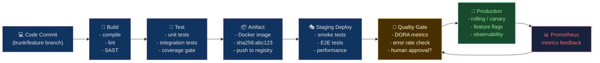

# 📐 CI/CD Principles and Patterns

> [!abstract] TL;DR
> **CI** (Continuous Integration) = every commit triggers automated build+test to maintain integration confidence. **CD** (Continuous Delivery) = every passing build is *releasable* to production. **Continuous Deployment** = auto-promotion without human approval. Foundation principles: trunk-based development + feature flags, test pyramid (unit→integration→e2e, ~10× cost growth per layer), build-once-promote-everywhere (artifact pinned by SHA-256 digest, never `:latest`). DORA four keys: deploy frequency, lead time <1h, MTTR <1h, change failure rate 0–15%.

---

## Intuition — analogy FIRST

CI/CD is a **factory quality control line**. Without CI, workers assemble parts independently and throw them over a wall at end-of-sprint — integration is painful and slow. CI puts **inspection stations** at every workbench (every commit). CD means every inspected product is **ready to ship** — the shelf always holds releasable inventory. Continuous Deployment means the robot **automatically ships** each approved product without waiting for a human to press "release."

The test pyramid is the inspection cost hierarchy: cheap unit tests (quality of individual bolts) → pricier integration tests (bolt + assembly fits) → expensive E2E tests (full factory run).

---

## How It Works



---

## Key Concepts / Details

### The Three Modes

| Mode | Auto-build? | Auto-test? | Auto-deploy to prod? | Human gate? |
|------|-------------|------------|---------------------|-------------|
| Continuous Integration | Yes | Yes | No | Always |
| Continuous Delivery | Yes | Yes | No (ready but not auto) | Before prod |
| Continuous Deployment | Yes | Yes | Yes | Never (or just monitoring) |

### DORA Four Keys

```
Deployment Frequency:  How often you deploy to production
Lead Time for Changes: commit → running in production (target: <1h elite)
MTTR:                  incident detected → system recovered (target: <1h elite)
Change Failure Rate:   deployments causing incidents / total deployments (target: 0-5%)
```

**Measuring lead time:**
```bash
# Git tag at deploy + git log to find original commit
git log --pretty=format:"%H %ai" v1.2.0..v1.2.1 | tail -1
# Compare deploy timestamp to oldest commit in the release
```

### Test Pyramid

```
         /\
        /E2E\       Slow (mins), expensive, brittle, few
       /------\
      /  Integ  \   Medium (secs), test contracts + DB
     /------------\
    /  Unit Tests  \ Fast (<1s each), many, cheap, isolated
   /________________\
```

**Cost ratios** (approximate):
- Unit: $1
- Integration: $10 (10× slower, needs infra)
- E2E: $100 (100× slower, full stack)

**Shift-left** = run cheap tests earlier (closer to the developer). Move security scanning (SAST) to commit stage, not just before production.

### Build-Once, Promote-Everywhere

```bash
# WRONG: build image at every environment
docker build -t myapp:latest .
docker push myapp:latest
# staging uses :latest → production uses :latest → different code!

# CORRECT: build once, pin by digest
docker build -t myapp:${GIT_SHA} .
docker push myapp:${GIT_SHA}
# Get immutable digest
DIGEST=$(docker inspect --format='{{index .RepoDigests 0}}' myapp:${GIT_SHA})
# → myregistry.io/myapp@sha256:abc123...

# Promote the SAME digest through environments
# staging: deploy sha256:abc123
# production: deploy sha256:abc123
# Same binary — guaranteed identical behavior
```

**Why `:latest` is dangerous**: The `:latest` tag is mutable. Between staging test and production deploy, someone could push a new image under `:latest`. You'd deploy untested code.

### Trunk-Based Development + Feature Flags

```python
# Feature flags decouple deploy from release
def process_payment(order):
    if feature_flags.is_enabled("new_payment_processor", user_id=order.user_id):
        return new_payment_processor.process(order)
    return legacy_payment_processor.process(order)

# Rollout stages:
# 1. Deploy code (flag=OFF): zero user impact
# 2. Enable for internal users: test in production
# 3. Enable for 1% of users: canary validation
# 4. Ramp to 100%: full release
# 5. Delete flag + dead code: cleanup
```

### Pipeline-as-Code Principles

```yaml
# PRINCIPLE: Every pipeline step must be:
# 1. Idempotent: re-running produces same result
# 2. Atomic: either fully completes or fails cleanly
# 3. Fast-fail: cheapest checks run first
# 4. Reproducible: same commit → same result
# 5. Observable: structured logs, metrics, traces

# ANTI-PATTERNS:
# - Pipeline steps that depend on external mutable state
# - Steps that SSH into servers to pull code (use push-based)
# - Uploading artifacts without content hash validation
# - "Works on my machine" due to local env vars leaking
```

### Quality Gates

```yaml
# Typical gate thresholds
quality_gate:
  test_coverage_min: 80%
  critical_vulnerabilities: 0
  high_vulnerabilities: 0
  code_smells_max: 10
  duplicated_lines_max: 3%
  performance_regression_max: 5%  # p99 latency vs baseline
```

### MTTR Reduction Patterns

```
MTTR = detection_time + diagnosis_time + fix_time + deploy_time + validation_time

Reduce each:
- detection_time:  SLO burn rate alerts (2% in 1h = page immediately)
- diagnosis_time:  distributed tracing, structured logs, runbooks
- fix_time:        feature flag toggle = seconds vs code deploy = minutes
- deploy_time:     optimized pipeline <10 min, parallel stages
- validation_time: automated rollback on metric degradation
```

---

## Real-World Notes

- **DORA metrics as lagging indicators**: DORA scores improve naturally when you invest in: automated testing, deployment automation, and incident management tooling. Don't optimize DORA directly — optimize the underlying capabilities.
- **Change failure rate inflation**: If you count reverted feature flags as "failures," your CFR looks terrible. Define consistently: "a deployment causing a production incident requiring a hotfix or rollback."
- **The 10-minute pipeline target**: Martin Fowler's original CI guidance specified 10 minutes as the max CI feedback loop. Modern pipelines with parallel stages and caching routinely hit this; >20 minutes signals optimization opportunity.
- **Environment promotion chain**: dev → staging → pre-prod → prod. Each environment gate has different criteria — staging checks E2E, pre-prod checks performance.

---

## Common Pitfalls

1. **Treating CI as a formality** — merging despite red CI "just this once" defeats the entire model; enforce CI-green as merge prerequisite.
2. **No test in staging** — building confidence from unit tests alone, then deploying straight to production; always have at least smoke tests in staging.
3. **Manual rollback procedures** — if rollback requires manual steps, MTTR balloons; automate rollback behind a single command or automatic metric trigger.
4. **Pipeline as snowflake** — one-off scripts in CI that only work in specific runner environments; containerize build steps.
5. **Secrets in pipeline logs** — don't `echo $SECRET_KEY`; use secret masking and rotate any secret that appears in logs.

---

## Related Concepts

- [[_MOC_CICD_Pipelines|↑ CI/CD Pipelines MOC]]
- [[GitHub_Actions|→ GitHub Actions]] — practical implementation
- [[Jenkins_and_GitLab_CI|→ Jenkins & GitLab CI]] — alternative platforms
- [[ArgoCD_and_GitOps|→ ArgoCD & GitOps]] — deployment layer
- [[Release_Strategies|→ Release Strategies]] — deploy vs release distinction

---

## Review Questions

1. A team's lead time for changes is 4 days. What are the three most likely root causes, and what specific CI/CD change addresses each?
2. Explain why building a Docker image at both staging and production stages violates build-once-promote-everywhere, even if the Git SHA is the same.
3. Your MTTR is 3 hours. Break down the MTTR formula and identify which component a feature flag rollback most directly reduces.

---

## Sources

- DORA State of DevOps Report 2024 (dora.dev)
- Martin Fowler: Continuous Integration, ContinuousDelivery
- Nicole Forsgren, Accelerate (book)

#DevOps #CICD #Principles #DORA #ShiftLeft #TestPyramid #BuildOnce
