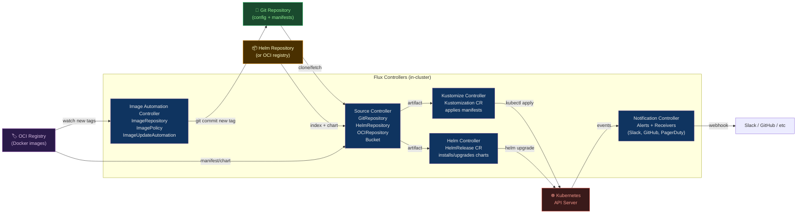

# 🔄 FluxCD

> [!abstract] TL;DR
> **Flux v2** is a CNCF Graduated GitOps operator for Kubernetes — it continuously reconciles cluster state with declarations stored in Git, Helm repositories, or OCI registries. Flux is built as a **toolkit of composable controllers**: the **Source Controller** (polls Git/Helm/OCI/Bucket), **Kustomize Controller** (applies Kustomizations), **Helm Controller** (manages HelmReleases), **Notification Controller** (sends alerts), and **Image Automation Controller** (updates image tags in Git). Unlike ArgoCD's single monolithic application model, Flux is **CLI-native, modular, and multi-tenant** — no web UI by default, managed entirely as Kubernetes CRDs. The reconciliation loop: Git changes → Source fetches → Controller applies → Kubernetes converges.

---

## Intuition — analogy FIRST

FluxCD is an **autonomous property manager** for your Kubernetes cluster. You hand the manager a key to your Git repository (the property specification notebook) and say: "Whatever is written in this notebook must be the current state of my building." The manager checks the notebook every minute, and if someone rearranged the furniture (manual `kubectl apply`), the manager silently puts it back. When you want to make a change, you update the notebook (Git commit); the manager reads it and implements the change. You never touch the building directly — the notebook is the single source of truth.

---

## How It Works



---

## Key Concepts / Details

### Bootstrap Flux into a Cluster

```bash
# Install Flux CLI
curl -s https://fluxcd.io/install.sh | sudo bash

# Check prerequisites
flux check --pre

# Bootstrap with GitHub (creates flux-system namespace + Git repo)
flux bootstrap github \
  --owner=myorg \
  --repository=fleet-infra \
  --branch=main \
  --path=clusters/production \
  --personal

# Bootstrap with GitLab
flux bootstrap gitlab \
  --owner=mygroup \
  --repository=fleet-infra \
  --branch=main \
  --path=clusters/production \
  --token-auth
```

### Sources — GitRepository, HelmRepository, OCIRepository

```yaml
# GitRepository — Flux polls this repo for changes
apiVersion: source.toolkit.fluxcd.io/v1
kind: GitRepository
metadata:
  name: flux-system
  namespace: flux-system
spec:
  interval: 1m                   # poll every minute
  ref:
    branch: main
  url: https://github.com/myorg/fleet-infra
  secretRef:
    name: flux-system             # SSH deploy key or token secret
---
# HelmRepository — Helm chart registry
apiVersion: source.toolkit.fluxcd.io/v1beta2
kind: HelmRepository
metadata:
  name: ingress-nginx
  namespace: flux-system
spec:
  interval: 10m
  url: https://kubernetes.github.io/ingress-nginx
---
# OCIRepository — Flux artifacts or OCI-packaged manifests
apiVersion: source.toolkit.fluxcd.io/v1beta2
kind: OCIRepository
metadata:
  name: podinfo
  namespace: flux-system
spec:
  interval: 5m
  url: oci://ghcr.io/stefanprodan/manifests/podinfo
  ref:
    tag: latest
```

### Kustomization Controller

```yaml
# Kustomization — applies a set of manifests from a Source
apiVersion: kustomize.toolkit.fluxcd.io/v1
kind: Kustomization
metadata:
  name: infrastructure
  namespace: flux-system
spec:
  interval: 10m                  # reconcile every 10 minutes
  retryInterval: 1m              # retry on failure
  sourceRef:
    kind: GitRepository
    name: flux-system
  path: ./infrastructure         # path within the Git repo
  prune: true                    # delete resources removed from Git
  wait: true                     # wait for health checks before continuing
  timeout: 5m
  healthChecks:
    - apiVersion: apps/v1
      kind: Deployment
      name: ingress-nginx-controller
      namespace: ingress-nginx
  postBuild:
    substitute:                  # variable substitution in manifests
      cluster_name: production
      region: us-east-1
    substituteFrom:
      - kind: ConfigMap
        name: cluster-vars
      - kind: Secret
        name: cluster-secrets
        optional: true
```

### HelmRelease — Managed Helm Deployments

```yaml
# HelmRelease — Flux manages the Helm lifecycle
apiVersion: helm.toolkit.fluxcd.io/v2beta2
kind: HelmRelease
metadata:
  name: ingress-nginx
  namespace: ingress-nginx
spec:
  interval: 30m
  chart:
    spec:
      chart: ingress-nginx
      version: ">=4.7.0 <5.0.0"  # SemVer range (with constraint)
      sourceRef:
        kind: HelmRepository
        name: ingress-nginx
        namespace: flux-system
      interval: 1h
  values:                         # inline values (override chart defaults)
    controller:
      replicaCount: 2
      service:
        type: LoadBalancer
  valuesFrom:                     # values from ConfigMap or Secret
    - kind: ConfigMap
      name: ingress-values
    - kind: Secret
      name: ingress-tls-values
      optional: true
  upgrade:
    remediation:
      remediateLastFailure: true  # auto-rollback on upgrade failure
  rollback:
    cleanupOnFail: true
  test:
    enable: true                  # run helm test after install/upgrade
```

### Image Automation — Auto-Update Image Tags in Git

```yaml
# Step 1: ImageRepository — watch a container registry for new tags
apiVersion: image.toolkit.fluxcd.io/v1beta2
kind: ImageRepository
metadata:
  name: podinfo
  namespace: flux-system
spec:
  image: ghcr.io/stefanprodan/podinfo
  interval: 5m
  secretRef:
    name: ghcr-credentials
---
# Step 2: ImagePolicy — define which tags to accept
apiVersion: image.toolkit.fluxcd.io/v1beta2
kind: ImagePolicy
metadata:
  name: podinfo
  namespace: flux-system
spec:
  imageRepositoryRef:
    name: podinfo
  policy:
    semver:
      range: ">=6.0.0 <7.0.0"   # only accept 6.x.x tags
---
# Step 3: ImageUpdateAutomation — commit new tag to Git
apiVersion: image.toolkit.fluxcd.io/v1beta1
kind: ImageUpdateAutomation
metadata:
  name: flux-system
  namespace: flux-system
spec:
  interval: 1m
  sourceRef:
    kind: GitRepository
    name: flux-system
  git:
    checkout:
      ref:
        branch: main
    commit:
      author:
        email: fluxcdbot@users.noreply.github.com
        name: fluxcdbot
      messageTemplate: |
        Auto-update image tags
        {{range .Updated.Images}}{{println .}}{{end}}
    push:
      branch: main
  update:
    path: ./clusters/production
    strategy: Setters            # updates # {"$imagepolicy": "namespace:name"} markers
```

```yaml
# In deployment.yaml — marker comment tells Flux which field to update
spec:
  containers:
    - name: podinfo
      image: ghcr.io/stefanprodan/podinfo:6.3.5 # {"$imagepolicy": "flux-system:podinfo"}
```

### Notifications

```yaml
# Alert provider (Slack)
apiVersion: notification.toolkit.fluxcd.io/v1beta3
kind: Provider
metadata:
  name: slack-provider
  namespace: flux-system
spec:
  type: slack
  channel: "#deployments"
  secretRef:
    name: slack-webhook-url
---
# Alert — fire when HelmRelease fails
apiVersion: notification.toolkit.fluxcd.io/v1beta3
kind: Alert
metadata:
  name: helm-failures
  namespace: flux-system
spec:
  providerRef:
    name: slack-provider
  severity: error
  eventSources:
    - kind: HelmRelease
      name: "*"           # all HelmReleases in this namespace
```

### Common Flux CLI Commands

```bash
# Force immediate reconciliation (don't wait for interval)
flux reconcile source git flux-system
flux reconcile kustomization infrastructure
flux reconcile helmrelease ingress-nginx

# Suspend/resume reconciliation (e.g., during maintenance)
flux suspend kustomization production-apps
flux resume kustomization production-apps

# Get status of all Flux resources
flux get all -A                  # all namespaces
flux get kustomizations
flux get helmreleases

# Diff: show what Flux would apply vs current cluster state
flux diff kustomization infrastructure

# Check logs
flux logs --follow
flux logs --level=error --kind HelmRelease --name ingress-nginx

# Trace: which resources were applied by a kustomization
flux trace --kind Deployment --name nginx --namespace ingress-nginx
```

---

## Flux vs ArgoCD

| Feature | Flux v2 | ArgoCD |
|---------|---------|--------|
| **UI** | None (CLI-first) | Rich web UI |
| **Architecture** | Modular toolkit (separate controllers) | Monolithic application |
| **Multi-tenancy** | Native (per-namespace controllers) | ApplicationSets / projects |
| **Helm support** | HelmRelease CRD (Helm Controller) | Native Helm |
| **Image automation** | Built-in (Image Automation Controller) | External (Argo Image Updater) |
| **OCI support** | Native (OCIRepository) | OCI Helm + OCI manifests |
| **Notification** | Notification Controller | Notifications (plugin) |
| **GitOps purity** | Strict (no manual apply override) | Has manual sync button |
| **Learning curve** | Steep (CLI + CRDs) | Lower (UI helps) |
| **Best for** | Platform teams, multi-cluster, CLI-first | Teams wanting a dashboard |

---

## Real-World Notes

- **Multi-cluster management**: Flux's `flux bootstrap` creates per-cluster Git paths (`clusters/production`, `clusters/staging`) and the same controllers manage multiple clusters from separate paths in one monorepo.
- **Secret management**: Flux integrates with SOPS (encrypted secrets committed to Git) and external-secrets-operator (ESO) for pulling secrets from Vault/AWS SM at apply time.
- **Kustomize overlays**: the most common pattern is `base/` + `overlays/production/` — Flux Kustomization applies the overlay at reconcile time.
- **Progressive delivery**: Flux integrates with Flagger for canary and blue/green deployments driven by metrics (Prometheus) — fully GitOps-driven progressive rollouts.

---

## Common Pitfalls

1. **`prune: true` with shared resources** — if a CRD is managed by Flux and a HelmRelease also creates it, Flux may prune (delete) it when it's removed from the Kustomization path; namespace the responsibility clearly.
2. **ImageUpdateAutomation committing to main directly** — without a PR-based workflow, image tag updates bypass code review; use a `push.branch` that creates a PR instead.
3. **Overlapping paths** — two Kustomizations covering the same directory create conflict; Flux applies both and last-write-wins is non-deterministic.
4. **Missing `wait: true` in ordered Kustomizations** — without `dependsOn` and `wait: true`, a Kustomization applying a CRD and another Kustomization applying a CR may race, causing "resource not found" failures.
5. **Ignoring reconciliation failures** — Flux silently retries; without Notification alerts configured, a broken HelmRelease can go unnoticed for hours.

---

## Related Concepts

- [[_MOC_CICD_Pipelines|↑ CI/CD MOC]]
- [[ArgoCD_and_GitOps|← ArgoCD]] — the primary GitOps competitor; choose ArgoCD for UI, Flux for modular/CLI
- [[Helm_Charts|← Helm Charts]] — HelmRelease CRD manages Helm chart lifecycle
- [[Kubernetes_Core_Concepts|← Kubernetes Core]] — prerequisite knowledge
- [[CICD_Principles_and_Patterns|← CI/CD Principles]] — GitOps is a specific CI/CD paradigm

---

## Review Questions

1. Explain how the Flux reconciliation loop works. If someone manually runs `kubectl delete deployment myapp`, what happens next and why?
2. Compare the HelmRelease CRD approach (Flux Helm Controller) with running `helm upgrade` in a CI/CD pipeline step. What does Flux add that the CI pipeline approach lacks?
3. You want Flux to automatically update the image tag in your deployment manifest whenever a new SemVer `1.x.x` tag is pushed to your container registry. List the three Flux CRDs you need and what each one does.

---

## Sources

- fluxcd.io/flux/concepts
- github.com/fluxcd/flux2
- fluxcd.io/flux/guides/image-update
- fluxcd.io/flux/guides/helmreleases
- fluxcd.io vs argoproj.github.io/argo-cd — comparison

#DevOps #GitOps #FluxCD #Kubernetes #Helm #Kustomize #ImageAutomation #CICD #Flux
