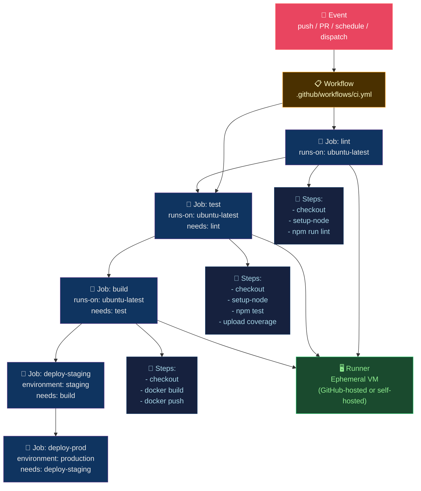

# ⚡ GitHub Actions

> [!abstract] TL;DR
> GitHub Actions is an event-driven CI/CD platform. Events (push, pull_request, schedule, workflow_dispatch) trigger **workflows** composed of parallel **jobs** running on ephemeral **runners**, each job a sequence of **steps**. Hosted runners provide Ubuntu/macOS/Windows; self-hosted runners serve GPU/VPC workloads. Secrets are masked in logs. Environments add protection rules, branch gates, and scoped secrets. **Composite actions** bundle steps; **reusable workflows** bundle jobs. `needs:` creates a DAG for job ordering. Matrix strategy creates NxM job combinations (e.g., 3 OS × 3 Node versions = 9 jobs).

---

## Intuition — analogy FIRST

GitHub Actions is a **choreography engine for code events**. Every push is a dinner bell — it rings, and a team of pre-assigned chefs (jobs) starts cooking in parallel. Each chef follows a recipe (steps). Some dishes must be ready before others start (needs: DAG). Matrix is running the same recipe with different ingredients across multiple kitchens simultaneously.

---

## How It Works



---

## Key Concepts / Details

### Complete Workflow Example

```yaml
# .github/workflows/ci.yml
name: CI/CD Pipeline

on:
  push:
    branches: [main, "release/**"]
  pull_request:
    branches: [main]
  schedule:
    - cron: "0 2 * * *"           # nightly at 2AM UTC
  workflow_dispatch:               # manual trigger
    inputs:
      environment:
        description: 'Target environment'
        required: true
        default: 'staging'

env:
  REGISTRY: ghcr.io
  IMAGE_NAME: ${{ github.repository }}

jobs:
  lint:
    name: Lint & Format
    runs-on: ubuntu-latest
    steps:
      - uses: actions/checkout@v4
      - uses: actions/setup-node@v4
        with:
          node-version: "20"
          cache: "npm"
      - run: npm ci
      - run: npm run lint
      - run: npm run typecheck

  test:
    name: Test (Node ${{ matrix.node }}, OS ${{ matrix.os }})
    needs: lint
    runs-on: ${{ matrix.os }}
    strategy:
      matrix:
        os: [ubuntu-latest, windows-latest]
        node: ["18", "20", "22"]
        exclude:
          - os: windows-latest
            node: "18"
      fail-fast: false              # continue other matrix jobs on failure
    steps:
      - uses: actions/checkout@v4
      - uses: actions/setup-node@v4
        with:
          node-version: ${{ matrix.node }}
          cache: "npm"
      - run: npm ci
      - run: npm test -- --coverage
      - uses: codecov/codecov-action@v4
        if: matrix.os == 'ubuntu-latest' && matrix.node == '20'

  build:
    name: Build & Push Image
    needs: test
    runs-on: ubuntu-latest
    permissions:
      contents: read
      packages: write
      id-token: write              # OIDC for keyless signing
    outputs:
      image-digest: ${{ steps.push.outputs.digest }}
    steps:
      - uses: actions/checkout@v4
      - uses: docker/setup-buildx-action@v3
      - uses: docker/login-action@v3
        with:
          registry: ${{ env.REGISTRY }}
          username: ${{ github.actor }}
          password: ${{ secrets.GITHUB_TOKEN }}
      - name: Build and push
        id: push
        uses: docker/build-push-action@v5
        with:
          context: .
          push: ${{ github.event_name != 'pull_request' }}
          tags: |
            ${{ env.REGISTRY }}/${{ env.IMAGE_NAME }}:${{ github.sha }}
            ${{ env.REGISTRY }}/${{ env.IMAGE_NAME }}:latest
          cache-from: type=gha
          cache-to: type=gha,mode=max
      - uses: sigstore/cosign-installer@v3
      - run: |
          cosign sign --yes ${{ env.REGISTRY }}/${{ env.IMAGE_NAME }}@${{ steps.push.outputs.digest }}

  deploy-staging:
    name: Deploy to Staging
    needs: build
    runs-on: ubuntu-latest
    environment:
      name: staging
      url: https://staging.example.com
    steps:
      - uses: actions/checkout@v4
      - name: Deploy via ArgoCD
        run: |
          argocd app set myapp-staging \
            --helm-set image.digest=${{ needs.build.outputs.image-digest }}
          argocd app sync myapp-staging --wait
        env:
          ARGOCD_SERVER: ${{ secrets.ARGOCD_SERVER }}
          ARGOCD_AUTH_TOKEN: ${{ secrets.ARGOCD_AUTH_TOKEN }}

  deploy-prod:
    name: Deploy to Production
    needs: deploy-staging
    runs-on: ubuntu-latest
    environment:
      name: production             # requires manual approval
      url: https://example.com
    if: github.ref == 'refs/heads/main'
    steps:
      - name: Deploy to production
        run: |
          argocd app set myapp-prod \
            --helm-set image.digest=${{ needs.build.outputs.image-digest }}
          argocd app sync myapp-prod --wait
```

### Reusable Workflows (Jobs Level)

```yaml
# .github/workflows/reusable-deploy.yml
on:
  workflow_call:
    inputs:
      environment:
        required: true
        type: string
      image-digest:
        required: true
        type: string
    secrets:
      ARGOCD_AUTH_TOKEN:
        required: true

jobs:
  deploy:
    runs-on: ubuntu-latest
    environment: ${{ inputs.environment }}
    steps:
      - name: ArgoCD sync
        run: argocd app sync myapp-${{ inputs.environment }} ...
```

```yaml
# Calling workflow uses it like:
jobs:
  deploy:
    uses: ./.github/workflows/reusable-deploy.yml
    with:
      environment: staging
      image-digest: ${{ needs.build.outputs.image-digest }}
    secrets: inherit
```

### Composite Actions (Steps Level)

```yaml
# .github/actions/setup-app/action.yml
name: Setup Application
description: Install deps + configure environment

inputs:
  node-version:
    description: Node.js version
    default: "20"

runs:
  using: composite
  steps:
    - uses: actions/setup-node@v4
      with:
        node-version: ${{ inputs.node-version }}
        cache: npm
    - run: npm ci
      shell: bash
    - run: npm run build
      shell: bash
```

### Self-Hosted Runners

```yaml
# Use self-hosted runner for GPU/VPC access
jobs:
  ml-training:
    runs-on: [self-hosted, gpu, linux]
    steps:
      - uses: actions/checkout@v4
      - run: python train.py --device cuda
```

```bash
# Register self-hosted runner
mkdir actions-runner && cd actions-runner
curl -O -L https://github.com/actions/runner/releases/download/v2.317.0/actions-runner-linux-x64-2.317.0.tar.gz
tar xzf actions-runner-linux-x64-2.317.0.tar.gz
./config.sh --url https://github.com/ORG/REPO --token TOKEN
./run.sh   # or install as systemd service: sudo ./svc.sh install
```

### Secrets, Environments, and OIDC

```yaml
# Access scoped to environment
environment: production

# OIDC: keyless AWS authentication (no stored access keys)
- uses: aws-actions/configure-aws-credentials@v4
  with:
    role-to-assume: arn:aws:iam::123456789:role/github-actions-prod
    aws-region: us-east-1
    # No access-key-id / secret-access-key needed!
```

```json
// AWS IAM trust policy for OIDC
{
  "Effect": "Allow",
  "Principal": {
    "Federated": "arn:aws:iam::123456789:oidc-provider/token.actions.githubusercontent.com"
  },
  "Action": "sts:AssumeRoleWithWebIdentity",
  "Condition": {
    "StringEquals": {
      "token.actions.githubusercontent.com:sub": "repo:org/repo:environment:production"
    }
  }
}
```

### Caching

```yaml
# Cache node_modules
- uses: actions/cache@v4
  with:
    path: ~/.npm
    key: ${{ runner.os }}-node-${{ hashFiles('**/package-lock.json') }}
    restore-keys: |
      ${{ runner.os }}-node-

# Docker layer cache via GHA cache backend
- uses: docker/build-push-action@v5
  with:
    cache-from: type=gha
    cache-to: type=gha,mode=max
```

---

## Real-World Notes

- **Ephemeral runners = no state**: Each job starts fresh. Use caching (`actions/cache`) and artifacts (`actions/upload-artifact`) to persist data between jobs.
- **Matrix parallelism**: 3 OS × 3 Node = 9 concurrent jobs. GitHub-hosted runners: free tier limits concurrency; pro/enterprise lifts limits.
- **`needs:` output passing**: Jobs communicate via `outputs:` — a job can expose values that downstream jobs reference as `${{ needs.job-id.outputs.key }}`.
- **GITHUB_TOKEN permissions**: Default permissions are read-only since 2023. Explicitly grant `packages: write`, `contents: write`, etc., at job level.
- **Workflow concurrency**: Prevent duplicate pipeline runs on rapid pushes.

```yaml
concurrency:
  group: ${{ github.workflow }}-${{ github.ref }}
  cancel-in-progress: true        # cancel older run when new push arrives
```

---

## Common Pitfalls

1. **Using `:latest` in actions** — always pin with SHA: `actions/checkout@v4` not `actions/checkout@latest`; supply chain security.
2. **Secrets in matrix env** — matrix variables are visible in logs; never put secrets in matrix parameters.
3. **Missing `permissions:`** — GITHUB_TOKEN default is overly permissive or overly restrictive depending on org settings; always declare explicitly.
4. **Long monolithic job** — all steps in one job means one failure reruns everything; split into lint/test/build jobs.
5. **No timeout** — runaway jobs consume minutes and block runners; always set `timeout-minutes: 30`.

---

## Related Concepts

- [[_MOC_CICD_Pipelines|↑ CI/CD Pipelines MOC]]
- [[CICD_Principles_and_Patterns|← CI/CD Principles]] — theory this implements
- [[Jenkins_and_GitLab_CI|→ Jenkins & GitLab CI]] — alternative platforms
- [[ArgoCD_and_GitOps|→ ArgoCD & GitOps]] — deployment step target
- [[../03_Containers_Docker/Container_Registry_and_Distribution|→ Container Registry]] — image push/pull

---

## Review Questions

1. A matrix of `os: [ubuntu, windows, macos]` × `node: [18, 20, 22]` with `exclude: [{os: macos, node: 18}]` — how many jobs run, and which are skipped?
2. Explain why a reusable workflow is more appropriate than a composite action when you need to deploy across multiple environments with different approval gates.
3. Design a workflow that prevents two concurrent production deployments from running simultaneously, even if two PRs merge seconds apart.

---

## Sources

- docs.github.com/en/actions
- github.com/actions/toolkit
- sigstore.dev — cosign image signing

#DevOps #CICD #GitHubActions #Workflows #Matrix #Runners #OIDC
