# 🔧 Jenkins and GitLab CI

> [!abstract] TL;DR
> **Jenkins** is a self-hosted automation server with Declarative and Scripted Groovy pipelines stored as `Jenkinsfile` in the repo. **Shared libraries** provide reusable Groovy code across pipelines. **GitLab CI/CD** uses `.gitlab-ci.yml` with stages, rules, needs (DAG), runners, artifacts, and caching. GitLab runners can be shared (SaaS) or self-managed (Docker, Kubernetes, Shell executors). Both support parallel jobs, environment-specific deployments, and secret management.

---

## Intuition — analogy FIRST

Jenkins is a **veteran factory with custom machinery** — extremely configurable, runs anything, but requires a dedicated team to maintain the infrastructure. GitLab CI is the **modern factory floor** integrated into the materials management system (GitLab SCM) — less setup, more guardrails, native integration with merge requests and environments. Shared libraries in Jenkins are equivalent to GitLab CI templates: reusable "machine programs" you write once and share across all production lines.

---

## How It Works

```mermaid
graph TD
    subgraph Jenkins
        SCM_J["GitHub/Bitbucket\nwebhook"]:::trigger
        JMASTER["Jenkins Controller\n(job scheduler)"]:::system
        JAGENT["Jenkins Agent\n(executor node)"]:::runner
        JLT["Shared Library\n@Library('mylib')"]:::lib
        JWS["Workspace\n(cloned repo)"]:::workspace

        SCM_J -->|"webhook"| JMASTER
        JMASTER -->|"allocate agent"| JAGENT
        JLT -->|"imported by"| JAGENT
        JAGENT --> JWS
    end

    subgraph GitLab
        SCM_G["GitLab MR / push"]:::trigger
        COORD["GitLab Coordinator\n(pipeline orchestrator)"]:::system
        RUNNER["GitLab Runner\n(Docker/K8s/Shell executor)"]:::runner
        ARTIFACT["Artifacts\n(passed between stages)"]:::lib
        CACHE["Cache\n(npm/pip per branch)"]:::workspace

        SCM_G -->|"pipeline trigger"| COORD
        COORD -->|"dispatch job"| RUNNER
        RUNNER --> ARTIFACT
        RUNNER --> CACHE
    end

    classDef trigger fill:#e94560,stroke:#ff6b6b,color:#fff
    classDef system fill:#0f3460,stroke:#533483,color:#e8e8e8
    classDef runner fill:#1a4a2e,stroke:#2ecc71,color:#90ee90
    classDef lib fill:#4a3000,stroke:#f39c12,color:#ffc
    classDef workspace fill:#16213e,stroke:#0f3460,color:#a8d8ea
```



---

## Key Concepts / Details

### Jenkins — Declarative Pipeline

```groovy
// Jenkinsfile (Declarative syntax)
@Library('my-shared-library@main') _

pipeline {
    agent {
        kubernetes {
            yaml """
apiVersion: v1
kind: Pod
spec:
  containers:
  - name: maven
    image: maven:3.9-eclipse-temurin-17
    command: ['cat']
    tty: true
"""
        }
    }

    environment {
        REGISTRY = 'registry.example.com'
        IMAGE_TAG = "${env.GIT_COMMIT[0..7]}"
    }

    options {
        timeout(time: 30, unit: 'MINUTES')
        buildDiscarder(logRotator(numToKeepStr: '20'))
        timestamps()
        ansiColor('xterm')
    }

    stages {
        stage('Checkout') {
            steps {
                checkout scm
            }
        }

        stage('Test') {
            parallel {
                stage('Unit Tests') {
                    steps {
                        container('maven') {
                            sh 'mvn test -Dtest="*Unit*"'
                        }
                    }
                    post {
                        always {
                            junit 'target/surefire-reports/*.xml'
                        }
                    }
                }
                stage('Static Analysis') {
                    steps {
                        container('maven') {
                            sh 'mvn sonar:sonar'
                        }
                    }
                }
            }
        }

        stage('Build & Push') {
            when {
                branch 'main'
            }
            steps {
                withCredentials([usernamePassword(
                    credentialsId: 'registry-creds',
                    usernameVariable: 'DOCKER_USER',
                    passwordVariable: 'DOCKER_PASS'
                )]) {
                    sh """
                        docker build -t ${REGISTRY}/myapp:${IMAGE_TAG} .
                        echo ${DOCKER_PASS} | docker login -u ${DOCKER_USER} --password-stdin ${REGISTRY}
                        docker push ${REGISTRY}/myapp:${IMAGE_TAG}
                    """
                }
            }
        }

        stage('Deploy Staging') {
            when { branch 'main' }
            steps {
                mylib.deployToK8s(
                    cluster: 'staging',
                    image: "${REGISTRY}/myapp:${IMAGE_TAG}"
                )
            }
        }

        stage('Deploy Production') {
            when { branch 'main' }
            input {
                message "Deploy to production?"
                ok "Deploy"
                submitter "platform-team,release-managers"
            }
            steps {
                mylib.deployToK8s(
                    cluster: 'production',
                    image: "${REGISTRY}/myapp:${IMAGE_TAG}"
                )
            }
        }
    }

    post {
        failure {
            slackSend channel: '#ci-alerts', color: 'danger',
                message: "FAILED: ${env.JOB_NAME} [${env.BUILD_NUMBER}] ${env.BUILD_URL}"
        }
        success {
            slackSend channel: '#ci-alerts', color: 'good',
                message: "SUCCESS: ${env.JOB_NAME} [${env.BUILD_NUMBER}]"
        }
    }
}
```

### Jenkins Shared Libraries

```
// Structure of a shared library repository
(root)
├── vars/
│   ├── deployToK8s.groovy       # global function: deployToK8s(...)
│   └── runTests.groovy
├── src/
│   └── org/myorg/
│       └── Utils.groovy         # class-based helpers
└── resources/
    └── scripts/
        └── deploy.sh            # resource files

// vars/deployToK8s.groovy
def call(Map config) {
    sh """
        kubectl set image deployment/${config.appName} \
            app=${config.image} \
            --namespace=${config.namespace}
        kubectl rollout status deployment/${config.appName} \
            --namespace=${config.namespace} \
            --timeout=5m
    """
}
```

### GitLab CI — Complete Example

```yaml
# .gitlab-ci.yml
image: docker:24

variables:
  DOCKER_DRIVER: overlay2
  DOCKER_TLS_CERTDIR: ""
  IMAGE_TAG: $CI_REGISTRY_IMAGE:$CI_COMMIT_SHA

stages:
  - validate
  - test
  - build
  - deploy-staging
  - integration-test
  - deploy-production

# Global cache
cache:
  key:
    files:
      - package-lock.json
  paths:
    - node_modules/

# Templates using YAML anchors
.deploy-template: &deploy-template
  image: bitnami/kubectl:latest
  script:
    - kubectl config use-context $KUBE_CONTEXT
    - |
      kubectl set image deployment/$APP_NAME \
        app=$IMAGE_TAG \
        -n $NAMESPACE
    - kubectl rollout status deployment/$APP_NAME -n $NAMESPACE

lint:
  stage: validate
  image: node:20-alpine
  script:
    - npm ci
    - npm run lint
    - npm run typecheck
  rules:
    - if: $CI_PIPELINE_SOURCE == "merge_request_event"
    - if: $CI_COMMIT_BRANCH == "main"

unit-test:
  stage: test
  image: node:20-alpine
  needs: [lint]
  script:
    - npm ci
    - npm test -- --coverage
  coverage: '/Lines\s*:\s*(\d+\.\d+)%/'
  artifacts:
    reports:
      coverage_report:
        coverage_format: cobertura
        path: coverage/cobertura-coverage.xml
      junit: coverage/junit.xml
    expire_in: 1 week

build:
  stage: build
  services:
    - docker:dind
  needs: [unit-test]
  before_script:
    - docker login -u $CI_REGISTRY_USER -p $CI_REGISTRY_PASSWORD $CI_REGISTRY
  script:
    - docker build -t $IMAGE_TAG .
    - docker push $IMAGE_TAG
  rules:
    - if: $CI_COMMIT_BRANCH == "main"

deploy-staging:
  <<: *deploy-template
  stage: deploy-staging
  needs: [build]
  variables:
    KUBE_CONTEXT: org/myapp:staging
    NAMESPACE: staging
    APP_NAME: myapp
  environment:
    name: staging
    url: https://staging.example.com
  rules:
    - if: $CI_COMMIT_BRANCH == "main"

integration-test:
  stage: integration-test
  needs: [deploy-staging]
  image: mcr.microsoft.com/playwright:v1.44.0
  script:
    - npm run test:e2e -- --baseURL=https://staging.example.com
  artifacts:
    when: always
    paths:
      - playwright-report/
    expire_in: 1 week

deploy-production:
  <<: *deploy-template
  stage: deploy-production
  needs: [integration-test]
  variables:
    KUBE_CONTEXT: org/myapp:production
    NAMESPACE: production
    APP_NAME: myapp
  environment:
    name: production
    url: https://example.com
  when: manual                    # requires manual trigger
  rules:
    - if: $CI_COMMIT_BRANCH == "main"
```

### GitLab CI — rules vs only/except

```yaml
# Modern: rules (preferred, conditional logic)
build:
  rules:
    - if: $CI_COMMIT_BRANCH == "main"
      when: always
    - if: $CI_PIPELINE_SOURCE == "merge_request_event"
      changes:
        - src/**/*
      when: always
    - when: never                 # default: skip

# Legacy: only/except (simple but limited)
build:
  only:
    - main
  except:
    - schedules
```

### Comparison: Jenkins vs GitLab CI vs GitHub Actions

| Feature | Jenkins | GitLab CI | GitHub Actions |
|---------|---------|-----------|----------------|
| Config language | Groovy (DSL) | YAML | YAML |
| SCM integration | Plugin-based | Native | Native |
| Runner hosting | Self-hosted | SaaS + self | SaaS + self |
| Shared code | Shared Libraries | CI templates / includes | Reusable workflows |
| Secrets management | Credentials plugin | CI/CD variables | Encrypted secrets |
| Kubernetes agents | Plugin | Kubernetes executor | Self-hosted runners |
| Cost | Infrastructure | Free tier + compute | Free tier + minutes |
| Plugin ecosystem | 1800+ plugins | Limited | 20k+ marketplace |

---

## Real-World Notes

- **Jenkins maintenance overhead**: Controllers, agents, plugins, and backups require dedicated ops. Consider Jenkins on Kubernetes (Jenkins X or official Helm chart) to reduce operational burden.
- **GitLab `needs:` DAG**: Overrides the stage ordering — jobs in later stages can start before all earlier-stage jobs finish, if their specific dependencies (`needs:`) are met. This enables true parallelism within a pipeline.
- **GitLab includes**: Split large `.gitlab-ci.yml` across files using `include:` for maintainability.

```yaml
include:
  - local: '.gitlab/ci/test.yml'
  - project: 'devops/ci-templates'
    ref: main
    file: '/templates/docker-build.yml'
```

---

## Common Pitfalls

1. **Jenkins Groovy sandbox restrictions** — scripts in the sandbox can't use arbitrary Java; `@Grab` and certain APIs require explicit approval in Manage Jenkins → In-Process Script Approval.
2. **GitLab artifact expiry** — without `expire_in`, artifacts accumulate indefinitely; set retention policies per artifact type.
3. **Jenkins agent sprawl** — each unique build environment (Java 17, Java 21, Node 20...) spawns new agent types; containerized agents (pod templates) are cleaner.
4. **`when: manual` blocking pipelines** — if a manual gate job blocks the pipeline indefinitely, downstream jobs never run; set `allow_failure: true` for non-blocking manual jobs.
5. **Unscoped variables in GitLab** — CI/CD variables defined at the project level are visible to all jobs; use environment-scoped variables for secrets.

---

## Related Concepts

- [[_MOC_CICD_Pipelines|↑ CI/CD Pipelines MOC]]
- [[CICD_Principles_and_Patterns|← CI/CD Principles]]
- [[GitHub_Actions|↔ GitHub Actions]] — alternative platform comparison
- [[ArgoCD_and_GitOps|→ ArgoCD & GitOps]] — deployment layer after build

---

## Review Questions

1. In a Jenkins declarative pipeline, how do you run two stages (`unit-test` and `lint`) in parallel while blocking the `build` stage until both complete?
2. Explain the difference between GitLab CI's `stage` ordering and `needs:` DAG. When would you use `needs:` within the same stage?
3. A Jenkins shared library function `deployToK8s` needs credentials. How do you inject them without hardcoding, and where are they stored?

---

## Sources

- jenkins.io/doc/book/pipeline/
- docs.gitlab.com/ee/ci/
- Jenkins Shared Libraries: jenkins.io/doc/book/pipeline/shared-libraries/

#DevOps #CICD #Jenkins #GitLabCI #Pipelines #SharedLibraries #Runners
