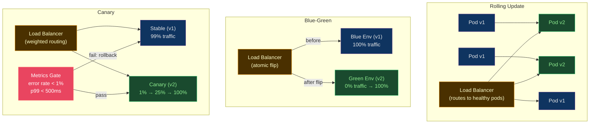

# 🚦 Release Strategies

> [!abstract] TL;DR
> **Deploy ≠ Release**: deploying puts code in production; releasing exposes it to users. Key strategies: **Rolling** (gradual pod replacement, `maxSurge`/`maxUnavailable`); **Blue-Green** (atomic 100% traffic flip between identical environments, 2× infra cost); **Canary** (blended error rate `E=(p·ec+(100-p)·es)/100`, step up traffic with metric gate); **Argo Rollouts** adds metric-gated analysis and `AnalysisRun` to Kubernetes; **Feature Flags** (LaunchDarkly/OpenFeature) decouple deploy from release entirely.

---

## Intuition — analogy FIRST

Release strategies are **traffic light patterns for production deployments**. Rolling is a road where traffic gradually shifts from old lane to new. Blue-Green is a highway with two complete road systems — you flip the direction sign at once. Canary is a toll booth where you send 1% of cars down the new road first; if they don't crash, send more. Feature flags bypass the road metaphor entirely — the car (user) chooses which road based on their membership, regardless of which physical road was built last.

---

## How It Works



---

## Key Concepts / Details

### Rolling Update (Kubernetes Default)

```yaml
# Deployment with rolling update strategy
apiVersion: apps/v1
kind: Deployment
metadata:
  name: myapp
spec:
  replicas: 10
  strategy:
    type: RollingUpdate
    rollingUpdate:
      maxSurge: 3          # max pods ABOVE desired during update (abs or %)
      maxUnavailable: 1    # max pods BELOW desired during update (abs or %)
      # With 10 replicas: can have 13 pods max, must have 9 pods min
  template:
    spec:
      containers:
        - name: app
          image: myapp:v2
          readinessProbe:        # CRITICAL: gates traffic routing
            httpGet:
              path: /health
              port: 8080
            initialDelaySeconds: 10
            periodSeconds: 5
            failureThreshold: 3
```

```bash
# Monitor rollout
kubectl rollout status deployment/myapp --timeout=10m

# Pause mid-rollout (if issues detected)
kubectl rollout pause deployment/myapp

# Resume
kubectl rollout resume deployment/myapp

# Rollback to previous version
kubectl rollout undo deployment/myapp

# Rollback to specific revision
kubectl rollout undo deployment/myapp --to-revision=3

# View rollout history
kubectl rollout history deployment/myapp
```

**Limitation**: Rolling updates can't guarantee zero downtime if your app doesn't support two concurrent versions of the API (e.g., incompatible database schema changes).

### Blue-Green Deployment

```yaml
# Two identical deployments
apiVersion: apps/v1
kind: Deployment
metadata:
  name: myapp-blue
  labels:
    version: blue
spec:
  replicas: 5
  selector:
    matchLabels:
      app: myapp
      version: blue
---
apiVersion: apps/v1
kind: Deployment
metadata:
  name: myapp-green
  labels:
    version: green
spec:
  replicas: 5
  selector:
    matchLabels:
      app: myapp
      version: green
---
# Service (traffic switch = single label change)
apiVersion: v1
kind: Service
metadata:
  name: myapp
spec:
  selector:
    app: myapp
    version: blue       # change to "green" to flip traffic
  ports:
    - port: 80
      targetPort: 8080
```

```bash
# Atomic traffic flip
kubectl patch service myapp -p '{"spec":{"selector":{"version":"green"}}}'

# Verify new version is serving
curl https://myapp.example.com/version

# If issues: instant rollback (milliseconds)
kubectl patch service myapp -p '{"spec":{"selector":{"version":"blue"}}}'

# After validation: scale down blue
kubectl scale deployment myapp-blue --replicas=0
```

**Cost**: 2× infrastructure during deployment. Switch is atomic (no partial traffic state). Old environment stays warm for instant rollback.

### Canary Deployment — Blended Error Rate Formula

**Formula:**
```
E = (p · ec + (100-p) · es) / 100

Where:
  E  = blended error rate observed at load balancer
  p  = percentage of traffic to canary (e.g., 10)
  ec = canary error rate (new version)
  es = stable error rate (old version)

Example: p=10%, ec=5%, es=0.1%
E = (10 × 5 + 90 × 0.1) / 100 = (50 + 9) / 100 = 0.59%

If threshold is 1%: 0.59% < 1% → canary passes
```

```yaml
# Nginx Ingress weighted canary
apiVersion: networking.k8s.io/v1
kind: Ingress
metadata:
  name: myapp-canary
  annotations:
    nginx.ingress.kubernetes.io/canary: "true"
    nginx.ingress.kubernetes.io/canary-weight: "10"  # 10% to canary
spec:
  rules:
    - host: myapp.example.com
      http:
        paths:
          - path: /
            pathType: Prefix
            backend:
              service:
                name: myapp-canary-svc
                port:
                  number: 80
```

### Argo Rollouts — Automated Progressive Delivery

```yaml
# Rollout with automated canary analysis
apiVersion: argoproj.io/v1alpha1
kind: Rollout
metadata:
  name: myapp
spec:
  replicas: 10
  strategy:
    canary:
      canaryService: myapp-canary
      stableService: myapp-stable
      trafficRouting:
        nginx:
          stableIngress: myapp-stable
      steps:
        - setWeight: 5                    # 5% to canary
        - pause: {duration: 5m}           # observe for 5 min
        - analysis:                       # run AnalysisRun
            templates:
              - templateName: error-rate-check
        - setWeight: 25
        - pause: {duration: 10m}
        - analysis:
            templates:
              - templateName: latency-check
        - setWeight: 50
        - pause: {duration: 10m}
        - setWeight: 100                  # promote to stable
---
apiVersion: argoproj.io/v1alpha1
kind: AnalysisTemplate
metadata:
  name: error-rate-check
spec:
  metrics:
    - name: error-rate
      interval: 1m
      successCondition: result[0] < 0.01     # <1% error rate
      failureLimit: 3
      provider:
        prometheus:
          address: http://prometheus:9090
          query: |
            sum(rate(http_requests_total{
              status=~"5..",
              app="myapp",
              version="canary"
            }[5m])) /
            sum(rate(http_requests_total{
              app="myapp",
              version="canary"
            }[5m]))
    - name: p99-latency
      successCondition: result[0] < 0.5      # <500ms
      provider:
        prometheus:
          address: http://prometheus:9090
          query: |
            histogram_quantile(0.99,
              sum(rate(http_request_duration_seconds_bucket{
                app="myapp",version="canary"
              }[5m])) by (le))
```

```bash
# Argo Rollouts CLI
kubectl argo rollouts get rollout myapp --watch
kubectl argo rollouts promote myapp          # manual promote next step
kubectl argo rollouts abort myapp            # rollback
kubectl argo rollouts set image myapp app=myapp:v2  # trigger update
```

### Feature Flags — Deploy ≠ Release

```python
# Using OpenFeature standard SDK
from openfeature import api
from openfeature.contrib.provider.launchdarkly import LaunchDarklyProvider

# Initialize (app startup)
api.set_provider(LaunchDarklyProvider(sdk_key="sdk-abc123"))
client = api.get_client()

# Usage in code
def get_recommendation(user):
    use_ml = client.get_boolean_value(
        flag_key="ml-recommendations",
        default_value=False,
        evaluation_context={"user_id": user.id, "tier": user.tier}
    )
    if use_ml:
        return ml_recommender.get(user)
    return rule_based_recommender.get(user)
```

**Flag targeting rules** (LaunchDarkly example):
```json
{
  "key": "ml-recommendations",
  "on": true,
  "rules": [
    {
      "clauses": [{"attribute": "tier", "op": "in", "values": ["premium"]}],
      "variation": 1  // enable for premium users
    },
    {
      "clauses": [{"attribute": "user_id", "op": "in", "values": ["internal@example.com"]}],
      "variation": 1  // always enable for internal
    }
  ],
  "fallthrough": {"rollout": {"variations": [{"variation": 0, "weight": 99000}, {"variation": 1, "weight": 1000}]}},
  "offVariation": 0
}
```

### Strategy Selection Guide

| Scenario | Recommended Strategy | Reason |
|----------|---------------------|--------|
| Stateless microservice | Canary with metrics | Low risk, automated gate |
| Database schema change | Blue-Green | Atomic flip, easy rollback |
| Feature gradual rollout | Feature flags | Decouple from deploy |
| High-traffic, latency-sensitive | Canary with SLO analysis | Catch degradation early |
| Regulated software (strict rollback) | Blue-Green | Instant full rollback |
| Simple internal tool | Rolling update | Simplicity wins |

---

## Real-World Notes

- **Argo Rollouts needs its own ingress controller integration**: Nginx, ALB, Istio, or Traefik — each has different traffic shaping mechanisms. Validate your ingress supports weighted routing before designing canary.
- **Canary with stateful sessions**: If users are session-affined, a user who hits canary on request 1 may hit stable on request 2 — their experience is inconsistent. Use header-based routing instead.
- **Blue-Green database migrations**: The hardest part of blue-green is database schema compatibility. Blue and green must run simultaneously against the same database. Use expand-contract (backward-compatible migration → deploy → contract) pattern.
- **Feature flag consistency**: Flags should be consistent per user within a session. A user who sees the new checkout on page 1 shouldn't see the old one on page 2.

---

## Common Pitfalls

1. **Rolling update without readiness probe** — new pods take traffic before they're ready, causing errors during update.
2. **Blue-Green without session draining** — users mid-session on blue get dropped when traffic flips to green; implement connection draining (grace period).
3. **Canary analysis too short** — 1-minute analysis misses slow-burn degradation; run analysis for at least one error budget window (e.g., 30 minutes).
4. **Feature flag without kill switch testing** — flags work in development but fail at runtime due to SDK misconfiguration; always test the OFF state explicitly.
5. **Permanent canary** — canary never promotes to 100% but stays at 10% indefinitely; resources run at 2× cost for no reason.

---

## Related Concepts

- [[_MOC_CICD_Pipelines|↑ CI/CD Pipelines MOC]]
- [[CICD_Principles_and_Patterns|← CI/CD Principles]] — deploy vs release distinction
- [[ArgoCD_and_GitOps|← ArgoCD & GitOps]] — Argo Rollouts extends ArgoCD
- [[../04_Kubernetes/Kubernetes_Core_Concepts|→ K8s Core Concepts]] — Deployment rolling update
- [[../07_Monitoring_Observability/Prometheus_and_Alertmanager|→ Prometheus]] — AnalysisRun metrics

---

## Review Questions

1. A canary has 10% traffic with 3% error rate while stable has 0.2% error rate. Calculate the blended error rate. If your SLO threshold is 1%, does the analysis pass or fail?
2. Your application uses PostgreSQL with a NOT NULL column addition. How do you structure the blue-green deployment to avoid downtime or errors during the schema migration?
3. Design an Argo Rollout that promotes automatically from 5% → 25% → 100%, with a 10-minute analysis window at each step using both error rate and p99 latency metrics.

---

## Sources

- Argo Rollouts: argoproj.github.io/argo-rollouts
- LaunchDarkly: docs.launchdarkly.com
- OpenFeature: openfeature.dev
- Martin Fowler: BlueGreenDeployment, CanaryRelease

#DevOps #CICD #ReleaseStrategies #BlueGreen #Canary #ArgoRollouts #FeatureFlags #Rolling
