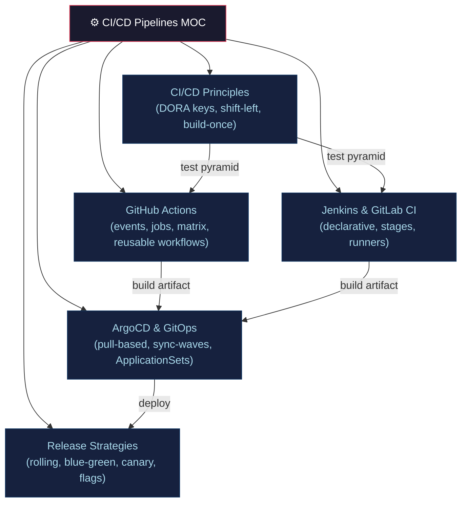

# ⚙️ CI/CD Pipelines — Section MOC

> [!abstract] Section Overview
> CI/CD transforms code changes into deployed software reliably and rapidly. CI provides integration confidence; CD makes every commit releasable; Continuous Deployment auto-promotes. DORA four keys measure delivery performance. This section covers principles, GitHub Actions, Jenkins/GitLab CI, ArgoCD/GitOps, and release strategies.

---

## Concept Map



---

## Notes in This Section

| Note | Key Concepts | Difficulty |
|------|-------------|------------|
| [[CICD_Principles_and_Patterns\|CI/CD Principles]] | DORA metrics, shift-left, build-once-promote-everywhere | Intermediate |
| [[GitHub_Actions\|GitHub Actions]] | events/jobs/steps, matrix, reusable workflows, environments | Intermediate |
| [[Jenkins_and_GitLab_CI\|Jenkins & GitLab CI]] | Jenkinsfile declarative, GitLab stages/rules, shared libraries | Intermediate |
| [[ArgoCD_and_GitOps\|ArgoCD & GitOps]] | pull-based deploy, sync-waves, ApplicationSets, Flux | Advanced |
| [[Release_Strategies\|Release Strategies]] | rolling, blue-green, canary E-formula, Argo Rollouts | Advanced |

---

## DORA Four Keys Reference

| Metric | Elite | Formula/Threshold |
|--------|-------|------------------|
| Deploy Frequency | On-demand (>1/day) | Count deployments/day |
| Lead Time for Changes | <1 hour | commit→production time |
| MTTR | <1 hour | incident detected→resolved |
| Change Failure Rate | 0–5% | failed deploys / total deploys |

---

## Learning Path

```
CI/CD Principles → GitHub Actions → Jenkins & GitLab CI
→ ArgoCD & GitOps → Release Strategies
```

---

## Related Sections

- [[_MOC_DevOps_Master|↑ DevOps Master MOC]]
- [[../01_Git_Version_Control/_MOC_Git_Version_Control|← Git & Version Control]] — hooks trigger pipelines
- [[../04_Kubernetes/_MOC_Kubernetes|→ Kubernetes]] — ArgoCD deploys to K8s
- [[../07_Monitoring_Observability/_MOC_Monitoring_Observability|→ Observability]] — canary metrics

---

#DevOps #CICD #MOC #Pipelines
